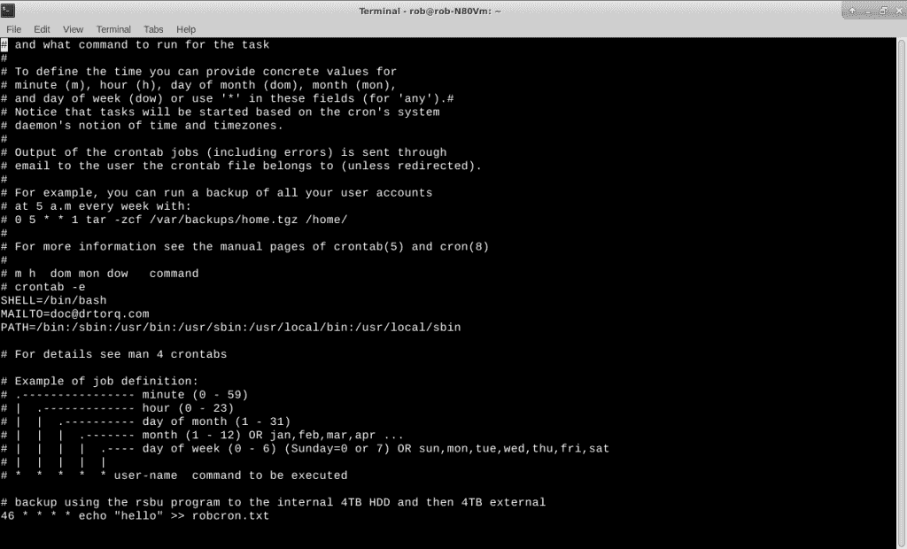
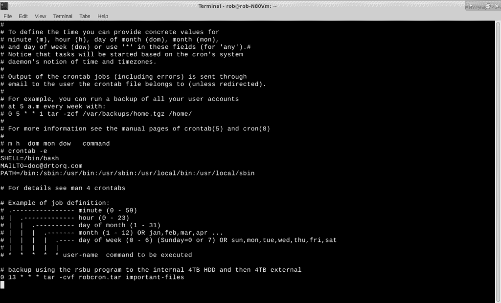
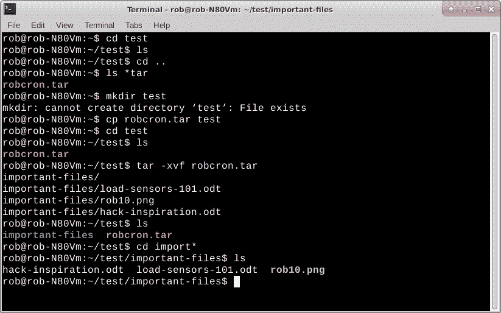

# 教程:使用 cron 实现 Linux 任务调度和自动化

> 原文：<https://thenewstack.io/tutorial-linux-task-scheduling-and-automation-with-cron/>

Linux/Unix [cron](https://en.wikipedia.org/wiki/Cron) 是一个命令行、基于表格的 Linux 调度程序，它在特定的时间运行作业。系统管理员使用它来安排维护工作，如备份、下载、磁盘清理和其他类似的周期性重复活动。大多数基于 Debian 的 Linux 版本默认允许普通用户运行自己的 cron 作业。根用户总是可以使用 cron。

我们最近谈到了在 T4 归档文件的问题。将它与 cron 一起使用是定期进行文件备份的一种简单方法。cron 还可以用于测试、开发和许多计算任务的日常自动化。我偶尔会将它与 MQTT 一起使用，以生成“心跳”,并确保远程物联网(IoT)系统仍在运行。

让我们看看如何使用 cron 来自动化 Linux 任务。

## 初级 cron

使用 cron 并不难。您在一个 cron 表中设置您的程序时间表，并把它写到磁盘上。然后，cron 进程获取它，并在指定的。时间安排可能从几分钟到几天到几年，有很多组合。编辑该表最简单的方法是在命令行中使用 crontab 命令，并使用“-e”选项。

`rob% crontab -e`

这个命令行调出了我华硕笔记本上 [Xubuntu](https://xubuntu.org/) 下的 [nano 文本编辑器](https://www.nano-editor.org/)。我喜欢使用 vi，所以我在 rob 用户中添加了“export EDITOR=vi”。bashrc 文件。快速注销/登录使更改生效，噗，我的默认文本编辑器变成了 vi。有趣的是，在我的 Raspberry Pi 4 蒸汽朋克笔记本电脑上，vi 是 Raspbian 下的默认文本编辑器。cron 和 tar 在那里也工作得很好。

编写并退出 vi 会安装新的 cron 表，并自动更新执行列表。您将收到一条类似“正在安装新的 crontab”的消息，表明一切正常。文件中的问题，如忘记空格或命令行格式不正确，将无法安装表，并且您的命令将无法按预期运行。我选择下面的例子是为了让读者在使用 tar 进行自动归档之前进行一些练习。最好在等待几个小时或几天来查看您的第一个归档是否实际运行之前，确保基础工作正常。

这里有一个在特定时间向文件写入消息的例子。

调用 echo 并写入 cron 表中的文件。

在本例中，最后一行是文件中唯一可操作的项目。前面几行都是注释和说明。cron 表具有特定的格式，包括分钟、小时、一月中的某一天、月、一周中的某一天以及要执行的命令，每个表之间用空格分隔。注释行以井号(" # ")作为第一个字符。每条生产线都单独评估，并在指定时间运行。

可操作行使用 echo 命令将单词“hello”依次写到名为 robcron.txt 的文件中。

`46 * * * * echo "hello" >> robcron.txt`

echo 命令将在每小时 46 分钟后运行。双右箭头告诉它在每次运行时向 robcron.txt 添加“hello”。“*”符号代表其他小时、星期几等。参数在这些字段的所有实例上运行。小时是 0 到 23，天是 1 到 31 等等。

您可以在特定字段中多次使用“，”符号。Days 可能是 3，10，表示 echo 命令将在该月的第三和第十天运行。同样，“-”表示该字段的值范围。1 到 3 可能是一周中某一天的合适值，意味着在星期一、星期二和星期三运行 echo。

在便携式 Linux 系统(如笔记本电脑)上使用 cron 可能会有问题，因为如果机器碰巧在指定的时间关闭，命令就不会执行。当电源重新打开时，没有运行作业的规定。当然，这不应该阻止您使用 cron。只是要意识到局限性，并据此制定计划。当我在家时，我通常 24/7 运行我的 Linux 笔记本。

现在，让我们看看如何使用 cron 通过 tar 自动进行备份。

## 自动 tar 备份

假设我想在每天下午 1 点用 tar 创建我的一个重要目录的备份文件。

我可以编辑 cron 表中的现有示例来反映新函数。只需启动旧的 crontab -e 并使最后一行如下所示。

`0 13 * * * tar -cvf robcron.tar important-files`

修改了运行 tar 命令的 cron 表。

在这个例子中，我在重要文件目录中有几个 LibreOffice Impress 会议幻灯片堆栈和一个图形文件。

由于我是在下午工作的，所以我退出了 crontab，一直等到 1:01 时间下午 1 点。

`rob% ls -l robcron*`

果然 robcron.tar 出现在清单上。

向自己保证一切按预期运行总是有意义的。

为了验证 tar 文件是正确创建的，我将它复制到一个“test”目录中，然后将归档文件扩展到它们各自的文件中。

`rob% makedir test
rob% cp robcron.tar test
rob% cd test
rob% tar -xvf robcron.tar` 

列出测试中的文件如下所示。

提取重要文件清单以验证工作流程。

然后，我在 LibreOffice 中调出了一个幻灯片堆栈，以确保文件是好的。它工作得很好。

## 下一步是什么

Cron 有一堆不同的选项，读者可以从 [crontab 页面](http://crontab.org/)开始探索。网站上还有各种文章和其他教程。

另一个有趣的想法是研究使用 cron 脚本。编写命令行脚本，并像在 cron 表中调用 tar 一样调用它。例如，除了制作一个包含重要文件的 tar 文件进行备份之外，为什么不使用 FTP 或类似的程序将结果文件发送到网络服务器呢？为了搜索/检索的目的，可以列出文件清单。这些工作可以捆绑在一个简单的脚本中。哦，对了，别忘了让你的脚本可执行。

在 doc@drtorq.com或 407-718-3274 联系[罗布“drtorq”雷利](/author/rob-reilly/)咨询、演讲约定和委托项目。

Linux 基金会是新堆栈的赞助商。

由[JESHOOTS.COM](https://unsplash.com/@jeshoots?utm_source=unsplash&utm_medium=referral&utm_content=creditCopyText)在 [Unsplash](https://unsplash.com/s/photos/timetable?utm_source=unsplash&utm_medium=referral&utm_content=creditCopyText) 上拍摄的特征图像。

<svg xmlns:xlink="http://www.w3.org/1999/xlink" viewBox="0 0 68 31" version="1.1"><title>Group</title> <desc>Created with Sketch.</desc></svg>