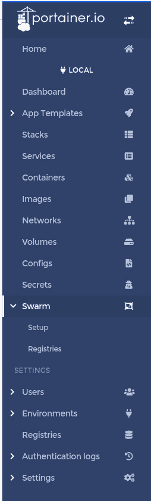
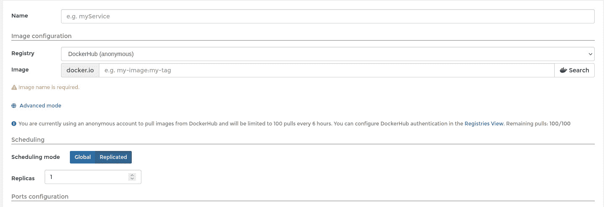
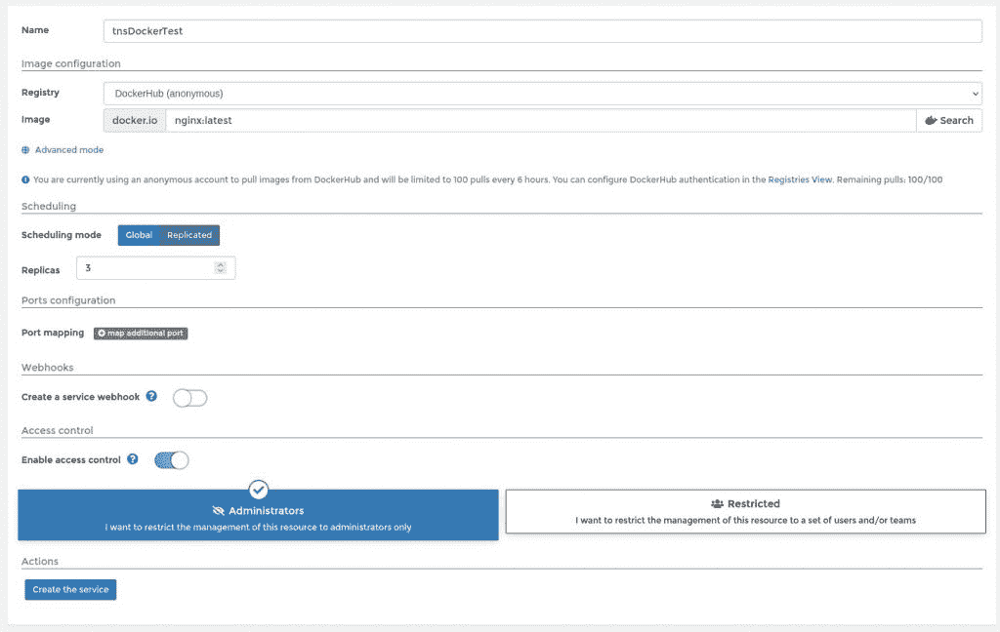

# 教程:用 Portainer 管理 Docker 群

> 原文：<https://thenewstack.io/tutorial-manage-docker-swarm-with-portainer/>

Docker Swarm 容器编排引擎是利用集群进行容器部署的好方法。虽然它可能没有 Kubernetes 那么受欢迎，但如果您正在寻找以下功能，它仍然是一个很好的选择:

*   与 Docker 引擎集成的集群管理
*   分散设计
*   声明式服务模型
*   扩展容器部署
*   期望的国家和解
*   多主机网络
*   服务发现
*   负载平衡
*   安全部署
*   滚动更新

鉴于 Docker Swarm 比 Kubernetes 更容易使用，这是将容器引入开发生命周期组合的一个很好的方式。

尽管 Docker Swarm 很容易管理，但有一种更简单的方法……多亏了 Portainer 容器管理系统。一旦你的 Docker 启动并运行，你就可以部署 Portainer，它会自动获取你的控制器和所有节点。

我想向您介绍部署 Docker Swarm 和将 Portainer 添加到组合中的过程。一旦您安装并运行了它，您会发现管理您的集群 Docker 服务器和您已经部署的容器/服务会容易得多。

然而，我们需要做的第一件事是建立一个 Docker 群。我将用 Ubuntu Server 20.04 的三个实例来演示这一点。您可以在任何 Linux 机器上部署这个设置，但是您需要修改安装过程以适合您选择的发行版。

让我们开始工作吧。

## 部署 Docker 群

登录到您的第一个 Ubuntu 实例，使用以下命令安装必要的依赖项:

`sudo apt-get install ca-certificates curl gnupg lsb-release -y`

安装完成后，使用以下命令添加官方 Docker GPG 密钥:

`curl -fsSL https://download.docker.com/linux/ubuntu/gpg | sudo gpg --dearmor -o /usr/share/keyrings/docker-archive-keyring.gpg`

接下来，我们可以使用以下命令添加稳定的 Docker 存储库:

`echo "deb [arch=$(dpkg --print-architecture) signed-by=/usr/share/keyrings/docker-archive-keyring.gpg] https://download.docker.com/linux/ubuntu $(lsb_release -cs) stable" | sudo tee /etc/apt/sources.list.d/docker.list > /dev/null`

使用以下命令更新 apt:

`sudo apt-get update`

安装 Docker 引擎(社区版)和:

`sudo apt-get install docker-ce docker-ce-cli containerd.io -y`

安装完成后，您将需要启动并启用 Docker 服务:

`sudo systemctl enable --now docker`

要能够在没有 sudo 权限的情况下发出 *docker* 命令(这可能是一个安全问题)，请使用以下命令将您的用户添加到 docker 组:

`sudo usermod -aG docker $USER`

注销并重新登录以使更改生效(或者只需发出命令 *newgrp docker* 就可以了)。

重要的是，在你计划加入群的每个 Docker 节点上重复上述步骤。

## 初始化群体并加入节点

回到控制器(您安装 Docker 的第一台机器)并使用以下命令发现该机器的 IP 地址:

`ip a`

现在，您可以使用以下命令初始化 Swarm:

`docker swarm init --advertise-addr SERVER`

其中 SERVER 是 Docker 控制器的 IP 地址。

当该命令完成时，它将打印出如下所示的 join 命令:

`docker swarm join --token TOKEN 192.168.1.13:2377`

其中 TOKEN 是一长串随机字符。复制该命令，并在您想要加入群的每个节点上运行它。一旦加入了所有节点，返回控制器并发出命令:

`docker info`

您应该会在输出中看到类似如下的一行:

`Nodes: 3`

所有三个节点都成功加入了群体。

## 部署 Portainer

下一个技巧是使用命令部署 Portainer(在控制器上运行):

`docker run -d -p 8000:8000 -p 9443:9443 --name=portainer --restart=always -v /var/run/docker.sock:/var/run/docker.sock -v portainer_data:/data portainer/portainer-ce`

给容器一点时间启动，然后将 web 浏览器指向 http://SERVER:9443(其中 SERVER 是控制器的 IP 地址)。创建一个管理员用户并登录。因为 Portainer 已经被部署到 Swarm 中的一个控制器上，所以您将在左侧栏中看到 Swarm 的一个条目(**图 1** )。

图 1:当 Portainer 是集群的一部分时，它添加了一个群组条目。

现在好戏开始了。

让我们为我们的群部署一个服务。点按左侧边栏中的“服务”，然后点按“添加服务”。在结果窗口中(**图 2** ，您应该会看到一个副本条目。

图 2:通过 Portainer 创建新服务。

因为我们正在处理总共涉及三个节点的群，所以我们可以将副本条目增加到三个，这样我们部署的服务将复制到群中的每个节点(为了高可用性和故障转移)。

让我们为我们的 Swarm 部署一个 NGINX 服务。给服务起一个名字，然后在 Image 字段中输入 *nginx:latest* 。将副本增加到三个，然后单击创建服务(**图 3** )。

图 3:一个非常基本的服务将被部署到我们的 Docker Swarm。

一旦服务成功部署到群，它将被列在服务列表中(**图 4** )。

图 4:我们的 tnsDockerTest 服务已经复制到集群中的所有节点。

你可以通过 Portainer 做的另一个很酷的技巧是扩大和缩小服务。如果您单击列表中的 Scale 按钮，该字段将发生变化(**图 5** )，以便您可以根据需要放大或缩小服务。

图 5:通过 Portainer 扩展或缩小服务非常容易。

这就是在 Portainer 的帮助下管理 Docker 群是多么容易。如果你有任何与 Docker Swarm 合作的意向，我强烈推荐你试试这个用户友好的基于网络的阿桂。你会发现你的工作更有成效、更有效率、更可靠。

<svg xmlns:xlink="http://www.w3.org/1999/xlink" viewBox="0 0 68 31" version="1.1"><title>Group</title> <desc>Created with Sketch.</desc></svg>