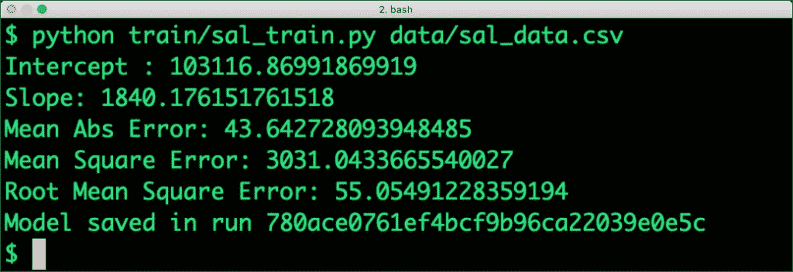
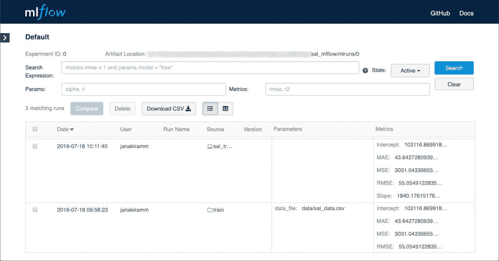
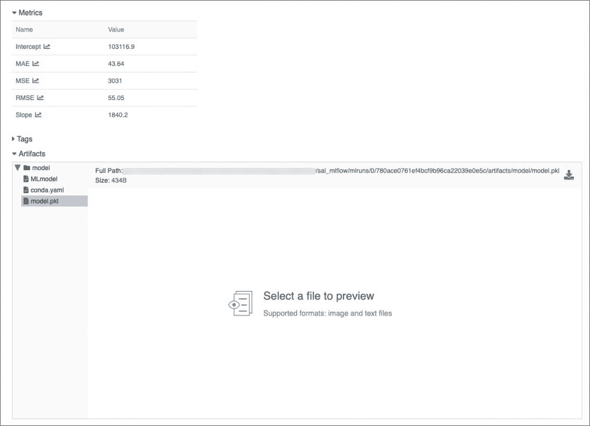

# 教程:使用 Databricks MLflow 管理机器学习生命周期

> 原文：<https://thenewstack.io/tutorial-manage-machine-learning-lifecycle-with-databricks-mlflow/>

在过去的一个[教程](https://thenewstack.io/databricks-mlflow-aims-to-simplify-management-of-machine-learning-pipelines/)中，我介绍了 [MLflow](https://www.mlflow.org) ，这是一个来自 [Databricks](https://databricks.com) 的开源项目，用于管理、跟踪、部署和扩展机器学习模型。

在本教程中，我将向您展示如何将 MLflow 集成到您的机器学习和深度学习项目中。环境设置基于 macOS 10.14，但可以轻松扩展到 Microsoft Windows 和 Ubuntu。

## **配置 Python 环境**

让我们首先将默认的 Python 环境升级到 3.6，并在我们的机器上安装 *pip* 和 *virtualenv* 。

从安装自制软件开始。

```
/usr/bin/ruby  -e  "$(curl -fsSL https://raw.githubusercontent.com/Homebrew/install/master/install)"

```

通过自制安装 Python3。

安装 Python 包安装程序 PIP，然后安装 *virtualenv* 。

```
sudo pip install virtualenv

```

最后，通过下载 PKG 文件，为 Python 3.x 安装 [Miniconda](https://conda.io/en/latest/miniconda.html) 。

现在，我们的机器上有了带 *PIP* 、 *virtualenv* 和 Miniconda 的 Python3。是时候安装 MLflow 库和模块了。

### **安装 MLflow**

MLflow 以 PIP 包的形式提供。运行下面的命令来安装它和其他依赖项。

```
pip install mlflow[extras]

```

### **训练模型**

我们将根据 Stackoverflow 工资数据集训练一个简单的线性回归模型。首先，克隆 [Github 库](https://github.com/janakiramm/salmlflow)。

关于数据集和回归模型的背景，请参考本[教程](https://thenewstack.io/machine-learning-linear-regression-mere-mortals/?source=post_page---------------------------)。

导航到 train 文件夹，探索基于 Scikit-learn 的模型。请注意 Mlflow 是如何集成到标准线性回归培训工作中的。

我们导入 MLflow 的相关模块。

```
import  mlflow
import  mlflow.sklearn

```

除了将系数和指标打印到标准输出，我们还会将它们记录到 MLFlow 跟踪组件中。

```
mlflow.log_metric("Intercept",  lm.intercept_)
mlflow.log_metric("Slope",  lm.coef_[0])

```

```
mlflow.log_metric("MAE",  mae)
mlflow.log_metric("MSE",  mse)
mlflow.log_metric("RMSE",  rmse)

```

最后，我们将序列化为 Python PKL 文件的模型文件记录到 MLflow。

```
mlflow.sklearn.log_model(lm,  "model")

```

从实验的根目录，通过将数据集作为参数传递来运行训练作业。

```
python train/sal_train.py data/sal_data.csv

```

培训作业已将所有系数和指标与最终模型一起记录到 MLflow 中。

[](https://thenewstack.io/tutorial-manage-machine-learning-lifecycle-with-databricks-mlflow/mlflow-0/)

### **跟踪项目**

MLflow 附带了一个强大的仪表板，用于可视化和跟踪每次运行生成的指标。

通过从命令行启动 MLflow UI 来访问位于 http://localhost:5000 的仪表板。

这个仪表板在跟踪深度学习中使用的超参数方面非常有用。您可以查询、过滤和下载 CSV 文件中的指标。

[](https://thenewstack.io/tutorial-manage-machine-learning-lifecycle-with-databricks-mlflow/mlflow-1/)

### **包装培训作业**

现在我们有了我们的培训代码，我们可以打包它，使其他团队成员可以轻松地一致复制环境。一旦打包，培训工作可以部署在云平台上并远程运行。

有两个文件携带打包信息–ml project 和 conda.yaml。第一个文件定义作业的入口点和参数，而第二个文件包含培训脚本所需的依赖项和模块。

```
name: salary

conda_env: conda.yaml

entry_points:
  main:
    parameters:
      data_file: path
    command: "python sal_train.py {data_file}"

```

```
name:  salary
channels:
  -  defaults
dependencies:
  -  pip
  -  python=3.6
  -  numpy=1.14.3
  -  pandas=0.22.0
  -  scikit-learn=0.19.1
  -  pip:
    -  mlflow

```

这两个文件与训练脚本存在于同一个目录中。

我们现在可以将它转换成 Python *virtualenv* 并使用下面的命令运行该作业:

```
mlflow run train  -P  data_file=data/sal_data.csv

```

注意数据集是如何通过 mlflow run 命令作为参数传递的。每次 mlflow 运行时，它都会确保 conda.yaml 中定义的依赖关系得到满足。如果没有先前的 *virtualenv* 用于运行，则创建一个新的来安装依赖项。

### **服务模特**

MLflow 带有内置的模型服务机制，该机制通过 REST 端点公开经过训练的模型。

MLflow 模型是包装机器学习模型的标准格式，可用于各种下游工具，例如，通过 REST API 或 Apache Spark 上的批处理推理进行实时服务。

我们现在将配置模型服务，它可以根据多年的经验预测工资。

在训练代码中，在训练线性回归模型之后，MLflow 中的函数将模型保存为运行中的工件。为了查看这个工件，我们可以再次访问 UI。

[](https://thenewstack.io/tutorial-manage-machine-learning-lifecycle-with-databricks-mlflow/mlflow-2/)

让我们将 MLflow 模型服务工具指向上次运行生成的最新模型。我们还将明确提到 REST 端点的端口号 5050。

```
mlflow models serve  -m  mlruns/0/f7aa700cc2cb4d1f98ea2a2fa6486a4b/artifacts/model  -p  5050

```

一旦这个服务在监听，我们就可以通过发送数据点作为 JSON 有效负载来调用它。

```
curl  -X  POST  -H  "Content-Type:application/json"  \
  --data  '{"columns":["x"],"data":[[22]]}'  \
  http://127.0.0.1:5050/invocations

[143600.7452574526]

```

上面的输出显示了一个有 22 年经验的开发人员的预测工资。

MLflow 是一个灵活的工具包，用于管理、跟踪、部署和扩展机器学习项目、实验和模型。

贾纳基拉姆·MSV 的网络研讨会系列“机器智能和现代基础设施(MI2)”提供了涵盖前沿技术的信息丰富、见解深刻的会议。在 [http://mi2.live](http://mi2.live/) 上注册参加即将举行的 MI2 网络研讨会。

<svg xmlns:xlink="http://www.w3.org/1999/xlink" viewBox="0 0 68 31" version="1.1"><title>Group</title> <desc>Created with Sketch.</desc></svg>