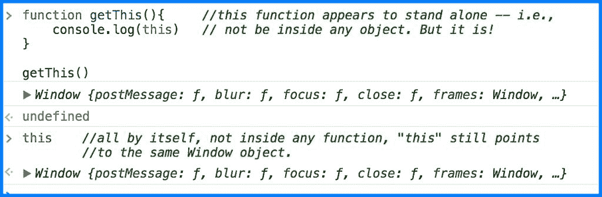
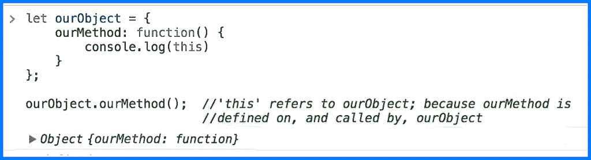
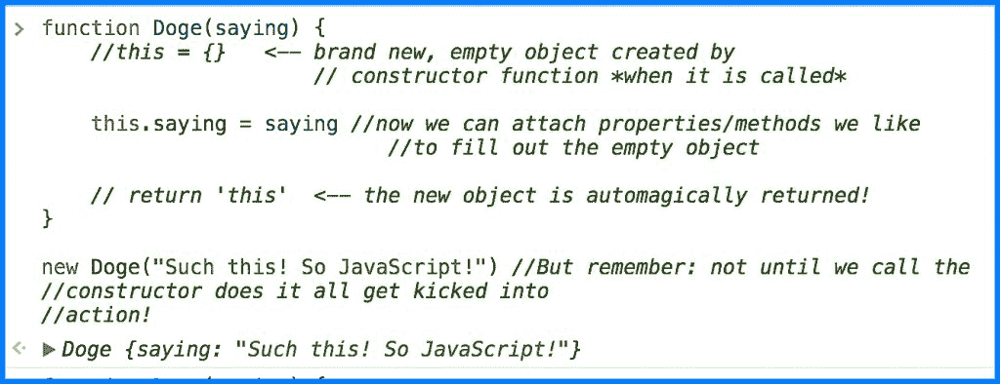
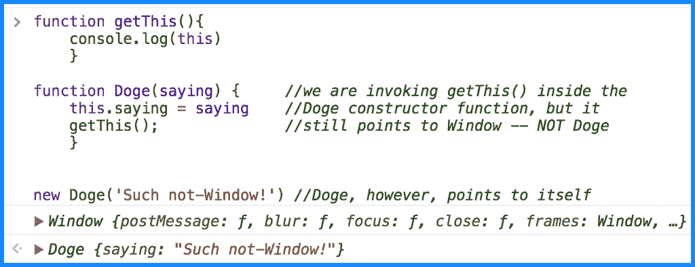
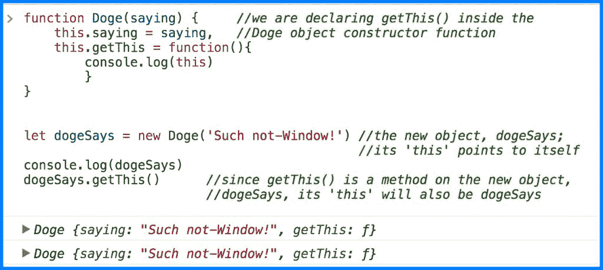
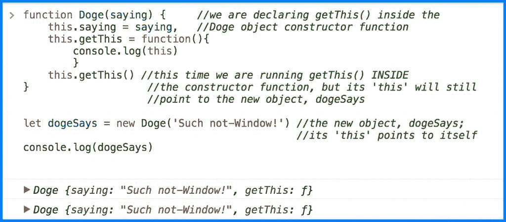

# 教程:掌握 JavaScript 中的“this”

> 原文：<https://thenewstack.io/tutorial-mastering-javascript/>

“this”关键字的概念对于许多 JavaScript 程序员来说非常棘手的一个原因是——即使是经验丰富的程序员——因为“this”是一个狡猾的小吸盘:“this”指的是什么完全取决于上下文，有时以非常复杂的方式。为了与“this”和平共处，关键是不仅要掌握“this”在不同上下文中的不同行为，还要理解上下文本身——以及如何在实际代码中识别它们。

为了解释“这一点”,已经花了很多笔墨和教程。就个人而言，我在将“this”视为一种独特类型的变量的概念上取得了最大的成功，这种变量会根据其使用的上下文来改变值。变量没那么可怕吧？我们一直在使用它们。因此，让我们深入探讨“这一点”。

## 一点背景知识

在 Javascript 中，[函数是对象](https://developer.mozilla.org/en-US/docs/Web/JavaScript/Reference/Functions)。因此，所有 JavaScript 函数都有属性和方法，就像对象有属性和方法一样。

每当一个函数被执行时，它就被赋予自己的“this”属性——一个带有对象值的变量，该对象调用使用“this”的函数。

换句话说，当“this”在一个函数中使用时——让我们称之为 our function——它就像一个变量，包含调用我们函数的对象的值。使用“this”不仅仅是一种捷径，尽管这确实是一个方便的方面。更重要的是“this”如何充当标识符:有时我们需要它来访问调用我们函数的对象的方法和属性，因为我们并不总是知道调用对象的名称。有时，没有名称来引用调用对象(如回调、匿名或立即调用的函数)。

调用对象解释基本上是 [Kyle Simpson](https://github.com/getify) 在他奇妙的 YDKJS 系列的第三本书中采用的方法的镜像，这个&对象原型:

“要理解的最重要的事情是‘this’不是一个作者时绑定，而是一个运行时绑定。这意味着“this”指向的位置*(也就是说，在我们的变量隐喻中，值“this”被分配给 hold)* 与函数声明的位置无关。相反，“这”取决于函数被调用的位置。

Simpson 解释说，函数的“this”绑定是由其调用位置决定的，这是绝对正确的。但是找到调用点——这涉及到跟踪调用堆栈中经常出现的复杂和令人困惑的踪迹——可能会很棘手。更不用说耗时了。作为一个 JavaScript 编程新手，我发现从另一个方向接近“this”要容易得多，例如，调用函数的对象。最终，这是同一个目的地:调用函数的对象不可避免地会被找到。句号。由于对象通常更容易识别，特别是在大型代码库中，从“this”作为指向调用对象的变量的概念开始工作使我的生活变得非常非常容易。

*‘this’**实际上是一个函数被调用时做的绑定，而不是声明时做的绑定。“this”引用什么完全由调用函数的调用点决定。*

## 默认' this '

“这个”引用总是指——我们甚至可以说持有( *cough* 变量 *cough* )的值——一个单一的、唯一的对象。“this”通常用在函数或方法中。但是，它也可以在全局范围内的函数之外使用。

(JavaScript n00bs 的行话解释器:“方法”是包含在对象中的函数的名称。“回调”是作为参数传递给另一个函数的匿名函数。不过，两者最终都只是函数。

在一个常规的独立函数中——或者如果你根本不在一个函数中——“this”仍然必须引用回某个调用对象——然而，既然没有显式对象，那么是哪个呢？但是，是的，即使这些明显自由的函数也有一个调用对象:窗口对象。例如，包含我们代码的实际浏览器窗口，由一个名为“window”的对象表示。看看这个:

(注意[在严格模式下](https://developer.mozilla.org/en-US/docs/Web/JavaScript/Reference/Strict_mode)，‘this’将保存全局函数中 *undefined* 的值——就像它在没有绑定到任何对象的匿名函数中一样)。

## 这在被称为方法的函数中

理解“这”的最简单和最直接的上下文发生在对同一对象定义和调用一个方法的时候。记住您的[对象点符号](https://developer.mozilla.org/en-US/docs/Web/JavaScript/Reference/Operators/Property_Accessors):您通过键入对象的名称，然后是点操作符，然后是您试图访问的对象属性的名称来访问对象的属性和方法。(同样，方法是作为对象的属性在对象上声明的函数，但它们仍然只是函数)。

当一个方法和它的定义对象一起被调用时，“这”非常容易追踪:看看初始化属性语句的东西。即位于点标记的左侧:

【T2

看到它是如何工作的吗？为了访问和调用我们的方法，我们首先需要命名定义我们的方法的对象。在此上下文中，该对象名等于“this”。跟我说:在圆点的左边寻找“this ”!

## 构造函数中的“this”

下一个 JavaScript 快速回顾:当一个函数被用来创建新对象时，它被称为[构造函数](https://developer.mozilla.org/en-US/docs/Web/JavaScript/Reference/Classes/constructor)。为了调用构造函数，我们使用“new”关键字。识别构造函数的方法是函数名以大写字母开头。这也告诉我们需要使用“new”关键字来调用那个特定的函数。

当一个构造函数被调用时，它的‘this’指向新创建的对象，*而不是*指向构建它的构造函数。

深入研究一下正在发生的事情有助于解释为什么构造函数中的“this”会有这样的行为。所以:每当一个构造函数被调用来创建一个新的对象时，它也会同时创建一个新的匹配的“this”实例。简单地说，构造函数的任务基本上就是创建一个临时昵称为“this”的新对象，然后返回这个新对象，并赋予它自己的“this”。

我们不必声明“this ”,因为该功能内置于“new”关键字中，这意味着当调用构造函数时，“this”是在后台自动创建的。另一件很酷的事情是‘this’和新对象一起自动返回，而不需要我们指定 return 语句。

概括一下:构造函数中的“this”指向构造函数在被调用时创建的全新的空白对象。然后，我们可以将我们喜欢的所有属性(包括方法)添加到这个时髦的新对象中，并使用“this”访问它们中的每一个。

## 变得棘手了

现在事情开始变得有点棘手了。当我们把一个函数放在构造函数里面，甚至可能调用它，会发生什么？

这里有一个全局 getThis()函数、一个构造函数和一个由构造函数创建的新对象。在第一个示例中，实际上是从构造函数内部调用全局作用域 getThis():

getThis()仍然指向 Window，因为当它在 Doge()构造函数内部被调用时，实际的 getThis()函数本身在全局范围内运行。

然而，当我们将 getThis() *移动到*Doge 构造函数内部时，作为一个方法，它的“This”现在指向无论我们何时运行它都会创建的任何新对象:

(上图，控制台首先打印出新对象 dogeSays。接下来是 getThis()的 log 语句，它指向新对象作为它的“This”，它也指向新对象 dogeSays——还记得我们的“点的左侧”规则吗？？？).

如果我们在创建一个新对象的时候*调用*构造函数中的 getThis()方法*会怎么样？*

getThis()仍然指向新创建的对象。还记得我们在前面谈到的构造函数运行时创建的占位符“this”吗？这两个代码示例都展示了占位符效果。

我们的要点:对于嵌套在构造函数中的方法，即使调用位置(调用上下文)可能不同，也要将“this”赋给新创建的对象。

## 这不是“这”的结束

我们还没完。此时，您已经准备好处理相当简单的对象和构造函数，并轻松地实现它们的“this”绑定。没问题，现在你已经知道如何首先识别调用对象，然后在其中跟踪决定“this”绑定的调用点…并查看点的左侧。

然而，回调(函数作为参数传递给其他函数)确实变得非常棘手，因此他们将获得自己的“this”教程。不要绝望，朝圣者们——我们也将学习如何控制“这个”,把它设置成我们想要的。所以当你对我唱“这个”困惑时，即使有回调，你也会有办法解脱并赋予必要的价值。继续你的生活。两周后见！

<svg xmlns:xlink="http://www.w3.org/1999/xlink" viewBox="0 0 68 31" version="1.1"><title>Group</title> <desc>Created with Sketch.</desc></svg>