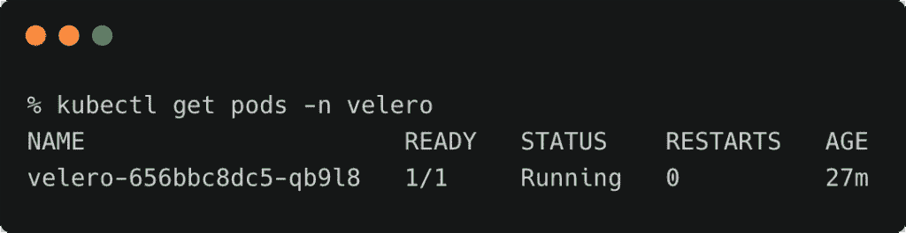
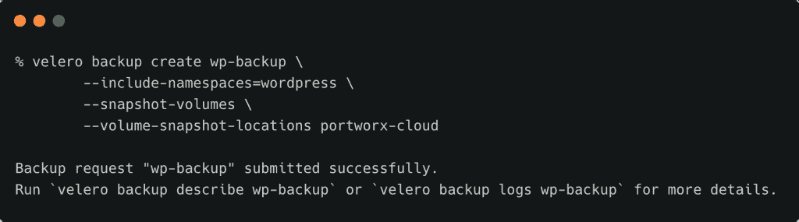
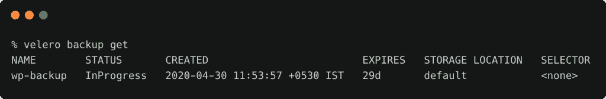
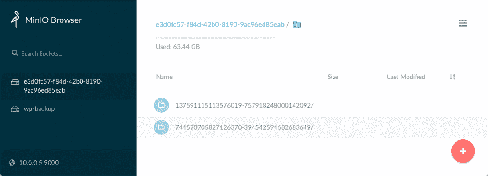
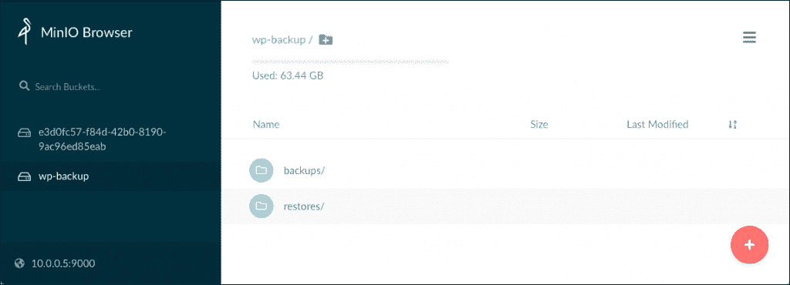
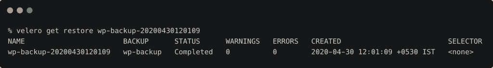

# 教程:使用 Portworx 和 Velero 迁移有状态的 Kubernetes 工作负载

> 原文：<https://thenewstack.io/tutorial-migrate-stateful-kubernetes-workloads-with-portworx-and-velero/>

在本系列教程的最后一部分中，我们已经看到了如何拍摄 Portworx 卷的快照，并将它们存储在与 S3 兼容的对象存储服务中，比如 MinIO。我们将扩展该场景，以跨名称空间、集群甚至云提供商迁移有状态工作负载。在本教程结束时，你将能够将 WordPress 从一个名称空间迁移到另一个名称空间。

由于这是上一篇教程的延续，所以它假设您在继续下一步*之前，已经按照步骤安装了 MinIO 并向 Portworx 注册了它(或者从头开始:[第 1 部分](https://thenewstack.io/a-closer-look-at-the-portworx-storage-cluster-architecture/)、[第 2 部分](https://thenewstack.io/tutorial-install-and-configure-portworx-on-a-bare-metal-kubernetes-cluster/)、[第 3 部分](https://thenewstack.io/tutorial-optimize-wordpress-on-kubernetes-with-portworx/)、[第 4 部分](https://thenewstack.io/tutorial-backup-and-restore-of-stateful-workloads-with-portworx/))。*

Portworx 为 Kubernetes backup 提供了成熟的企业级备份和恢复。本指南是使用 Portworx 备份和迁移功能的替代方法。本教程适用于 Portworx Essentials 和 Portworx Enterprise。

### 安装 Velero

[Velero](https://velero.io) (以前的 Heptio Ark)是一个备份和恢复 Kubernetes 集群资源和持久卷的工具。它作为 CRD 安装在 Kubernetes 中，用于备份整个名称空间或与特定标签匹配的特定资源。

按照文档中的[说明](https://velero.io/docs/v1.3.2/basic-install/)下载并安装 Velero。

瓦莱罗的备份可以存储在亚马逊 S3 桶。我们将使用 MinIO，而不是亚马逊 S3。确保将 MinIO 密钥和访问密钥凭证添加到位于当前目录的文件***credentials-velero***中。有关该配置的更多信息，请参考 Velero [文档](https://velero.io/docs/v1.3.2/contributions/minio/)。

用您的 MinIO 端点替换 URL。

```
velero install  \
    --provider aws  \
    --plugins velero/velero-plugin-for-aws:v1.0.0  \
    --bucket wp-backup  \
    --secret-file  ./credentials-velero  \
    --use-volume-snapshots=false  \
    --backup-location-config region=minio,s3ForcePathStyle="true",s3Url=http://10.0.0.5:9000,publicUrl=http://10.0.0.5:9000

```

这导致了名称空间 **velero** 的创建以及在其中运行的 pod。

```
kubectl get pods  -n  velero

```



我们让 Velero 准备好备份一个工作负载，并将其存储在 MinIO bucket 中。这是通过添加 AWS 插件以及指向 bucket URL 的指针来实现的。

请注意，Velero 此时不知道 Portworx，这意味着它不能拍摄 PVC 的卷快照。下一步，我们将把 Velero 指向 Portworx，以便在备份时使用它的卷快照功能。

### 为 Velero 配置 Portworx 提供程序

Velero 使用一个[插件模型](https://velero.io/docs/v1.3.2/supported-providers/)用于对象存储中存储的备份和块存储的卷快照。在这个场景中，我们将 AWS 插件用于对象存储，将 Portworx 插件用于卷快照。

```
velero plugin add portworx/velero-plugin:1.0.0

```

上面的命令向 Velero 注册了 Portworx 插件。下一步是将 Velero 指向 Portworx 配置的快照的默认位置。在上一个教程中，我们向 Portworx 注册了 MinIO 的凭证，以便将卷快照存储在其中一个桶中。每次启动备份时，Velero 将继续使用相同的配置。

```
velero snapshot-location create portworx-cloud  \
  --provider portworx.io/portworx  \
  --config type=cloud

```

我们刚刚指示 Velero 为卷快照使用 Portworx 的默认远程快照配置。

这种集成使 Velero 能够备份 Kubernetes 资源，如部署、服务、入口，同时将卷快照作业委托给 Portworx。在恢复过程中遵循相同的过程。

### 用 Velero 备份 WordPress 应用程序

我们现在准备启动与 Velero 的备份。运行以下命令启动作业。

```
velero backup create wp-backup  \
  --include-namespaces=wordpress  \
  --snapshot-volumes  \
 --volume-snapshot-locations portworx-cloud

```



通过运行' *velero backup get'* 命令检查状态。



完成后，检查 MinIO 浏览器。将有两个存储桶—一个存储由 Portworx 创建的卷快照，另一个存储整个工作负载的 Velero 备份。



这里可以看到对应于 MySQL 和 WordPress PVCs 的两个对象。



Velero 使用桶 **wp-backup** 从 WordPress 名称空间转储 Kubernetes 对象的完整备份。

### 使用 Velero 执行恢复

备份就绪后，让我们用 Velero 测试恢复过程。

我们将首先删除 ***wordpress*** 名称空间，以移除与应用程序相关的所有资源，包括 PVCs。

```
kubectl delete ns wordpress

```

现在让我们尝试恢复。

```
velero restore create  --from-backup wp-backup

```


使用以下命令检查状态:

```
velero get restore wp-backup-20200430120109

```

[](https://thenewstack.io/tutorial-migrate-stateful-kubernetes-workloads-with-portworx-and-velero/px-velero-6/)

Velero 已经将所有资源恢复到同一个名称空间 WordPress。

```
kubectl get all  -n  wordpress

```


恢复过程包括 Velero 重新创建 Kubernetes 对象和 Portworx 从云快照创建 PVC。

如果您拥有安装了 Portworx 和 Velero 的相同环境，则可以使用相同的工作流跨集群迁移有状态工作负载。

本文总结了用 Portworx 运行有状态工作负载的系列文章。

贾纳基拉姆·MSV 的网络研讨会系列“机器智能和现代基础设施(MI2)”提供了涵盖前沿技术的信息丰富、见解深刻的会议。在 [http://mi2.live](http://mi2.live) 注册参加即将到来的 MI2 网络研讨会。

Portworx 是新堆栈的赞助商。

来自 Pixabay 的 Siggy Nowak 的特写图片。

<svg xmlns:xlink="http://www.w3.org/1999/xlink" viewBox="0 0 68 31" version="1.1"><title>Group</title> <desc>Created with Sketch.</desc></svg>