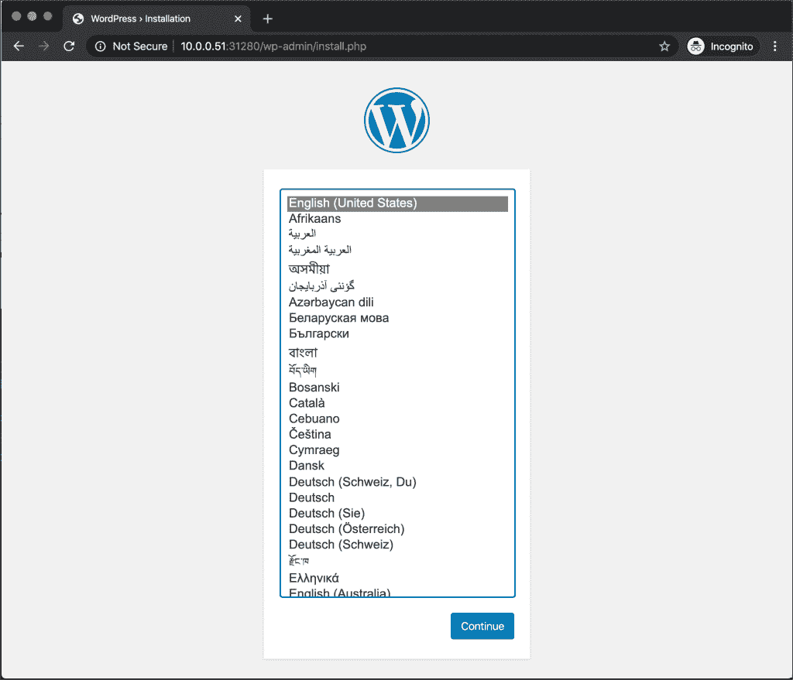

# 教程:用 Portworx 优化 Kubernetes 上的 WordPress

> 原文：<https://thenewstack.io/tutorial-optimize-wordpress-on-kubernetes-with-portworx/>

本教程是用 Portworx 在 Kubernetes 上运行有状态工作负载系列的一部分。前面的部分涵盖了 Portworx 的[架构](https://thenewstack.io/a-closer-look-at-the-portworx-storage-cluster-architecture/)和[安装](https://thenewstack.io/tutorial-install-and-configure-portworx-on-a-bare-metal-kubernetes-cluster/)。本指南将解释如何利用 Portworx 的功能，如存储池、服务等级、复制卷、共享卷，以实现 WordPress 内容管理系统(CMS)的最佳性能和高可用性。

WordPress 是一个有状态的应用程序，依赖于两个持久性后端:一个文件系统和 MySQL 数据库。这两个后端的存储服务应该是可靠、安全和高性能的。在横向扩展模式中，多个 WordPress 实例访问同一个文件系统来读取和更新图像、视频、插件、主题和其他配置文件等内容。MySQL 的存储后端应该支持高峰使用期间的高吞吐量和高性能。

Portworx 是在 Kubernetes 上运行 WordPress 的理想云原生存储平台。它具有处理 web 级应用程序的横向扩展、共享和高性能需求的内置功能。

### Portworx 存储池

每当 Portworx 检测到连接到集群的新磁盘时，它会自动对设备进行基准测试，以评估其 I/O 性能。根据性能指标评测报告的吞吐量，它会创建存储池来聚合具有共同特征的设备。

在我的裸机集群中，每个节点上都连接了一个外部 USB 磁盘和 NVMe 设备。根据内部 Portworx 基准测试结果，这两个设备被分成不同的池。在安装过程中，Portworx 创建了两个存储池，根据 IO 优先级分类为低和高。


当我们运行 **pxctl status** 命令时，输出显示可用的存储池。


IOPS 较低的设备是池 0 的一部分，而 NVMe 设备是池 1 的一部分。


通过运行 **pxctl service pool show** 命令，我们可以获得关于存储池的更多信息。


我们可以针对这些池创建符合工作负载特征的存储卷。对于 WordPress，我们将共享文件系统放在池 0 上，同时在池 1 上创建 MySQL 数据和日志文件。

让我们看看如何利用 Kubernetes 的这些存储池。

### 为 MySQL 和 WordPress 创建存储类

存储类充当 Portworx 存储引擎和 Kubernetes 中运行的工作负载之间的媒介。storage 类中指定的注释和参数会影响持久卷和声明的创建方式。这种方法利用了 Kubernetes 中可用的动态供应功能。当一个 PVC 有一个带有存储类的注释时，Portworx 动态地创建一个 PV 并将 PVC 绑定到它。

对于 MySQL，我们需要一个跨三个节点复制并支持高 IOPS 的卷。让我们用这些参数创建一个存储类。

```
kind:  StorageClass
apiVersion:  storage.k8s.io/v1beta1
metadata:
    name:  db
provisioner:  kubernetes.io/portworx-volume
parameters:
 repl:  "3"
 priority_io:  "high"
 io_profile:  "db"

```

参数 *io_profile: "db"* ，实现回写刷新合并算法，尝试将 50ms 窗口内发生的多个同步合并为单个同步。标志 *priority_io: "high"* 表示必须在具有高 IOPS 的存储池上创建 PV。

WordPress 的存储类有不同的需求。它不仅需要复制，还需要具有读/写功能的共享卷。由于 I/O 并不重要，因此可以将卷放在吞吐量相对较小的存储池中。

```
kind:  StorageClass
apiVersion:  storage.k8s.io/v1beta1
metadata:
  name:  wp
provisioner:  kubernetes.io/portworx-volume
parameters:
  repl:  "3"
  sharedv4:  "true"
  io_profile:  "cms"

```

特殊标志*io _ profile:“CMS”*，适用于支持异步写操作的共享卷。当上传文件到共享存储卷时，这增加了 WordPress 仪表盘的响应能力。


创建存储类并继续下一步。

### 配置和部署 MySQL

部署 MySQL 的第一步是创建一个利用动态预配置的 PVC。

让我们为部署创建一个专用的名称空间。

```
kubectl create ns wordpress

```

```
kind:  PersistentVolumeClaim
apiVersion:  v1
metadata:
 name:  db-pvc
 namespace:  wordpress
 annotations:
 volume.beta.kubernetes.io/storage-class:  db
spec:
 accessModes:
 -  ReadWriteOnce
 resources:
 requests:
 storage:  10Gi

```

PVC 中的注释提示根据预定义的存储类创建一个 PV。

```
kubectl create  -f  db-pvc.yaml

```

```
kubectl get pvc  -n  wordpress

```


我们现在将使用一个副本创建 MySQL 部署。请注意，我们不需要创建 statefulset，因为复制由存储层处理。由于复制因子设置为 3，每个数据块都会自动写入另外两个节点。

即使 MySQL pod 被终止并重新安排在不同的节点上，我们仍然能够访问数据。这是由 Portworx 的定制调度器来处理的，该调度器称为 Kubernetes (STORK) 的[存储编排。](https://portworx.com/stork-storage-orchestration-kubernetes/)

在下面的规范中，我们提到 STORK 作为定制调度程序，将有状态 pod 的放置和调度委托给 Portworx，而不是留给默认的 Kubernetes 调度程序。

```
apiVersion:  apps/v1
kind:  Deployment
metadata:
  name:  mysql
  namespace:  wordpress
  labels:
    app:  mysql
spec:
  strategy:
    rollingUpdate:
      maxSurge:  1
      maxUnavailable:  1
    type:  RollingUpdate
  replicas:  1
  selector:
    matchLabels:
      app:  mysql
  template:
    metadata:
      labels:
        app:  mysql
    spec:
      schedulerName:  stork
      containers:
      -  name:  mysql
        image:  mysql:5.6
        imagePullPolicy:  "Always"
        env:
        -  name:  MYSQL_ROOT_PASSWORD
          value:  password
        ports:
        -  containerPort:  3306
        volumeMounts:
        -  mountPath:  /var/lib/mysql
          name:  mysql-data
      volumes:
      -  name:  mysql-data
        persistentVolumeClaim:
          claimName:  db-pvc

```

让我们通过 ClusterIP 服务公开 MySQL pods。

```
apiVersion:  v1
kind:  Service
metadata:
  name:  mysql
  namespace:  wordpress
  labels:
    app:  mysql
spec:
  ports:
  -  port:  3306
    name:  mysql
  clusterIP:  None
  selector:
    app:  mysql

```


SSH 进入其中一个节点，以浏览 Portworx 创建的卷。


```
pxctl volume inspect pvc-13b7e4b3-0bd6-42ba-a2f5-6ebf2e27b289

```


请注意，该卷符合存储类中提到的设置。它有跨三个节点的副本集，如 HA 和副本集部分所示。IO 优先级设置为高，强制卷位于从每个节点上的 NVMe 设备创建的池中。

### 配置和部署 WordPress

WordPress 的容量需求与 MySQL 不同。虽然它不像 MySQL 那样需要高吞吐量，但它需要一个共享文件系统。我们在存储类中指定了这些参数。让我们继续创建 PVC。

```
kind:  PersistentVolumeClaim
apiVersion:  v1
metadata:
 name:  wp-pvc
 namespace:  wordpress
 annotations:
 volume.beta.kubernetes.io/storage-class:  wp
spec:
 accessModes:
 -  ReadWriteMany
 resources:
 requests:
 storage:  20Gi

```

```
kubectl create  -f  wp-pvc.yaml

```

```
kubectl get pvc  -n  wordpress

```


让我们创建 MySQL 部署和服务对象。

```
apiVersion:  apps/v1
kind:  Deployment
metadata:
  name:  wordpress
  namespace:  wordpress
  labels:
    app:  wordpress
spec:
  strategy:
    type:  Recreate
  selector:
    matchLabels:
      app:  wordpress
  template:
    metadata:
      labels:
        app:  wordpress
    spec:
      containers:
      -  image:  wordpress:latest
        name:  wordpress
        env:
        -  name:  WORDPRESS_DB_HOST
          value:  mysql
        -  name:  WORDPRESS_DB_PASSWORD
          value:  password
        ports:
        -  containerPort:  80
          name:  wordpress
        volumeMounts:
        -  name:  wp-data
          mountPath:  /var/www/html
      volumes:
      -  name:  wp-data
        persistentVolumeClaim:
          claimName:  wp-pvc

```

```
kubectl apply  -f  wp-app.yaml

```

```
apiVersion:  v1
kind:  Service
metadata:
  name:  wordpress
  namespace:  wordpress
  labels:
    app:  wordpress
spec:
  ports:
    -  port:  80
  selector:
    app:  wordpress
  type:  NodePort

```

```
kubectl apply  -f  wp-svc.yaml

```


现在让我们检查一下与 WordPress 部署相关的 Portworx 卷。


```
pxctl volume inspect pvc-17197451-ee80-4556-be27-5f0e8757ce17

```


该卷同时打开了复制和共享标志。它被分配给具有低 IO 优先级的存储池。

让我们来衡量 WordPress 部署的数量。

```
kubectl scale deploy/wordpress  --replicas=4  -n  wordpress

```

```
kubectl get pods  -l  app=wordpress  -n  wordpress

```


您可以从节点端口中显示的 IP 地址访问 CMS。



在本系列的下一部分，我们将探讨如何配置快照来备份和恢复 Portworx 卷。敬请关注。

Portworx 是新堆栈的赞助商。

由来自 Pixabay 的 Jessica Crawford 拍摄的特写图片。

<svg xmlns:xlink="http://www.w3.org/1999/xlink" viewBox="0 0 68 31" version="1.1"><title>Group</title> <desc>Created with Sketch.</desc></svg>