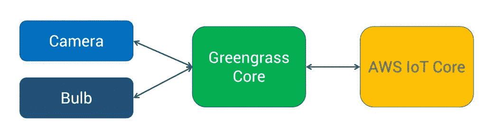
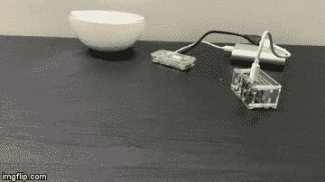
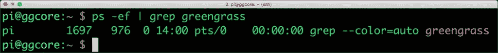
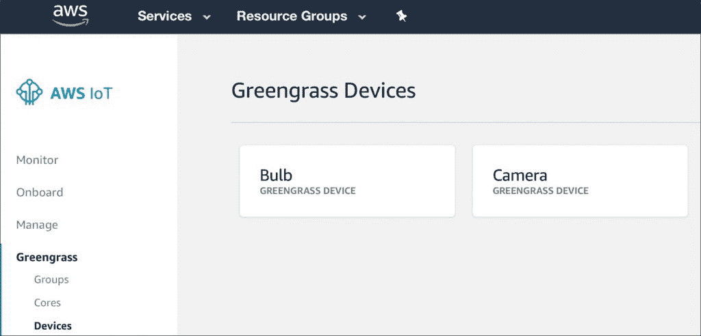
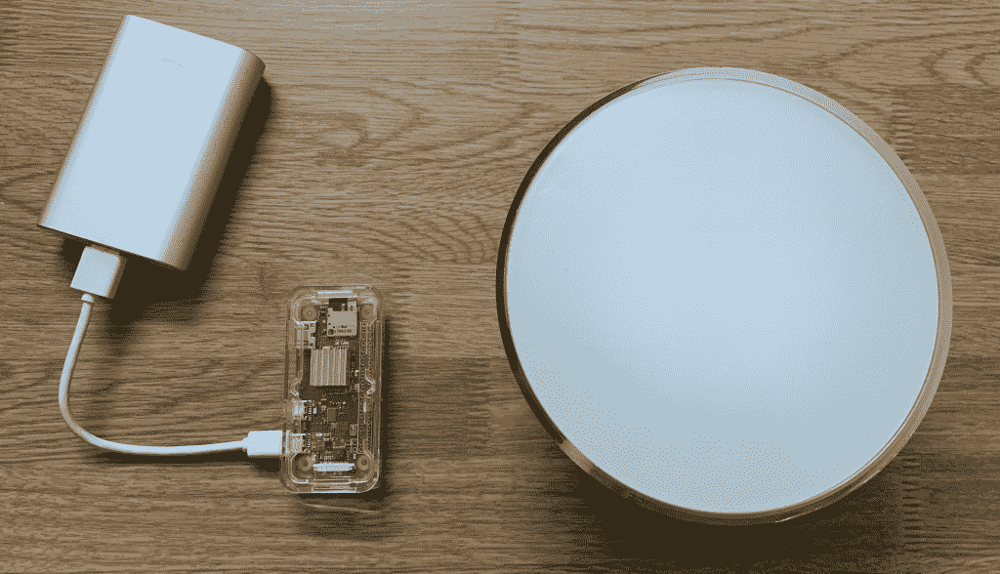
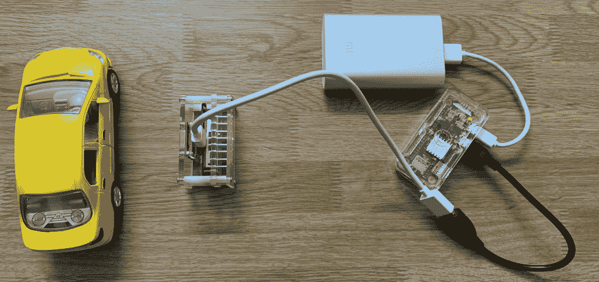
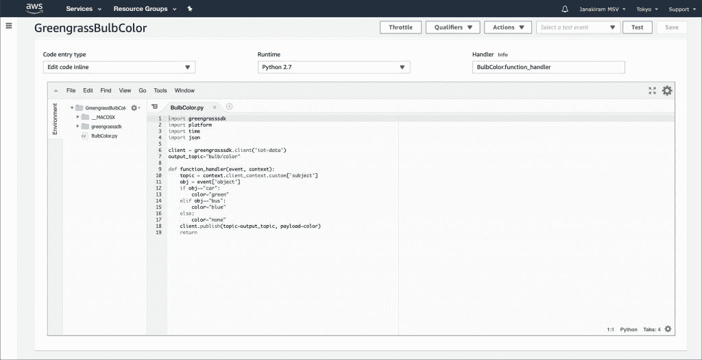
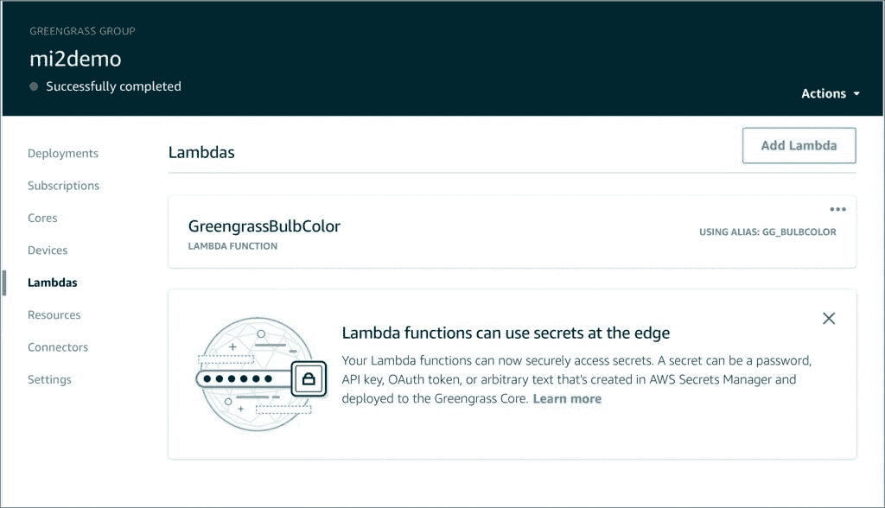
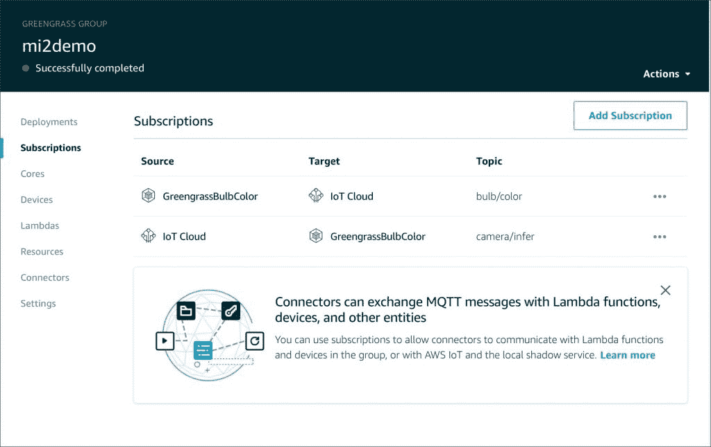
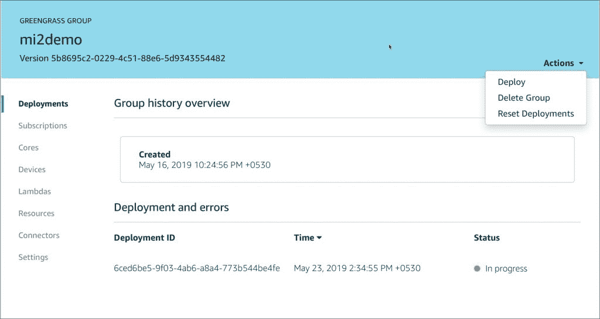

# 教程:使用 AWS 物联网 Greengrass 在边缘执行对象检测

> 原文：<https://thenewstack.io/tutorial-perform-object-detection-at-the-edge-with-aws-iot-greengrass/>

亚马逊网络服务的[物联网 Greengrass](https://aws.amazon.com/greengrass/) 是亚马逊的一个边缘计算平台。关于这项新兴技术的概述，请参考我的[上一篇文章](https://thenewstack.io/how-aws-iot-greengrass-brings-cloud-capabilities-to-the-edge/)。

在 AWS 物联网 Greengrass 系列的第二部分，我将带您了解我们通过机器学习推理识别车辆类型并改变智能灯泡颜色的场景。这些设备由 AWS 物联网 Greengrass 管理和控制。



该演示场景基于以下工作流程:

*   智能摄像机(Horned Sungem ),可检测包括车辆类型在内的物体
*   智能灯泡(飞利浦色调)，可根据车辆类型改变颜色
*   在树莓 Pi 3 模型 B+上运行的 Greengrass 核心
*   智能相机和灯泡连接到单独的 Raspberry Pi Zero W 设备
*   控制灯泡颜色的λ函数
*   AWS 物联网 Greengrass 订阅支持信息流动

[](https://thenewstack.io/tutorial-perform-object-detection-at-the-edge-with-aws-iot-greengrass/31onzq/)

以下是该项目使用的组件列表:

*   1 个树莓 Pi 3 型号 B+
*   2 个树莓派 Zero W
*   1 个带角的 Sungem 摄像机
*   1 个飞利浦顺化桥
*   1 个飞利浦巨型 Go 灯泡

本教程的源代码可以在 [Github](https://github.com/janakiramm/gg-smartcam) 获得。

## 配置绿草群组

首先，我们创建一个具有一个核心和两个设备的 Greengrass 组。一个 Raspberry Pi 3 Model B+被配置为运行 Greengrass 运行时的核心。该设备负责为灯泡和摄像机等叶级设备提供消息传递基础设施和本地计算能力。

注册核心设备后，我们更新位于/greengrass/config 的 config.json 文件并重启 Raspberry Pi。下面的截图显示了绿草守护进程的状态。



在 Greengrass 集团内部，我们注册了两个设备—灯泡和摄像机。



设备标识将用于配置负责控制智能灯泡和智能摄像机的 Raspberry Pi Zero W 设备。

其中一个 Raspberry Pi Zero W 配置为通过桥与飞利浦 Hue Go 灯泡对话。



另一个 Raspberry Pi Zero W 设备被配置为与执行对象检测的 Horned Sungem 相机对话。


所有的设备都连接到本地的 WiFi 路由器。

## 连接和配置带角的 Sungem 智能摄像机

有角的 Sungem 摄像机配有嵌入式英特尔 Movidius 视觉处理单元(VPU ),可加速推断。SDK 提供了对各种预训练模型的轻松访问，用于对象检测、图像分类和人脸检测。

我们将相机连接到运行有角的 Sungem SDK 的 Raspberry Pi Zero W 设备。当摄像机检测到一个对象时，它只是向 MQTT 主题发布一条名为 camera/infer 的消息。

下面的代码片段显示了我们如何将摄像机视为一个典型的传感器，将遥测数据发布到 AWS IoT MQTT 主题。

```
loopCount  =  0
label=""
while True:
     _,  img  =  video_capture.read()
     result  =  net.run(img)
     if(len(result[1])):
         label  =  net.labels[result[1][0][0]]
         print(label)
         time.sleep(1)
     else:
         label="none"

     message  =  {}
     message['object']  =  label
     message['sequence']  =  loopCount

     messageJson  =  json.dumps(message)
     camMQTTClient.publish(topic,  messageJson,  1)
     print('Published topic %s: %s\n'  %  (topic,  messageJson))  
     loopCount  +=  1         

```

在 Github 的 cam.py 文件中可以找到摄像机推断的完整源代码。

## 连接和控制飞利浦 Hue 智能灯泡

飞利浦 Hue 使用基于 Z-Wave 协议的桥接器来控制灯泡。由于桥公开了 REST API，我们可以从任何可以进行 HTTP 调用的设备上控制它。

其中一个 Raspberry Pi 设备运行代码，根据发送到名为 bulb/color 的主题的消息来改变灯泡的颜色。

该设备不知道发送消息的实际发布者。它的工作是订阅主题，并根据发布的消息改变颜色。

下面的代码片段显示了每次消息发布到主题时调用的回调方法。

```
def bulbCallback(client,  userdata,  message):
     color=message.payload
     print("Received message: "  +  color)
     if color=="green":
      b.lights[2].state(on=True,  bri=250,  sat=250,  hue=23000)

     elif color=="blue":
    b.lights[2].state(on=True,  bri=250,  sat=250,  hue=45000)
     else:
    b.lights[2].state(on=False)

```

## AWS Lambda:连接摄像机和灯泡

在当前设置中，摄像机发布到主题摄像机/推断器，灯泡等待灯泡/颜色消息。这两个是独立的主题，需要通过业务逻辑连接起来。在我们的例子中，当检测到的车辆类型是公共汽车时，我们希望将灯泡变为蓝色，当车辆是小汽车时，将灯泡变为绿色。

这个逻辑写成 Lambda 函数，部署到 AWS 物联网 Greengrass。

```
import greengrasssdk
import platform
import time
import json

client  =  greengrasssdk.client('iot-data')
output_topic="bulb/color"
def function_handler(event,  context):
topic  =  context.client_context.custom['subject']
obj  =  event['object']
if obj=="car":
color="green"
elif obj=="bus":
    color="blue"
else:
    color="none"
    client.publish(topic=output_topic,  payload=color)
return

```



该函数作为普通的 Lambda 函数发布，但通过 AWS 控制台被推到了边缘。


最后，我们需要连接设备和 Lambda 函数之间的点。这是通过 Greengrass 订阅完成的。

相机发布到由 Lambda 函数接收的 AWS IoT 主题 camera/infer。然后，该函数将消息发布回一个名为灯泡/颜色的 AWS 物联网主题。

这在 AWS 物联网 Greengrass 中定义为一组订阅。



一旦整个配置完成，我们需要将其部署到 AWS 物联网 Greengrass 核心。



AWS 物联网 Greengrass 是一个简单而强大的平台，可在边缘部署应用程序。该场景强调了如何基于 AWS IoT Greengrass 管理的智能摄像机执行对象检测。

<svg xmlns:xlink="http://www.w3.org/1999/xlink" viewBox="0 0 68 31" version="1.1"><title>Group</title> <desc>Created with Sketch.</desc></svg>