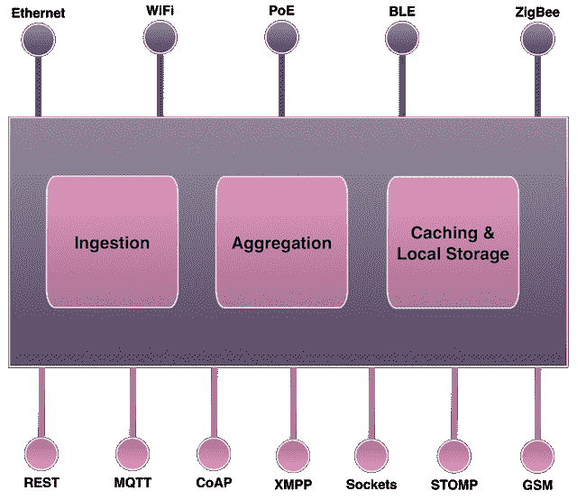
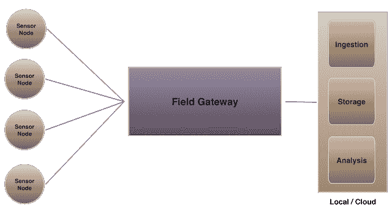
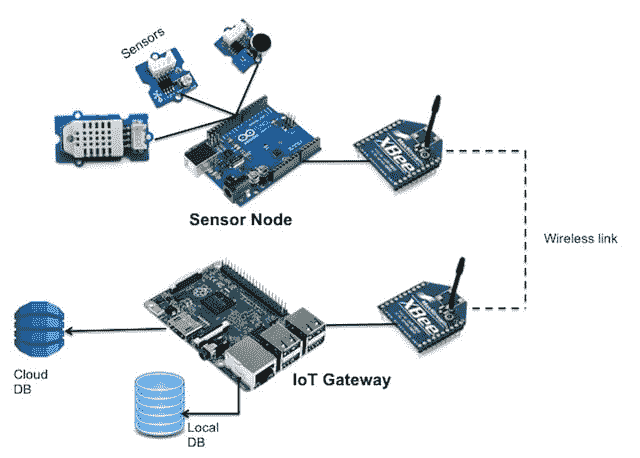

# 教程:使用 Arduino 和 Raspberry Pi 构建传感器节点和物联网网关原型——第 1 部分

> 原文：<https://thenewstack.io/tutorial-prototyping-a-sensor-node-and-iot-gateway-with-arduino-and-raspberry-pi-part-1/>

两部分教程中的第一部分，介绍了如何使用开源软件栈为工业环境实时聚合、存储和可视化传感器数据。在…里

[part two](https://thenewstack.io/tutorial-configuring-a-sensor-node-and-iot-gateway-to-collect-and-visualize-data-part-2/)

我们将连接传感器和无线电来配置 Arduino 和 Raspberry Pi。

工业物联网需要强大的基础设施，包括传感器节点、节能通信网络和连接互联网和云的网关。传感器生成的数据集在对企业有价值之前要经过许多阶段。本文介绍了工业场景中使用的传感器节点、低功耗网络和物联网网关的概念。我们将使用 Arduino、XBee、Raspberry Pi 2 和开源软件来构建端到端解决方案的原型。

最新的《覆盆子 Pi 2》比它的前代产品更具冲击力。树莓 Pi 2 Model B 采用 900 MHz 四核 ARM Cortex-A7 处理器和 1GB RAM，可用于各种场景。我们将使用开源软件栈来实时聚合、存储和可视化传感器数据。

## 什么是物联网网关？

在工业物联网场景中，有许多传感器和执行器与机器交互。每台机器通常都有多个传感器来跟踪其健康状况，并监控与生产相关的关键参数。每个传感器和致动器都连接到一个微控制器，该微控制器负责通过预定义的指令集采集数据或控制开关。微控制器——连同传感器、电源和无线电——被称为传感器节点。它是一个独立的可部署单元，可以捕获传感器生成的数据。传感器节点没有足够的处理能力、内存和存储来本地处理数据。它使用低能量无线电通信网络将数据发送到中央位置。传感器节点和中央集线器之间的通信链路基于 ZigBee、蓝牙低能耗(BLE)或以太网供电(PoE)。充当传感器节点生成的多个原始数据集的聚合器的集线器称为物联网网关。

物联网网关扮演着多重角色。网关的首要工作之一是转换和规范化数据。传感器节点生成的数据集将采用不同的格式。一些遗留节点使用专有协议，而现代节点可能依赖于 JSON 或 CSV。网关从多个传感器节点获取异构数据集，并将其转换为数据处理管道下一阶段可以理解的标准格式。

物联网网关的第二个作用是协议转换。由于传感器节点不能使用耗电的 Wi-Fi 或以太网，它们使用低功耗的通信网络。网关支持多种通信协议来接受传感器节点发送的入站数据。它使用各种协议进行出站通信，通常将网关连接到云中运行的进程。物联网环境中使用的一些流行出站协议有 REST、MQTT、CoAP、STOMP 甚至 SMS。在某些情况下，网关还可以处理数据并实时发出警报。但是这最好留给运行在云中的强大的流处理管道。

下图展示了物联网网关的部署架构。

网关就像一个边缘设备，将传感器节点隐藏在公共互联网之外。虽然传感器节点可以通过网关向外连接到互联网和云，但它们不能被直接访问。因此，网关扮演着保护传感器节点和内部网络的路由器和防火墙的双重角色。

能够连接到互联网的传感器节点仍然需要网关来进行数据聚集和转换。它们连接到云中运行的一个叫做云网关的设备。在内部运行的本地边缘设备通常被称为现场网关。

## Arduino 作为传感器节点，Raspberry Pi 作为网关

由于本教程的目标是构建一个工作原型，我们将保持传感器节点配置简单。我们将使用一个廉价的 DHT22 传感器来捕获环境湿度和温度，并将其发送到网关。

我们使用以下组件:

### 传感器节点

*   Arduino Uno R3
*   DHT 22 湿度/温度传感器
*   XBee 分线板
*   XBee 系列 2

### 物联网网关

*   树莓 Pi 2
*   XBee 系列 2
*   无线网络加密狗

## XBee 简介

XBee 模块使创建无线点对点或网状网络变得容易。它们通过标准的 AT 命令进行配置。凭借内置的纠错功能，XBee 模块提供了可靠的无线连接。它们有多种风格，支持 ZigBee、蓝牙甚至 Wi-Fi 等协议。XBee 模块可以配置为在透明数据模式或应用程序编程接口(API)模式下运行。

在透明模式下，进入数据输入(DIN)引脚的数据会直接通过无线传输至目标接收无线电，无需任何修改。这一特性使 XBee 成为 RS–232 电缆的替代产品。传入的数据包既可以直接寻址到一个目标(点对点)，也可以广播到多个目标(星形)。我们将使用以透明模式配置的 XBees 将传感器节点连接到网关。

ZigBee 是一种高级通信协议规范，主要用于基于小型、低功率数字无线电的个人区域网络。ZigBee 基于 IEEE 802.15.4 标准。它的低功耗将传输范围限制在 10 至 100 米的视距内，具体取决于功率输出和环境特征。ZigBee 设备能够通过中间设备的网状网络到达更远的设备来长距离传输数据。

ZigBee 通常用于需要长电池寿命和安全网络的低数据速率应用。ZigBee 网络由 128 位对称加密密钥保护。ZigBee 的一些使用案例包括无线电灯开关、带家用显示器的电表、交通管理系统以及其他需要短距离、低速率无线数据传输的消费和工业设备。

ZigBee 规范定义的技术旨在比其他无线个人区域网(WPANs)更简单、更便宜，例如蓝牙或 Wi-Fi。飞利浦 Hue 灯泡使用 ZigBee 作为集线器和灯泡之间的通信协议。我们将使用 ZigBee 作为传感器节点和物联网网关之间的无线电链路。

连接到传感器节点的 XBee 无线电将充当路由器，而连接到网关的无线电将充当协调器。多个路由器可以与协调器对话。对于高级场景，建议在 API 配置模式下使用 XBee。关于在路由器模式和协调器模式下配置 XBee 无线电模块的详细演练，请参考 SparkFun 的[优秀教程。](https://learn.sparkfun.com/tutorials/exploring-xbees-and-xctu)

<svg xmlns:xlink="http://www.w3.org/1999/xlink" viewBox="0 0 68 31" version="1.1"><title>Group</title> <desc>Created with Sketch.</desc></svg>