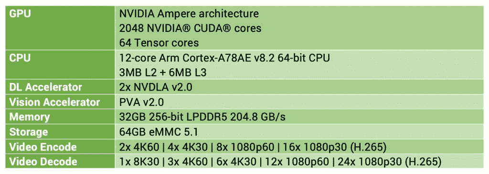
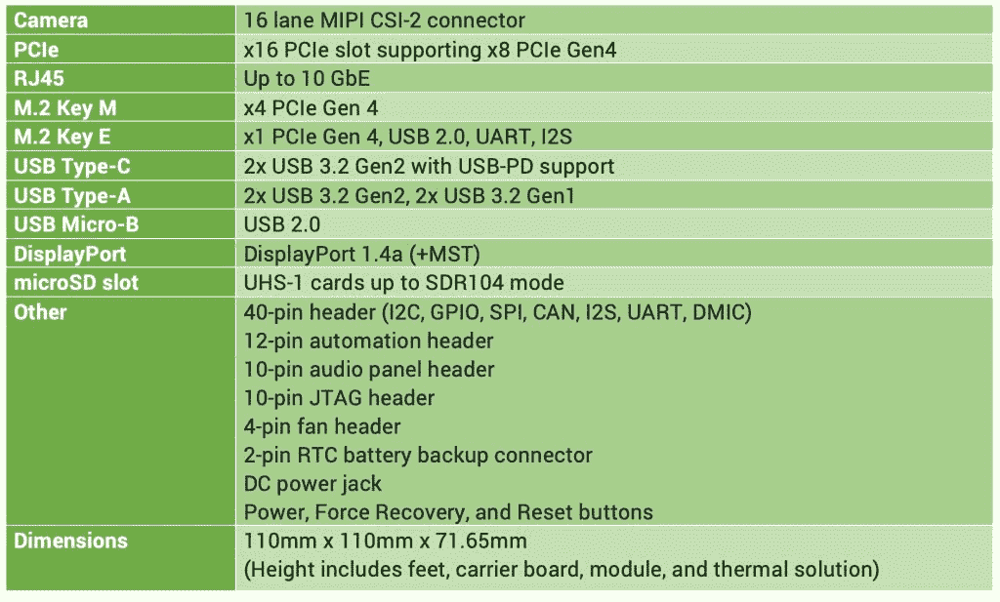
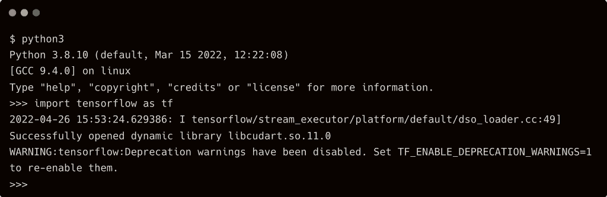
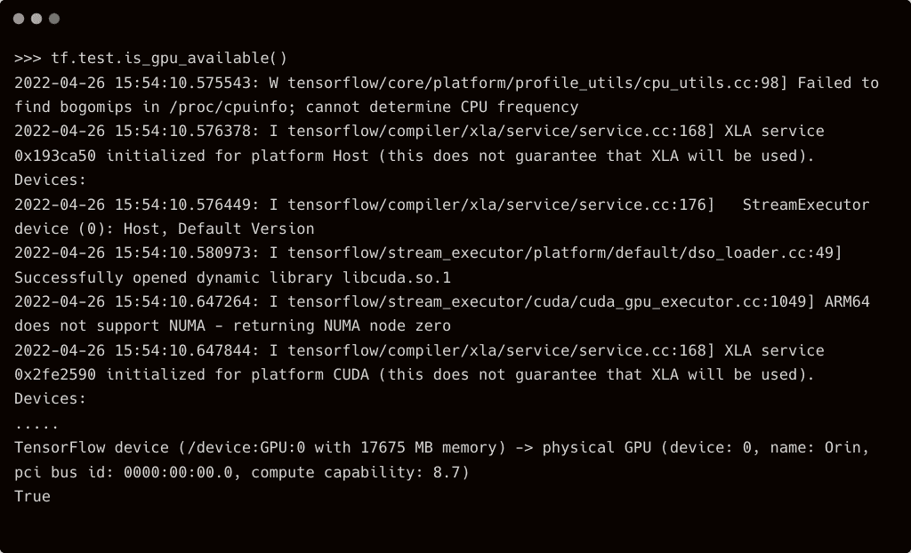
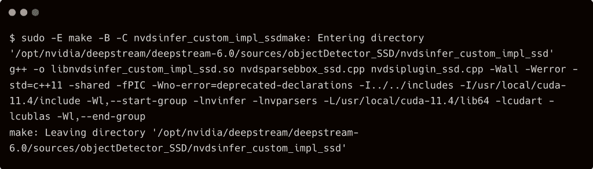
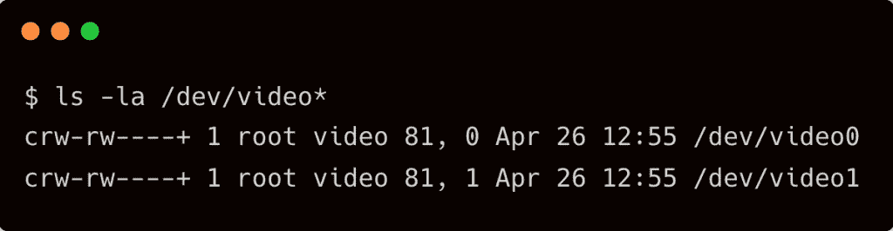

# 教程:在 Nvidia Jetson AGX Orin 上使用 DeepStream 进行实时对象检测

> 原文：<https://thenewstack.io/tutorial-real-time-object-detection-with-deepstream-on-nvidia-jetson-agx-orin/>

上个月，Nvidia 在 GTC 发布了下一代边缘计算硬件设备，名为 [Jetson AGX Orin](https://www.nvidia.com/en-in/autonomous-machines/embedded-systems/jetson-orin/) 。承蒙 Nvidia 的帮助，我有幸得到了一个 Jetson AGX Orin 开发工具包来评估和试验它。

Jetson AGX Orin 开发者套件拥有在边缘运行 AI 推理所需的一切，具有超低延迟和高吞吐量。作为最强大的杰特森 AGX 泽维尔的继任者，AGX 奥林包一拳。

以下是 Jetson AGX Orin 计算模块的规格:



开发套件带有载板，可轻松连接各种外设。



Jetson AGX Orin 开发工具包附带了 JetPack SDK 5.0 的预览版，它基于 Ubuntu 20.04 根文件系统和 Linux 内核 5.10。它预装了 CUDA 11.4、cuDNN 8.3.2、TensorRT 8.4.0 和 DeepStream 6.0。

本教程将带您完成使用运行在 Jetson AGX Orin 上的 DeepStream SDK 执行实时对象检测的步骤。

### 步骤 1–在 JetPack 5.0 上安装 TensorFlow

由于我们使用预先训练的 TensorFlow 模型，所以让我们安装运行时。

`sudo pip3 install --pre --extra-index-url https://developer.download.nvidia.com/compute/redist/jp/v50 'tensorflow<2'`

这将安装最适合本教程的 TensorFlow 1.15。`--extra-index-url`指向一个为 JetPack 5.0 优化的轮子。



检查 GPU 是否可从 TensorFlow 访问。



### 步骤 2–下载预先训练的 TensorFlow 初始模型

我们将使用在 COCO 数据集上训练的 TensorFlow Inception V2 模型。

```
wget  -qO-  http://download.tensorflow.org/models/object_detection/ssd_inception_v2_coco_2017_11_17.tar.gz | tar xvz -C /tmp

```

### 步骤 3–将张量流模型转换为张量

此步骤通过将 TensorFlow 冻结模型转换为序列化的 tensort UFF 元图模型来优化模型。

```
python3  /usr/lib/python3.8/dist-packages/uff/bin/convert_to_uff.py  \  /tmp/ssd_inception_v2_coco_2017_11_17/frozen_inference_graph.pb  -O  NMS  \
-p  /usr/src/tensorrt/samples/sampleUffSSD/config.py  \
-o  /tmp/sample_ssd_relu6.uff

```

### 步骤 4–编译自定义对象检测器示例应用程序

DeepStream SDK 附带了一个示例应用程序，可以与各种模型集成。我们现在将编译应用程序来使用我们的初始 V2 模型。

```
cd  /opt/nvidia/deepstream/deepstream/sources/objectDetector_SSD
export CUDA_VER=11.4
export LD_LIBRARY_PATH=/usr/local/cuda
sudo  -E  make  -C  nvdsinfer_custom_impl_ssd

```

### 

### 步骤 5–编辑 DeepStream 应用程序配置文件

打开`/opt/nvidia/deepstream/deepstream/sources/objectDetector_SSD/deepstream_app_config_ssd.txt`，用以下内容替换`[source0]`部分:

```
[source0]
enable=1
type=1
camera-width=640
camera-height=480
camera-fps-n=30
camera-fps-d=1
camera-v4l2-dev-node=0

```

这实际上将 USB 网络摄像头配置为输入源。连接相机后，确保 JetPack 可以看到它。



### 步骤 6–运行深流推理管道

最后，运行推理来执行对象检测。

```
deepstream-app  -c  deepstream_app_config_ssd_USB.txt

```


我们可以通过切换到 Jetson AGX Orin 开发工具包的内置相机串行接口(CSI)来提高推理性能和每秒帧数。

<svg xmlns:xlink="http://www.w3.org/1999/xlink" viewBox="0 0 68 31" version="1.1"><title>Group</title> <desc>Created with Sketch.</desc></svg>