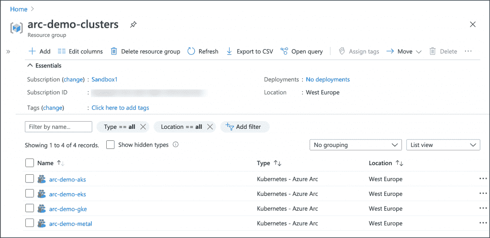
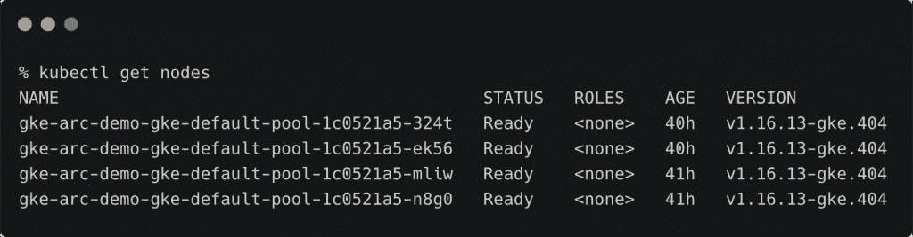
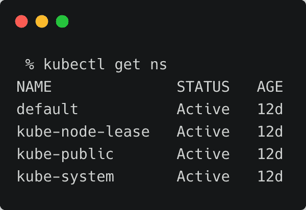
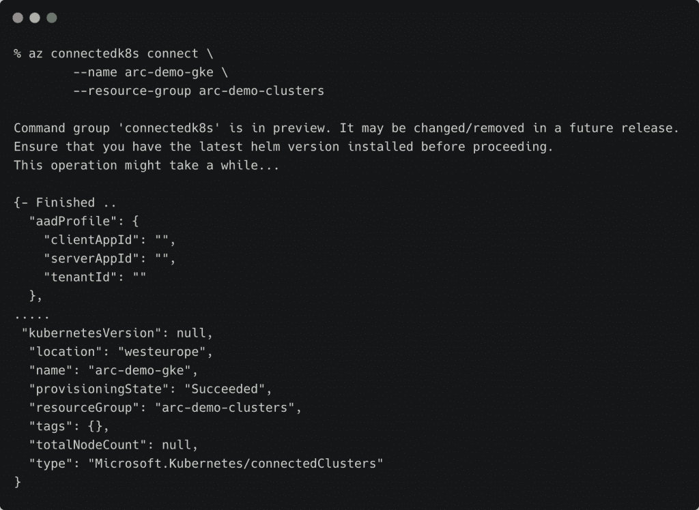
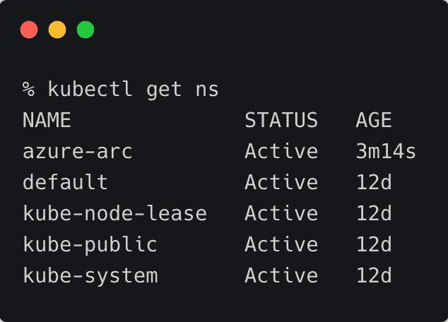
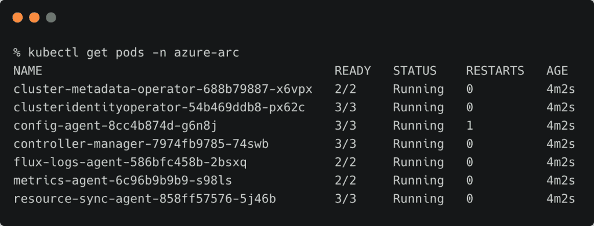
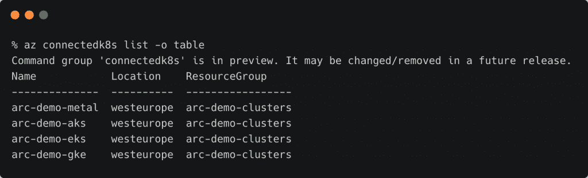
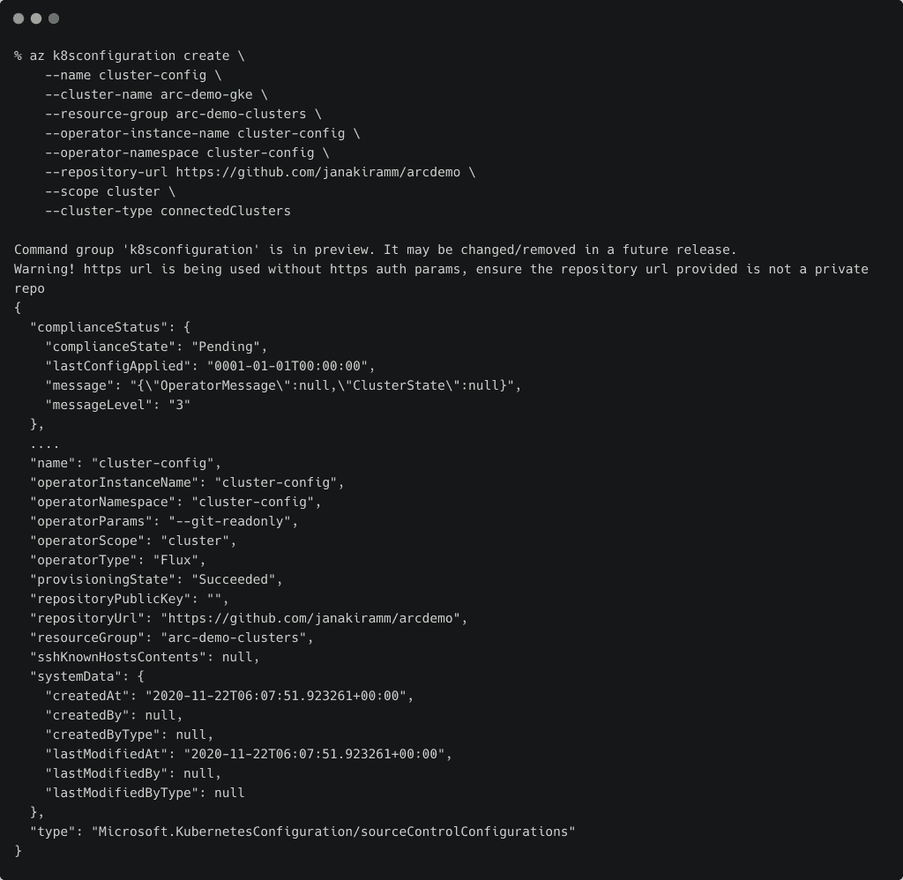
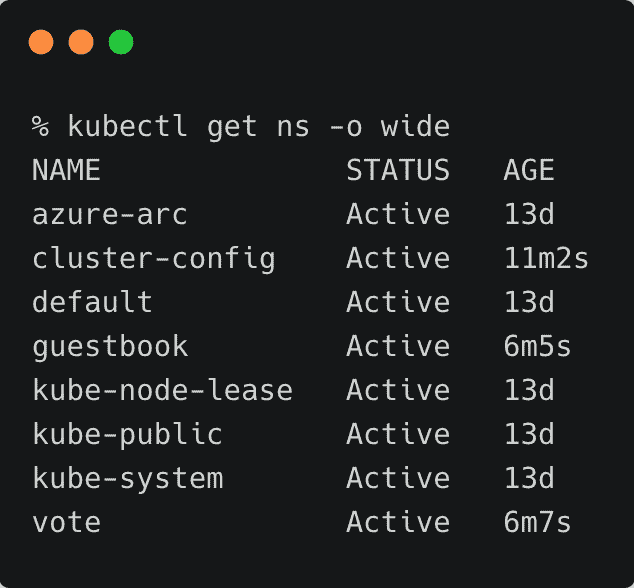

# 教程:用 Azure Arc 注册和配置 Kubernetes 集群

> 原文：<https://thenewstack.io/tutorial-register-and-configure-kubernetes-clusters-with-azure-arc/>

这篇文章是本周探索微软 Arc 系列文章的第三篇，也是如何将它作为一个控制平面来管理服务。请在周四之前每天查看后续部分: (

[Part 1](https://thenewstack.io/a-technical-introduction-to-microsoft-azure-arc/)

) (

[Part 2](https://thenewstack.io/tutorial-register-and-manage-linux-servers-with-azure-arc/)

)

本文是 Azure Arc 系列的第三部分，在这里我们将探索支持 Arc 的 Kubernetes 集群。我们还将配置 GitOps，以便在所有注册的集群上一致地部署工作负载。

我们可以使用 Azure Arc 支持的 Kubernetes 在 Azure 内部或外部附加和配置 Kubernetes 集群。在下面的屏幕截图中，我们在阿克苏、EKS、GKE 和 Azure Arc 裸机部署了四个集群。



学完本教程后，您将能够连接现有集群并在其上部署集群配置代理。

### 设置环境

确保您有一个在 GKE 或其他环境中运行的集群。甚至基于 Minikube 或 Kind 的集群也可以用 Azure Arc 注册。

对于本教程，我正在 GKE 运行一个四节点集群。



首先为您的 Azure 订阅注册提供商。提供商正在注册，请耐心等待。这可能需要一段时间。

```
az provider register  --namespace Microsoft.Kubernetes

```

```
az provider register  --namespace Microsoft.KubernetesConfiguration

```

我们还需要为`az` CLI 注册一个扩展，以便使用支持 Arc 的 Kubernetes 集群。运行以下命令进行注册。

```
az extension add  --name connectedk8s

```

```
az extension add  --name k8sconfiguration

```

我们还需要安装最新版本的头盔。在 macOS 上，通过自制软件安装。

最后，为注册的集群创建一个资源组。确保在受支持的地区之一(美国东部和西欧)创建资源组。

```
az group create  --name arc-demo-clusters  -l  WestEurope

```

我们现在准备注册集群。确保您的 KUBECONFIG 环境指向正确的集群。

### 向 Azure Arc 注册 Google Kubernetes 引擎集群

让我们看看集群中的名称空间。



目前，集群中没有正在运行的工作负载。我们只有在集群配置期间创建的默认名称空间。

向 Azure Arc 注册 Kubernetes 集群将产生一个新的名称空间。让我们通过运行下面的命令来启动注册:

```
az connectedk8s connect  \
  --name arc-demo-gke  \
  --resource-group arc-demo-clusters

```



让我们研究一下名称空间和在新名称空间中创建的资源。





Azure Arc 代理部署在名称空间`azure-arc`中。这些代理维护 Kubernetes 集群和 Azure Arc 控制平面之间的连接。

我们可以用下面的命令列出所有连接的集群:

```
az connectedk8s list  -o  table

```



您也可以通过 Azure Portal 验证注册。


### 通过 GitOps 部署应用程序和配置

GitOps 是在 Git 存储库中声明 Kubernetes 配置的期望状态(如部署、名称空间和配置映射),然后使用操作符将这些配置的轮询和基于拉的部署模型发送到集群的实践。

使用 Azure Arc，我们可以通过将清单提交给 Git 存储库，将应用程序和配置部署到所有注册的集群。在每个已注册的集群中运行的代理将自动提取清单/规范，并将它们应用到集群。

我们需要一个 Git 存储库，作为所有参与集群的唯一真实来源。对于本教程，您可以使用[https://github.com/janakiramm/arcdemo](https://github.com/janakiramm/arcdemo)，它拥有流行的 Azure Vote 示例应用程序和一个名为 guestbook 的空名称空间。

您也可以尝试派生存储库并向其中添加您自己的清单。在这种情况下，确保 GitOps 代理指向您的存储库，而不是上面共享的那个。

确保您的 KUBECONFIG 变量指向我们之前配置的同一个 GKE 集群。运行以下命令，使用 GitOps 代理配置集群。

```
az k8sconfiguration create  \
    --name cluster-config  \
    --cluster-name arc-demo-gke  \
    --resource-group arc-demo-clusters  \
    --operator-instance-name cluster-config  \
    --operator-namespace cluster-config  \
    --repository-url https://github.com/janakiramm/arcdemo \
    --scope cluster  \
    --cluster-type connectedClusters

```



几分钟后，`cluster-config`名称空间将运行 GitOps 代理，该代理监视 GitHub 存储库的新提交。



您还会注意到添加了两个名称空间— `vote`和`guestbook`，它们来自 GitHub 存储库中存储的规范。

所有注册到 Azure Arc 并运行集群配置代理的集群都将拥有这些名称空间以及相关的部署和配置。

尝试对清单进行更改，并将它们提交给 repo。您会注意到这些更改会自动传播到所有已注册的集群，无需手动干预。这就是基于 GitOps 的部署和配置的强大之处。

在本系列的下一部分，我们将探索 Azure Arc 数据服务。敬请期待！

贾纳基拉姆·MSV 的网络研讨会系列“机器智能和现代基础设施(MI2)”提供了涵盖前沿技术的信息丰富、见解深刻的会议。在 [http://mi2.live](http://mi2.live) 上注册参加即将举行的 MI2 网络研讨会。

ipicgr 通过 Pixabay 生成的特征图像。

<svg xmlns:xlink="http://www.w3.org/1999/xlink" viewBox="0 0 68 31" version="1.1"><title>Group</title> <desc>Created with Sketch.</desc></svg>