# 教程:用 Azure Arc 注册和管理 Linux 服务器

> 原文：<https://thenewstack.io/tutorial-register-and-manage-linux-servers-with-azure-arc/>

这篇文章是本周探索微软 Arc 系列文章的第二篇，也是如何将它作为一个控制平面来管理服务。请在周四之前每天查看后续部分: (

[Part 1](https://thenewstack.io/a-technical-introduction-to-microsoft-azure-arc/)

), (

[Part 3](https://thenewstack.io/tutorial-register-and-configure-kubernetes-clusters-with-azure-arc/)

).

本文是 Azure Arc 系列的第二部分，在这里我们将探讨支持 Azure Arc 的服务器的概念。除了连接现有的 Ubuntu 机器，我们还将配置一个策略来检查特定资源组中所有服务器的兼容性。

Azure Arc 支持的服务器可以由 Azure 资源管理器(ARM)控制平面管理，即使它们不在 Azure 中运行。

在下面的屏幕截图中，我们看到运行在 Amazon EC2、Google Compute Engine、vSphere 和 Azure 虚拟机上的虚拟机注册了 Azure Arc。

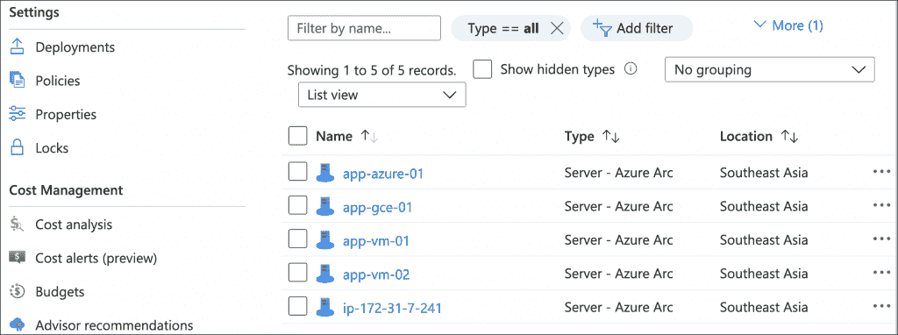

我们还可以应用策略来检查这些虚拟机的合规性。在本教程中，我们将对使用密码而不是 SSH 密钥的所有虚拟机进行审核。

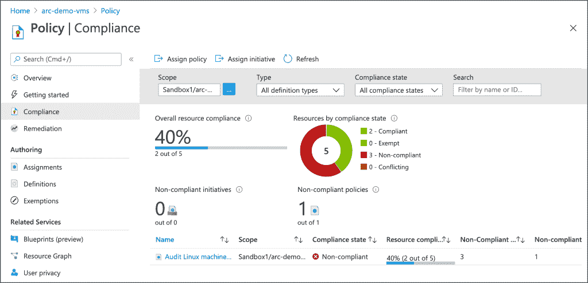

部署在 vSphere 中的两个虚拟机和运行在 Azure 中的另一个虚拟机不使用 SSH 密钥，Azure 策略管理器发现了这一点。

### 先决条件

*   带有出站互联网访问的 Ubuntu 18.04 服务器
*   有效的 Microsoft Azure 订阅

### 注册现有的 Ubuntu 服务器

从 Azure 门户，搜索**服务器-Azure Arc**来启动向导。

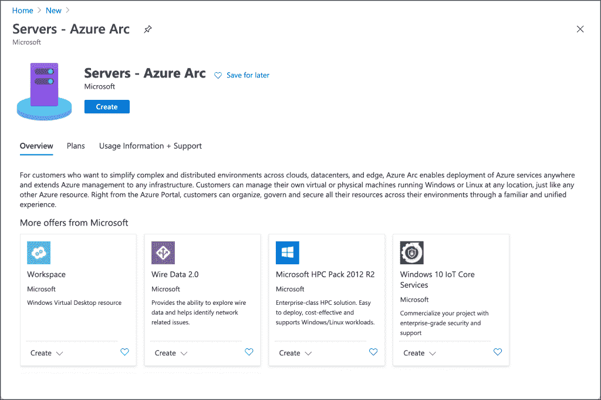

您可以交互注册服务器，也可以大规模注册多台服务器。对于本教程，选择使用交互式脚本添加服务器的第一个选项。

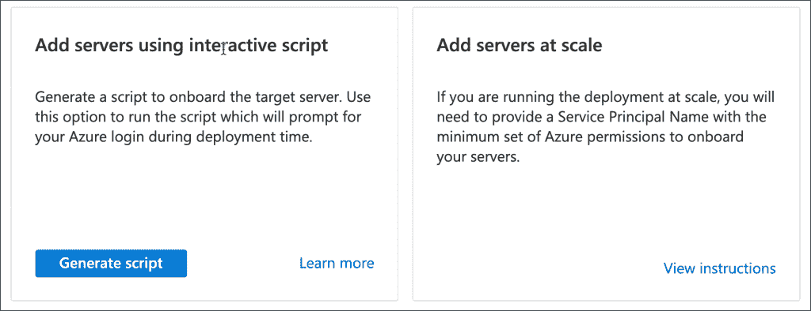

在继续下一步之前，请确保您满足先决条件。

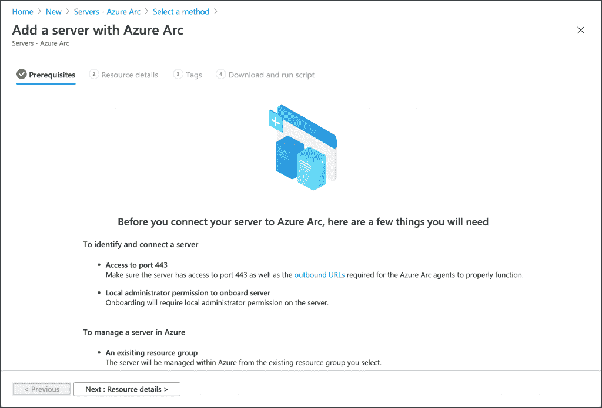

在下一步中，选择您的订阅、资源组以及 Azure Arc 可用的地区。选择 Linux 作为操作系统，然后进入下一步。

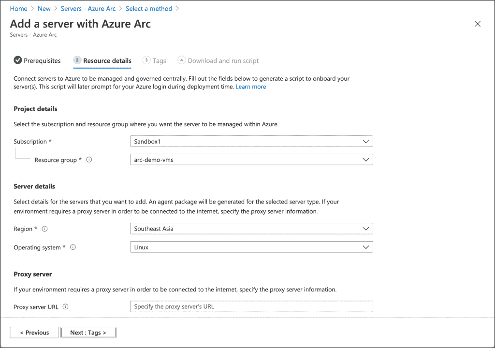

填充任何建议标记的值或创建您自己的标记。

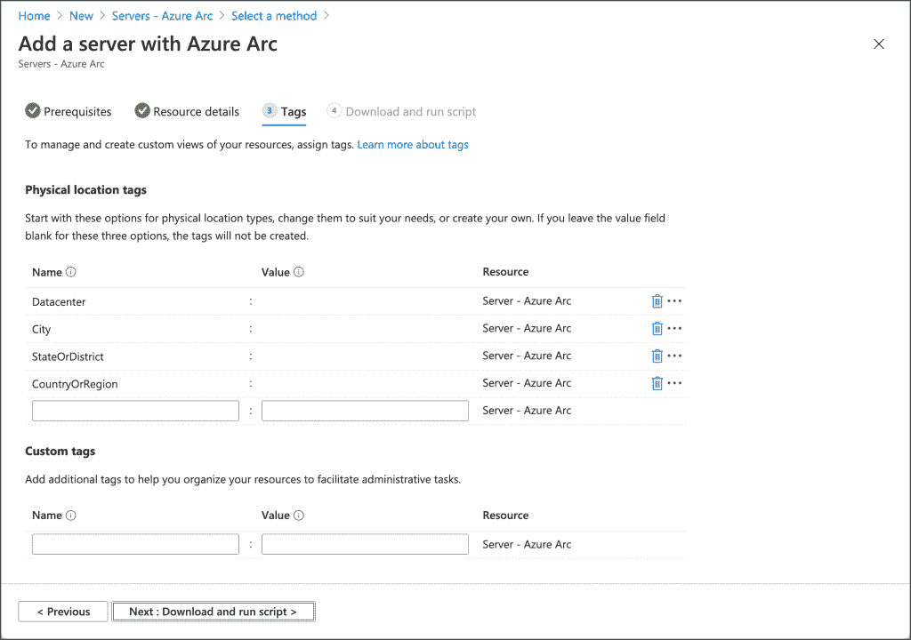

最后，您将看到在 Ubuntu 服务器上运行的命令。复制它并关闭向导。

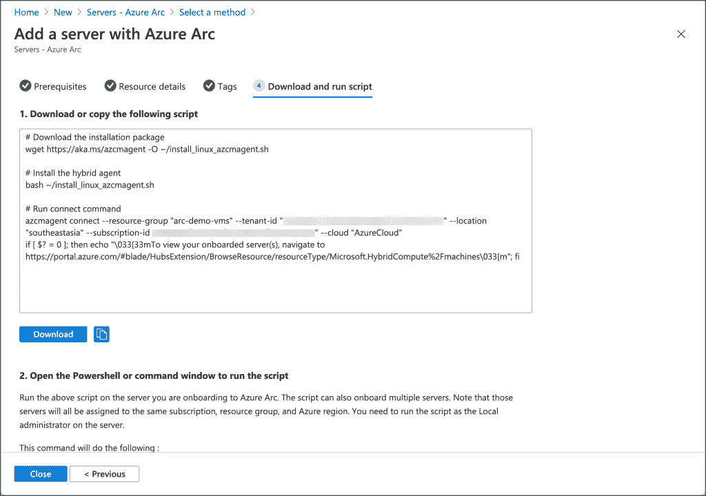

SSH 到你的 Ubuntu 机器上，粘贴上一步复制的命令。

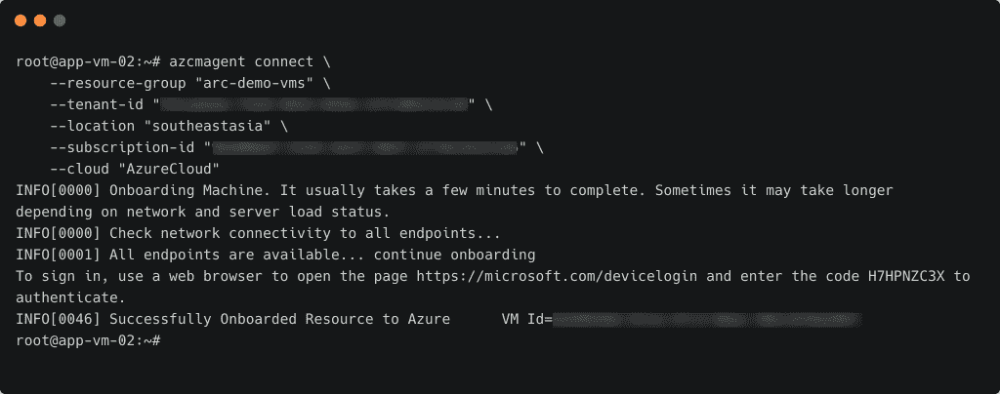

几分钟后，您会注意到资源组中已注册的机器。

### 将策略应用到已注册的服务器

我们现在将应用一个策略来发现是否有任何注册的机器使用密码而不是 SSH 密钥。

打开资源管理器的策略设置，并单击分配策略。

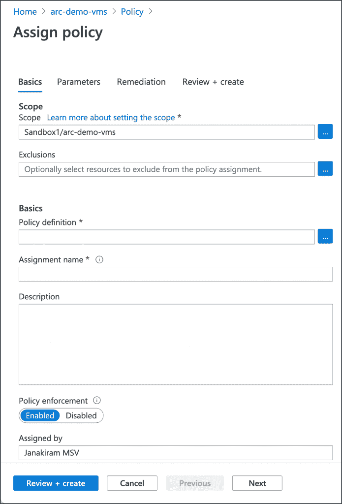

从可用的策略定义中，选择**审计不使用 SSH 密钥进行认证的 Linux 机器**。

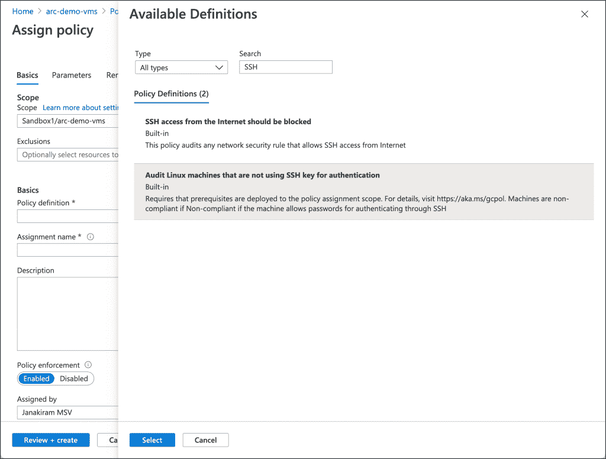

确保您设置了选项**包括 Arc 连接的服务器**。

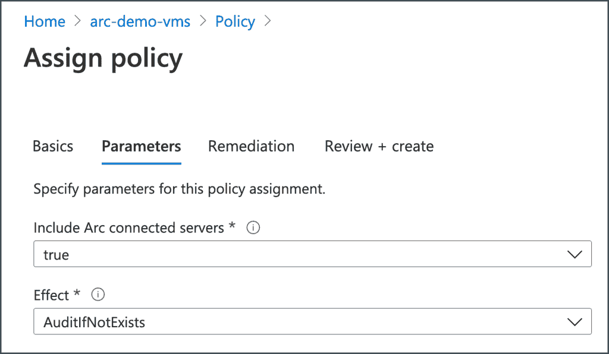

在下一步中接受默认值以创建策略。

几分钟后，合规性控制面板将更新，以报告审核结果。

恭喜你！您已成功向 Azure Arc 注册了外部服务器，并运行了合规性测试。

在本系列的下一部分，我们将探索如何向 Azure Arc 注册 Kubernetes 集群并执行基于 GitOps 的部署。敬请期待！

贾纳奇拉姆·MSV 的网络研讨会系列“机器智能和现代基础设施(MI2)”提供了涵盖前沿技术的信息丰富、见解深刻的会议。在 [http://mi2.live](http://mi2.live) 注册即将到来的 MI2 网络研讨会。

通过 Pixabay 的特征图像。

<svg xmlns:xlink="http://www.w3.org/1999/xlink" viewBox="0 0 68 31" version="1.1"><title>Group</title> <desc>Created with Sketch.</desc></svg>