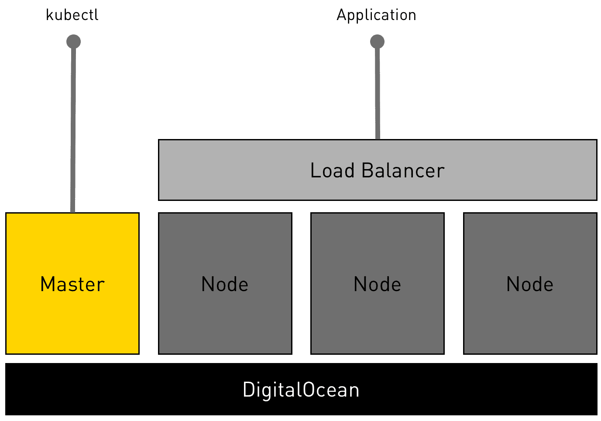
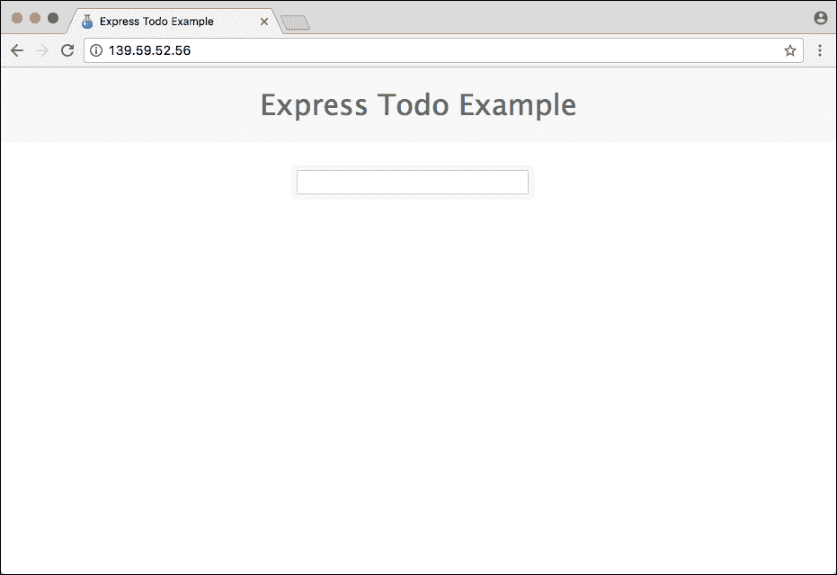
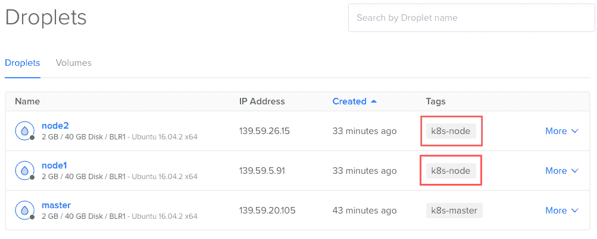
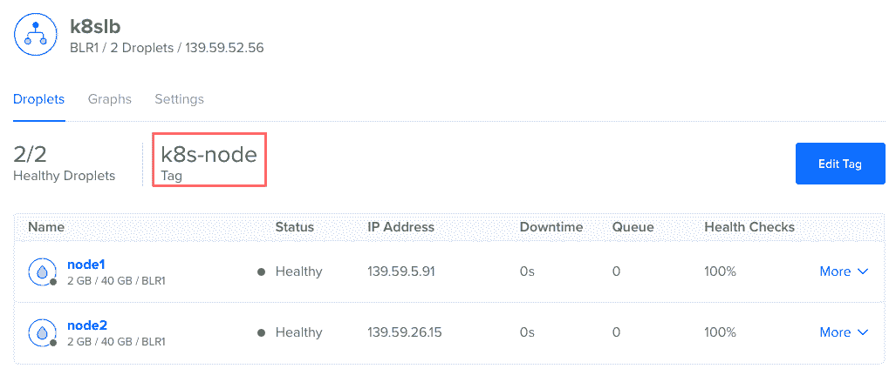

# 教程:在数字海洋中配置 Kubernetes 开发测试集群

> 原文：<https://thenewstack.io/tutorial-run-multi-node-kubernetes-cluster-digitalocean/>

[DigitalOcean](https://www.digitalocean.com/) 是一个面向开发者的平价云计算平台。它遍布美洲、亚洲和欧洲，是发展最快的公共云服务公司之一。 [Kubernetes](http://kubernetes.io/) 在容器编排生态系统中也取得了进展。许多企业将它视为生产工作负载的容器管理平台。

出于开发和测试的目的，本教程将向您介绍在 Mac 上配置 DigitalOcean 中的多节点 Kubernetes 集群的步骤。本指南的独特之处在于，它向您展示了利用 DigitalOcean 中可用功能的提示和技巧。我们将学习如何有效地使用[云配置](https://www.digitalocean.com/community/tutorials/an-introduction-to-cloud-config-scripting)的概念，以及最近宣布的数字海洋中的[负载平衡器](https://www.digitalocean.com/community/tutorials/an-introduction-to-digitalocean-load-balancers)功能。

其中一些技巧也可以轻松应用于其他公共云环境。

最后一步将向您展示如何部署通过负载平衡器公开的微服务应用程序。

您可以从 [GitHub](https://github.com/janakiramm/do-k8s) 下载示例应用程序的脚本和 YAML 文件。在 [YouTube](https://www.youtube.com/watch?v=C8gq5hUWC0g) 上还有一个视频演示。

这是部署拓扑的图示。



数字海洋上的 Kubernetes 部署拓扑

## 设置环境

除了 DigitalOcean 的有效帐户外，我们还需要 DigitalOcean 和 Kubernetes——doctl 和 kubectl——的 CLI。

让我们从下载和安装数字海洋的 CLI 开始。

```
$  curl  -OL https://github.com/digitalocean/doctl/releases/download/v1.6.0/doctl-1.6.0-darwin-10.6-amd64.tar.gz

$  tar xf  ./doctl-1.6.0-darwin-10.6-amd64.tar.gz

$  sudo mv  ~/doctl  /usr/local/bin

```

参考本[教程](https://www.digitalocean.com/community/tutorials/how-to-use-doctl-the-official-digitalocean-command-line-client)将 DigitalOcean CLI 与您的帐户相关联。

然后我们将下载 kubectl，Kubernetes 的 CLI。

```
$  curl  -LO https://storage.googleapis.com/kubernetes-release/release/$(curl -s https://storage.googleapis.com/kubernetes-release/release/stable.txt)/bin/darwin/amd64/kubectl

$  chmod  +x  ./kubectl

$  sudo mv  ./kubectl  /usr/local/bin/kubectl

```

下一步是生成 SSH 密钥对，并将其导入我们的 DigitalOcean 帐户。为了安全地访问集群，我们将创建一对与 Kubernetes 主节点和节点相关联的 SSH 密钥。

```
$  ssh-keygen  -t  rsa

$  doctl compute ssh-key import k8s-ssh  --public-key-file  ~/.ssh/id_rsa.pub

$  SSH_ID=`doctl compute ssh-key list  |  grep  "k8s-ssh"  |  cut  -d' '  -f1`

$  SSH_KEY=`doctl compute ssh-key get  $SSH_ID  --format FingerPrint  --no-header`

```

上述步骤将公钥复制到云端，可在创建 droplets(数字海洋中的虚拟机)时使用。

我们还将在数字海洋环境中创建一些稍后需要的标签。

```
$  doctl compute tag create k8s-master

$  doctl compute tag create k8s-node

```

我们需要一个令牌，Kubernetes 节点需要这个令牌来发现主节点。我们将通过一个简单的一行 Python 脚本生成它，然后替换我们稍后将使用的 master.sh 和 node.sh 中的占位符。

```
$  TOKEN=`python  -c  'import random; print "%0x.%0x" % (random.SystemRandom().getrandbits(3*8), random.SystemRandom().getrandbits(8*8))'`
$  sed  -i.bak  "s/^TOKEN=.*/TOKEN=${TOKEN}/"  ./master.sh
$  sed  -i.bak  "s/^TOKEN=.*/TOKEN=${TOKEN}/"  ./node.sh

```

最后，让我们定义一个变量来保存部署的首选区域。

要获得数字海洋支持的地区列表，您可以使用下面的命令

```
$  doctl compute region list

```

环境配置就绪后，让我们继续部署 [Kubernetes master](https://kubernetes.io/docs/concepts/overview/components/) 。

## 配置 Kubernetes 主机

我们正在使用 [kubeadm](https://kubernetes.io/docs/getting-started-guides/kubeadm/) ，这是一个大大减少安装 Kubernetes 的痛苦的工具。Kubeadm 支持 CentOS 7 或 Ubuntu 16.04 发行版。我们将使用 Ubuntu 作为我们的设置。

以下脚本配置 Kubernetes 主机。

```
#!/bin/bash
# Replace this with the actual token
TOKEN=xxxxxx.yyyyyyyyyyyyyyyy

apt-get update  &amp;&amp;  apt-get upgrade  -y

curl  -s  https://packages.cloud.google.com/apt/doc/apt-key.gpg | apt-key add -

cat  &lt;&lt;EOF  &gt;  /etc/apt/sources.list.d/kubernetes.list

deb http://apt.kubernetes.io/ kubernetes-xenial main

EOF

apt-get update  -y

apt-get install  -y  docker.io

apt-get install  -y  --allow-unauthenticated kubelet kubeadm kubectl kubernetes-cni

# Get the public IP of DigitalOcean droplet from the metadata endpoint

export MASTER_IP=$(curl  -s  http://169.254.169.254/metadata/v1/interfaces/public/0/ipv4/address)

kubeadm init  --pod-network-cidr=10.244.0.0/16   --apiserver-advertise-address  $MASTER_IP  --token  $TOKEN

```

```
cp  /etc/kubernetes/admin.conf  $HOME/

chown  $(id  -u):$(id  -g)  $HOME/admin.conf

export KUBECONFIG=$HOME/admin.conf

kubectl create  -f  https://raw.githubusercontent.com/coreos/flannel/master/Documentation/kube-flannel-rbac.yml --namespace=kube-system

kubectl create  -f  https://raw.githubusercontent.com/coreos/flannel/master/Documentation/kube-flannel.yml --namespace=kube-system

kubectl create  -f  https://rawgit.com/kubernetes/dashboard/master/src/deploy/kubernetes-dashboard.yaml --namespace=kube-system

```

您可以自由更改主节点和节点加入集群时使用的令牌。由于我们需要告诉 master API 将被暴露的 IP 地址，所以我们使用 DigitalOcean 的 droplet 元数据来动态检索 IP 地址。master.sh 中提供的这个脚本通过 [cloud-config](https://www.digitalocean.com/community/tutorials/an-introduction-to-cloud-config-scripting) 配置传递给 droplet。这种技术为我们提供了一种无需动手的机制来设置 Kubernetes master。随着 droplet 的供应，我们传递的脚本将会执行。在几分钟内，我们将有一个完全配置好的主节点准备好接受节点。

运行以下命令，基于运行 Ubuntu 16.04 64 位的 2GB droplet 配置启动 Kubernetes master。

```
$  doctl compute droplet create master  \

--region  $REGION  \

--image ubuntu-16-04-x64  \

--size  2gb  \

--tag-name k8s-master  \

--ssh-keys  $SSH_KEY  \

--user-data-file   ./master.sh  \

--wait

```

注意，我们正在传递在环境设置期间填充的变量区域和 SSH_KEY。脚本 master.sh 在配置过程中执行。这个单一的开关通过自动安装 Kubernetes master 为 droplet 的创建提供了强大的动力。在进入下一步之前，等待 7 到 10 分钟。这种方法的美妙之处在于，您永远不必通过 SSH 进入 droplet 来确认安装。这是一个全自动、无需手动的设置。

因为我们需要 master 的公共 IP 地址，所以运行下面的命令来填充几个环境变量。

```
$  MASTER_ID=`doctl compute droplet list  |  grep  "master"  |cut  -d' '  -f1`

$  MASTER_IP=`doctl compute droplet get  $MASTER_ID  --format PublicIPv4  --no-header`

```

几分钟后，运行以下命令从主服务器获取配置文件。我们可以通过 Kubernetes CLI、kubectl 开始使用这个文件来访问集群。

```
$  scp root@$MASTER_IP:/etc/kubernetes/admin.conf  .

```

如果你看到“没有这样的文件或目录”的错误，这意味着主服务器还没有准备好。

是时候确认主服务器是否配置成功了。运行以下命令查看可用节点。

```
$  kubectl  --kubeconfig  ./admin.conf get nodes

NAME       STATUS      AGE        VERSION

master     NotReady    44s        v1.6.1

```

这是主设备完全配置的标志。几分钟后，状态变为就绪。

有了 Kubernetes 主服务器，让我们继续配置节点。

## 配置 Kubernetes 节点

像 master 一样，我们也将使用云配置脚本来配置节点。

```
#!/bin/bash

# Replace this with the token
TOKEN=xxxxxx.yyyyyyyyyyyyyyyy

MASTER_IP=xxx.xxx.xxx.xxx

apt-get update  &amp;&amp;  apt-get upgrade  -y

```

```
curl  -s  https://packages.cloud.google.com/apt/doc/apt-key.gpg | apt-key add -

cat  &lt;&lt;EOF  &gt;  /etc/apt/sources.list.d/kubernetes.list

deb http://apt.kubernetes.io/ kubernetes-xenial main

EOF

apt-get update  -y

apt-get install  -y  docker.io

apt-get install  -y  --allow-unauthenticated kubelet kubeadm kubectl

kubernetes-cni

kubeadm join  --token  $TOKEN  $MASTER_IP:6443

```

确保令牌环境变量与主变量相同。MASTER_IP 变量告诉节点在哪里寻找 API 服务器。这个应该指向大师。

下面的命令将使用主服务器的当前 IP 地址更新脚本。

```
$  sed  -i.bak  "s/^MASTER_IP=.*/MASTER_IP=${MASTER_IP}/"  ./node.sh

```

一切就绪后，让我们开始启动两个节点。

```
$  doctl compute droplet create node1 node2  \

--region  $REGION  \

--image ubuntu-16-04-x64  \

--size  2gb  \

--tag-name k8s-node  \

--ssh-keys  $SSH_KEY  \

--user-data-file   ./node.sh  \

--wait

```

带有令牌和主节点 IP 地址的云配置脚本将确保节点立即向主节点注册。

几分钟后，再次检查节点数。虽然它可能显示节点没有准备好，但一切都会在几分钟内稳定下来。

```
$  kubectl  --kubeconfig  ./admin.conf get nodes

NAME       STATUS     AGE        VERSION

master     Ready      10m        v1.6.1

node1      Ready      1m         v1.6.1

node2      Ready      1m         v1.6.1

```

恭喜你！现在，您已经有了一个在云中运行的成熟的 Kubernetes 集群。是我们部署微服务应用的时候了。

## 部署应用程序

我们将在我们的 Kubernetes 集群中部署一个基于 MEAN stack 的简单待办应用程序。以下命令使用包含 pod、复制控制器和服务定义的 YAML 文件。

```
$  kubectl  --kubeconfig  ./admin.conf create   -f  todo-all-in-one.yaml

pod  "db"  created

service  "db"  created

replicationcontroller  "web"  created

service  "web"  created

```

使用 kubectl 检查可用的 pod 和服务。

```
$  kubectl  --kubeconfig  ./admin.conf get pods

NAME         READY      STATUS     RESTARTS    AGE

db           1/1        Running    0           1m

web-b6xkj    1/1        Running    0           1m

web-hwcjr    1/1        Running    0           1m

```

```
$  kubectl  --kubeconfig  ./admin.conf get svc

NAME          CLUSTER-IP        EXTERNAL-IP    PORT(S)         AGE

db            10.105.206.173    &lt;none&gt;         27017/TCP       1m

kubernetes    10.96.0.1         &lt;none&gt;         443/TCP         13m

web           10.110.85.30      &lt;nodes&gt;        80:32360/TCP    1m

```

服务 web 显示该应用程序在端口 32，360 的每个节点上都可用。此时，您可以获取任何节点的公共 IP 地址，以访问端口 32，360 处的待办应用程序。

让我们创建一个 DigitalOcean 负载平衡器，将每个节点上的端口 80 指向端口 32，360，而不是命中一个特定的节点。这将使我们的应用程序可以通过负载平衡器的公共 IP 访问，请求通过循环机制路由到每个节点。

## 配置负载平衡器

我们可以用 Kubernetes web 服务的 NodePort 值填充一个环境变量。这将有助于通过脚本动态配置负载平衡器。下面的命令显示了如何通过 kubectl 获得 NodePort。

```
$  NODEPORT=`kubectl  --kubeconfig  ./admin.conf get svc  -o  go-template='{{range .items}}{{range.spec.ports}}{{if .nodePort}}{{.nodePort}}{{"\n"}}{{end}}{{end}}{{end}}'`

```

我们现在将创建一个 DigitalOcean 负载平衡器，它具有指向微服务应用程序的健康检查和转发规则。转发规则将把负载平衡器的端口 80 映射到 Kubernetes 服务的节点端口，在那里应用程序的前端是可用的。

```
$  doctl compute load-balancer create  \

--name k8slb  \

--tag-name k8s-node  \

--region  $REGION  \

--health-check protocol:http,port:$NODEPORT,path:/,check_interval_seconds:10,response_timeout_seconds:5,healthy_threshold:5,unhealthy_threshold:3  \

--forwarding-rules entry_protocol:TCP,entry_port:80,target_protocol:TCP,target_port:$NODEPORT

```

我们现在有了一个完全配置好的环境，有一个示例应用程序和一个负载平衡器。是时候访问应用程序了。

## 访问应用程序

运行以下命令，在默认浏览器中打开应用程序。

```
$  LB_ID=`doctl compute load-balancer list  |  grep  "k8slb"  |  cut  -d' '  -f1`

$  LB_IP=`doctl compute load-balancer get  $LB_ID  |  awk  '{ print $2; }'  |  tail  -n  +2`

$  open http://$LB_IP

```

以上命令获取 DigitalOcean 的负载均衡器的公共 IP 地址，并在 Mac 上的默认浏览器中打开。



通过负载平衡器从浏览器访问微服务应用

## 添加其他节点

如何向集群添加新节点？非常简单——使用与原始节点相同的配置和参数启动新的 droplets。

```
$  doctl compute droplet create node3 node4  \

--region  $REGION  \

--image ubuntu-16-04-x64  \

--size  2gb  \

--tag-name k8s-node  \

--ssh-keys  $SSH_KEY  \

--user-data-file   ./node.sh  \

--wait

```

因为有了 node.sh，这个脚本文件拥有了向集群添加新节点所需的一切，它将会非常有效。

这是我们利用数字海洋的另一个独特功能— [水滴标签](https://www.digitalocean.com/community/tutorials/how-to-tag-digitalocean-droplets)。负载均衡器将自动发现任何使用标记 k8s-node 启动的新节点。这意味着，当您扩展复制控制器，并且在新节点上安排 pod 时，它们立即可供用户使用。这是因为负载平衡器会将流量路由到任何积极响应运行状况检查的节点，包括最近添加的节点。这个简单的技巧确保我们能够动态地向外扩展和向内扩展节点。



带有标签 k8s-nodes 的水滴表示 Kubernetes 节点



负载平衡器动态发现任何带有标签 k8s-nodes 的 droplet

## 拆毁

完成后，您可以运行以下命令来破坏环境，而不会留下任何痕迹。

```
# Delete SSH Key

SSH_ID=`doctl compute ssh-key list  |  grep  "k8s-ssh"  |  cut  -d' '  -f1`

SSH_KEY=`doctl compute ssh-key get  $SSH_ID  --format FingerPrint  --no-header`

doctl compute ssh-key delete  $SSH_KEY

```

```
# Delete Tags

doctl compute tag delete k8s-master  -f

doctl compute tag delete k8s-node  -f

```

```
# Delete Droplets

doctl compute droplet delete master node1 node2  -f

```

```
# Delete Load Balancer

LB_ID=`doctl compute load-balancer list  |  grep  "k8slb"  |  cut  -d' '  -f1`

doctl compute load-balancer delete  $LB_ID  -f

```

本教程的目的是向您展示在 DigitalOcean 中配置 Kubernetes 开发/测试环境是多么容易。这些脚本可以在 GitHub 上找到供你尝试。通过一些额外的配置更改，它可以很容易地用于生产部署。

***免责声明:**文中描述的设置过程不适合生产。它只是为了解释使用 kubeadm 工具所涉及的工作流程。请不要照原样重复配置生产群集的步骤。*

*我们要感谢 [Joe Beda](https://twitter.com/jbeda) 指出了设置中的安全缺陷并帮助我们修复它们。脚本中使用的基于 Python 的令牌生成器* *是从他的 [POC](https://github.com/jbeda/kubeadm-gce-tf/blob/master/README.md) 借用的，用于使用 Terraform 在 GCE 上部署 Kubernetes。*

<svg xmlns:xlink="http://www.w3.org/1999/xlink" viewBox="0 0 68 31" version="1.1"><title>Group</title> <desc>Created with Sketch.</desc></svg>