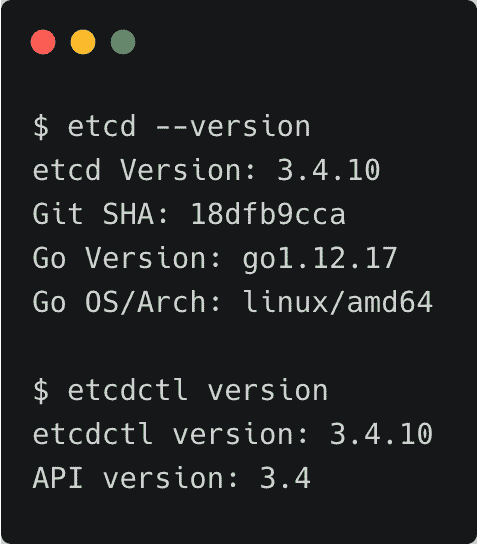
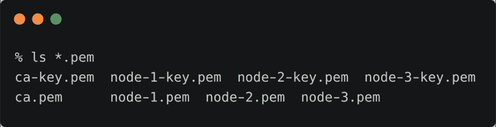
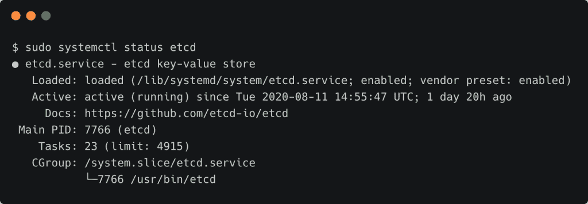
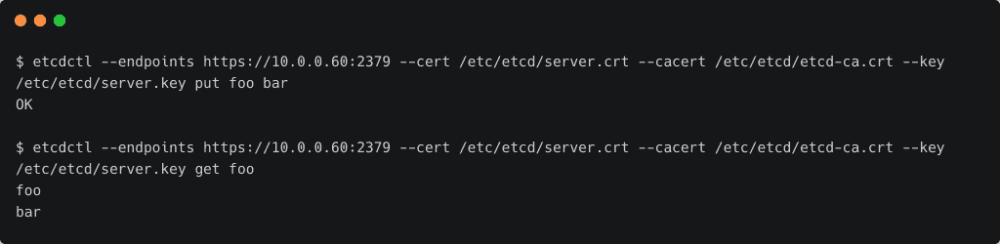
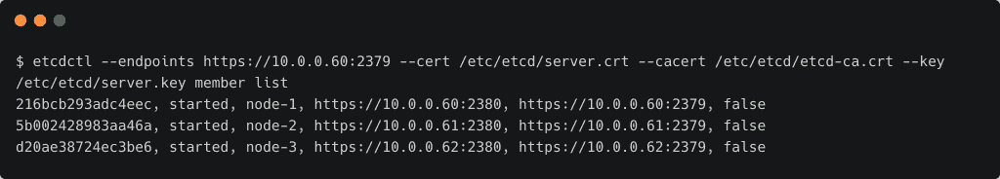

# 教程:设置安全且高度可用的 etcd 集群

> 原文：<https://thenewstack.io/tutorial-set-up-a-secure-and-highly-available-etcd-cluster/>

在 Rancher Labs K3s 项目系列教程的第二部分中，我们将探讨如何配置一个三节点 etcd 集群，该集群将被一个高可用性的多节点 K3s 集群使用。

etcd 项目是云原生生态系统中最受欢迎的开源项目之一。这是一个云原生计算基础孵化项目，已经成为 Kubernetes 基础设施的核心构件。

本教程结束时，您将部署一个启用了 TLS 的三节点 etcd 集群，该集群充当具有多个主节点的高可用性 K3s 集群的外部数据存储。

确保您有三台带有静态 IP 地址的 Linux 主机。在我的实验室里，我运行着四台运行 Ubuntu 18.04 的英特尔 NUC 迷你电脑，IP 地址范围从 10.0.0.60 到 10.0.0.63。我们将在 IP 地址为 10.0.0.60、10.0.0.61 和 10.0.0.62 的主机上安装 etcd。您必须用自己的地址集替换这些 IP 地址。

## 下载 etcd 二进制文件

在每台 Linux 主机上，运行以下命令下载并安装最新版本的二进制文件:

```
ETCD_VER=v3.4.10

DOWNLOAD_URL=https://storage.googleapis.com/etcd

rm  -f  /tmp/etcd-${ETCD_VER}-linux-amd64.tar.gz
rm  -rf  /tmp/etcd-download-test
mkdir  -p  /tmp/etcd-download-test

curl  -L  ${DOWNLOAD_URL}/${ETCD_VER}/etcd-${ETCD_VER}-linux-amd64.tar.gz  -o  /tmp/etcd-${ETCD_VER}-linux-amd64.tar.gz

tar  xzvf  /tmp/etcd-${ETCD_VER}-linux-amd64.tar.gz  -C  /tmp/etcd-download-test  --strip-components=1

rm  -f  /tmp/etcd-${ETCD_VER}-linux-amd64.tar.gz

chmod  +x  /tmp/etcd-download-test/etcd
chmod  +x  /tmp/etcd-download-test/etcdctl  

#Verify the downloads
/tmp/etcd-download-test/etcd  --version
/tmp/etcd-download-test/etcdctl version

#Move them to the bin folder
sudo mv  /tmp/etcd-download-test/etcd  /usr/local/bin
sudo mv  /tmp/etcd-download-test/etcdctl  /usr/local/bin

```



### 生成和分发证书

我们将使用 Cloudflare 的 [cfssl](https://github.com/cloudflare/cfssl) 工具来生成证书和密钥。如果你使用 Mac 作为你的工作站，你可以用自制软件安装它。


创建一个名为`certs`的目录，并运行下面的命令来为每个主机生成 CA 证书和服务器证书以及密钥组合。

```
mkdir certs  &amp;&amp;  cd certs

```

首先，让我们创建将被所有 etcd 服务器和客户端使用的 CA 证书。

```
echo  '{"CN":"CA","key":{"algo":"rsa","size":2048}}'  |  cfssl gencert  -initca  -  |  cfssljson  -bare ca  -
echo  '{"signing":{"default":{"expiry":"43800h","usages":["signing","key encipherment","server auth","client auth"]}}}'  &gt;  ca-config.json

```

这会产生三个文件—`ca-key.pem`、`ca.pem`和`ca.csr`

接下来，我们将为第一个节点生成证书和密钥。

```
export NAME=node-1
export ADDRESS=10.0.0.60,$NAME
echo  '{"CN":"'$NAME'","hosts":[""],"key":{"algo":"rsa","size":2048}}'  |  cfssl gencert  -config=ca-config.json  -ca=ca.pem  -ca-key=ca-key.pem  -hostname="$ADDRESS"  -  |  cfssljson  -bare  $NAME

```

对接下来的两个节点重复上述步骤。

```
export NAME=node-2
export ADDRESS=10.0.0.61,$NAME
echo  '{"CN":"'$NAME'","hosts":[""],"key":{"algo":"rsa","size":2048}}'  |  cfssl gencert  -config=ca-config.json  -ca=ca.pem  -ca-key=ca-key.pem  -hostname="$ADDRESS"  -  |  cfssljson  -bare  $NAME

```

```
export NAME=node-3
export ADDRESS=10.0.0.62,$NAME
echo  '{"CN":"'$NAME'","hosts":[""],"key":{"algo":"rsa","size":2048}}'  |  cfssl gencert  -config=ca-config.json  -ca=ca.pem  -ca-key=ca-key.pem  -hostname="$ADDRESS"  -  |  cfssljson  -bare  $NAME

```

不要忘记用您自己的组合替换 IP 地址和节点名。

此时，我们已经为 CA 和所有三个节点生成了证书和密钥。



是时候将这些证书分发给集群的每个节点了。

运行以下命令，通过替换用户名和 IP 地址将证书复制到相应的节点。

```
HOST=10.0.0.60
USER=ubuntu

scp ca.pem  $USER@$HOST:etcd-ca.crt
scp node-1.pem  $USER@$HOST:server.crt
scp node-1-key.pem  $USER@$HOST:server.key

```

SSH 进入每个节点，运行以下命令将证书移动到适当的目录中。

```
HOST=10.0.0.60
USER=ubuntu

ssh  $USER@$HOST
sudo mkdir  -p  /etc/etcd
sudo mv *  /etc/etcd
sudo chmod  600  /etc/etcd/server.key

```

我们已经完成了每个节点上证书的生成和分发。在下一步中，我们将为每个节点创建配置文件和 Systemd 单元文件。

### 配置和启动 etcd 集群

在节点 1 上，在`/etc/etcd`目录下创建一个名为`etcd.conf`的文件，内容如下:

```
ETCD_NAME=node-1
ETCD_LISTEN_PEER_URLS="https://10.0.0.60:2380"
ETCD_LISTEN_CLIENT_URLS="https://10.0.0.60:2379"
ETCD_INITIAL_CLUSTER_TOKEN="etcd-cluster"
ETCD_INITIAL_CLUSTER="node-1=https://10.0.0.60:2380,node-2=https://10.0.0.61:2380,node-3=https://10.0.0.62:2380"
ETCD_INITIAL_ADVERTISE_PEER_URLS="https://10.0.0.60:2380"
ETCD_ADVERTISE_CLIENT_URLS="https://10.0.0.60:2379"
ETCD_TRUSTED_CA_FILE="/etc/etcd/etcd-ca.crt"
ETCD_CERT_FILE="/etc/etcd/server.crt"
ETCD_KEY_FILE="/etc/etcd/server.key"
ETCD_PEER_CLIENT_CERT_AUTH=true
ETCD_PEER_TRUSTED_CA_FILE="/etc/etcd/etcd-ca.crt"
ETCD_PEER_KEY_FILE="/etc/etcd/server.key"
ETCD_PEER_CERT_FILE="/etc/etcd/server.crt"
ETCD_DATA_DIR="/var/lib/etcd"

```

对于节点 2，使用以下内容。

```
ETCD_NAME=node-2
ETCD_LISTEN_PEER_URLS="https://10.0.0.61:2380"
ETCD_LISTEN_CLIENT_URLS="https://10.0.0.61:2379"
ETCD_INITIAL_CLUSTER_TOKEN="etcd-cluster"
ETCD_INITIAL_CLUSTER="node-1=https://10.0.0.60:2380,node-2=https://10.0.0.61:2380,node-3=https://10.0.0.62:2380"
ETCD_INITIAL_ADVERTISE_PEER_URLS="https://10.0.0.61:2380"
ETCD_ADVERTISE_CLIENT_URLS="https://10.0.0.61:2379"
ETCD_TRUSTED_CA_FILE="/etc/etcd/etcd-ca.crt"
ETCD_CERT_FILE="/etc/etcd/server.crt"
ETCD_KEY_FILE="/etc/etcd/server.key"
ETCD_PEER_CLIENT_CERT_AUTH=true
ETCD_PEER_TRUSTED_CA_FILE="/etc/etcd/etcd-ca.crt"
ETCD_PEER_KEY_FILE="/etc/etcd/server.key"
ETCD_PEER_CERT_FILE="/etc/etcd/server.crt"
ETCD_DATA_DIR="/var/lib/etcd"

```

最后，为最后一个节点创建配置文件。

```
ETCD_NAME=node-3
ETCD_LISTEN_PEER_URLS="https://10.0.0.62:2380"
ETCD_LISTEN_CLIENT_URLS="https://10.0.0.62:2379"
ETCD_INITIAL_CLUSTER_TOKEN="etcd-cluster"
ETCD_INITIAL_CLUSTER="node-1=https://10.0.0.60:2380,node-2=https://10.0.0.61:2380,node-3=https://10.0.0.62:2380"
ETCD_INITIAL_ADVERTISE_PEER_URLS="https://10.0.0.62:2380"
ETCD_ADVERTISE_CLIENT_URLS="https://10.0.0.62:2379"
ETCD_TRUSTED_CA_FILE="/etc/etcd/etcd-ca.crt"
ETCD_CERT_FILE="/etc/etcd/server.crt"
ETCD_KEY_FILE="/etc/etcd/server.key"
ETCD_PEER_CLIENT_CERT_AUTH=true
ETCD_PEER_TRUSTED_CA_FILE="/etc/etcd/etcd-ca.crt"
ETCD_PEER_KEY_FILE="/etc/etcd/server.key"
ETCD_PEER_CERT_FILE="/etc/etcd/server.crt"
ETCD_DATA_DIR="/var/lib/etcd"

```

请不要忘记更换特定于您网络的 IP 地址。

配置就绪后，我们就可以在每个节点上创建 systemd 单元文件了。

在`/lib/systemd/system`创建文件`etcd.service`，内容如下:

```
[Unit]
Description=etcd key-value store
Documentation=https://github.com/etcd-io/etcd
After=network.target

[Service]
Type=notify
EnvironmentFile=/etc/etcd/etcd.conf
ExecStart=/usr/local/bin/etcd
Restart=always
RestartSec=10s
LimitNOFILE=40000

[Install]
WantedBy=multi-user.target

```

由于每个节点的配置被移动到专用文件中(`/etc/etcd/etcd.conf`)，单元文件对所有节点保持不变。

我们现在准备开始服务。在每个节点上运行下面的命令来启动 etcd 集群。

```
sudo systemctl daemon-reload
sudo systemctl enable etcd
sudo systemctl start etcd

```

确保 etcd 服务已启动并正常运行。

```
sudo systemctl status etcd

```



### 测试和验证集群

SSH 到其中一个节点，通过`etcdctl` CLI 连接到集群。

```
  etcdctl  --endpoints https://10.0.0.60:2379 --cert /etc/etcd/server.crt --cacert /etc/etcd/etcd-ca.crt --key /etc/etcd/server.key put foo bar

```

我们在 etcd 数据库中插入了一个密钥。让我们看看我们是否能取回它。

```
etcdctl  --endpoints https://10.0.0.60:2379 --cert /etc/etcd/server.crt --cacert /etc/etcd/etcd-ca.crt --key /etc/etcd/server.key get foo

```



接下来，让我们使用 API 端点来检查集群的健康状况。

```
curl  --cacert  /etc/etcd/etcd-ca.crt  --cert  /etc/etcd/server.crt  --key  /etc/etcd/server.key https://10.0.0.60:2379/health

```


最后，让我们确保所有节点都参与到集群中。

```
etcdctl  --endpoints https://10.0.0.60:2379 --cert /etc/etcd/server.crt --cacert /etc/etcd/etcd-ca.crt --key /etc/etcd/server.key member list

```



恭喜你！现在，您拥有了一个安全、分布式、高度可用的 etcd 集群，可用于生产级 K3s 集群环境。

在本教程的下一部分，我将带您完成安装和配置具有高可用性控制平面的 4 节点 K3s 集群的步骤。敬请期待！

贾纳奇拉姆·MSV 的网络研讨会系列“机器智能和现代基础设施(MI2)”提供了涵盖前沿技术的信息丰富、见解深刻的会议。在 [http://mi2.live](http://mi2.live) 注册即将到来的 MI2 网络研讨会。

<svg xmlns:xlink="http://www.w3.org/1999/xlink" viewBox="0 0 68 31" version="1.1"><title>Group</title> <desc>Created with Sketch.</desc></svg>