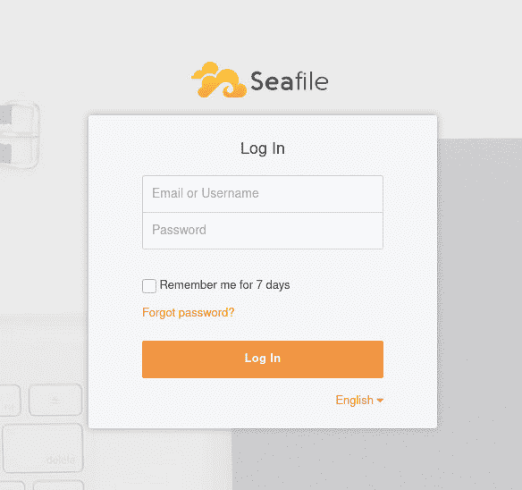

# 教程:使用 Seafile 在 Linux 服务器上设置云存储

> 原文：<https://thenewstack.io/tutorial-set-up-cloud-storage-on-a-linux-server-using-seafile/>

开源云存储系统 [Seafile](https://www.seafile.com/en/home/) 可以轻松充当您的内部云平台。Seafile 使用 Python [Django 框架](https://www.djangoproject.com/)编写，功能强大，包括一个用户友好的 web 前端，并提供如下特性:

*   文件同步
*   强文件加密
*   轻松协作
*   团队维基
*   小尺寸服务器，高性能
*   AD/LDAP 集成
*   使用文件同步、在线文件编辑等功能创建群组
*   创建库(用于单独同步)
*   自动文件冲突解决
*   共享库、子目录、链接、文件等

Seafile 被卡巴斯基、洪堡大学、古腾堡大学、斯特拉斯堡大学等使用，拥有超过 100 万用户和数千个团队，Seafile 已准备好成为您的首选本地云解决方案。

我想向您介绍在 Linux 上安装 Seafile 云存储服务器的过程。我将在 Ubuntu Server 18.04 上演示。

## 下载并解压缩服务器

首先要做的是使用以下命令下载 Seafile 服务器:

`wget https://s3.eu-central-1.amazonaws.com/download.seadrive.org/seafile-server_7.1.4_x86-64.tar.gz`

确保查看[官方 Seafile 下载页面](https://www.seafile.com/en/download/)，以便下载最新版本的服务器。

文件下载完成后，使用以下命令将其解压缩:

`tar xvfz seafile-server_7.1.4_x86-64.tar.gz`

这将创建一个名为 seafile-server-7.1.4 的新目录。使用以下命令切换到该目录:

`cd seafile-server-7.1.4`

使用命令创建一个新目录来存放 Seafile:

`sudo mkdir /srv/seafile`

使用以下命令移动目录的全部内容:

`sudo mv * /srv/seafile/`

## 安装依赖项

Seafile 依赖于一个数据库服务器，所以让我们用下面的命令安装它:

sudo apt-get 安装 mysql-server -y

使用以下命令安装剩余的依赖项:

`sudo apt install python python-{pip,pil,ldap,urllib3,setuptools,mysqldb,memcache,requests} -y`

 *`sudo apt install libpython3.6 ffmpeg python3-django-captcha -y`

安装完成后，使用以下命令保护 MySQL 数据库服务器:

`sudo mysql_secure_installation`

确保为数据库管理员用户提供一个强密码，并对其余问题回答 Y。

## 创建数据库

是时候创建 Seafile 数据库了。使用以下命令登录 MySQL 控制台:

`sudo mysql -u root -p`

创建必要的数据库，并使用命令授予必要的权限:

```
CREATE DATABASE seafile_server;
CREATE DATABASE ccnet_server;
CREATE DATABASE seahub_server;
CREATE USER  'seafile'@'localhost'  IDENTIFIED BY  'PASSWORD';
GRANT ALL ON seafile_server.*  TO  'seafile'@'localhost';
GRANT ALL ON ccnet_server.*  TO  'seafile'@'localhost';
GRANT ALL ON seahub_server.*  TO  'seafile'@'localhost';
QUIT;

```

…其中密码是一个强/唯一的密码。

## 配置 Seafile

万事俱备，就该配置 Seafile 了。为此，使用以下命令切换到 */srv/seafile* 目录:

`cd /srv/seafile`

发出命令:

`sudo ./setup-seafile-mysql.sh`

出现提示时，按键盘上的 Enter 键，安装将开始。您将会被询问一些问题(例如服务器名称、服务器地址、服务器端口等)。).当询问初始化数据库时，键入 1 创建新的。然后会询问您一些关于数据库服务器的问题。这些问题(和答案)是:

*   **mysql 服务器主机:**本地主机
*   **mysql 服务器端口:** 3306
*   **root 密码:**MySQL 服务器的 root 密码
*   **Seafile 的 mysql 用户:** seafile
*   **sea file 用户密码:**密码
*   **ccnet 数据库名称:** ccnet-db
*   **Seafile 数据库名称:** seafile-db
*   **Seahub 数据库名称:** seahub-db

其中 PASSWORD 是一个强/唯一的密码。

配置到此为止。

## 运行 Seafile 服务器

既然 Seafile 已经配置好了，就该运行服务器了。为此，必须启动两个组件:seafile 和 seahub。要启动这些组件，请保留在 */opt/cloud* 目录中，并发出以下命令:

`sudo ./seafile.sh start`

`sudo ./seahub.sh start`

当您第一次运行 **seahub.sh** 脚本时，您将被要求设置一个新的管理员用户(您将输入该用户的电子邮件地址和密码)。

## 安装 NGINX

我们将使用 NGINX 作为我们的 web 服务器，它需要配置为反向代理。使用以下命令安装服务器:

`sudo apt-get install nginx -y`

NGINX 安装完成后，使用以下命令启动并启用它:

`sudo systemctl start nginx`

`sudo systemctl enable nginx`

使用以下命令创建新的配置文件:

`sudo nano /etc/nginx/conf.d/seafile.conf`

在该文件中，粘贴以下内容:

```
server  {
    listen  80;
    listen  [::]:80;
    server_name   SERVERADDRESS;
    autoindex off;
    client_max_body_size  100M;
    access_log  /var/log/nginx/seafile.com.access.log;
     error_log  /var/log/nginx/seafile.com.error.log;

     location  /  {
            proxy_pass              http://127.0.0.1:8000;
            proxy_set_header     Host  $host;
            proxy_set_header     X-Real-IP  $remote_addr;
            proxy_set_header     X-Forwarded-For  $proxy_add_x_forwarded_for;
            proxy_set_header     X-Forwarded-Host  $server_name;
            proxy_read_timeout   1200s;
        }

     location  /seafhttp  {
            rewrite  ^/seafhttp(.*)$  $1  break;
            proxy_pass http://127.0.0.1:8082;
proxy_set_header     X-Forwarded-For  $proxy_add_x_forwarded_for;
            proxy_connect_timeout   36000s;
            proxy_read_timeout   36000s;
            proxy_send_timeout   36000s;
            send_timeout   36000s;
        }

    location  /media  {
            root  /srv/seafile-server-latest/seahub;
        }
}

```

其中，服务器地址是托管服务器的域或 IP 地址。

保存并关闭文件。使用以下命令重新启动 NGINX:

`sudo systemctl restart nginx`

## 访问 sea 文件

您现在可以访问新安装的 Seafile 平台了。打开 web 浏览器并将其指向 http://SERVER_IP(其中 SERVER_IP 是托管服务器的域或 IP 地址)。会提示你登录(**图一**)。



**图 A:** 登录我们新安装的 Seafile 服务器。

使用您在运行后创建的电子邮件/密码凭据。/seahub.sh 启动脚本，您会发现自己在主 Seafile 页面上，在这里您可以开始使用您的本地云平台。

通过 Pixabay 的特征图像。

目前，新堆栈不允许直接在该网站上发表评论。我们邀请所有希望讨论某个故事的读者通过推特(Twitter)或脸书(T2)与我们联系。我们也欢迎您通过电子邮件发送新闻提示和反馈:[反馈@thenewstack.io](mailto:feedback@thenewstack.io) 。

<svg xmlns:xlink="http://www.w3.org/1999/xlink" viewBox="0 0 68 31" version="1.1"><title>Group</title> <desc>Created with Sketch.</desc></svg>*