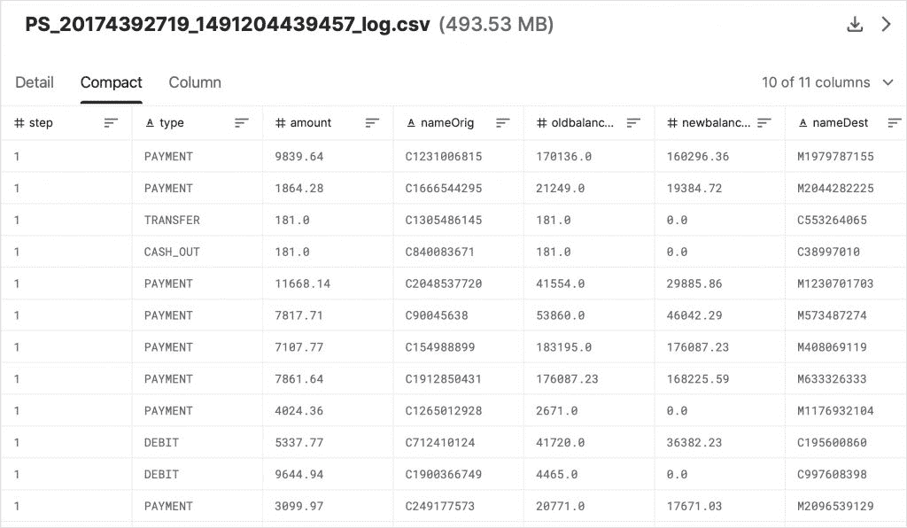
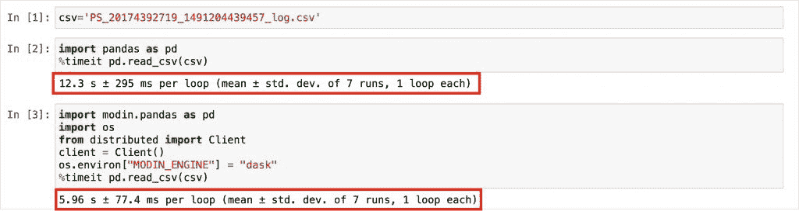
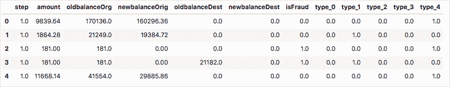
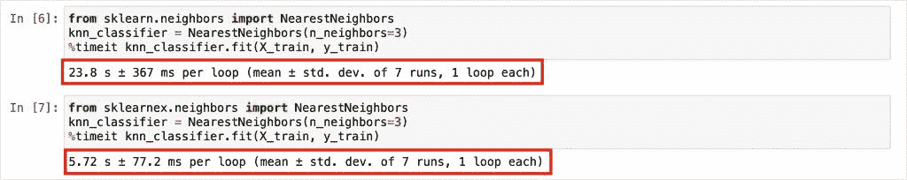

# 教程:使用英特尔 oneAPI 人工智能分析工具包加速 ML 训练

> 原文：<https://thenewstack.io/tutorial-speed-ml-training-with-the-intel-oneapi-ai-analytics-toolkit/>

在上一篇文章中，我[介绍了](https://thenewstack.io/intel-oneapis-unified-programming-model-for-python-machine-learning/) [Modin](https://www.intel.com/content/www/us/en/developer/tools/oneapi/distribution-of-modin.html) 的英特尔发行版和 [Scikit-learn](https://www.intel.com/content/www/us/en/developer/articles/guide/intel-extension-for-scikit-learn-getting-started.html) 的英特尔扩展，它们是英特尔 oneAPI 人工智能分析工具包和整个英特尔人工智能软件套件的组成部分。

让我们通过本教程仔细看看 Modin 和 Scikit-learn 扩展。本指南的目的是强调 Modin 和 Scikit-learn 扩展是如何替代现有的 Pandas 和 Scikit-learn 库的。您可以在[英特尔 DevCloud](https://www.intel.com/content/www/us/en/developer/tools/devcloud/overview.html) 或您的工作站上尝试本教程。

对于本教程，我在 Google Compute Engine 上配置了一个 e2-standard-4 虚拟机，该虚拟机基于英特尔 Broadwell 平台，配有 4 个 vCPUs 和 16GB RAM。它预装了 Python 3.8，我用它作为这个项目的运行时。

我们将根据 Kaggle 的[欺诈交易检测](https://www.kaggle.com/llabhishekll/fraud-transaction-detection/data)数据集训练一个模型来检测欺诈交易。这是一个大约 500MB 的 CSV 文件，包含 600 多万行数据，是 Modin 的理想选择。这让我们有机会比较摩丁和熊猫的加载时间。在开始项目之前，下载数据集并将其复制到培训环境中。



训练算法基于最近邻，这是一种无监督的机器学习技术，用于训练分类和回归模型。我们将使用股票 Scikit-learn 和英特尔 Scikit-learn 扩展对模型进行两次训练，以测量速度和性能。

### 步骤 1:配置环境

让我们从安装`pip`和所需的模块开始。

```
curl https://bootstrap.pypa.io/get-pip.py -o get-pip.py
python get-pip.py

```

现在，安装英特尔发布的 Modin、英特尔 Scikit-learn 扩展和 Jupyter。

```
pip install scikit-learn-intelex
pip install modin[all]
pip install jupyter

```

启动 Jupyter Notebook 并从浏览器访问它。

```
jupyter notebook  --ip=0.0.0.0  --port=80

```

### 步骤 2:加载数据集并测量性能

将 CSV 文件上传到您的培训环境后，让我们将其加载到 Modin 和 Pandas 中。

```
csv='PS_20174392719_1491204439457_log.csv'

import  pandas  as  pd
%timeit  pd.read_csv(csv)

import modin.pandas as pd
import os
from distributed import Client
client  =  Client()
os.environ["MODIN_ENGINE"]  =  "dask"  
%timeit pd.read_csv(csv)

```

当我们加载数据集时，我们还通过在单元格的开头添加`%timeit`神奇函数来测量时间。

在我的环境中，Pandas 花了大约 12 秒，而 Modin 在大约 6 秒内加载了相同的数据集。



英特尔发布的 Modin 将数据集加载速度提高了两倍。当使用大型数据集时，Modin 提供了更显著的性能改进。

### 步骤 3:准备和预处理数据集

不管我们如何加载数据集，我们都需要准备和预处理它，使它对训练有用。

首先，我们将删除不相关和不有用的列。

```
from sklearn.preprocessing import LabelEncoder
from sklearn.preprocessing import OneHotEncoder

df=pd.read_csv(csv)
df  =  df.drop(['nameOrig',  'nameDest',  'isFlaggedFraud'],  axis  =  1)

```

数据集中的类型列有五类:
●现金入
●现金出
●借记
●支付
●转账

让我们把它们编码成整数。

```
df['type']  =  df['type'].astype('category')
type_encode  =  LabelEncoder()
df['type']  =  type_encode.fit_transform(df.type)

```

最后，我们将执行一次热编码，将它们转换成分类列，并将它们追加到原始数据集，并删除原始列。

```
type_one_hot  =  OneHotEncoder()
type_one_hot_encode  =  type_one_hot.fit_transform(df.type.values.reshape(-1,1)).toarray()
ohe_variable  =  pd.DataFrame(type_one_hot_encode,  columns  =  ["type_"+str(int(i))  for  i  in range(type_one_hot_encode.shape[1])])
df  =  pd.concat([df,  ohe_variable],  axis=1)
df  =  df.drop('type',  axis  =  1)

```

由于数据集中的一些值为空，我们将通过用零替换它们来执行数据插补。

数据集现已准备好进行训练。



### 步骤 4:训练模型并测量性能

在开始训练过程之前，让我们先分离特征和标签，然后将数据分成训练数据集和测试数据集。

```
features  =  df.drop('isFraud',  axis  =  1).values
target  =  df['isFraud'].values

from sklearn.model_selection import train_test_split
X_train,  X_test,  y_train,  y_test  =  train_test_split(features,  target,  test_size  =  0.3,  random_state  =  42,  stratify  =  target)

```

这将创建一个包含 30%数据的测试数据集，其余用于训练。

首先，让我们用 Sckit 训练模型——学习和测量性能。

```
from sklearn.neighbors import NearestNeighbors
knn_classifier  =  NearestNeighbors(n_neighbors=3)
%timeit knn_classifier.fit(X_train,  y_train)

```

完成后，我们将对 Scikit-learn 的英特尔扩展重复该步骤。注意，我们显式加载了`sklearnex`模块并导入了`NearestNeighbors`。

```
from sklearnex.neighbors import NearestNeighbors
knn_classifier  =  NearestNeighbors(n_neighbors=3)
%timeit knn_classifier.fit(X_train,  y_train)

```



在我的环境中，stock scikit-learn 耗时 23.8 秒，而英特尔 scikit-learn 扩展仅用 5.72 秒就完成了培训，速度提高了 4 倍以上。虽然结果可能因您的机器而异，但显然英特尔 Scikit-learn 扩展比普通 Scikit-learn 要快得多。它可以加速通用 x86 CPUs 上的训练，而不需要昂贵的 AI 加速器，如 GPU 和 FPGAs。

<svg xmlns:xlink="http://www.w3.org/1999/xlink" viewBox="0 0 68 31" version="1.1"><title>Group</title> <desc>Created with Sketch.</desc></svg>