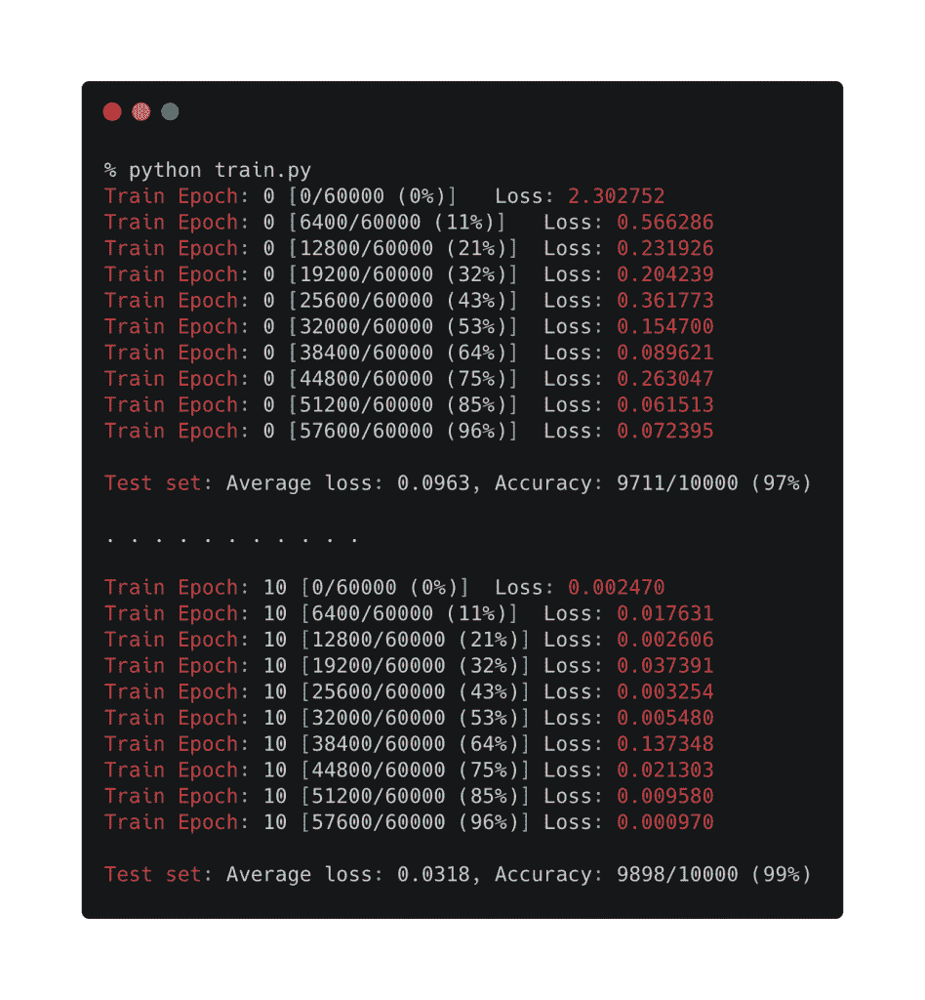
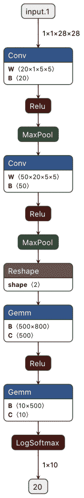

# 教程:在 PyTorch 中训练一个深度学习模型，并导出到 ONNX

> 原文：<https://thenewstack.io/tutorial-train-a-deep-learning-model-in-pytorch-and-export-it-to-onnx/>

本文是关于

[Open Neural Network Exchange](https://onnx.ai/)

(ONNX)，由 AWS、微软和脸书发起，旨在定义跨机器学习平台的互操作性标准。参见:

[Part 1](/open-neural-network-exchange-brings-interoperability-to-machine-learning-frameworks/)

,

[Part 2](/tutorial-using-a-pre-trained-onnx-model-for-inferencing/)

.

在本教程中，我们将在 [PyTorch](https://pytorch.org/) 中训练一个卷积神经网络，并将其转换为 ONNX 模型。一旦我们有了 ONNX 格式的模型，我们可以将它导入到其他框架中，如 TensorFlow，用于推理和通过迁移学习重用模型。

## 设置环境

本教程的唯一先决条件是 Python 3.x。请确保您的计算机上安装了 Python 3 . x。

创建一个 Python 虚拟环境，用于本教程和下一个教程。

`python3 -m virtualenv pyt2tf` 

`source pyt2tf/bin/activate` 

创建一个文件 ***requirements.txt*** ，其内容包含本教程所需的模块。

```
torch
torchvision
opencv-python
tensorflow==1.15
onnx
onnxruntime
onnx_tf

```

注意，我们在本教程中使用的是 [TensorFlow](https://www.tensorflow.org/) 1.x。如果安装 1.15 以上版本的 TensorFlow，您可能会看到错误。

用 pip 安装上述文件中的模块。

`pip install -r requirements.txt` 

最后，创建一个目录来保存模型。

`mkdir output` 

### 用 MNIST 数据集训练 CNN

让我们从导入程序所需的正确模块开始。

```
import torch
import torch.nn as nn
import torch.nn.functional as  F
import torch.optim as optim
from torchvision import datasets,  transforms

```

然后，我们将定义具有适当层的神经网络。

```
class Net(nn.Module):
    def __init__(self):
        super(Net,  self).__init__()
        self.conv1  =  nn.Conv2d(1,  20,  5,  1)
        self.conv2  =  nn.Conv2d(20,  50,  5,  1)
        self.fc1  =  nn.Linear(4*4*50,  500)
        self.fc2  =  nn.Linear(500,  10)

    def forward(self,  x):
        x  =  F.relu(self.conv1(x))
        x  =  F.max_pool2d(x,  2,  2)
        x  =  F.relu(self.conv2(x))
        x  =  F.max_pool2d(x,  2,  2)
        x  =  x.view(-1,  4*4*50)
        x  =  F.relu(self.fc1(x))
        x  =  self.fc2(x)
        return  F.log_softmax(x,  dim=1)

```

创建一个训练 PyTorch 模型的方法。

```
def train(model,  device,  train_loader,  optimizer,  epoch):
    model.train()
    for batch_idx,  (data,  target)  in enumerate(train_loader):
        data,  target  =  data.to(device),  target.to(device)
        optimizer.zero_grad()
        output  =  model(data)
        loss  =  F.nll_loss(output,  target)
        loss.backward()
        optimizer.step()
        if batch_idx  %  100  ==  0:
            print('Train Epoch: {} [{}/{} ({:.0f}%)]\tLoss: {:.6f}'.format(
                epoch,  batch_idx *  len(data),  len(train_loader.dataset),
                100.  *  batch_idx  /  len(train_loader),  loss.item()))

```

以下方法将测试和评估模型:

```
def test(model,  device,  test_loader):
    model.eval()
    test_loss  =  0
    correct  =  0
    with torch.no_grad():
        for data,  target in test_loader:
            data,  target  =  data.to(device),  target.to(device)
            output  =  model(data)
            test_loss  +=  F.nll_loss(output,  target,  reduction='sum').item()  # sum up batch loss
            pred  =  output.argmax(dim=1,  keepdim=True)  # get the index of the max log-probability
            correct  +=  pred.eq(target.view_as(pred)).sum().item()

    test_loss  /=  len(test_loader.dataset)

    print('\nTest set: Average loss: {:.4f}, Accuracy: {}/{} ({:.0f}%)\n'.format(
        test_loss,  correct,  len(test_loader.dataset),
        100.  *  correct  /  len(test_loader.dataset)))

```

有了网络架构、训练和测试方法，让我们创建 *main* 方法来创建神经网络的实例，并用 [MNIST 数据集](http://yann.lecun.com/exdb/mnist/)对其进行训练。

```
def main():

    device  =  "cpu"

    train_loader  =  torch.utils.data.DataLoader(
    datasets.MNIST('../data',  train=True,  download=True,
 transform=transforms.Compose([
 transforms.ToTensor(),
 transforms.Normalize((0.1307,),  (0.3081,))
 ])),
    batch_size=64,  shuffle=True)
    test_loader  =  torch.utils.data.DataLoader(
    datasets.MNIST('../data',  train=False,  transform=transforms.Compose([
 transforms.ToTensor(),
 transforms.Normalize((0.1307,),  (0.3081,))
 ])),
    batch_size=1000,  shuffle=True)
    model  =  Net().to(device)
    optimizer  =  optim.SGD(model.parameters(),  lr=0.01,  momentum=0.5)

    for epoch in range(0,  10):
        train(model,  device,  train_loader,  optimizer,  epoch)
        test(model,  device,  test_loader)

    torch.save(model.state_dict(),"output/model.pt")

if __name__  ==  '__main__':
    main()        

```

在主方法中，我们下载 MNIST 数据集，对其进行预处理，并用 10 个时期训练模型。

如果你在一个强大的 GPU 上训练模型，你可以改变设备变量，调整历元数以获得更好的精度。但是，对于 MNIST 数据集，只需在 CPU 上运行 10 个历元，就能达到约 98%的准确率。 [](https://thenewstack.io/tutorial-train-a-deep-learning-model-in-pytorch-and-export-it-to-onnx/mnist_train/) 下面是 PyTorch 中训练模型的完整代码。

```
import torch
import torch.nn as nn
import torch.nn.functional as  F
import torch.optim as optim
from torchvision import datasets,  transforms

class Net(nn.Module):
    def __init__(self):
        super(Net,  self).__init__()
        self.conv1  =  nn.Conv2d(1,  20,  5,  1)
        self.conv2  =  nn.Conv2d(20,  50,  5,  1)
        self.fc1  =  nn.Linear(4*4*50,  500)
        self.fc2  =  nn.Linear(500,  10)

    def forward(self,  x):
        x  =  F.relu(self.conv1(x))
        x  =  F.max_pool2d(x,  2,  2)
        x  =  F.relu(self.conv2(x))
        x  =  F.max_pool2d(x,  2,  2)
        x  =  x.view(-1,  4*4*50)
        x  =  F.relu(self.fc1(x))
        x  =  self.fc2(x)
        return  F.log_softmax(x,  dim=1)

def train(model,  device,  train_loader,  optimizer,  epoch):
    model.train()
    for batch_idx,  (data,  target)  in enumerate(train_loader):
        data,  target  =  data.to(device),  target.to(device)
        optimizer.zero_grad()
        output  =  model(data)
        loss  =  F.nll_loss(output,  target)
        loss.backward()
        optimizer.step()
        if batch_idx  %  100  ==  0:
            print('Train Epoch: {} [{}/{} ({:.0f}%)]\tLoss: {:.6f}'.format(
                epoch,  batch_idx *  len(data),  len(train_loader.dataset),
                100.  *  batch_idx  /  len(train_loader),  loss.item()))

def test(model,  device,  test_loader):
    model.eval()
    test_loss  =  0
    correct  =  0
    with torch.no_grad():
        for data,  target in test_loader:
            data,  target  =  data.to(device),  target.to(device)
            output  =  model(data)
            test_loss  +=  F.nll_loss(output,  target,  reduction='sum').item()  # sum up batch loss
            pred  =  output.argmax(dim=1,  keepdim=True)  # get the index of the max log-probability
            correct  +=  pred.eq(target.view_as(pred)).sum().item()

    test_loss  /=  len(test_loader.dataset)

    print('\nTest set: Average loss: {:.4f}, Accuracy: {}/{} ({:.0f}%)\n'.format(
        test_loss,  correct,  len(test_loader.dataset),
        100.  *  correct  /  len(test_loader.dataset)))

def main():

    device  =  "cpu"

    train_loader  =  torch.utils.data.DataLoader(
    datasets.MNIST('../data',  train=True,  download=True,
 transform=transforms.Compose([
 transforms.ToTensor(),
 transforms.Normalize((0.1307,),  (0.3081,))
 ])),
    batch_size=64,  shuffle=True)
    test_loader  =  torch.utils.data.DataLoader(
    datasets.MNIST('../data',  train=False,  transform=transforms.Compose([
 transforms.ToTensor(),
 transforms.Normalize((0.1307,),  (0.3081,))
 ])),
    batch_size=1000,  shuffle=True)
    model  =  Net().to(device)
    optimizer  =  optim.SGD(model.parameters(),  lr=0.01,  momentum=0.5)

    for epoch in range(0,  10):
        train(model,  device,  train_loader,  optimizer,  epoch)
        test(model,  device,  test_loader)

    torch.save(model.state_dict(),"output/model.pt")

if __name__  ==  '__main__':
    main()        

```

一旦训练完成，你会在 ***输出*** 目录中找到文件 ***model.pt*** 。这是我们需要将模型转换成 ONNX 格式的工件。

### 将 PyTorch 模型导出为 ONNX 格式

PyTorch 本地支持 ONNX，这意味着我们可以在不使用额外模块的情况下转换模型。

让我们加载上一步中训练好的模型，创建一个匹配输入张量形状的输入，并将模型导出到 ONNX。

神经网络类包含在代码中，以确保模型架构可与输入张量形状一起访问。

```
from torch.autograd import Variable
import torch
import torch.nn.functional as  F
import torch.nn as nn

class Net(nn.Module):
    def __init__(self):
        super(Net,  self).__init__()
        self.conv1  =  nn.Conv2d(1,  20,  5,  1)
        self.conv2  =  nn.Conv2d(20,  50,  5,  1)
        self.fc1  =  nn.Linear(4*4*50,  500)
        self.fc2  =  nn.Linear(500,  10)

    def forward(self,  x):
        x  =  F.relu(self.conv1(x))
        x  =  F.max_pool2d(x,  2,  2)
        x  =  F.relu(self.conv2(x))
        x  =  F.max_pool2d(x,  2,  2)
        x  =  x.view(-1,  4*4*50)
        x  =  F.relu(self.fc1(x))
        x  =  self.fc2(x)
        return  F.log_softmax(x,  dim=1)

trained_model  =  Net()
trained_model.load_state_dict(torch.load('output/model.pt'))
dummy_input  =  Variable(torch.randn(1,  1,  28,  28))  
torch.onnx.export(trained_model,  dummy_input,  "output/model.onnx")  

```

运行上面的代码会导致创建 ***model.onnx*** 文件，其中包含最初在 PyTorch 中训练的深度学习模型的 onnx 版本。

你可以在 [Netron](https://github.com/lutzroeder/netron) 工具中打开它，探索神经网络的层次和架构。

[](https://thenewstack.io/tutorial-train-a-deep-learning-model-in-pytorch-and-export-it-to-onnx/model/)

在本教程的下一部分，我们将把 ONNX 模型导入 TensorFlow，并使用它进行推理。敬请关注。

贾纳基拉姆·MSV 的网络研讨会系列“机器智能和现代基础设施(MI2)”提供了涵盖前沿技术的信息丰富、见解深刻的会议。在 [http://mi2.live](http://mi2.live) 注册参加即将到来的 MI2 网络研讨会。

<svg xmlns:xlink="http://www.w3.org/1999/xlink" viewBox="0 0 68 31" version="1.1"><title>Group</title> <desc>Created with Sketch.</desc></svg>