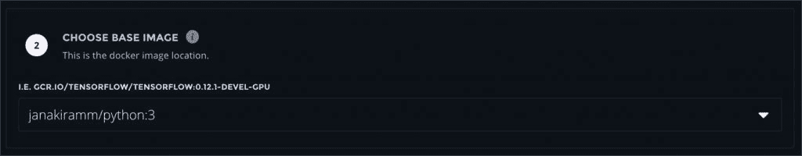
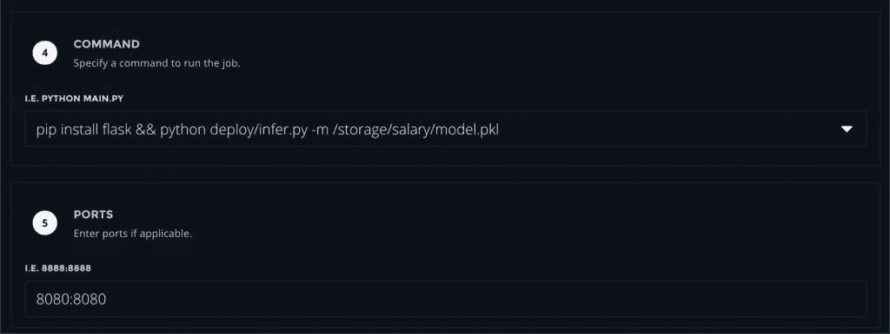

# 教程:使用图纸空间梯度训练和部署机器学习模型

> 原文：<https://thenewstack.io/tutorial-train-and-deploy-machine-learning-models-with-paperspace-gradient/>

Gradient 是来自 [Paperspace](http://paperspace.com) 的机器学习平台即服务(ML PaaS)产品。该平台的关键构建模块包括作业执行引擎、一键式 Jupyter 笔记本访问、原生 Python API 和与 Github 集成的 CI/CD 管道，用于模型管理。

Gradient 还支持模型快速迭代的实验。实验是具有不同超参数和度量的作业的集合。实验在一个项目的上下文中执行，该项目充当数据集、作业和模型工件的逻辑边界。

关于背景和上下文，请参考在新堆栈上发表的关于渐变的[文章](https://thenewstack.io/paperspace-gradient-a-modern-paas-for-machine-learning/)。

在本教程中，我们将探索使用渐变训练和部署模型所涉及的工作流。由于重点是在流程上，我们将挑选一个简单的线性回归问题，根据这个经验预测一个开发人员的工资。

该数据集部分基于示例堆栈溢出工资计算器，我们将使用该计算器构建具有一个要素(经验)和一个标签(工资)的单变量线性回归模型。

堆栈溢出工资模型在新的堆栈文章中进行了详细的讨论，[机器学习和凡人线性回归](/machine-learning-linear-regression-mere-mortals/)。该工作流涉及两项工作——培训和部署。第一个作业生成一个 Python pickle 文件，该文件存储在 Gradient 的共享存储服务中。运行 Flask web 服务器的第二个作业将使用同一个 pickle 文件来公开 REST 端点。该作业将通过推理端点为模型提供服务。

在继续学习教程之前，注册 Gradient。

### 步骤 1:创建一个项目和一个实验来训练模型

登录后，点击左侧导航栏中的 Gradient 选择**项目**。点击**创建项目**按钮并选择**创建独立项目**。出现提示时，输入项目的名称。


在这个项目中，我们将创建一个训练模型的实验。


Experiment Builder 是一个向导式 GUI 工具，用于向作业运行器组件提交作业。

第一步是选择安排作业的机器类型。Gradient 利用 Google Compute Engine 的可抢占实例来提供低成本的基础设施。确保选中**启用低成本实例**复选框。选择配备 1 个 CPU 内核、1.7GB 内存和 250GB SDD 的 G1 机型。这种配置足以完成 Scikit-learn 培训工作。对于 TensorFlow 和 PyTorch，您可以选择基于 GPU 的机器类型来加速作业。


在 Gradient 中，作业基于提供运行时和依赖项的容器映像。对于本教程，我们使用一个包含 Python 3 运行时和 Scikit-learn 框架的映像。我通过向轻量级 Alpine Linux 映像添加 Python 依赖项来构建映像。



另外，如果您想使用自己的容器映像，可以随意使用或修改 Docker 文件，并将其推送到一个公共容器注册中心，比如 Docker Hub。

```
FROM alpine:latest

LABEL MAINTAINER="Janakiram MSV <janakiramm@gmail.com>"

# Linking of locale.h as xlocale.h
# This is done to ensure successfull install of python numpy package
# see https://forum.alpinelinux.org/comment/690#comment-690 for more information.

WORKDIR  /var/www/

ENV  PACKAGES="\
    dumb-init  \
    musl  \
    libc6-compat  \
    linux-headers  \
    build-base  \
    bash  \
    git  \
    ca-certificates  \
    freetype  \
    libgfortran  \
    libgcc  \
    libstdc++  \
    openblas  \
    tcl  \
    tk  \
    libssl1.0  \
    "

ENV  PYTHON_PACKAGES="\
    numpy  \
    matplotlib  \
    scipy  \
    scikit-learn  \
    pandas  \
    nltk  \
    "  

RUN apk add  --no-cache  --virtual build-dependencies python3  \
    &&  apk add  --virtual build-runtime  \
    build-base python3-dev openblas-dev freetype-dev pkgconfig gfortran  \
    &&  ln  -s  /usr/include/locale.h  /usr/include/xlocale.h  \
    &&  python3  -m  ensurepip  \
    &&  rm  -r  /usr/lib/python*/ensurepip  \
    &&  pip3 install  --upgrade pip setuptools  \
    &&  ln  -sf  /usr/bin/python3  /usr/bin/python  \
    &&  ln  -sf pip3  /usr/bin/pip  \
    &&  rm  -r  /root/.cache  \
    &&  pip install  --no-cache-dir  $PYTHON_PACKAGES  \
    &&  apk del build-runtime  \
    &&  apk add  --no-cache  --virtual build-dependencies  $PACKAGES  \
    &&  rm  -rf  /var/cache/apk/*

```

运行时容器就位后，我们现在需要将 Gradient 指向数据集和训练脚本。这是通过与 Github 的集成实现的。Gradient 将 Github repo 拉入实验工作区，并将资产用于培训工作。

请随意探索包含数据集以及培训和部署代码的 [Github repo](https://github.com/janakiramm/Salary.git) 。

让我们将 Gradient 指向 Github 上的教程 repo。


最后，让我们定义作业的命令，它是在容器运行时的上下文中执行的 Python 脚本。当脚本正常退出时，作业被标记为完成。

这个作业的命令是*python train/train . py-I ./data/sal . CSV-o/storage/salary*。脚本 *train.py* 取数据集的源位置( *sal.csv* )和保存训练模型的目标位置( */storage/salary* )。

在 Gradient 中，保存在 */storage* 位置的任何文件都可用于其他作业和实验。通过将模型持久化到这个位置，我们将能够从推理作业中访问它。


我们现在准备好通过点击**提交实验**按钮开始培训工作。

Gradient 将作业添加到队列中，并在一种选定的机器类型中进行调度。几分钟后，作业执行完成。


您可以验证显示系数的日志，如打印到代码中的 stdout 的均方差(MSE)、截距和斜率。


请随意探索作业的环境和文件部分。

经过充分训练和酸洗的模型( *model.pkl* )现在可以在 */storage/salary* 位置获得。现在，您可以安全地删除作业来清理项目。

### 步骤 2:托管和服务模型

培训工作完成后，我们现在将托管一个长期运行的工作，该工作公开一个为模型服务的 REST 端点。Github repo 有加载 pickled 模型文件和运行基于 Flask 的 web 服务器的代码。

首先使用以下参数创建一个新作业。请注意，除了命令–*pip install flask&&python deploy/infer . py-m/storage/salary/model . pkl*之外，它与培训作业类似。

我们首先安装 Flask 模块，然后启动 infer.py，它获取模型文件*/storage/salary/model . pkl*。请随意探索 infer.py 的代码，以理解我如何加载 pickled 模型文件并将其连接到 GET 请求。

因为我们运行的是 web 服务器，所以我们还需要启用端口映射。这可以通过在作业的**端口**部分输入 *8080:8080* 来完成。



提交实验并等待作业进入运行模式。

该作业的日志确认 web 服务器已启动并正在运行。


在我们可以向端点发送 GET 请求之前，我们需要访问作业的 URL，它可以在**环境**部分中找到。


打开一个终端窗口并调用 REST 端点。

```
curl joyn52q2ns0g9.gradient.paperspace.com:8080/sal/25

```

下面的输出显示了一个有 25 年经验的开发人员的预测工资。


梯度项目和实验使得训练和服务机器学习模型变得极其简单。可以从 CLI 启动相同的工作流，这有利于自动化作业。

在即将到来的一个教程中，我将演示如何通过 GradientCI 为机器学习配置 CI/CD 管道。敬请期待！

*贾纳基拉姆·MSV 的网络研讨会系列“[机器智能和现代基础设施(MI2)](https://mi2.janakiram.com/) ”提供了涵盖前沿技术的信息丰富、见解深刻的会议。[注册](https://mi2.janakiram.com/)参加即将举行的 MI2 网络研讨会，了解如何使用 AWS Greengrass 在边缘运行应用。*

来自 Pixabay 的денисмарчук特写图片。

<svg xmlns:xlink="http://www.w3.org/1999/xlink" viewBox="0 0 68 31" version="1.1"><title>Group</title> <desc>Created with Sketch.</desc></svg>