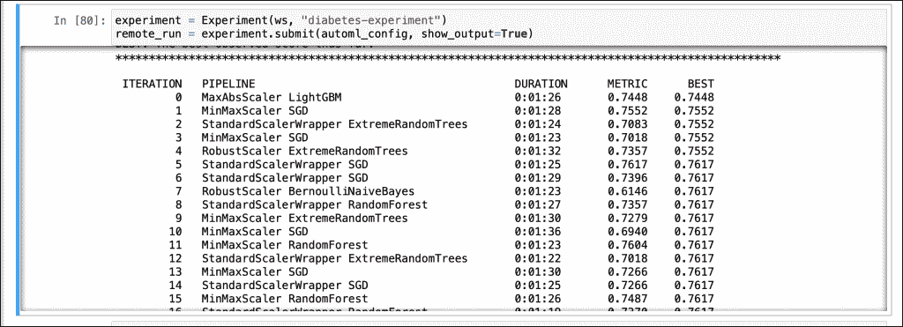
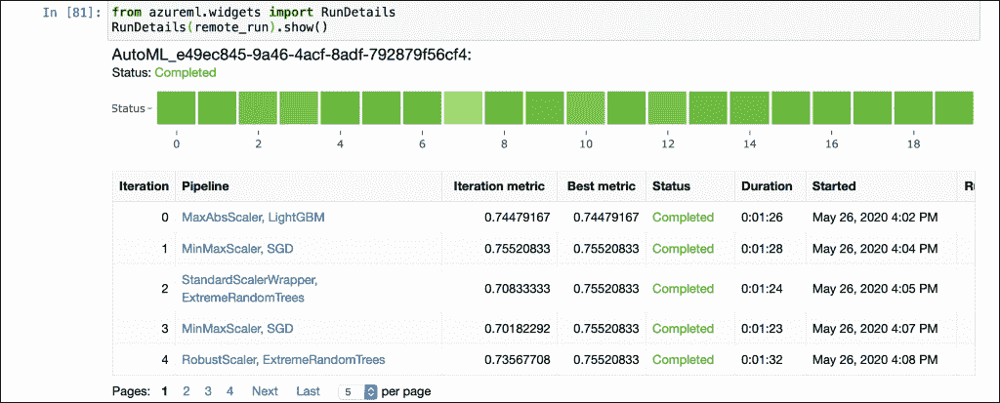
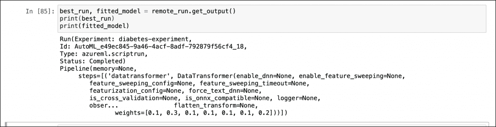

# 教程:用 Azure ML 的自动化 ML 特性训练机器学习模型

> 原文：<https://thenewstack.io/tutorial-train-machine-learning-models-with-automated-ml-feature-of-azure-ml/>

这是使用 AzureML 的[系列的最后一部分，在这里我们探索平台的 AutoML 功能。](/build-repeatable-ml-workflows-with-azure-machine-learning-pipelines/)

类似于上两个教程([第 2 部分](/build-repeatable-ml-workflows-with-azure-machine-learning-pipelines/)和[第 3 部分](/tutorial-build-an-end-to-end-azure-ml-pipeline-with-the-python-sdk/)，我们将对[皮马印度糖尿病](https://www.kaggle.com/uciml/pima-indians-diabetes-database)数据集应用逻辑回归。我们不会自己训练模型，而是使用 AutoML SDK 让 Azure ML 选择最佳算法。

您可以在工作站上的 Jupyter 笔记本中运行代码，但 AutoML 作业在 Azure 中提供的远程计算集群中运行。

按照前面教程中描述的步骤在 Azure 中创建工作空间，并在本地开发机器中安装 Python AzureML SDK。

首先导入相关的 Python 模块。

```
import azureml.core
from azureml.core import Workspace,  Experiment
from azureml.core.compute import ComputeTarget,  AmlCompute
from azureml.core.compute_target import ComputeTargetException
from azureml.core import Dataset
from azureml.core.experiment import Experiment
from azureml.train.automl import AutoMLConfig

from datetime import datetime
from dateutil.relativedelta import relativedelta

from pandas import read_csv
from numpy import set_printoptions
from sklearn.preprocessing import MinMaxScaler
from sklearn.model_selection import train_test_split
from sklearn.linear_model import LogisticRegression

import logging
import os

```

让我们初始化 Azure ML 工作区。确保 config.json 文件在同一目录中。

```
ws  =  Workspace.from_config()
if not os.path.exists('project_folder'):
    os.makedirs('project_folder')

```

让我们加载 CSV 文件，添加标题并保存回来。

```
filename  =  './data/pima-indians-diabetes.csv'
names  =  ['preg',  'plas',  'pres',  'skin',  'test',  'mass',  'pedi',  'age',  'class']
dataframe  =  read_csv(filename,  names=names)
dataframe.to_csv('./data/diabetes.csv')

```

我们现在可以上传 CSV 文件，并将其注册为 AzureML 中的数据集

```
def_blob_store  =  ws.get_default_datastore()
def_blob_store.upload_files(["./data/diabetes.csv"],  target_path="data",  overwrite=True)
diabetes_data  =  Dataset.Tabular.from_delimited_files(def_blob_store.path('./data/diabetes.csv'))
diabetes_data  =  diabetes_data.register(ws,  'diabetes_data',create_new_version=True)

```

有了数据集，我们现在将基于 AzureML 中的集群定义计算环境。

```
aml_compute_target  =  "demo-cluster"
try:
    aml_compute  =  AmlCompute(ws,  aml_compute_target)
    print("found existing compute target.")
except ComputeTargetException:
    print("creating new compute target")

    provisioning_config  =  AmlCompute.provisioning_configuration(vm_size  =  "STANDARD_D2_V2",
                                                                min_nodes  =  1,  
                                                                max_nodes  =  4)    
    aml_compute  =  ComputeTarget.create(ws,  aml_compute_target,  provisioning_config)
    aml_compute.wait_for_completion(show_output=True,  min_node_count=None,  timeout_in_minutes=20)

print("Azure Machine Learning Compute attached")

```

下一步是定义 AutoML 配置。

```
automl_settings  =  {
    "iteration_timeout_minutes":  1,
    "iterations":  20,
    "primary_metric":  'accuracy',
    "featurization":  True,
    "verbosity":  logging.INFO,
    "n_cross_validations":  2
}

```

这指示 Azure AutoML 在满足最佳算法之前运行 20 次迭代。每种算法都基于准确性度量进行排名。

我们现在准备开始自动工作。

```
automl_config  =  AutoMLConfig(task='classification',
 debug_log='automated_ml_errors.log',
 path="./project_folder",
 compute_target=aml_compute_target,
 training_data=diabetes_data,
 label_column_name="class",
 **automl_settings)

```

```
experiment  =  Experiment(ws,  "diabetes-experiment")
remote_run  =  experiment.submit(automl_config,  show_output=True)

```

我们选择分类作为任务类型，并指向代表数据集中标签的列。这一步将数据集、计算和问题类型之间的点连接起来。

整个过程大约需要 30 分钟。您可以在 Jupyter 笔记本单元格中看到下面的输出。

[](https://thenewstack.io/tutorial-train-machine-learning-models-with-automated-ml-feature-of-azure-ml/az-automl-0/)

我们还可以使用来自 AzureML Python SDK 的小部件，它提供了对培训工作的深入了解。

```
from azureml.widgets import RunDetails
RunDetails(remote_run).show()

```

[](https://thenewstack.io/tutorial-train-machine-learning-models-with-automated-ml-feature-of-azure-ml/az-automl-1/)

最后，您可以检索基于准确性的最佳模型。

```
best_run,  fitted_model  =  remote_run.get_output()
print(best_run)
print(fitted_model)

```

[](https://thenewstack.io/tutorial-train-machine-learning-models-with-automated-ml-feature-of-azure-ml/az-automl-2-2/)

按照本[教程](https://thenewstack.io/build-and-deploy-a-machine-learning-model-with-azure-ml-service/)中的步骤注册和部署模型。

*贾纳基拉姆·MSV 的网络研讨会系列“机器智能和现代基础设施(MI2)”提供了涵盖前沿技术的信息丰富、见解深刻的会议。在 [http://mi2.live](http://mi2.live) 上注册参加即将举行的 MI2 网络研讨会。*

由[卢卡斯·迈尔斯](https://unsplash.com/@unthunk?utm_source=unsplash&utm_medium=referral&utm_content=creditCopyText)在 [Unsplash](https://unsplash.com/?utm_source=unsplash&utm_medium=referral&utm_content=creditCopyText) 上特写 ihoto。

<svg xmlns:xlink="http://www.w3.org/1999/xlink" viewBox="0 0 68 31" version="1.1"><title>Group</title> <desc>Created with Sketch.</desc></svg>