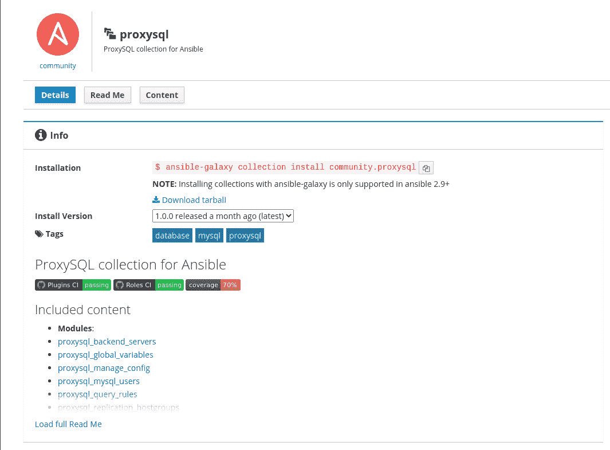
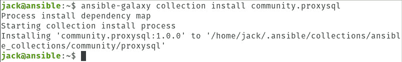
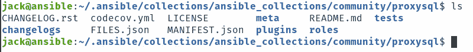
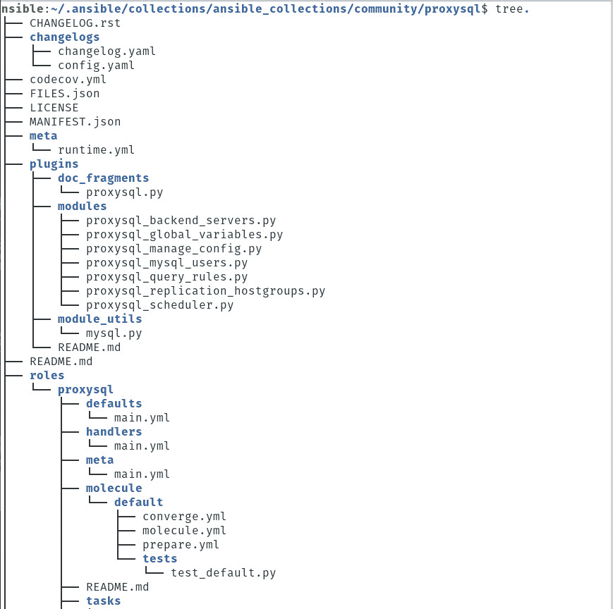

# 教程:使用 Ansible 集合帮助配置和管理更复杂的系统

> 原文：<https://thenewstack.io/tutorial-use-ansible-collections-to-help-configure-and-manage-more-complex-systems/>

当你想到红帽的开源 IT 自动化软件 [Ansible](https://www.ansible.com/) ，你会想到什么？自动化？跨硬件环境的高效部署？或者，您是否对不得不为每项任务编写越来越复杂的剧本充满恐惧？

事实上，你花在 Ansible 上的大部分时间都是在构建剧本上。对于一些人来说，这是一个灵活提高开发人员和管理员技能的好机会。然而，对其他人来说，这可能是一种沮丧和脱发的锻炼。

手头的任务越复杂，行动手册就会变得越复杂。

Ansible 是一个开源平台，用于软件供应、配置管理和应用程序部署。从单一入口点，您可以管理和部署 Linux 和 Windows 台式机和服务器。Ansible 使用一种称为剧本的声明性语言来描述系统配置。通过构建适当的剧本，您可以使用 Ansible 做的事情几乎没有限制。然而，这些行动手册可能会变得非常复杂。

这就是 Ansible 集合发挥作用的地方。

从去年发布的 [Ansible 2.9](https://docs.ansible.com/ansible/latest/roadmap/ROADMAP_2_9.html) 开始，这不仅是可能的，而且这些剧本的构建也变得稍微容易了一些。在 Ansible Collections 的帮助下，你有一大堆可以利用的内容。

[Ansible Collections](https://www.ansible.com/blog/getting-started-with-ansible-collections) 是预打包的内容，可以按原样使用，也可以根据您的需求进行修改。Ansible 集合中的内容包括用于特定目的的内容、工具，甚至是帮助您了解 Ansible 的来龙去脉的演示。对于任何不熟悉或非常熟悉 Ansible 的人来说，这些复杂内容的集合可以从您自己的行动手册中引用，以帮助扩展您的配置能力。

我想向您展示如何使用 Ansible 集合。

## 要求

使用集合唯一需要的是 Ansible 的运行实例。只要运行正常，你在什么平台上运行 Ansible 并不重要。我将在 Ubuntu Server 18.04 上演示，但只要你有一个正常运行的 Ansible 系统，这就可以了。

## 定位一个可转换的集合

您必须做的第一件事是找到要添加到 Ansible 的集合。为此，将你的浏览器指向 Ansible Galaxy。在该网站中，您将找到以下内容的集合:

*   系统
*   监视
*   发展
*   包装
*   建立工作关系网
*   剧本捆绑包
*   云
*   安全性
*   数据库ˌ资料库
*   网

如果你点击这些类别中的任何一个，你会发现成百上千的收藏可供选择。比如说，你想用 prxysql 开发。您可以单击数据库类别，向下滚动，您将看到 proxysql 集合。

## 正在安装收藏

说实话，你实际上并没有安装一个集合。相反，您可以使用 Ansible 将集合下载到本地驱动器。下载后，可以在~/中找到收藏。ansible/collections 目录，在这里您可以开始处理包含的文件。

你能相信这些收藏吗？这是一个重要的问题。如你所知，Docker 经历了一些严重的问题，后来发现托管在 Docker Hub 上的图像包含恶意代码或容易受到黑客攻击。

幸运的是，所有的收藏都是从官方的 Ansible 服务器下载的，所以你应该可以相信你所得到的。最重要的是，你可以梳理集合中的每一个文件，找出是否有流氓或恶意代码。

解决这个问题后，让我们下载 proxysql 集合。为此，单击 proxysql。在生成的页面中，您将看到安装该集合所必需的命令(**图 1** )。



**图 1:** 准备安装的 proxysql 集合。

要下载这个集合，请登录到 Ansible 服务器，并发出命令:

`ansible-galaxy collection install community.proxysql`

一旦 Ansible 完成下载，它会通知您在哪里可以找到这些文件(**图 3** )。



**图 2**:ansi ble-galaxy 指示收藏保存的位置。

对于这个 NGINX 集合，您可以使用以下命令切换到有问题的文件夹:

`cd ~/.ansible/collections/ansible_collections/community/proxysql`

在这个目录中发出 *ls* 命令，显示集合中包含的所有内容(**图 3** )。



**图 3**:proxy SQL 集合内容泄露。

在这种情况下，您会发现许多配置文件，以及可以定制的插件。插件文件可以在插件/模块/中找到，并且都是 Python 文件。您还可以在 roles/proxysql 中找到 YAML 文件。为了更好地查看这个集合的内容，您需要使用 *tree* 命令。如果在您的机器上找不到*树*，您可以从标准存储库中安装它，如下所示:

*   在基于 Debian 的系统上—*sudo apt-get install tree-y*
*   在基于 Red Hat 的系统上-*sudo dnf 安装树-y*

发布根目录下的树将显示集合的结构(**图 4** )。



**图 4:** 用树命令查看集合的结构。

## 在您的行动手册中使用一个系列

既然您已经下载了一个集合，并梳理了它的内容，您可能会想，“我如何在我自己的剧本中使用一个集合？”很高兴你问了，因为这其实很简单。

为了在您的 Ansible 行动手册中引用集合，您必须使用集合的名称，例如，我们之前下载的集合的名称是 community.proxysql。因此，要在行动手册中引用该集合，您可以使用以下方法之一:

```
tasks:
 import_role:
    name:  community.proxysql

```

或

```
collections:  name:  community.proxysql:

```

有关在您的剧本中使用 Ansible 系列的更多信息，请务必查看官方 [Ansible 文档](https://docs.ansible.com/ansible/latest/user_guide/collections_using.html)。

## 结论

如果您正在寻找一种方法将 Ansible 的使用扩展到更复杂的领域，集合可能是最快的途径。与其重新发明轮子，或者花费大量时间制作复杂的内容，为什么不简单地改变已经创建的东西的用途，并从您自己的剧本中引用它。节省时间，避免挫败感。

看看 Ansible Galaxy，看看是否有一些收藏可以让你的生活变得轻松一点。

<svg xmlns:xlink="http://www.w3.org/1999/xlink" viewBox="0 0 68 31" version="1.1"><title>Group</title> <desc>Created with Sketch.</desc></svg>