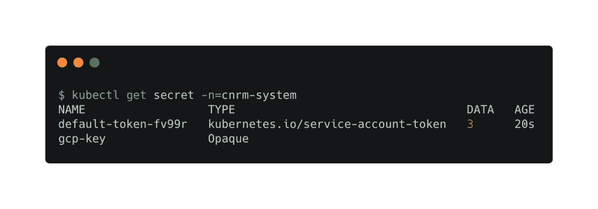
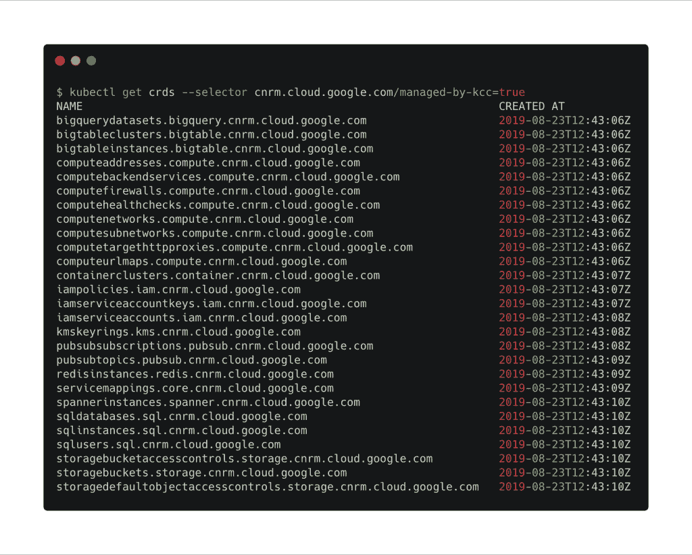
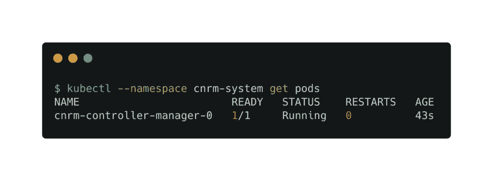
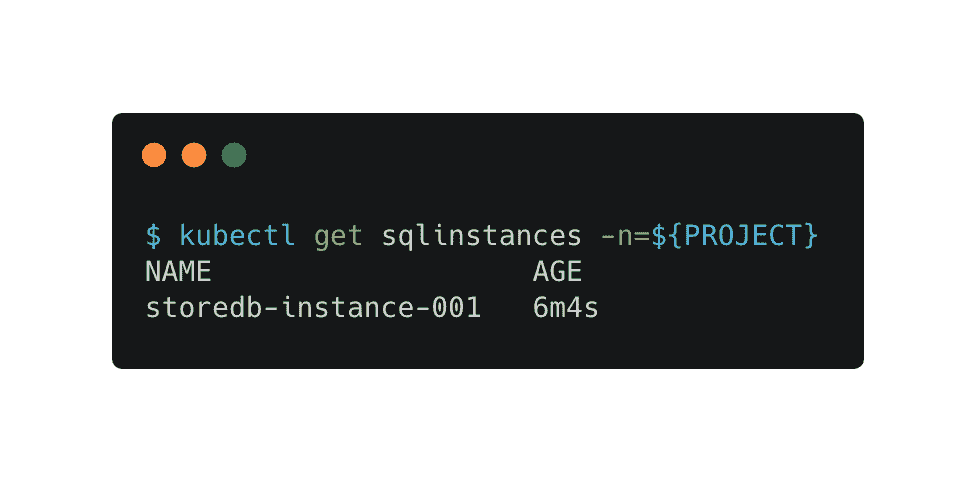
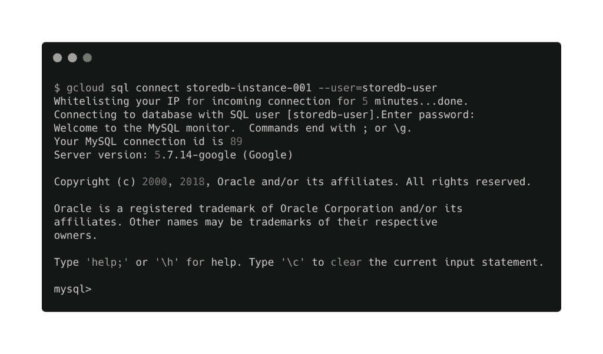
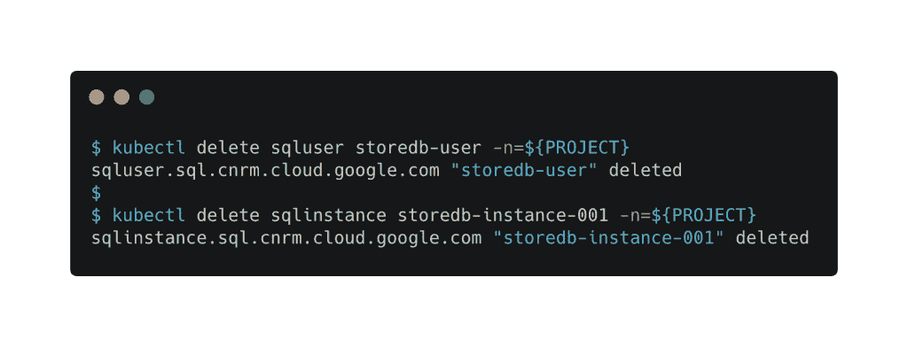

# 教程:使用 Google Config Connector 管理 GCP 云 SQL 数据库

> 原文：<https://thenewstack.io/tutorial-use-google-config-connector-to-manage-a-gcp-cloud-sql-database/>

谷歌云平台的[配置连接器](https://cloud.google.com/config-connector/docs/overview)将[谷歌云平台的](https://cloud.google.com/)资源公开为 Kubernetes 对象。在本教程中，我们将使用本地部署在 **Minikube** 上的配置连接器来供应和管理位于 GCP 的[云 SQL](https://cloud.google.com/sql/) 数据库实例。

假设您已经启动并运行了 Minikube，并且安装并配置了 Google Cloud SDK，那么第一步就是基于拥有者角色的 GCP 服务帐户创建一个秘密。

以下命令创建一个 GCP 服务帐户并绑定到所有者角色。

```
export PROJECT=  # replace this with your GCP project id 

```

```
gcloud iam service-accounts create cnrm-system

```

```
gcloud  projects  add-iam-policy-binding  ${PROJECT}  \

--member serviceAccount:cnrm-system@${PROJECT}.iam.gserviceaccount.com  \

    --role roles/owner

```



让我们将与服务帐户相关联的 JSON 密钥下载到开发机器，并在 **cnrm-system** 名称空间的 **Minikube** 中将其注册为一个秘密。

```
gcloud  iam  service-accounts  keys  create  --iam-account  \

cnrm-system@${PROJECT}.iam.gserviceaccount.com key.json  

```

```
kubectl create namespace cnrm-system

```

```
kubectl create secret generic gcp-key  \

--from-file key.json  \

--namespace cnrm-system 

```

让我们下载配置连接器 YAML 文件，将其安装在 **Minikube** 中。这导致在 Kubernetes 中部署了一组定制资源定义(CRD)。

```
curl  -X  GET  -sLO  \

  -H  "Authorization: Bearer $(gcloud auth print-access-token)"  \

  --location-trusted  \

  https://us-central1-cnrm-eap.cloudfunctions.net/download/latest/infra/install-bundle.tar.gz

```

```
tar zxvf install-bundle.tar.gz

```

```
kubectl apply  -f  install-bundle/

```

我们可以通过配置连接器检查部署在 **Minikube** 中的所有 CRD。pod 也部署在 **cnrm-system** 名称空间中。在我们创建云 SQL 实例之前，让我们确保在我们的 GCP 帐户中启用了云 SQL 和云 SQL 管理 API:

```
gcloud services enable sql-component.googleapis.com

gcloud services enable sqladmin.googleapis.com

```

配置连接器需要一个与 GCP 项目 id 匹配的 Kubernetes 命名空间。这是我们必须遵守的强制性要求。

```
kubectl  create  namespace  ${PROJECT}

```

既然我们想创建一个云 SQL 实例，让我们仔细看看 CRD。

```
kubectl describe crd sqlinstances.sql.cnrm.cloud.google.com

```


为了简洁起见，输出被截取了。

创建下面的 YAML 文件，在美国中部地区提供一个基于 MySQL 的 GCP 云 SQL DB 实例。

```
apiVersion:  sql.cnrm.cloud.google.com/v1alpha3

kind:  SQLInstance

metadata:

  name:  storedb-instance-001

spec:

  databaseVersion:  MYSQL_5_7

  region:  us-central1

  settings:

    tier:  db-f1-micro

```

```
kubectl  --namespace  ${PROJECT}  create  -f  sql-instance.yaml

```

这将创建云 SQL 实例，可使用 gcloud CLI 进行验证。您也可以从 kubectl 获得这个资源。

如果您很好奇，可以使用 kubectl describe 命令来仔细查看 SQLInstance 对象。

```
kubectl describe sqlinstance storedb-instance-001  -n=${PROJECT}

```

等待数据库实例准备就绪。现在可以创建一个 DB 用户来访问该实例。用户定义也作为 YAML 文件提交给 CRD。

```
apiVersion:  sql.cnrm.cloud.google.com/v1alpha3

kind:  SQLUser

metadata:

  name:  storedb-user

spec:

  instanceRef:

    name:  storedb-instance-001

  host:  "%"

  password:  Password@123

```

```
kubectl  --namespace  ${PROJECT}  create  -f  sql-user.yaml

```


如果在本地机器上安装了 MySQL 客户端，就可以访问云 SQL shell。

最后，您可以通过删除运行在 **Minikube** 中的 SQL instance 和 SQLUser 对象来终止云 SQL 实例。

Google 的 Config Connector 表明了 Kubernetes 是如何成为管理资源生命周期的通用控制平面的。

*贾纳基拉姆·MSV 的网络研讨会系列“机器智能和现代基础设施(MI2)”提供了涵盖前沿技术的信息丰富、见解深刻的会议。在 [http://mi2.live](http://mi2.live/) 注册参加即将举行的 MI2 网络研讨会。*

<svg xmlns:xlink="http://www.w3.org/1999/xlink" viewBox="0 0 68 31" version="1.1"><title>Group</title> <desc>Created with Sketch.</desc></svg>