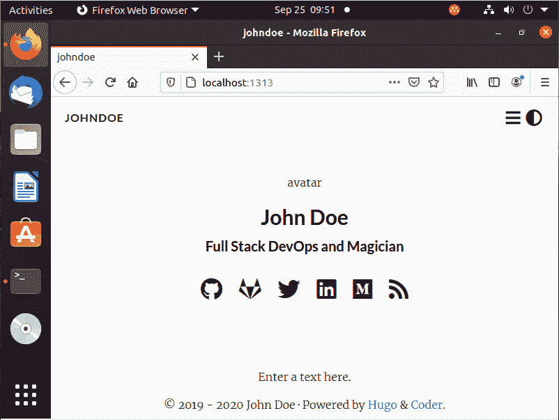
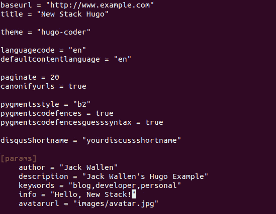
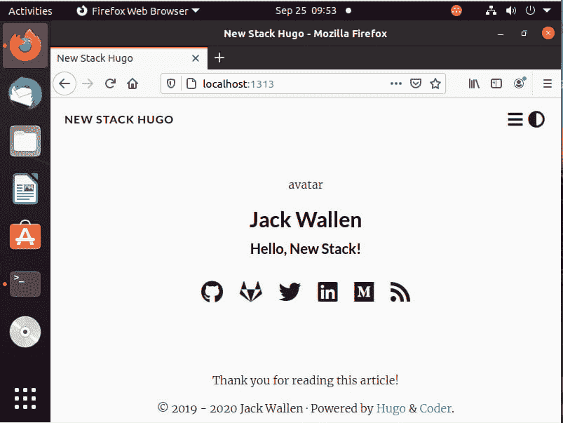
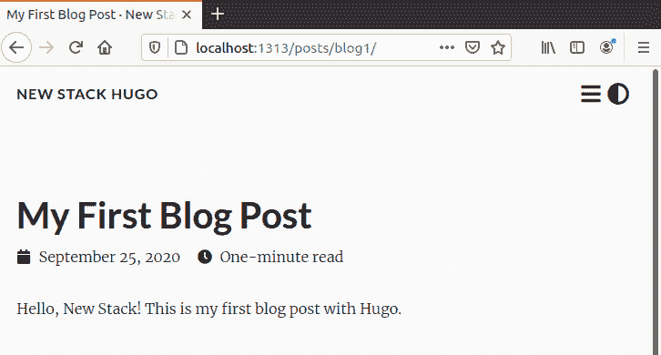

# 教程:使用 Hugo 生成一个静态网站

> 原文：<https://thenewstack.io/tutorial-use-hugo-to-generate-a-static-website/>

由于没有数据库后端、插件，甚至 PHP 与之配套，开源软件 Hugo 使用模板生成一个完整的(尽管是静态的)网站。这些预先构建的页面以令人难以置信的速度呈现出来。所以当你需要速度的时候，Hugo 可能就是你要找的。更好的是，Hugo 包括自己内置的 web 服务器(用于测试)。你可以主持雨果这样的节目:

*   亚马逊 S3
*   蔚蓝的
*   GitHub 页面
*   GoDaddy
*   谷歌云存储
*   Rackspace
*   网络生活
*   更多

Hugo 使用 TOML 和 YAML 文件进行配置，所以几乎所有使用过容器的人都应该对这种语言有一点熟悉。Hugo 也对创建的页面使用 markdown。

我将向您介绍安装 Hugo 的过程，然后生成一个静态网站。你会惊讶于它有多简单。一旦您掌握了 Hugo 的基础知识，您就可以尝试将它插入到您的 CI/CD 管道中(如果您需要的话)。

我将在 Ubuntu 桌面 20.04 上演示。然而，如果你是 macOS 用户，你也可以用 Homebrew 和 MacPorts 安装它。

## 安装 Hugo

Hugo 可以在标准的存储库中找到，所以安装它就像登录到您的桌面，打开一个终端窗口，发出以下命令一样简单:

`sudo apt-get install hugo -y`

一旦安装完成，您可以发出命令**Hugo–help**来确保安装成功。

您还需要在您的机器上安装 Git，所以发出以下命令:

`sudo apt-get install git -y`

当然，您可以使用以下命令安装它们:

`sudo apt-get install hugo git -y`

## 用 Hugo 创建一个静态站点

现在好戏开始了。它是这样工作的:

*   您首先使用 Hugo 来生成您的站点所需的所有元素。
*   您使用 git 初始化根文件夹，然后为站点下拉一个主题。
*   然后在本地启动该网站。
*   然后，您可以修改网站内容以满足您的需要。
*   一旦网站完全符合你的要求，你就可以建立网站了。
*   一旦网站建成，你就可以把它推给你的主机。

在这一点上，你可能会对自己说，“但是我可以用 HTML 和其他网络友好的语言同样容易地建立一个这样的网站。当然可以。把 Hugo 想象成一个搭建网站的框架。考虑到这一点，接下来您所要做的就是添加内容(而不是代码),然后您就可以开始运行了。所以使用这个工具可以更有效率。

让我们走一遍这个过程。

### 步骤 1:生成站点

首先，我们使用 Hugo 为新网站生成骨骼。为此，我们将使用以下命令创建站点 newstack:

`hugo new site newstack`

那应该在眨眼之间完成。现在，您的站点将有一个新的目录。使用以下命令切换到该目录:

`cd newstack`

如果您发出 ls 命令，您将看到六个文件夹(原型、内容、数据、布局、静态、主题)和一个文件(config.toml)。

### 步骤 2:下载主题

接下来，我们将使用 Git 向站点添加一个主题。在你这样做之前，去 Hugo 主题库[选择一个你喜欢的主题。我将使用](https://themes.gohugo.io/) [Hugo Coder](https://themes.gohugo.io/hugo-coder/) 主题进行演示。

首先，我们需要用以下命令初始化根文件夹:

`git init`

接下来，我们将使用以下命令将主题添加为 Git 子模块:

`git submodule add https://github.com/luizdepra/hugo-coder.git themes/hugo-coder`

每个 Hugo 主题都包括一个完整的工作网站，所以为了使用它，你必须将主题文件夹中的所有内容复制到新网站的根目录中。为此，使用以下命令切换到新克隆的目录:

`cd themes/hugo-coder`

接下来，使用命令将所有内容复制到根目录中:

`cp -rf * ../../`

使用以下命令切换回根目录:

`cd ../../`

如果发出 ls 命令，现在应该可以看到根目录中主题的所有内容。

最后，我们需要使用以下命令将 Hugo Coder config.toml 文件复制到根目录中:

`cp exampleSite/config.toml .`

### 步骤 3:在本地启动网站

对于我们的下一个技巧，我们将在本地机器上启动站点。要使用 Hugo 内置服务器，使用命令(从根目录)启动站点:

`hugo server -D`

打开一个 web 浏览器，指向 http://localhost:1313，您应该会看到一个新的站点，其中显示了可以配置的编码器主题。

我们和雨果一起建的第一个网站。

您还应该在命令输出中看到站点的构建速度。在我的例子中，它是在 257 毫秒内创建的，这很快。

目前，该站点是一个工作副本，从本地机器的 RAM 提供服务。Hugo 服务器运行在 demon 模式下，正在监视 config.toml 文件的变化。打开第二个终端，切换到站点的根目录。使用命令打开站点的 TOML 文件:

`nano config.toml`

将 baseURL 更改为您的服务器的域或 IP 地址，并更改您喜欢的任何其他部分:

编辑新 Hugo 站点的 config.toml 文件。

修改完配置文件后，使用[Ctrl]+[x]组合键保存文件，您应该会注意到 Hugo 会检测到更改并刷新站点以反映这些更改:

这些更改会自动反映在运行的站点中。

显然，一些主题将包含更多的示例内容作为指南。但是一旦你下载并探索了足够多的主题，你就可以开始构建你自己的主题了。然而，重要的是，当你改变一个主题时(当 Hugo 以本地守护模式运行时)，当你保存配置文件时，这些改变将被实时地反映出来。

## 如何创建新内容

对于 Hugo Coder 站点，您需要使用以下命令将 exampleSite/content 目录复制到根目录:

`cp -rf exampleSite/content/* ./content`

如何为你的站点创建内容将取决于你使用的主题。但是一般来说，您可以使用如下命令创建新内容:

`hugo new content/posts/blog-post-1.md`

创建页面后，您可以使用以下命令对其进行编辑:

`nano content/posts/blog-post-1.md`

根据需要编辑新文件的内容。保存并关闭文件，Hugo 会自动检测到新添加的博文的变化:

我们的新博客帖子

当然，如何将它整合到网站中取决于所选择的主题。

一旦您获得了您想要的站点，使用[Ctrl]+键盘组合键终止守护服务器，并使用以下命令构建站点(从根目录运行):

`hugo`

该站点将非常快速地在文档根目录中构建和创建一个新的公共文件夹。上传那个文件夹到你的主机服务器，你就可以开始了。

## 结论

这就是用 Hugo 创建一个静态网站的要点。一旦你掌握了这一点，你就可以开始梦想将它集成到你的 CI/CD 管道中。或者，你可以简单地使用它作为一个工具，根据你自己创建的模板，非常快速地生成静态网站。无论哪种方式，Hugo 都是开发人员工具箱中的一个强大工具。

正在考虑为您的项目选择 Hugo？伸手[静躁](https://staticmania.com/)。他们很乐意帮助你做出适当的选择，无论是 Hugo 还是其他技术。

<svg xmlns:xlink="http://www.w3.org/1999/xlink" viewBox="0 0 68 31" version="1.1"><title>Group</title> <desc>Created with Sketch.</desc></svg>