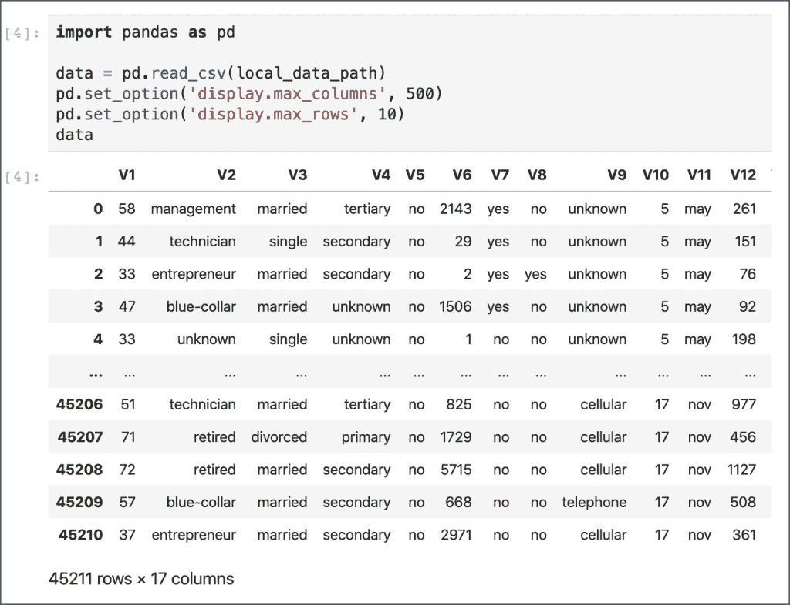
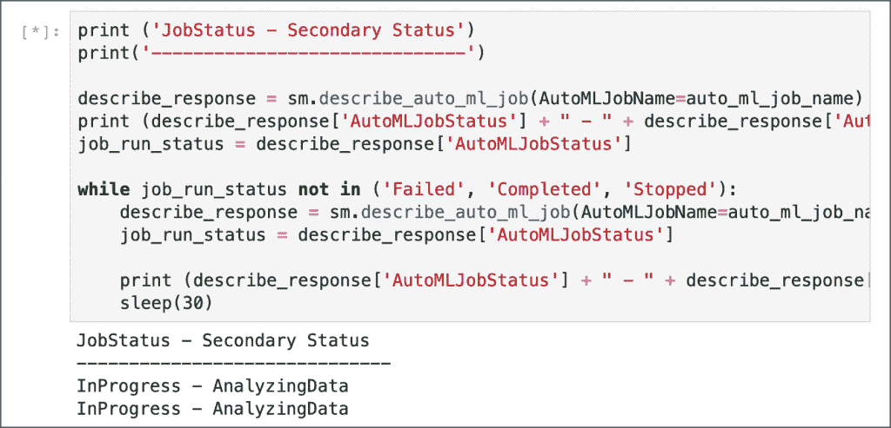
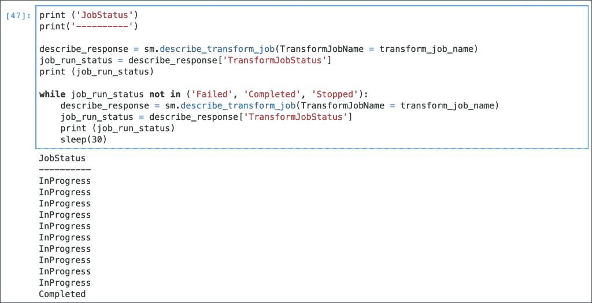
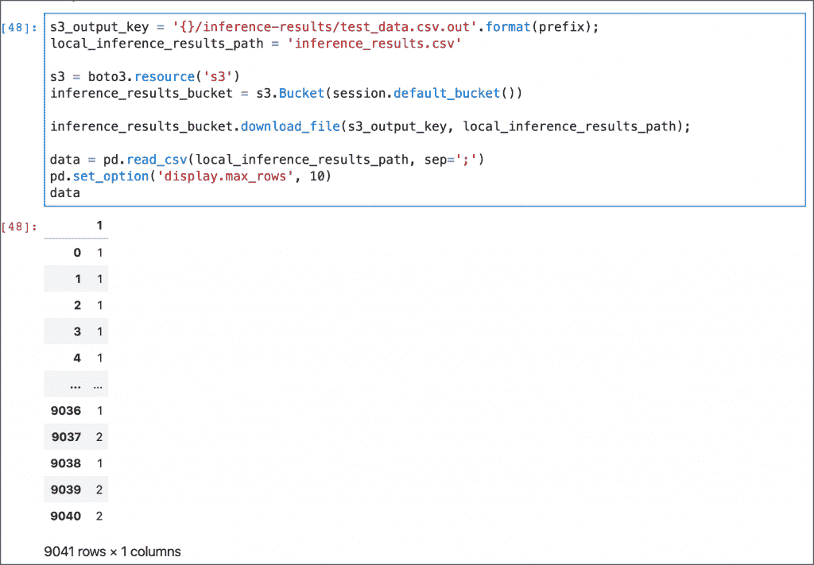

# 教程:使用 Amazon SageMaker Python SDK 训练带有自动驾驶仪的 AutoML 模型

> 原文：<https://thenewstack.io/tutorial-use-the-amazon-sagemaker-python-sdk-to-train-automl-models-with-autopilot/>

在[上一个教程](/train-and-deploy-machine-models-with-amazon-sagemaker-autopilot/)中，我们已经看到了如何使用[亚马逊 SageMaker Studio](https://docs.aws.amazon.com/sagemaker/latest/dg/gs-studio.html) 通过[自动驾驶](https://aws.amazon.com/sagemaker/autopilot/)来创建模型。

在这一部分中，我们将仔细研究 Python SDK 来编写一个端到端的工作流来训练和部署模型。我们将使用批量推理，并将输出存储在亚马逊 S3 桶中。

该演练基于上一教程中讨论的相同数据集和问题类型。

按照前面教程中提到的步骤来配置和设置 Autopilot 的环境。发布一个新的 [Jupyter 笔记本](https://jupyter.org/)来运行使用 SDK 的 Python 代码。

```
import sagemaker
import boto3
from sagemaker import get_execution_role

region  =  boto3.Session().region_name

session  =  sagemaker.Session()
bucket  =  session.default_bucket()
print(bucket)
prefix  =  'sagemaker/termdepo'

role  =  get_execution_role()

sm  =  boto3.Session().client(service_name='sagemaker',region_name=region)

```

该步骤初始化环境并返回与 SageMaker 相关的默认 S3 桶。

```
!wget  -N  https://datahub.io/machine-learning/bank-marketing/r/bank-marketing.csv
local_data_path  =  'bank-marketing.csv'

```

我们从 datahub.io 下载了数据集

```
import pandas as pd

data  =  pd.read_csv(local_data_path)
pd.set_option('display.max_columns',  500) 
pd.set_option('display.max_rows',  10)  
data

```

这将验证数据集并将其显示在网格中。

[](https://thenewstack.io/tutorial-use-the-amazon-sagemaker-python-sdk-to-train-automl-models-with-autopilot/sm-ap-sdk-0/) 

```
train_data  =  data.sample(frac=0.8,random_state=200)
test_data  =  data.drop(train_data.index)
test_data  =  test_data.drop(columns=['Class'])

```

```
train_file  =  'train_data.csv';
train_data.to_csv(train_file,  index=False,  header=True)
train_data_s3_path  =  session.upload_data(path=train_file,  key_prefix=prefix  +  "/train")
print('Train data uploaded to: '  +  train_data_s3_path)

test_file  =  'test_data.csv';
test_data.to_csv(test_file,  index=False,  header=False)
test_data_s3_path  =  session.upload_data(path=test_file,  key_prefix=prefix  +  "/test")
print('Test data uploaded to: '  +  test_data_s3_path)

```

我们分割数据集并将其上传到 S3 存储桶。

现在数据集已经准备好了，我们将定义自动驾驶实验的输入、输出和作业配置。

```
input_data_config  =  [{
      'DataSource':  {
        'S3DataSource':  {
          'S3DataType':  'S3Prefix',
          'S3Uri':  's3://{}/{}/train'.format(bucket,prefix)
        }
      },
      'TargetAttributeName':  'Class'
    }
  ]

job_config  =  {
    'CompletionCriteria':  {
      'MaxRuntimePerTrainingJobInSeconds':  600,
      'MaxAutoMLJobRuntimeInSeconds':  3600
    },
}

output_data_config  =  {
    'S3OutputPath':  's3://{}/{}/output'.format(bucket,prefix)
  }

problem_type  =  'BinaryClassification'
job_objective  =  {  'MetricName':  'F1'  }

```

这个单元包含了自动驾驶仪实验最关键的参数。它说明了数据集的位置、标签、最终工件的上传位置、完成工作的标准以及问题类型和评估模型性能的指标。

```
from time import gmtime,  strftime,  sleep
timestamp_suffix  =  strftime('%d-%H-%M-%S',  gmtime())

auto_ml_job_name  =  'termdepo'  +  timestamp_suffix
print('AutoMLJobName: '  +  auto_ml_job_name)

sm.create_auto_ml_job(AutoMLJobName=auto_ml_job_name,
                      InputDataConfig=input_data_config,
                      OutputDataConfig=output_data_config,
                      AutoMLJobConfig=job_config,
                      AutoMLJobObjective=job_objective,
                      ProblemType=problem_type,
                      RoleArn=role)

```

配置就绪后，我们将创建一个 AutoML 作业。

```
print  ('JobStatus - Secondary Status')
print('------------------------------')

describe_response  =  sm.describe_auto_ml_job(AutoMLJobName=auto_ml_job_name)
print  (describe_response['AutoMLJobStatus']  +  " - "  +  describe_response['AutoMLJobSecondaryStatus'])
job_run_status  =  describe_response['AutoMLJobStatus']

while job_run_status not in  ('Failed',  'Completed',  'Stopped'):
    describe_response  =  sm.describe_auto_ml_job(AutoMLJobName=auto_ml_job_name)
    job_run_status  =  describe_response['AutoMLJobStatus']

    print  (describe_response['AutoMLJobStatus']  +  " - "  +  describe_response['AutoMLJobSecondaryStatus'])
    sleep(30)

```

该单元将继续每 30 秒打印一次作业状态。

[](https://thenewstack.io/tutorial-use-the-amazon-sagemaker-python-sdk-to-train-automl-models-with-autopilot/sm-ap-sdk-1/)

一旦工作完成，我们就可以检索数据探索笔记本、候选人定义笔记本以及具有最佳模型的候选人的姓名。

```
job  =  sm.describe_auto_ml_job(AutoMLJobName=auto_ml_job_name)

job_candidate_notebook  =  job['AutoMLJobArtifacts']['CandidateDefinitionNotebookLocation']
job_data_notebook  =  job['AutoMLJobArtifacts']['DataExplorationNotebookLocation']
job_best_candidate  =  job['BestCandidate']
job_best_candidate_name  =  job_best_candidate['CandidateName']

job_candidate_notebook
job_data_notebook
job_best_candidate_name

```

```
%%sh  -s  $job_candidate_notebook  $job_data_notebook

aws s3 cp  $1  .
aws s3 cp  $2  .

```

这将把 Jupyter 笔记本从 S3 桶下载到本地环境。

在接下来的几个步骤中，我们将从最佳候选中创建模型，部署它并执行批量推理。

```
model_name  =  'automl-termdepo-model-'  +  timestamp_suffix

model  =  sm.create_model(Containers=job_best_candidate['InferenceContainers'],
                            ModelName=model_name,
                            ExecutionRoleArn=role)

print('Model ARN corresponding to the best candidate is : {}'.format(model['ModelArn']))

```

为了执行批量推理，我们需要转换存储在 S3 桶中的测试数据集，并将其发送给模型。

```
transform_job_name  =  'automl-termdepo-transform-'  +  timestamp_suffix

transform_input  =  {
        'DataSource':  {
            'S3DataSource':  {
                'S3DataType':  'S3Prefix',
                'S3Uri':  test_data_s3_path
            }
        },
        'ContentType':  'text/csv',
        'CompressionType':  'None',
        'SplitType':  'Line'
    }

transform_output  =  {
        'S3OutputPath':  's3://{}/{}/inference-results'.format(bucket,prefix),
    }

transform_resources  =  {
        'InstanceType':  'ml.m4.xlarge',
        'InstanceCount':  1
    }

sm.create_transform_job(TransformJobName  =  transform_job_name,
                        ModelName  =  model_name,
                        TransformInput  =  transform_input,
                        TransformOutput  =  transform_output,
                        TransformResources  =  transform_resources
)

```

等待，直到作业状态显示为已完成。

```
print  ('JobStatus')
print('----------')

describe_response  =  sm.describe_transform_job(TransformJobName  =  transform_job_name)
job_run_status  =  describe_response['TransformJobStatus']
print  (job_run_status)

while job_run_status not in  ('Failed',  'Completed',  'Stopped'):
    describe_response  =  sm.describe_transform_job(TransformJobName  =  transform_job_name)
    job_run_status  =  describe_response['TransformJobStatus']
    print  (job_run_status)
    sleep(30)

```

[](https://thenewstack.io/tutorial-use-the-amazon-sagemaker-python-sdk-to-train-automl-models-with-autopilot/sm-ap-sdk-2/)

我们现在可以下载并打印推理作业的输出。

```
s3_output_key  =  '{}/inference-results/test_data.csv.out'.format(prefix);
local_inference_results_path  =  'inference_results.csv'

s3  =  boto3.resource('s3')
inference_results_bucket  =  s3.Bucket(session.default_bucket())

inference_results_bucket.download_file(s3_output_key,  local_inference_results_path);

data  =  pd.read_csv(local_inference_results_path,  sep=';')
pd.set_option('display.max_rows',  10) 
data

```

[](https://thenewstack.io/tutorial-use-the-amazon-sagemaker-python-sdk-to-train-automl-models-with-autopilot/sm-ap-sdk-3/)

这一步结束了使用 SageMaker Autopilot Python SDK 训练模型的教程。

*贾纳基拉姆·MSV 的网络研讨会系列“机器智能和现代基础设施(MI2)”提供了涵盖前沿技术的信息丰富、见解深刻的会议。请在 http://mi2.live 注册参加即将举行的 MI2 网络研讨会*

<svg xmlns:xlink="http://www.w3.org/1999/xlink" viewBox="0 0 68 31" version="1.1"><title>Group</title> <desc>Created with Sketch.</desc></svg>