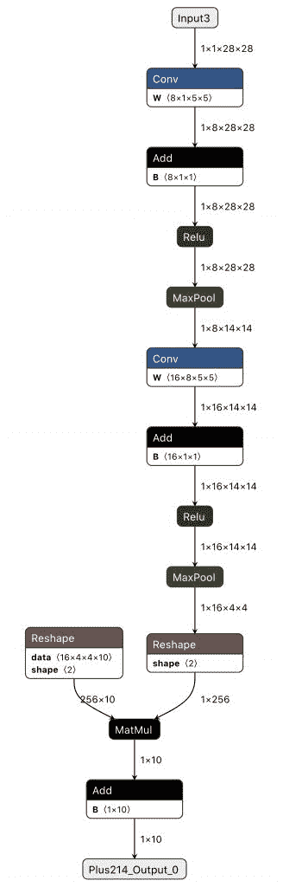
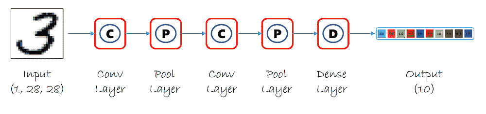
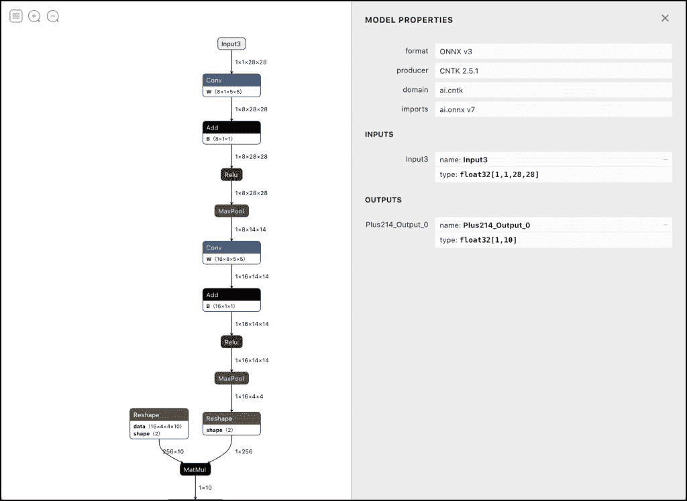

# 教程:使用预训练的 ONNX 模型进行推理

> 原文：<https://thenewstack.io/tutorial-using-a-pre-trained-onnx-model-for-inferencing/>

本文是开放神经网络交换(ONNX)系列介绍教程的第二篇。阅读

[part one here](https://thenewstack.io/open-neural-network-exchange-brings-interoperability-to-machine-learning-frameworks/)

.

在本系列的前一部分，我介绍了开放神经网络交换( [ONNX](https://onnx.ai/) )和 ONNX 运行时，作为机器学习和深度模型的互操作工具包和平台。

在本教程中，我们将探索如何使用现有的 ONNX 模型进行推理。在仅仅 30 行代码中，包括对输入图像的预处理，我们将执行 MNIST 模型的推断，从图像中预测数字。

本教程的目的是让您熟悉 ONNX 文件格式和运行时。

## 设置环境

要完成本教程，您需要在您的机器上运行 Python 3.x。我们将首先创建一个 Python3 虚拟环境，将其与机器上的主 Python 环境隔离开来。

```
python3  -m  venv onnx_mnist
source onnx_mnist/bin/activate

```

虚拟环境就绪后，让我们安装程序所需的 Python 模块。以下命令将在您的环境中安装 ONNX、ONNX 运行时和 OpenCV。

```
pip install onnx onnxruntime opencv-python

```

让我们从 ONNX 模型动物园下载并扩展在 Microsoft CNTK Toolkit 中训练的 MNIST 预训练模型。

```
wget https://www.cntk.ai/OnnxModels/mnist/opset_7/mnist.tar.gz

```

上面的命令产生了一个名为 *mnist* 的新目录，它将模型和测试数据序列化到 ProtoBuf 文件中。我们不会在教程中使用测试数据。

我们现在可以打开 *model.onnx* 文件，通过 [Netron](https://github.com/lutzroeder/netron) 工具检查模型。

ONNX Model Zoo 的 MNIST 模型使用最大池来更新其卷积中的权重，如 Netron 的图表所示。



该模型有两个卷积图层、两个 maxpool 图层、一个密集图层和一个输出图层，该输出图层可对代表 MNIST 数据集中使用的标注的 10 个值之一进行分类。



## 为预测编写推理代码

我们现在将编写代码，用于对预训练的 MNIST 模型执行推理。

让我们从导入正确的 Python 模块开始。

```
import json
import sys
import os
import time
import numpy as np
import cv2
import onnx
import onnxruntime
from onnx import numpy_helper

```

注意，我们正在使用 ONNX、ONNX 运行时以及与 ONNX 相关的 NumPy 助手模块。

ONNX 模块帮助解析模型文件，而 ONNX 运行时模块负责创建会话和执行推理。

接下来，我们将初始化一些变量来保存模型文件和命令行参数的路径。

```
model_dir  ="./mnist"
model=model_dir+"/model.onnx"
path=sys.argv[1]

```

下一步，我们将加载图像，并用 OpenCV 对其进行预处理。

```
#Preprocess the image
img  =  cv2.imread(path)
img  =  np.dot(img[...,:3],  [0.299,  0.587,  0.114])
img  =  cv2.resize(img,  dsize=(28,  28),  interpolation=cv2.INTER_AREA)
img.resize((1,  1,  28,  28))

```

上面的代码片段负责将图像转换为灰度，并将其大小调整为 28X28 数组。该数组将被用作模型的输入。

我们现在将图像转换成 float32 类型的 NumPy 数组。

```
data  =  json.dumps({'data':  img.tolist()})
data  =  np.array(json.loads(data)['data']).astype('float32')

```

我们现在准备将数据传递给模型进行推理。

```
data  =  json.dumps({'data':  img.tolist()})
data  =  np.array(json.loads(data)['data']).astype('float32')
session  =  onnxruntime.InferenceSession(model,  None)
input_name  =  session.get_inputs()[0].name
output_name  =  session.get_outputs()[0].name
print(input_name)
print(output_name)

```

我们需要使用与神经网络的输入层和输出层相同的名称。您可以很容易地从 **session.getinputs()** 和 **session.getoutputs()** 方法中检索它们。上面代码片段的输出与 Netron 显示的输入和输出节点名称相匹配。



让我们将输入传递给会话并打印预测。

```
result  =  session.run([output_name],  {input_name:  data})
prediction=int(np.argmax(np.array(result).squeeze(),  axis=0))
print(prediction)

```

我们应用 NumPy 的 **argmax** 函数来检索概率最高的值。

尝试通过传递一个手写数字的图像来运行代码。它很有可能预测到。

下面是完整的代码供你参考:

```
import json
import sys
import os
import time
import numpy as np
import cv2
import onnx
import onnxruntime
from onnx import numpy_helper

model_dir  ="./mnist"
model=model_dir+"/model.onnx"
path=sys.argv[1]

#Preprocess the image
img  =  cv2.imread(path)
img  =  np.dot(img[...,:3],  [0.299,  0.587,  0.114])
img  =  cv2.resize(img,  dsize=(28,  28),  interpolation=cv2.INTER_AREA)
img.resize((1,  1,  28,  28))

data  =  json.dumps({'data':  img.tolist()})
data  =  np.array(json.loads(data)['data']).astype('float32')
session  =  onnxruntime.InferenceSession(model,  None)
input_name  =  session.get_inputs()[0].name
output_name  =  session.get_outputs()[0].name
#print(input_name)
#print(output_name)

result  =  session.run([output_name],  {input_name:  data})
prediction=int(np.argmax(np.array(result).squeeze(),  axis=0))
print(prediction)

```

在本教程的下一部分，我们将学习如何导出 PyTorch 模型并将其转换为 TensorFlow 保存的模型文件。敬请关注。

*贾纳基拉姆·MSV 的网络研讨会系列“机器智能和现代基础设施(MI2)”提供了涵盖前沿技术的信息丰富、见解深刻的会议。在 [http://mi2.live](http://mi2.live) 注册参加即将举行的 MI2 网络研讨会。*

<svg xmlns:xlink="http://www.w3.org/1999/xlink" viewBox="0 0 68 31" version="1.1"><title>Group</title> <desc>Created with Sketch.</desc></svg>