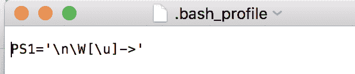
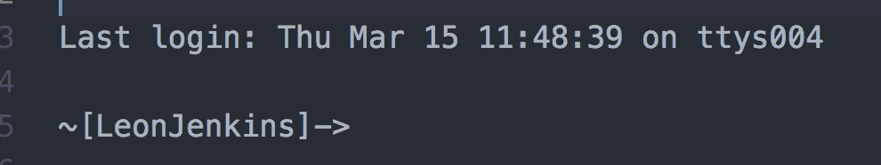
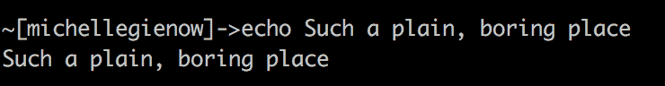
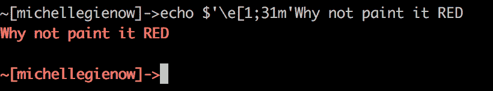
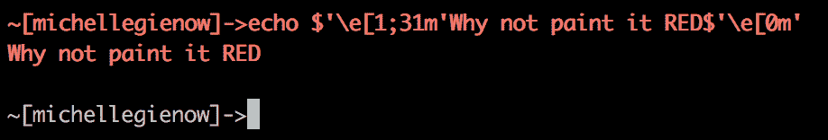
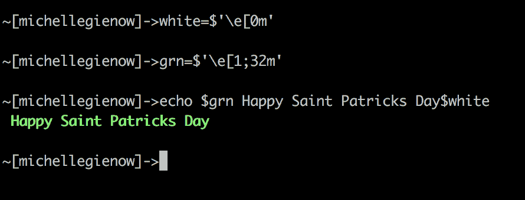
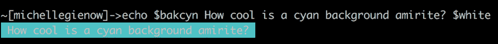
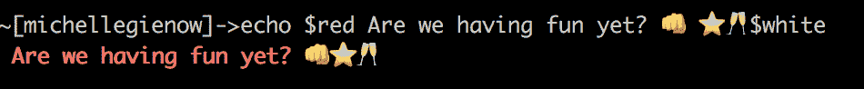

# 教程:定制你的终端 OG 风格——没有库或插件！

> 原文：<https://thenewstack.io/tutorial-your-terminal-og-style-no-libs-or-plugins/>

编码人员生活在命令行中。我们每天都在使用终端，不管我们是在建造还是在修理什么东西，也不管我们是在用额头敲打我们的人体工程学办公桌。因此，调整航站楼环境，使其变得舒适和适宜居住是绝对有意义的。例如，考虑一下运行 **brew install** *(无论什么)*如何以彩色键控消息和说明文本的形式交付结果。这不仅使文本在物理上更容易阅读，而且使我们更快地掌握其含义并采取行动。

当然，有各种各样的库和插件可以让我们随心所欲地重新装饰终端，但是——最终——安装别人预先打包好的设计选项能带来多少乐趣呢？通过命令行中的一些简单练习，我们的下一个 bash 脚本可以被丰富地格式化，并且更加用户友好——所有这些都不需要配置，也不需要安装插件。

注:我在这里假设[痛击](https://www.gnu.org/software/bash/)。我不想卷入任何 zsh vs bash vs 的争论。Bash 是几乎所有 UNIX 系统上的默认 shell，这意味着它具有高度的可移植性，并且一旦您习惯了它，您几乎可以在任何地方使用它。这完全取决于个人喜好，巴什是我的。还有，bash 是 Mac 和大多数 Linux 系统上的默认 shell 如果你是 Windows 用户，我一无所知——试着看看 Cygwin 在你的机器上创造的美妙的 bash 体验。

## 说出我的名字

你的提示——在 bash 中出现在光标前面的文本，比如**Leons-Macbook-Pro:~ Leon Jenkins $**——实际上是由一个名为 **PS1** 的变量定义的。您可以通过在终端提示符下键入' **echo $PS1** '来检查这个变量的当前值( **echo** '告诉终端简单地打印出随后的内容)。注意:你会得到一些看起来像鸡爪一样的转义字符，类似于 Regex。(想学习正则表达式，这是一种针对文本本身的通用快捷语言吗？太棒了。查看这个 [TNS 正则表达式教程)](https://thenewstack.io/dont-fear-regex-getting-started-regular-expressions/)

如果你以前从未弄乱过你的提示， **PS1** 很可能会返回“**\ h:\ W \ u \ $**”——一串转义字符，代表主机名( **\h** )、工作目录( **\W** )和用户名( **\u** )。不太漂亮，是吧？

在冒险进入之前未知的 **vi** 命令行文本编辑器领域时，我收到的第一个有用的编码建议之一是将我的 bash 提示符改为简短且令人难忘的。所以我们从简单地去掉主机名开始——我们大多数人都非常清楚我们在使用哪个主机，谢谢。

1.  定位**。bash_profile** 文件——您可能需要从命令行在您的用户名文件路径中创建一个
2.  在您最喜欢的文本编辑器中打开它。如果是空白的，那也可以。
3.  找到'**'在哪里，如果**中有值。bash_profile** 并将它们更改为以下内容。如果没有，只需键入整个文本。**
***   存储更改并检查“终端”(您可能需要重新启动“终端”以使更改生效)。**

 **

将您的提示设置为当前工作目录和您的用户名，然后是一个箭头(而不是经典的' **$** ')，只是为了好玩！)，您应该会看到:

从这里开始，您可以尝试将用户名更改为真正简短的名称，例如，将“LeonJenkins”简单地转换为“Leon”。(显然，你应该在这里替换你自己的用户名和变体，除非你碰巧是 Leon Jenkins。这样的话请 PM 我)。

严肃的提示定制超出了本指南的范围，但是您可以通过简单地摆弄它来学到很多东西。如果你真的想自己滚动，Bash 参考手册的[控制提示](https://www.gnu.org/software/bash/manual/bashref.html#Controlling-the-Prompt)是转义序列的入门。

## 给我涂上美丽的颜色

默认情况下，终端是一个严肃的单色环境。

幸运的是，bash 内置了颜色代码！例如，'**\ e[1；31m** 是红色的代码，可以与终端中的其他文本或命令结合使用:

不幸的是，一旦你让终端变成红色，它就一直保持红色。您可以键入“reset”以恢复到默认的单色…这将清除颜色，但也会清除整个屏幕。或者，您可以在末尾添加“**\ e[0m**”—白色的颜色代码:

是的，这很麻烦。因此，记住 bash 是一个我们可以编写脚本来做事情的地方，让我们引入一些变量。有各种各样的选择[你可以分配](https://misc.flogisoft.com/bash/tip_colors_and_formatting):字体颜色、背景高亮颜色、粗体、斜体、下划线——甚至闪烁的文本，如果你想让它变得令人讨厌的话。然而，为了继续我们的简单示例，用您选择的名称分配一个变量，然后是不带空格的等号(重要的)，然后是$'code name here' — codename 必须在单引号内—以将样式应用于终端文本。混搭！

**red = $ ' \ e[1；31 米’**

**grn = $ ' \ e[1；32 米’**

**white=$'\e[0m'**

**巴克辛=$'\e[46m'**

显然，这是一个非常基本的例子，重点是您可以将这些变量放入您编写的任何 shell 脚本中，然后就可以了。最简单的方法是将[颜色和字体样式代码的标准备忘单](https://misc.flogisoft.com/bash/tip_colors_and_formatting)复制到你的**中。bash_profile** 作为变量，从那时起，您就可以调用它们来满足您的创造性和丰富多彩的需求。

## 第二个表情符号

或者我们现在称之为表情符号。(小时候我们用 ASCII 字符做了自己的表情符号[，很喜欢)。](https://thenewstack.io/surprisingly-rich-history-ascii-art/)

这有点棘手，因为它取决于你的操作系统，但在实践中再简单不过了:只需将表情符号直接复制/粘贴到终端。(你也可以在你的**中给变量分配你喜欢的。bash_profile** ，用于快速快速访问)。

## 完全可选

好了，这些实际上不是视觉效果，而是一些我非常喜欢的超级方便的命令行快捷方式。这些是改变 bash 内置的 [Readline](https://en.wikipedia.org/wiki/GNU_Readline) 功能的方法，不知何故，当您第一次开始遍历终端时，没有人会提到它。也许是因为它们如此有用和显而易见，以至于我们立即内化了它们，并认为它们是理所当然的？在任何情况下，如果你对这些都不熟悉，请立即访问上面的 Readline 链接，查看所有其他的 sweet CLI 工具。

还有**$ set show-all-if-ambiguity。**你知道如何开始输入文件路径名和 tab 键来自动完成，对吗？或者至少尝试着这么做，但是太早的禁忌会敲响令人恐惧的耻辱的钟声。这被称为完成函数。该**模糊显示选项**的终端默认为“关”；将它切换到“开”(也就是说，如果你对这个完全陌生，只需打开终端并键入它)意味着有不止一个可能完成的单词将立即列出所有匹配，而不是响铃。

另外，尝试:**$ set completion-ignore-case****on。**默认为“关”。将其设置为“开”允许文件名匹配和完成，而忽略大小写。也就是说骆驼案不会再引发骆驼诅咒了。至少一样多。

图片由[Ash](https://unsplash.com/photos/Koxa-GX_5zs?utm_source=unsplash&utm_medium=referral&utm_content=creditCopyText)Edmonds[在](https://unsplash.com/photos/Koxa-GX_5zs?utm_source=unsplash&utm_medium=referral&utm_content=creditCopyText) [Unsplash 上拍摄。](https://unsplash.com/search/photos/macbook?utm_source=unsplash&utm_medium=referral&utm_content=creditCopyText)

<svg xmlns:xlink="http://www.w3.org/1999/xlink" viewBox="0 0 68 31" version="1.1"><title>Group</title> <desc>Created with Sketch.</desc></svg>**