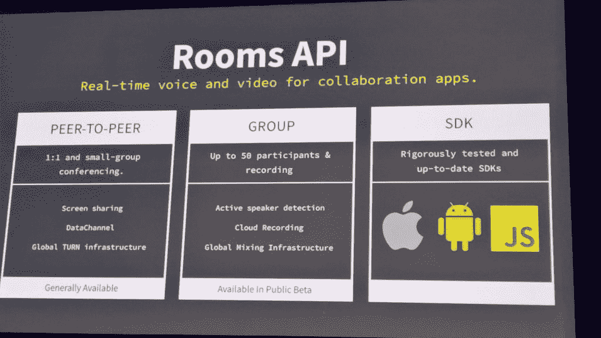

# Twilio 寻求为现代信息传递提供所有 API

> 原文：<https://thenewstack.io/twilio-apis-modern-day-messaging/>

如果像他们说的那样，API 正在吞噬世界，那么 Twilio 正在这个 API 世界中蚕食一部分。

如今， [Twilio](https://www.twilio.com/) 最广为人知的可能是优步一直在使用的一项服务，它为司机和乘客提供短信渠道，以便彼此交流；它提供了方便的 API，您可以在代码中调用这些 API 来拨打电话或发送短信，而无需考虑手机提供商或每月通话时间。

但在过去的九年里，Twilio 已经从提供少量的电话 API 发展到提供一套全面的通信和参与服务，您可以将这些服务插入到您的代码中，或者作为一个平台一起使用。

Twilio 服务适合开发人员在 SIP 和 WebRTC 等底层协议、Apple push notifications 和 Facebook Messenger 等特定于平台和提供商的服务以及与敏捷开发和云服务相对立的老派电话设置之间找到平衡点。

“我是开发商。在我创办的每一家公司，我都想做一些东西来与客户沟通；Twilio 首席执行官[杰夫·劳森](https://twitter.com/jeffiel)告诉新堆栈。“但每次我看到你应该如何做时，你都会得到一堆应用程序盒，一堆 PBX，从运营商那里运行一堆线路。[你]插入设备，然后引入专业服务团队，尝试让它投入使用，并让它尝试做你想做的事情。每次你想做出改变时，你都必须回到专业服务部门。”

缓慢的周转和高昂的成本一样是创新的障碍。有一次，劳森为一个允许顾客打电话留言的系统报价 200 万美元。

“它不是设计成一个你可以建立的平台，它不是为开发者实现新想法而设计的。这与软件精神正好相反，软件精神认为，首先你要做好并运行一些东西，然后你要倾听客户的意见并不断重复，直到你做对为止；这就是软件的超级力量，”他说。“但由于做出改变需要时间，我需要两年时间才能从客户那里得到反馈，知道我做的东西对他们是否有用。真是疯了！”

## API 所有的东西

Lawson 的观点是所有东西都应该是 API，Twilio 提供的 API 必须与他们合作的服务保持一致。“我们从未扼杀过 API，”他指出。但这些 API 已经在 Twilio 构建的通信网络之上构建成了他所谓的“可编程通信云”，与其他服务进行了广泛的集成。

“我们从语音和短信开始，我们开始在更多的运营商上分层，我们意识到我们已经建立了一个网络，我们可以在其上建立 API，以控制呼叫流，为您提供消息流、洞察力和更智能内容的媒体引擎。然后开发人员在此基础上建立了一个参与层，”他说。

Twilio 可以向你出售为物联网设备设计的 SIM 卡，你可以通过 Twilio 的云服务对其进行配置，这样当它们到达时，它们就可以插入并开始发回传感器数据。这是美国现在提供的漫游服务，但今年夏天它将进入欧洲和其他地区。它拥有 [Authy](https://www.twilio.com/docs/api/authy) 认证服务，该服务支持新的 Android 用户验证服务，该服务将注册的推送认证与检查用户是否使用真实电话号码或可能被骗子使用的 VOIP 线路相结合。

有用于传真的 API，也有用于[视频会议的 APIs】(包括一个小组之间的屏幕共享或录制多达 50 人的视频房间，并检测当前发言人是谁)，或用于监控语音通话质量的 APIs】(包括网络是否拥塞或用户是否将麦克风静音)。呼叫控制可以将无法通过短码的呼叫重新路由到完整的电话号码，将 MMS 消息转换为 SMS 格式或编辑消息中的 PII，并处理选择退出处理以实现合规性。](https://www.twilio.com/video)

用于处理语音呼叫的 Twilio APIs 的范围。

这些语音 API 构成了 Lawson 所说的“可编程语音”，从拨打电话号码到处理 WebRTC 连接，再到召集其他人开会并记录通话，无所不包。您还可以监控通话质量和运营商连接。

Twilio 的媒体引擎已经可以判断你的电话何时转到应答机(所以你可以从现场代理切换到让 API 说出你自己的录音信息，在哔哔声后正确离开)，它可以进行语音识别(使用谷歌的语音识别服务，每次识别收费 2 美分)，并将结果输入自然语言理解服务。

“不管是什么渠道；语音或短信，聊天或 Alexa 或无论什么，无论客户在哪里跟你说话，Twilio 都会理解。你只需训练它一次，编写你的应用程序一次，你就可以在你的客户想和你交谈的任何地方运行它，”公认的劳森说。

一旦语音被识别，Twilio 的自然语言理解就会提取句子中提到的意图和实体——从电话到预订的航班。

## 约定音

注意到开发人员如何使用 Twilio APIs 的一些常见模式，导致了 Lawson 所谓的“声明性”API 的构建，它构成了“参与云”

“大多数 REST APIs 都是命令式的，你在发送命令。但是有时您想要最佳实践和通用模式。这就是为什么我们选择开发框架；因为它们让我们专注于建筑，而不是管道，”劳森说。“您告诉我们您想要实现的目标，让我们应用通用模式和最佳实践来为您实现。您可以获得灵活性，但也可以更快地投入生产。”

这种方法产生了这样的 API:

*   [通知](https://www.twilio.com/notify):用于通过多种通信渠道发送通知，包括移动和网络推送通知。
*   [同步](https://www.twilio.com/sync):用于设备或应用程序之间共享状态。
*   [代理](https://www.twilio.com/proxy):让两个用户联系，但不透露他们的私人电话号码。
*   [TaskRouter](https://www.twilio.com/taskrouter) :用于建立呼叫中心流程。

Twilio 逐渐超越了电话，因为我们在手机上交流的方式不仅仅是语音和文本；Channels 是一项新服务，可以与 Notify、Proxy 和 Twilio 的 SMS API 配合使用，让你向一系列服务的用户发送消息——从 SMS 和 Facebook Messenger 到 Alexa 通知、Twitter DMs、Kik、Viber、微信、BlackBerry Messenger、HipChat 和 Slack，以及电子邮件的 SendGrid。

随着新服务的出现，这个列表会越来越长。“我们构建了这个非常酷的引擎，让您可以在几天内完成复杂的配置，为新的端点装载新的 API 当脸书宣布某事时，当谷歌宣布某事时，我们将能够真正有效地整合这些渠道，”劳森解释道。
不仅仅是连接一个新的服务思想；Notify 也知道你可以在不同的服务上做什么。

“我们所做的是为参与的关键类型建立抽象概念；有一个一对零的用例，那就是通知，有一对一，多对一，一对多。因此，一对一的对话是 Twitter 的直接消息，多对多是松弛的，但这些交互模型最终会在多个服务上复制。关键是要有正确的抽象来插入东西，”劳森说。

你可以直接在代码中使用所有这些，或者通过 Lawson 称之为 Twilio 的“运行时”稍微扩展一下通常的定义，这涵盖了 Twilio 站点上的门户，您可以在其中编写代码，内置调试器是一种新的无服务器函数工具，它抽象出了您用来运行代码的常用基础结构，具有可视化编程接口，公开了所有其他 Twilio 服务。如果你正在使用[聊天 API](https://www.twilio.com/docs/api/chat/rest) 构建一个聊天系统，Twilio 现在为设计提供了带有用户界面控件的模板。

所有这些都极大地简化了传统电话上的通信以及用户所在的在线工具和服务的混合，即使您只使用一个 API。劳森通常对开发者的潜力充满热情；“一个开发商就能掌控几年前整个国家都无法掌控的权力。”

专题图片:在最近的 Twilio 信号大会上，Twilio 首席执行官杰夫·劳森(Jeff Lawson)在舞台上演示语音识别和语言理解。所有图片均由 Mary Branscombe 提供。

<svg xmlns:xlink="http://www.w3.org/1999/xlink" viewBox="0 0 68 31" version="1.1"><title>Group</title> <desc>Created with Sketch.</desc></svg>