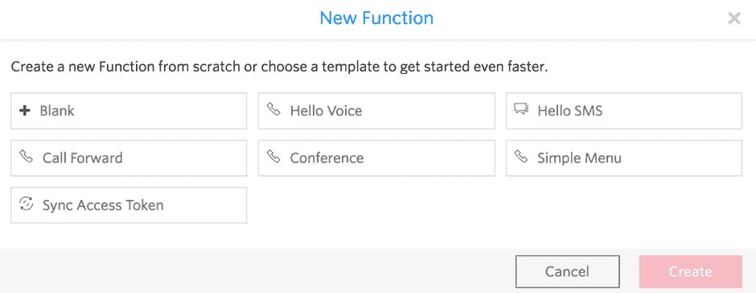
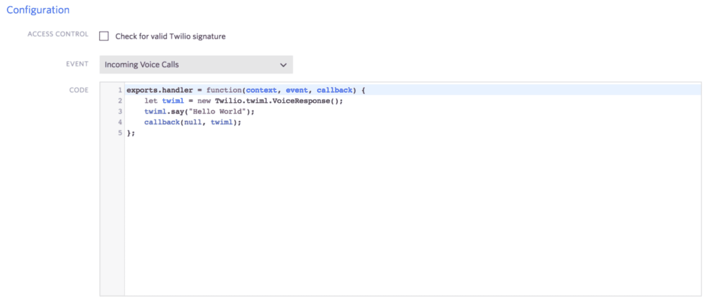
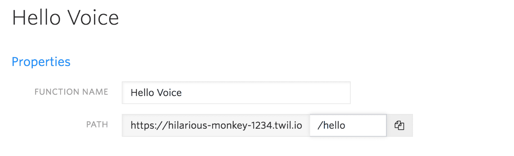

# Twilio 预览了一个名为 Functions 的无服务器功能，用于管理消息应用

> 原文：<https://thenewstack.io/twilio-functions-show-serverless-useful-model/>

Twilio 推出了一项名为 [Functions、](https://www.twilio.com/functions)的预览服务，开发人员可以在 Twilio 运行时控制台中编写和运行无服务器代码，从而对如何管理 Twilio API 驱动的消息应用程序有更多的控制权。这个预先配置的环境有助手库、API 密钥、资产存储和调试工具，可以在 Twilio web 门户中访问它们。

“我们构建函数的主要原因是为了提高开发速度，这样你就不需要考虑‘我如何扩展 web 基础设施？’" Twilio 消息总经理 [Patrick Malatack](https://github.com/pmala5) 告诉新堆栈. "现在您不需要考虑扩展，只需将它部署到 Twilio 即可。我们将所有操作系统、所有硬件和所有基础设施抽象化，让您专注于自己的代码。"

Twilio Functions 并不打算与通用的无服务器环境竞争，比如 [Azure Functions](https://azure.microsoft.com/en-us/services/functions/) 或 [AWS Lambda](https://aws.amazon.com/lambda/) 。事实上，它运行在 Lambda 上。相反，它可以帮助开发人员更好地扩展和管理他们基于 Twilio 的消息应用程序。

一段时间以来，Twilio 已经有了一个基于 web 的 GUI，用于让非开发人员创建小型语音和短信应用程序(称为 [Twimlets](https://www.twilio.com/labs/twimlets) )。您可以在 Twilio 门户中创建 [TwiML](https://www.twilio.com/docs/api/twiml) (Twilio 标记语言)应用程序和 TwiML 库来存储处理来电事件的代码。

通常，使用 Twilio APIs 构建应用程序的第一步是建立一个公共 web 服务器来接收 webhooks，这些 API 用于连接到远程软件，并管理认证和访问令牌以安全地做到这一点。这是您在原型开发和应用程序开发时需要解决的另一个问题，当您将应用程序投入生产时，您需要确保服务器能够扩展以满足需求。

函数消除了对服务器的需求，消除了另一个可能出错的地方。它允许开发人员使用带有预写代码和配置的模板，或者编写 Node.js 代码。有一些模板可以处理常见的模式，如呼叫转移、设置会议或为 Twilio 的同步服务创建访问令牌，还有更多正在开发中。

从模板或使用自己的 node.js 代码创建新的 Twilio 函数。

马拉塔克告诉我们:“我对我所有计算机状态和功能使用同步，我可以在 Twilio 上构建任何通信体验。

从其中一个模板开始，代码编辑窗口已经预填充了代码，包括从函数配置传入的凭据和环境变量(存储为键-值对)、从您正在使用的 Twilio API 传入的事件信息(使用 GET 和 POST)以及您调用以从函数返回的回调方法(可以是 TwiML、JavaScript、字符串，或者您用来指示错误的字符串)。

您可以使用 Twilio Node helper 库来生成 TwiML，以便以编程方式处理语音和消息事件，并且您可以获得已经在 Twilio 运行时中存在了几年的调试器支持。“Twilio 应用程序正在生成的所有 webhooks 有时他们会攻击一个关闭的服务器，所以你需要能够调试它。函数具有调试器支持，所以您可以看到我的代码发生了什么，哪里出错了？”马拉塔克说。

函数也可以自动缩放。一个用户每月可以获得 10，000 次免费的函数调用，超过这一次数，每次调用的费用为 0.0001 美元——一旦函数超出预览范围，就可以进行批量定价。您还可以在 Twilio Assets 服务中为您的应用程序存储任意内容。

Functions 覆盖了所有的 Twilio APIs，开发者可以使用内置的 [got 模块](https://github.com/sindresorhus/got)来处理第三方 REST APIs。马拉塔克解释说，这不是功能的重点，所以体验是相当基本的。“我们的重点是让它成为 Twilio 的最佳建设之地。但如果你想让一个 Stripe webhook 实现 Twilio 功能，从技术上来说这是可行的，我们没有理由不支持。”

您可以将您的函数与 Twilio 网络门户中的 Twilio 电话号码挂钩，也可以使用控制台中显示的 URL 来调用您的函数。有一个方便的复制按钮，可以让你在网页中测试你的功能。

Twilio 控制台中的功能代码。

目前，你在浏览器中使用 Twilio 函数，而不是 IDE“我们正在思考如何与您现有的工具链集成，”Malatack 告诉我们，因此随着功能的成熟，我们希望看到从其他开发工具构建、测试和部署功能的方法。

## 消除干扰

[无服务器](/category/serverless/)编程模型是 webhooks 合乎逻辑的下一步，因为你可以在没有托管 web 服务的开销的情况下获得基于事件的编程，而且 Twilio 不是唯一一个接受这一想法的人。

MongoDB Atlas 的新 [MongoDB Stitch](https://thenewstack.io/stitch-sews-together-third-party-backend-services-mongodb/) 服务被称为后端即服务，但你可以获得处理身份验证、数据访问控制以及与通信、消息和支付 API(包括 Twilio 的)集成的管道，而无需在这些任务的编码和基础设施上花费太多时间。

如果你正在编写一个软件即服务应用程序，你希望客户能够扩展自己，Auth0 的扩展服务为你提供了一个 React 嵌入式代码编辑器，让客户创建无服务器的 node.js 扩展。类似地， [Zapier 的开发人员 CLI 工具](https://github.com/zapier/zapier-platform-cli#getting-started)允许您编写、测试和部署 Node.js 应用程序，作为 Zapier 集成流程的一部分，如果您正在集成的 API 的输入和输出需要一定量的处理或调整；同样，它使用 AWS Lambda 来运行您的[定制代码](https://zapier.com/engineering/behind-the-cli/)。

Twilio Functions 表明，serverless 既是一种服务，也是一种编程风格，您可以期望看到运行函数的选项，而不必关心在更多地方作为选项出现的基础结构。

每个 Twilio 函数都有一个完全限定的 URL，可以用来调用它。

马拉塔克指出:“想想那些花费在不是你的代码和你想要的体验的事情上的所有时间和努力。”“我们看到我们现在拥有的惊人用户体验的部分原因是抽象变得越来越好，所以你可以花更多的时间在'我想要的正确结果是什么'上，而不是我在实现这个目标的过程中需要做的所有事情。”

由 [Shwetha Shankar](https://unsplash.com/@shwetha) 通过 [Unsplash](https://unsplash.com/?photo=9Q7PqDxCZeQ) 拍摄的特写图片。

<svg xmlns:xlink="http://www.w3.org/1999/xlink" viewBox="0 0 68 31" version="1.1"><title>Group</title> <desc>Created with Sketch.</desc></svg>