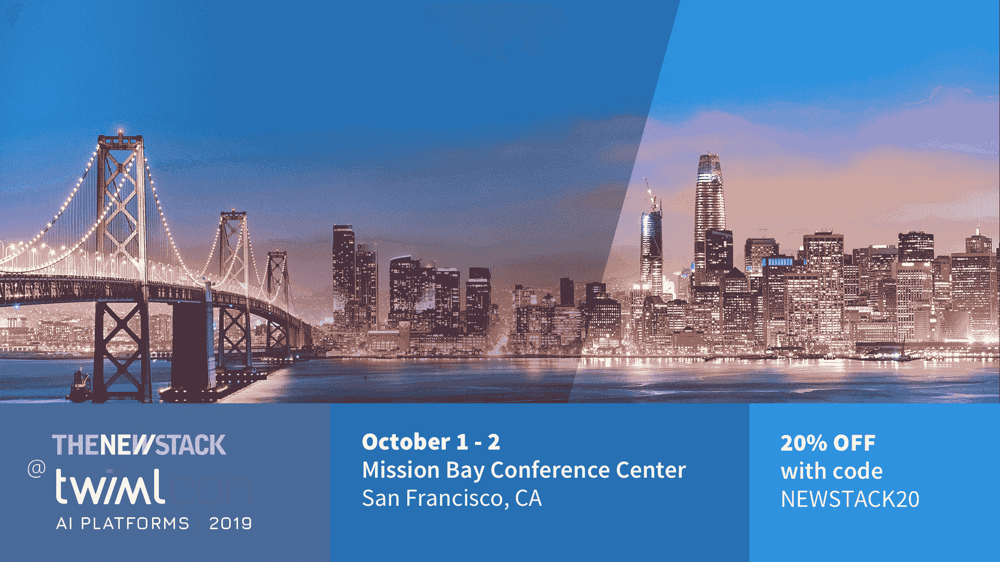

# TWIMLcon:帮助企业采用机器学习的新会议

> 原文：<https://thenewstack.io/twimlcon-a-new-conference-to-help-the-enterprise-adopt-machine-learning/>

在这一集的 New Stack Makers 播客中，TNS 创始人兼出版商 Alex Williams 在本周的机器学习人工智能播客中采访了山姆·查林顿，他是 T2 的创始人。他们讨论了 10 月 1 日至 2 日在加利福尼亚州圣地亚哥的 Mission Bay 会议中心举行的 Charrington 首届 [TWIMLcon](https://twimlcon.com) 会议。

TWIMLcon 源于查林顿与企业的对话，旨在为人工智能和人工智能活动带来全新的视角。他说，公司“往往处于一个非常有趣的转变点”，并指出他在去年年底听说他们“启动了许多机器学习概念验证类型的项目，他们取得了一些初步成功，他们的数据科学团队正在四处宣传，其中一些概念验证开始成熟[……]所以突然之间，这些组织面临着从“我如何成功执行个人机器学习项目”到“我如何成为在我的组织中提供机器学习的引擎”的转变挑战"

在开始 TWIML 播客后，查林顿发现，其他人工智能和人工智能会议的焦点往往是高级业务用例，或者建模和构建算法，但没有多少关于如何有效地建立模型和组织的对话。因此，TWIMLcon 的出现填补了这一空白。

[本周机器学习& AI 介绍 TWIMLcon 大会](https://thenewstack.simplecast.com/episodes/this-week-in-machine-learning-ai-introduces-the-twimlcon-conference)

TWIML 最近还出版了一本电子书,探索人工智能和人工智能中的低效之处，查林顿说它将这些分成三大类:数据访问和管理，实验管理和模型开发，以及模型部署和监控。“在这三个领域中，有很多潜在的问题和可能导致效率低下的地方。因为这个过程是高度迭代的，不仅仅是模型构建和事件实验，所有这些都是循环内的事情。查林顿解释说:“任何提高效率的投资都会让整个过程变得更加顺畅，并有助于组织扩大其推出模型的能力。

当被问及技术堆栈如何继续发展时，查林顿接着强调了 Comcast 软件工程总监 Leemay Nassery 即将在 TWIMLcon 上进行的演讲。作为 TWIML 播客的嘉宾，Nassery 谈到，“Comcast 如何从一个传统的单一推荐系统转变为一个基于无服务器、无数据转换和模型推理的系统，该系统无法真正满足他们的业务需求。”现在，这家有线电视巨头有了一个基于 Tensorflow 生态系统的推理堆栈， [TensorFlow 服务于](https://www.tensorflow.org/tfx/guide/serving)。

“这只是组织在试图解决这一问题时正在进行的各种转变的一个例子。这对很多人来说都是新的，技术发展非常非常快，”查林顿说。

新堆栈的读者可以通过在注册页面的[上输入代码 **thenewstack** 来获得 TWIMLcon 早鸟注册 20%的折扣。早鸟价格截止到 9 月 6 日。](https://twimlcon.com/register/)

### 在这个版本中:

[5:57:](https://thenewstack.simplecast.com/episodes/this-week-in-machine-learning-ai-introduces-the-twimlcon-conference?t=5:57) 这些差距是什么，您希望在大会上讨论什么？
[8:54:](https://thenewstack.simplecast.com/episodes/this-week-in-machine-learning-ai-introduces-the-twimlcon-conference?t=8:54)devo PS、数据科学和 AI 之间的相似之处& ML
[14:06:](https://thenewstack.simplecast.com/episodes/this-week-in-machine-learning-ai-introduces-the-twimlcon-conference?t=14:06) 他们是否也会关注整体技术体系的变化？
[17:43:](https://thenewstack.simplecast.com/episodes/this-week-in-machine-learning-ai-introduces-the-twimlcon-conference?t=17:43) 模型的数据存储和管理
[21:06:](https://thenewstack.simplecast.com/episodes/this-week-in-machine-learning-ai-introduces-the-twimlcon-conference?t=21:06)Kubernetes 在其中扮演什么角色？关于这次会议，你还有什么要说的吗？

<svg xmlns:xlink="http://www.w3.org/1999/xlink" viewBox="0 0 68 31" version="1.1"><title>Group</title> <desc>Created with Sketch.</desc></svg>