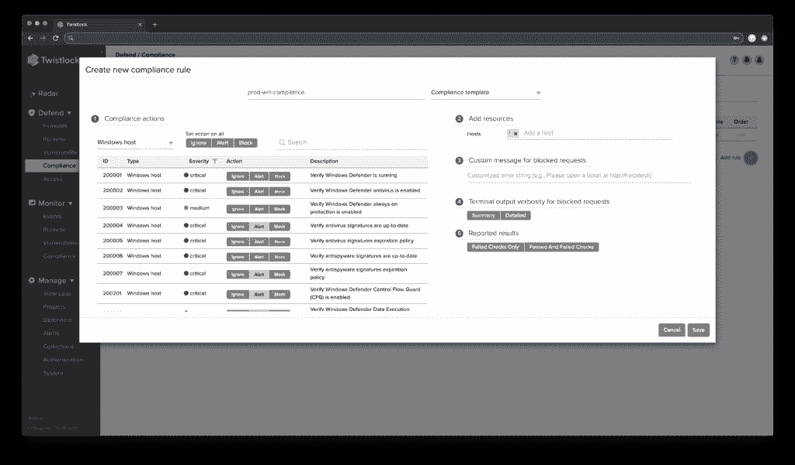
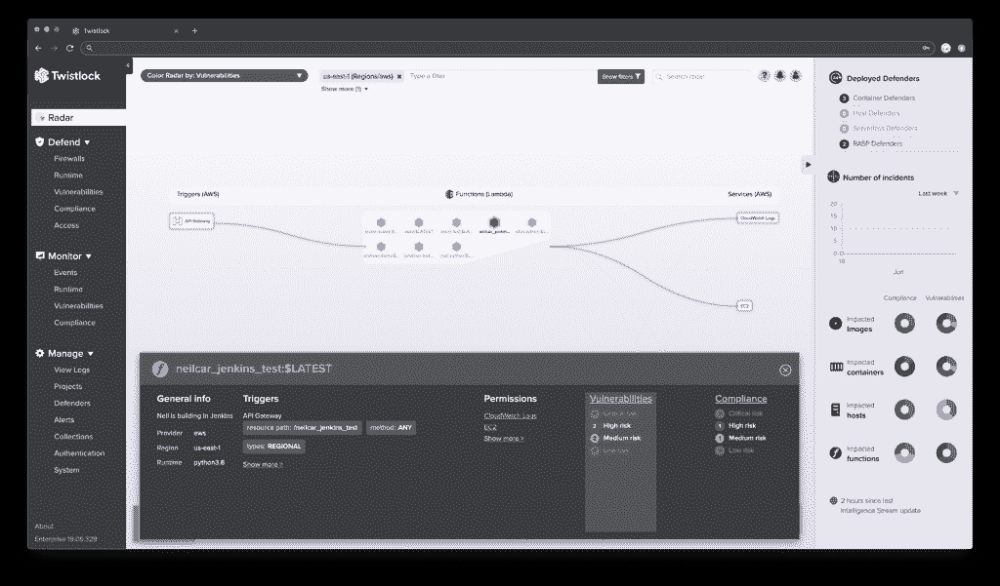

# Twistlock 19.07 建立在自动化、可见性和预防的基础上

> 原文：<https://thenewstack.io/twistlock-19-07-builds-on-automation-visibility-prevention/>

云原生安全提供商 [Twistlock](https://www.paloaltonetworks.com/prisma/cloud) 发布了其以云为中心的安全平台的最新版本，在本周于波士顿举行的 [AWS re:Inforce](https://reinforce.awsevents.com/) 云安全会议上首次亮相。

像本周大会上的许多会议和演讲一样，Twistlock 19.07 专注于无服务器、容器和云原生计算领域，尽管该公司在此次发布后的去向仍未确定。上个月末，企业安全提供商[帕洛阿尔托网络](https://www.paloaltonetworks.com/)宣布其[打算以大约 4 . 1 亿美元收购 Twistlock](https://www.paloaltonetworks.com/company/press/2019/palo-alto-networks-announces-intent-to-acquire-two-companies-to-extend-its-cloud-security-leadership) 以及无服务器安全提供商 [PureSec](https://www.puresec.io/) 。尽管如此，Palo Alto Networks 和 Twistlock 都在大会上有自己的展位，Twistlock 在这里谈论自 2015 年首次推出以来取得的持续进步。

除了收购之外，Twistlock 19.07 分为六个不同的平台更新，twist lock CTO[John Morello](https://www.linkedin.com/in/john-morello/)将该版本描述为建立在三个关键领域的基础上，并提供了该版本的快速总结。

“19.07 建立在我们的自动化、可见性和预防支柱之上，”Morello 说。他解释说，新版本的可信映像和云本地网络防火墙可以自动学习终端用户环境中正常的良好基线和行为，并自动防止异常。Radar 帮助用户概念化复杂的技术堆栈并可视化其中的风险。他总结说，取证技术的更新提供了对违规之前、期间和之后事件的清晰了解，并与运行时防御相结合，以防止这些违规事件的发生。

在与新堆栈的采访中，Twistlock 高级产品营销经理 [Keith Mokris](https://www.linkedin.com/in/keithmokris/) 进一步确定了 19.07 的意图，在每个功能更新和发布的演练中提供了一些见解。

“在 19.07 中，我们真的希望为主机、容器和无服务器提供完整的安全性，因为我们看到许多客户使用各种计算选项的组合来运行他们的云原生工作负载和应用程序，”Mokris 说。“我们一直致力于并继续致力于完整的生命周期，在构建、注册和生产阶段进行集成，Twistlock 190.7 确实在所有这些不同领域的少数功能上进行了改进。”

下面是对 Twistlock 19.07 新特性的深入分析。

## 云本机防火墙

Twistlock 的云原生网络防火墙(CNNF)自 2017 年以来一直在[左右，随着版本 3 的推出，引入了几个新功能。](https://www.twistlock.com/2017/09/19/announcing-twistlock-2-2-ga-release-notes/)

“CNNF 是我们的第四层防火墙，它可以自动学习您的网络拓扑结构，从本质上隔离主机到主机、单元到单元或容器到容器的流量。对于大规模利用 docker 和 Kubernetes 的组织来说，这无疑是一个巨大的挑战。“您如何专门为这些大型云原生环境保护和提供微分段？您当然希望保护您的外围环境，但是您也希望保护您的应用程序及其所有各种连接的组件。”

CNNF 现在提供了学习和管理配置连接的雷达可视化，以及学习和管理配置的所有连接规则的组合策略视图。

除了这些新的可见性增强，CNNF v3 还提供了导入和导出规则的能力，以及跨规则创建、命名和重用外部网络对象的能力。

## 辩论术

“取证建立在我们已经发布的几个我们称之为‘飞行数据记录器’的概念上。”当安全事故发生时，我们不断假脱机收集数据。“这真的有助于安全架构师、事件响应者或 SOC 团队成员识别在异常事件或危害中发生了什么，”Mokris 说我们使用 Twistlock 1907 所做的事情之一，不仅仅是像过去一样呈现事件周围的所有事情——杀戮链、事件类型或原始法医数据转储——我们实际上提供了一个时间轴视图，以便您可以选择不同类型的数据，并以非常酷的格式随时查看。"

Forensics v2 扩大了监控数据的范围，现在包括有关主机硬件(或虚拟硬件)、操作系统、容器运行时环境和容器本身的详细信息，包括映像运行及其运行时模型。正如 Mokris 指出的，取证的一个新的核心特性是基于时间轴的数据视图，这使得可视化和跳转到相关事件变得更加容易

## 无服务器雷达

Twistlock 19.07 引入了无服务器雷达，提供了对无服务器环境的可见性，这在这方面通常是缺乏的。Mokris 解释说，虽然已经为主机和容器提供了这种可见性，但是对无服务器功能的可见性需要一种稍微不同的方法。

“无服务器安全是不同的，因为您需要构建一个新的体系结构来扫描功能，以识别漏洞和合规性问题。扫描代码是不同的，因为你不能像对虚拟机或普通容器化堆栈那样，在运行无服务器工作负载的主机上运行任何类型的代理，”Mokris 说。因此，你需要一种新的方法来在运行时部署任何种类的安全协议。从框架的角度来看，无服务器功能的寿命非常短，所以这也是一个挑战。它仍然是这种云原生范式的一部分，但肯定有一些关于无服务器的新思路。”

根据发布说明，无服务器雷达“使用现有的提供商 API 来发现每个功能的调用方法以及它们与之通信的服务，并在三窗格视图中绘制它们，”显示调用方法，根据漏洞、合规性和运行时状态进行颜色编码的功能，以及这些功能与之通信的后端服务，如亚马逊网络服务的 S3。

## 可信图像

4 月下旬，Docker Hub 容器映像库[被黑](https://thenewstack.io/the-docker-hub-hack-the-quick-fix-and-the-long-term-questions/)，泄露了近 20 万个账户。随着 Twistlock 19.07 的推出，可信映像版本 2 将进一步保护组织免受此类攻击。

“组织目前面临的挑战之一是如何保护他们的开发管道。安全团队可能承担保护云原生环境的任务，他们并不总是知道用于构建在该环境中运行的容器的映像的来源。另一个挑战是，即使是开发人员也可能不知道他们拥有的所有构建模块，因为他们是一层一层地构建他们的容器映像的，”Mokris 解释道。“受信任的图像允许组织指定一个被认为可信的特定注册表或存储库，然后对来自外部位置的图像发出警报或进行阻止。它可以防止开发人员到 Docker Hub 下载映像，这些映像将在需要合规的环境中运行，或者在生产环境中运行，并且具有非常严格的漏洞标准。”

除了允许用户创建自己的规则之外，Trusted Images version 2 还通过检查所有已在使用的映像的来源，确保未来版本将被允许，并确保只使用可信来源(无论是内部还是外部)来自动学习和创建灵活的、基于规则的策略。

## 云平台雷达

使用最初于 2018 年发布的云发现[开源项目](https://github.com/twistlock/cloud-discovery)，Twistlock 的云平台雷达旨在让组织了解他们有时蔓延的多云环境。莫克里斯解释说，你无法保护你不知道的东西，所以云平台雷达让你确切地看到你在运行什么，在哪里。

“许多安全团队面临的挑战是识别组织中使用的所有云原生服务。我们将所有这些不同的服务公之于众，提供一些关于它们的数据，然后根据你是否部署了 Twistlock 来判断它们是否安全。“我们正在添加这种新型雷达，在全球地图上显示受保护或不受保护的状态。这是直观查看所有这些服务的位置、它们运行在什么公共云上，以及每个节点运行在什么区域或什么位置的另一种简单方法。”

与 Twistlock 上的所有雷达一样，云平台雷达也允许用户使用各种过滤器来定制显示的信息。

## Windows 支持

最后，Twistlock 19.07 在注意到操作系统在云原生环境中的使用增加后，致力于更深入地支持 Windows。

“许多客户在云原生基础架构上重新设计和运行应用程序，Windows 是这些场景的一部分。因此，我们改进并增加了所有现有的 Windows 功能，集成了一些现有的 Windows 功能，以提供有关自动更新、Windows 防火墙和 Windows Defender 配置的合规性检查。有些人想在 Windows 上运行 Jenkins，因为他们已经习惯了，所以我们现在支持这样做。”

有了这个最新的更新，Windows 用户现在可以享受 CNNF 的生产版本，对 Windows 的合规性检查包括自动更新，Windows 防火墙和 Windows Defender 配置，对 Jenkins 的支持，对 Windows 漏洞的增强风险评分，以及 Windows Server 2019 支持。

<svg xmlns:xlink="http://www.w3.org/1999/xlink" viewBox="0 0 68 31" version="1.1"><title>Group</title> <desc>Created with Sketch.</desc></svg>