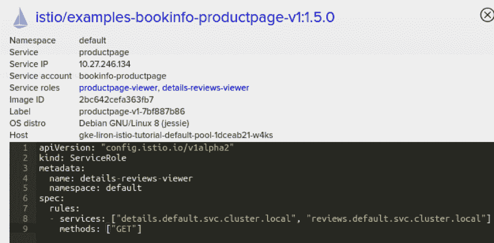

# Twistlock 使 Istio 的安全层更加强大，更易于监控

> 原文：<https://thenewstack.io/twistlock-makes-istios-security-layer-more-robust-easier-to-monitor/>

 [李龙·莱文

李龙·莱文博士是 Twistlock 公司的首席软件架构师。在加入 Twistlock 之前，Levin 在微软担任技术主管，参与了各种面向研究的项目。他拥有本古里安大学的通信系统工程博士学位。](https://www.paloaltonetworks.com/prisma/cloud) 

Istio 已经成为一个受欢迎和可靠的服务网格管理平台，可以更轻松地跨云部署部署、操作和扩展微服务。作为保护这些服务网格的一种方式，Twistlock 已经与 Istio 集成，以丰富平台的机器学习能力，实现连接。Twistlock 通过使用 Twistlock 数据来隔离受损的服务，并提供合规性策略来实施安全配置和 Istio 运行的堆栈的其余部分。

随着云原生成为构建和运行现代 web 级应用的默认方式，组织需要越来越复杂的工具来将底层复杂性从正常操作中抽象出来。Kubernetes 是编排军备竞赛的明显赢家，并抽象出了管理大型计算节点机群的复杂性。然而，随着 Kubernetes 支持更大规模的部署，它可以受益于一项配套技术，该技术利用其平台级原语来简化大型服务组合的管理。

例如，Kubernetes 使您可以轻松部署一个跨 1，000 个节点的集群扩展并处理部署和节点故障的应用程序。但是，路由该服务的流量、监控服务的整体健康状况(不仅仅是单个节点和单元)以及确保该服务和群集中其他服务之间的公平资源分配可能会很复杂。

 [约翰·莫雷罗

Morello 是 Twistlock 的首席技术官，领导该公司与战略客户和合作伙伴的合作，并推动其产品路线图。此前，他是财富 500 强全球化学公司雅宝的 CISO。他在微软的咨询服务和产品团队工作了 14 年。他负责在 Windows、Azure 和 Office 365 中发布安全技术的功能团队，并担任美国混合云咨询团队的首席架构师。他与妻子和两个年幼的儿子住在路易斯安那州。作为一名热情的渔夫和潜水者，他也是恢复路易斯安那海岸联盟的主席。](https://www.paloaltonetworks.com/prisma/cloud) 

Istio 是一个旨在补充 Kubernetes(和微服务平台)并提供上述功能的项目。更具体地说，Istio 旨在为微服务提供流量管理、服务身份、管理策略执行和遥测。

Istio 是围绕由云本地计算基金会 (CNCF)托管的开源[特使代理](https://www.envoyproxy.io/) [构建的。Istio 建立在现有 Kubernetes 功能的基础上，使部署变得熟悉和集成，同时提供 Kubernetes 更关注基础设施以外的各种增值服务。](https://www.cncf.io/blog/2017/09/13/cncf-hosts-envoy/)

在过去的几个月里，我们的客户越来越多地询问 Twistlock 对 Istio 的计划，今天我们很高兴分享这些细节。Istio 是一个复杂的平台，具有多样化的配置选项和安全设置，当试图处理所有细节时，很容易迷失方向。

虽然开始运行 Istio 很简单，但我们重点加强的领域是了解流量、实施安全最佳实践，以及(可能是最重要的)利用 Istio 的功能来提高应用的安全性。

## 示例场景

为了探索 Twistlock 提供的新安全特性，我们将使用常见的 Bookinfo 示例应用程序。如指南中所述，该应用由多个互连的微服务组成:

*   产品页面微服务调用详情和点评微服务填充页面；
*   details 微服务包含图书信息；
*   点评微服务包含书评。它也称收视率为微服务；
*   ratings 微服务包含伴随书评的图书排名信息。

应用程序的拓扑结构如下所示:

## 可视化和控制雷达上的组织

我们认识到客户使用 Istio 的第一个挑战是能够可视化服务的拓扑结构。虽然 Twistlock 长期以来一直提供雷达视图，以提供整个集装箱化环境的实时视图，但 Istio 允许我们使用更多特定于应用程序的知识和深度来进一步扩充这些数据。

Istio 的主要安全优势之一是对网络策略的严格控制，即严格控制实体之间的通信协议和连接。为此，建议在 Istio 中启用服务级访问控制。将此功能与 Twistlock 一起使用时，您可以直接在 Radar 的可视画布中获得对网络拓扑的完全可见性和控制。

例如，在 Bookinfo 示例中,“productpage”服务接收一个绑定到“productpage-viewer”和“details-reviews-viewer”服务角色的“product-viewer”角色。

第一个角色表示所有用户都可以访问产品页面，而第二个角色是为产品页面显式设置的，只允许它访问详细信息和评论服务。

Twistlock 自动注册整个配置，以便动态更新并注释到每个服务的雷达画布上:

此外，当单击服务角色时，您可以深入查看每个服务角色的详细信息:

使用 Twistlock，我们可以编辑和管理与给定实体相关联的所有安全设置，并查看那些反映在 Istio 的托管服务网状拓扑中的更改。

## 利用 Istio 进行运行时隔离

我们还将我们的运行时防御传感器与 Istio 相集成，通过分析跨实体的允许连接和基础设施元数据，在上层拓扑上添加深度安全智能。使用这些数据，我们根据网络元数据和观察到的行为异常来报告和隔离实体。

例如，在 Bookinfo 应用程序中，如果攻击者成功地在“productpage”服务上实现远程代码执行，并从那里尝试访问“ratings”服务，会发生什么？从技术上来说，如果所有网格规则都配置正确，Istio 网络策略可以阻止连接，但您仍然需要检测和警告危害，这是通过 CNNF(我们的第 3 层云本地网络防火墙)与 Istio 的集成实现的:

当然，这些网络违规也会在 Radar 中报告和显示:

这个流程使 Twistlock 能够应用我们的 ML 驱动的行为建模来自动检测异常，然后将响应卸载给 Istio 以隔离受损的服务。

例如，Twistlock 可以在检测到异常时隔离面向公众的 web 服务，方法是指示 Istio 断开该服务与后端支付数据库的连接。由于这种集成发生在服务网格层，Istio 可以在整个环境中立即优雅地实施，而无需更改 IP 路由或手动重新配置端口。

## Istio 合规性

最后，我们的 Twistlock 实验室研究团队为 Istio 开发了一套新的合规性检查。这些合规性检查符合 Istio 项目和社区的现有最佳实践，例如确保在生产命名空间中启用相互 TLS，以及启用严格的基于角色的访问控制。这些合规性策略符合 Twistlock 现有的合规性功能，包括根据不合规情况发出警报和进行阻止的能力，以及在合规性浏览器仪表板中实时查看全局状态的能力。

## 摘要

随着客户部署和运行更复杂的云原生应用，Istio 等平台补充了 Docker 和 Kubernetes 中的现有功能，为每位客户提供全球规模的工具。Twistlock 为 Istio 添加了一个安全层，并利用它来扩展整个服务网络的安全性，从而有助于扩展这一范围。

[Twistlock](https://www.paloaltonetworks.com/prisma/cloud) 是新堆栈的赞助商。

通过 Pixabay 的特征图像。

<svg xmlns:xlink="http://www.w3.org/1999/xlink" viewBox="0 0 68 31" version="1.1"><title>Group</title> <desc>Created with Sketch.</desc></svg>