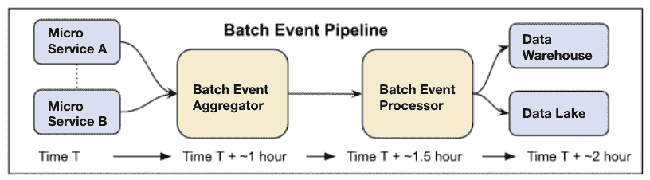
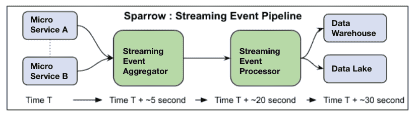

# Twitter 转向谷歌云进行实时数据流分析

> 原文：<https://thenewstack.io/twitter-turns-to-google-cloud-for-real-time-data-stream-analysis/>

每当有人在 Twitter 上采取行动，小到点击或滚动，大到注册或发微博，Twitter 都会记录下来。

因此，社交媒体服务产生了大量的数据——“每天有数万个节点、数百 Pb 和数万亿个事件，”Daniel Templeton 在他最近的[博客文章](https://blog.twitter.com/engineering/en_us/topics/infrastructure/2022/twitter-sparrow-tackles-data-storage-challenges-of-scale)中写道。邓普顿说，工程师和数据科学家希望将每一条用户数据转化为洞察力，这可能会使“平台成为终端客户的更好去处”。

令人惊讶的是，迄今为止，该公司主要使用批处理系统对数据进行第一次处理。但是，一个诞生于内部黑客应用程序的新公司倡议， [Twitter Sparrow](https://ieeexplore.ieee.org/document/9671438) 减少了用户数据到达 Twitter 数据科学工程师手中的时间——从几小时减少到几分钟甚至几秒钟——并允许实时数据传输以供研究和评估。以前，这些数据在批处理系统中发送，优先考虑吞吐量并牺牲延迟。

支持流媒体的基础设施在很大程度上建立在谷歌云之上。“这种规模的流媒体第一架构推动了谷歌云的可能性，”邓普顿说。

## **之前叽叽喳喳的麻雀**

在 Twitter Sparrow 之前，日志摄取管道工作流包括一个批处理系统，导致数据科学工程师要等待几个小时才能获得新的客户事件数据。该模型针对吞吐量而非延迟进行了优化。

管道本身保存了通过各种服务(包括网络和移动)连接到 Twitter 的数亿用户的迭代。邓普顿说，这是用户之间的互动、新注册、推文以及其间的一切被发送给数据科学家进行评估和研究的地方，这样他们就可以“更好地了解我们的客户并看到公共对话”。

随着公司需求和围绕 Twitter 的技术环境的不断变化，为了“以 Twitter 的速度前进”,实时数据交付成为一个优先事项。我们希望 Twitter 产品快速开发，快速理解事物，快速失败，如果有些东西不起作用，快速重申，”[Praveen Killamsetti](https://www.linkedin.com/in/praveenklm/)(Twitter 的软件工程师)说。

Sparrow 之前管道的可视化表示

## **输入麻雀**

Sparrow 最初是一个 [Twitter 黑客周](https://blog.twitter.com/en_us/a/2012/hack-week-twitter)项目。Sparrow 的工程师试图解决的最初挑战是(1)如何缩短日志管道中记录和交付数据所需的时间，以及(2)更有效地将分布在不同数据中心的数万个微服务生成的日志数据交付给分析师和工程师。

他们对如何做到这一点的看法包括用流技术重新设计批量摄取管道。流式数据管道使数据科学家能够实时访问新数据。对于历史数据处理，批处理数据可能更简单、更高效(例如，在更长的时间内运行报告)。因此，为了完全满足当前的需求，新的管道设计为包括批处理和实时流。

Twitter 工程师开发了一个流媒体事件聚合器，它从服务中收集日志事件，并将它们传递给一个消息队列，如 [Apache Kafka](https://thenewstack.io/apache-kafka-primer/) 或 [Google Pub/Sub](https://cloud.google.com/pubsub/docs/overview) 。然后，流式事件处理器使用 [Apache Beam](https://thenewstack.io/apache-beam-will-make-big-difference-organization/) 和 [Google Dataflow](https://cloud.google.com/dataflow) 从消息队列中读取事件，应用转换或格式对话，并将事件流式传输到下游存储系统，如 Google [BigQuery](https://cloud.google.com/bigquery) 和 [Google Cloud Storage](https://cloud.google.com/storage) 。

新管道现在针对吞吐量和延迟进行了优化，并实时向 Twitter 的数据科学工程师提供数据进行评估，在某些情况下只需几秒钟。扩展新管道和所有支持基础设施的努力是巨大的，但似乎是值得的，因为 Twitter Sparrow 设定的最初目标已经实现。

Twitter 的数据科学社区现在可以回答他们以前不能回答的问题。邓普顿的文章中列出的一个具体例子是实时分析 Twitter 的用户行为，这对该公司来说是绝对必要的，邓普顿说。

<svg xmlns:xlink="http://www.w3.org/1999/xlink" viewBox="0 0 68 31" version="1.1"><title>Group</title> <desc>Created with Sketch.</desc></svg>