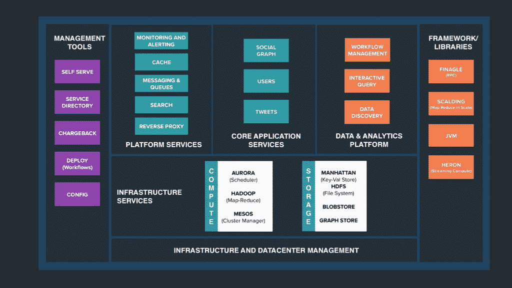
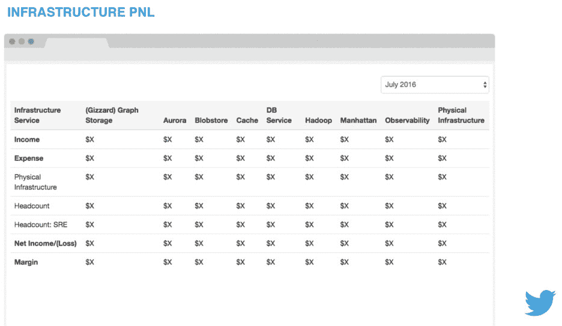
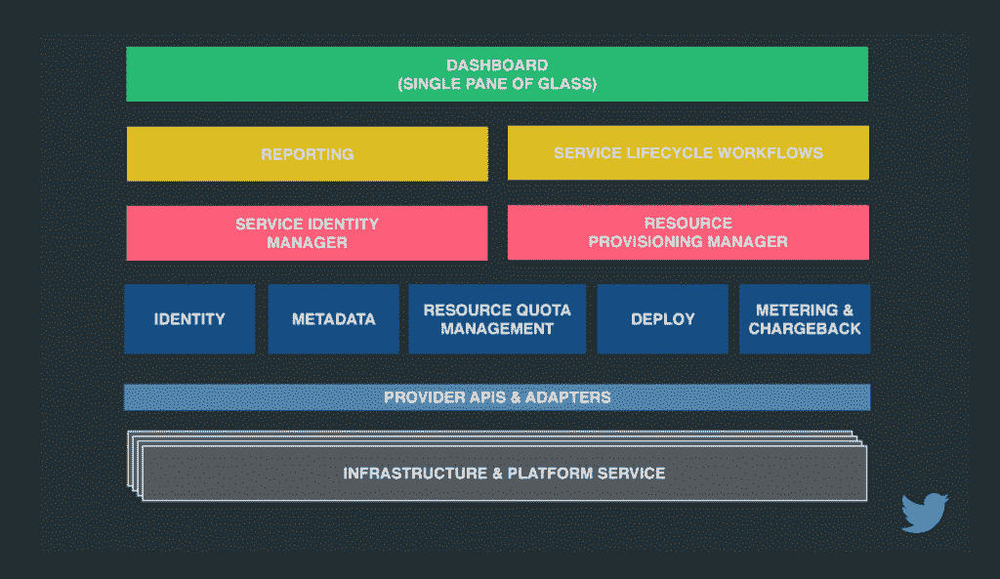

# Twitter 的 IT 计费系统为端到端服务生命周期管理奠定了基础

> 原文：<https://thenewstack.io/twitters-chargeback-system-sets-stage-service-lifecycle-management/>

Twitter 发现相信老记者的格言“跟着钱走”是有利可图的。

在转向基于微服务的服务架构后，该公司建立了一个按存储容量使用计费系统，让服务经理了解公司运行这些服务的成本，同时还为用于运行这些服务的基础架构的经理提供有价值的使用信息。结果是，计费系统正在帮助 Twitter 提高其基础设施的利用率和效率。

“当我们开始这项工作时，有很多人怀疑这将如何工作，”Twitter 云平台经理 [Micheal Benedict](https://twitter.com/micheal) 承认道，他[在上个月举行的 LinuxCon 北美 2016 会议上展示了](https://speakerdeck.com/vinucharanya/improving-efficiency-of-twitter-infrastructure-using-chargeback)该系统。Benedict 是平台工程团队的一员，负责构建构成 Twitter 的框架、库和服务。

自推出按存储容量使用计费系统以来，该公司的计算平台上使用的内核数量比保留的内核数量增加了 33%。随着时间的推移，计费系统将整合 Twitter 的所有计算资源。

该系统每月产生的反馈也激励工程师们使他们的系统更有效率。“工程师的自然反应是高效地构建服务，”Twitter 软件工程师解释道，他也做了演示。

除了对资源利用情况进行财务跟踪的直接效用之外，该系统还为云管理平台奠定了基础，该平台可用于在多个公共云和内部云上运行 Twitter 服务，该平台使用按存储容量使用计费设置的元数据将一切合理化并反馈给项目经理。

就新技术而言， [IT 退款](https://en.wikipedia.org/wiki/IT_chargeback_and_showback)并不性感。但是如果企业真的采用了[微服务](/category/microservices/)架构，那么每个部门级别的精确资源消耗计费将是必须的。Twitter 发现，这种紧密的会计核算也可能带来其他重大好处。

## Twitter 设备

Twitter 在 2010 年获得了微服务的信仰，不久前，西班牙赢得 2010 年世界杯后[的流量](https://blog.twitter.com/2010/another-big-record-part-deux)激增了 10 倍。

当时，Twitter 是建立在 Ruby on Rails 之上的，在高峰期，每秒可以发布 3200 条推文(只占今天 Twitter 流量的一小部分)。在世界杯活动的高峰期，该公司增加了更多的服务器，工程师们疯狂地调整 Ruby VM 和部署工具。尽管如此，该网站在激增期间还是多次宕机。

在随后的重新架构中，路由、表示和逻辑都彼此分离。Twitter 的不同功能被分离开来，每个服务都是独立的服务。

“我们建立了专注于 Twitter 产品特定方面的服务，”本尼迪克特说。总体而言，如今 Twitter 上有“成千上万”的服务在运行。

例如，网站上显示用户关注哪些用户的部分是一项独立的服务。这样，如果“谁关注谁去”部分关闭，整个网站不会受到影响。相反，只有该部分不可用。

Twitter 的工程副总裁克里斯·平克汉姆(Chris Pinkham)在 YouTube(T3)上的一次早期演示中解释说，就其本质而言，Twitter 的流量极其尖锐且不可预测，每当全球新闻事件发生时，流量就会激增，并被该服务的数亿用户讨论。平均每天，整个 Twitter 基础设施可能会产生超过 1 万亿笔交易，因为每个单独的交易(如发布一条推文)可能会导致多个内部系统交易。

为了运行这些服务，该公司为计算和存储资源维护了一套核心基础架构服务。在计算方面，有 Apache Hadoop 用于批量分析工作，还有 [Aurora](http://aurora.apache.org/) 和 Mesos 用于编排长期运行的服务。Mesos 用于主机管理，Aurora 用于作业调度。在存储方面，该公司使用 [Manhattan](https://blog.twitter.com/2014/manhattan-our-real-time-multi-tenant-distributed-database-for-twitter-scale) ，这是一种通用的低延迟、高吞吐量数据存储。

随着 Twitter 被整齐地划分为一组独立的服务，该公司的下一步是更好地了解每个服务使用了多少基础设施。

输入 IT 退款。Charanya 说，char Anya“跟踪每个工程团队的基础设施使用情况，并相应地向每个所有者收取使用费”。通过按存储容量使用计费，每个服务所有者都可以获得关于其服务消耗了多少基础架构资源的详细报告。

Charanya 说:“我们设想了一个单一的平台，供开发人员请求和管理他们所有的项目和基础设施标识符。该团队构建了一个平台，他们希望该平台将成为公司资源的真实来源，不仅允许开发人员采购资源，还可以处理其他职责，如服务对服务的认证。

Charanya 解释说，构建按存储容量使用计费的最初挑战是，没有一种基础架构资源是以一致的方式定义的，也没有多种方法来识别这些资源的用户。

Charanya 说，Twitter 需要四样东西来建立一个计费系统:

**服务身份**:跨基础设施标识服务的规范方式。集中式系统需要与创建和管理标识符的系统集成在一起。

**资源目录**:开发团队需要与基础设施团队合作来识别资源，这样它们就可以被发布并被开发人员使用。该小组还需要确定一段时间内运行资源的总拥有成本，建立可用于计算成本的实体模型。

**计量**:一种通过服务标识符跟踪每种资源使用情况的方法，所有结果通过标准的提取、转换和加载(ETL)管道发送到一个中心位置，因此使用数量被收集然后合并。

**服务元数据**:跟踪服务和其他元数据。

基础设施提供者被给予接口和 API 来将他们的资源挂钩。因此，对于开发人员来说，该系统可用于请求 Hadoop 服务或管理存储，这种计费系统将提供接口。

确定资源的成本尤其具有挑战性。Charanya 说，该系统从裸机服务器“自下而上”计算价格。随着时间的推移，价格也会随着原材料价格的变化而变化，比如存储。

例如，每天服务器的成本包括所有资本支出(capex)和运营支出(opex ),包括机器成本、任何专有软件的许可成本、扩展空间或预留容量、低效率以及操作这些服务器的人力成本。

确定了每天服务器的价格后，团队就可以逐步计算其他更复杂资源的价格，比如 Aurora 或 Hadoop。然后，系统可以为每个工程团队创建报告，显示使用情况。

一些基础架构资源比其他资源更难监控。Aurora 可能只有少量指标，如 CPU、GPU、内存使用情况，而 Manhattan 有一组更大的“产品”，包括附加配置，如集群、机器。

总体而言，该团队为九项基础设施服务建立了 500 项指标。迄今为止，收集这些数据已经在 Vertica 数据库中生成了大约 1 亿行。

## 退款的未来

在每个月的第一天，计费所覆盖的每个 Twitter 工程团队都会收到一份计费报告。该报告包括团队项目正在使用的所有基础设施服务的列表。这些报告包括使用这些基础设施工具的估计成本。

按存储容量使用计费系统还向基础架构经理提供损益(P&L)报告，包括利润率。“我们的目标是零利润。我们不希望任何人有盈利或亏损，”本尼迪克特说。

本尼迪克特说，PNL 的声明提供了一些关于基础设施正在发生什么的良好信号。例如，Twitter 可以判断基础设施团队是否做了一些优化，允许更多人使用相同的容量，这将导致“利润”的提升。在这些情况下，本尼迪克特的团队可以向下调整单位成本，将节省下来的成本转嫁给消费者。

基础设施的“收入”是通过一系列步骤计算出来的。服务提供商在参与时，为计费系统定义基础架构资源在帮助运行该服务中扮演什么角色。团队映射回服务。本尼迪克特说:“对一个团队来说，扣款账单实质上变成了一笔开支。”。这个数字反过来又成为基础设施提供商的收入。

例如，服务器基础设施的大部分“收入”来自 Aurora 和 Mesos。Charanya 进一步解释说，这笔收入也是 Aurora/Mesos 团队的一项支出。Aurora/Mesos 团队可能会努力削减成本，而基础架构团队则努力提高效率。

该系统还为融资服务生成预算报告，该报告根据该预算验证自己的支出计算。

其他报告是为其他用户生成的:基础设施团队想要知道他们的顶级团队是谁，以及他们的资源被使用了多少。服务中心了解他们所依赖的服务，以及这些服务的使用量。高管们可以了解发展趋势，以及大型项目的进展情况。

这种按存储容量使用计费系统消除了基础架构所有者为自己的服务构建自助服务门户的需要。由于捕获了大量元数据，系统还应该能够提供关于基础架构资源延迟的报告。

## 超越退款

虽然按存储容量使用计费听起来更像是老派会计，而不是新的堆栈工程，但这一学科实际上可以为许多超大规模公司仍在努力展示的能力奠定基础。

例如，计费系统应该帮助 Twitter 开发一个端到端的服务生命周期管理流程。Benedict 说:“我们认为有必要将服务生命周期作为一个整体来管理。“我们希望人们能够以快速、简单的方式编写服务，获得相关资源，然后在服务的整个生命周期结束后启动、部署、监控和终止服务。”

有了服务生命周期管理，“每个工程师都可以去一个地方，查看他们拥有的服务和项目，请求资源，请求标识符来管理访问控制。我们还让他们查看他们的账单和使用报告，并最终促进部署，”本尼迪克特说。

计费系统和服务生命周期管理器也可以在开发代号为 Kite 的单一平台中发挥重要作用，该平台可以从多个公共云为服务构建者提供他们所需的资源，以及从一个中心位置提供内部资源。

Benedict 解释说，这样一个平台为开发者提供了对虚拟机等云服务的访问，并保持对单个云的不可知论。它还可以促进整个 twitter 项目的生命周期。

https://youtu.be/FU7wrqsRj3o

专题图片: [Micheal Benedict](https://twitter.com/micheal) 和 2016 年北美 LinuxCon。

<svg xmlns:xlink="http://www.w3.org/1999/xlink" viewBox="0 0 68 31" version="1.1"><title>Group</title> <desc>Created with Sketch.</desc></svg>