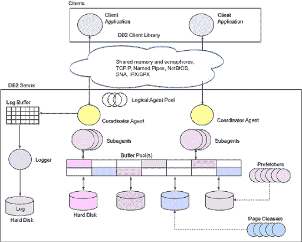
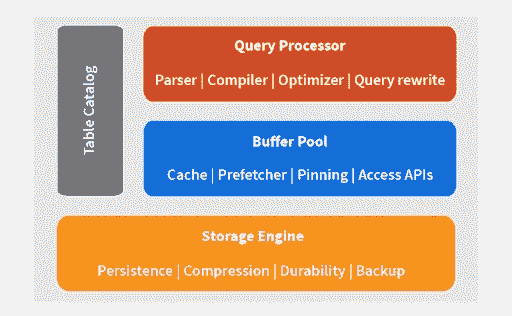
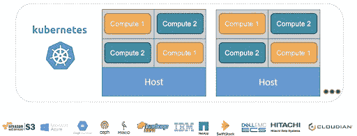
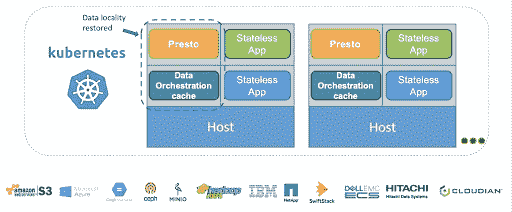

# 一个豆荚里的两颗豌豆:用开源软件编排您的云分析堆栈

> 原文：<https://thenewstack.io/two-peas-in-a-pod-orchestrate-your-cloud-analytics-stack-with-open-source/>

在过去几年中，容器在现实世界部署中的崛起是无可争议的。容器简化了在任何环境中运行的应用程序，Kubernetes 进一步改变了软件和应用程序的部署方式，并且与环境无关。事实上，Kubernetes 越来越被视为一项关键技术，它不仅可以在数据中心实现简单的资源编排，还可以在混合和多云环境中实现。虽然 containers 和 Kubernetes 对于 web 服务器等无状态应用程序，甚至是 mongoDB、Couchbase 等完全自包含的数据库都非常适用，但在高级分析和人工智能领域，堆栈看起来有点不同。让我们看一下堆栈是如何变化的，为什么它增加了在 K8s 集群中部署的复杂性，以及可以用来利用 Kubernetes 的能力来处理这些工作负载的方法。

### 分析堆栈的分解

分析堆栈中发生了什么变化？让我们回到 45 年前的 1974 年，IBM 实验室正在构建 System R——SEQUEL(结构化英语查询语言)的第一个实现，现在称为 SQL。该架构包括一个解析器、编译器、基本优化器、系统缓冲池和 RSS 研究存储系统。随着时间的推移，这个堆栈被称为关系数据库。

带有缓冲池的早期 DB2 内部架构

虽然自 1974 年以来，数据世界发生了很大变化，从系统变得更加分散到硬件变得更快，以及需要管理的数据越来越多，但旨在管理数据的核心概念并没有真正改变，只是堆栈变得越来越松散。历史上，数据库与构建在一起的所有核心组件紧密集成。Hadoop 改变了这一点。计算和存储仍在同一位置，但整个系统高度分布，而不是在一个或几个盒子里。

高级数据库/数据仓库架构

 [迪普蒂·博尔卡尔

Dipti Borkar 是 Alluxio 的产品和营销副总裁，在关系和非关系领域的数据和数据库技术方面拥有超过 15 年的经验。在加入 Alluxio 之前，Dipti 是 Kinetica 和 Couchbase 的产品营销副总裁。在 Couchbase，她担任过多个领导职位，包括全球技术销售主管和产品管理主管。在职业生涯的早期，Dipti 在 IBM DB2 管理开发团队，在那里她开始了数据库软件工程师的职业生涯。](https://twitter.com/dborkar) 

云改变了这一切。今天，像优步、推特、JD.com 和其他一些最具创新性的公司正在建立的数据堆栈是一个完全分解的堆栈。原始关系数据库管理系统的每个核心元素现在都是一个独立的层。存储引擎选项范围广泛，从 HDFS 到云对象存储，再到本地对象存储。表目录选择范围从 Hive Metastore on-premises 到 AWS 上的 AWS Glue。更多将会出现。这个缓冲池将越来越多地被称为数据编排。

当今的分类数据堆栈具有独立的计算层、数据编排层和存储层，可以横向扩展。

那么这对 Kubernetes 的部署有什么影响呢？对于不需要数据(无状态)并且像 mongoDB 和 mysql 等操作数据库一样完全预打包的自包含系统，按需扩展和编排要简单得多。这些数据库包括从查询引擎到存储层的所有内容。现代分析堆栈(现已分解)有许多不同的部分，需要放在一起并单独扩展。

## 分析堆栈“库伯内化”的挑战

 [马特·富勒

马特·富勒是 Presto 公司 Starburst 的联合创始人。此前，Matt 在过去 10 年中一直在数据仓库和分析领域担任工程职位，包括 Teradata 的工程总监，在那里他领导工程团队开发 Presto，并且是领导将开源(尤其是 Presto)引入 Teradata 产品的团队的一员。](https://www.starburstdata.com/leadership/) 

需要由查询引擎或模型进行分析的数据现在几乎无处不在，并且越来越多的数据在物理上孤立于不同的机架、不同的区域和不同的云中。因此，与数据仓库和 Hadoop 等传统数据平台不同，数据位于 K8s 集群之外。计算引擎(简称 compute)，无论是像 [Presto](http://prestodb.github.io/) (可以从任何数据源查询数据)这样强大的开源查询引擎，还是像 Tensorflow 或 Spark 这样的模型框架，都需要水平扩展，Kubernetes 通过增加或减少容器或 pod 来显著简化编排。

但我们来谈谈数据，如果数据不与 Kubernetes 中的计算位于同一位置，则需要远程访问(这意味着性能很差)或需要手动复制到 K8s 集群中(这意味着每个工作负载需要更多额外的开发操作和管理)。这通常会带来管理这些拷贝之间差异的负担，这可能很难做到。最好的解决方案是在这个分解的堆栈中重新创建数据局部性。此外，由于 K8s 集群中缺乏分布式数据层，因此没有一种简单的方法来跨作业共享数据或随着计算规模的增长在 Kubernetes 中弹性增长数据层，这是数据驱动型应用程序的关键要求。为了支持 Apache Spark、Presto、TensorFlow 等计算框架的弹性计算，数据也需要具有弹性。

## 计算和数据—一个豆荚里的两颗豌豆

为了解决数据局部性、数据共享和数据弹性挑战，像 Presto、data 和 compute 这样的计算框架需要放在同一个 pod 中，即 K8s pod。这可以通过数据编排技术来实现，该技术将数据从远程数据仓库移动到 K8s 集群，从而为每个工作人员/执行者带来更紧密的数据局部性。数据编排技术允许计算框架驱动所需的数据，然后将这些数据从底层数据仓库提取到 K8s 缓存中，并与底层系统保持同步。此外，随着 Presto 向上或向下扩展，计算友好型数据层也可以水平扩展，从而实现数据弹性。

通过数据编排技术将计算和数据放在同一个 pod 中，可以利用云和 Kubernetes 的灵活性来处理在分散堆栈中运行的分析工作负载。使用这种方法，用户可以转变他们的传统数据仓库方法，以构建基于 Presto 等开源技术的现代云原生数据堆栈，这是一个数据编排层，数据存储在任何文件或对象存储中。

通过 Pixabay 的特征图像。

<svg xmlns:xlink="http://www.w3.org/1999/xlink" viewBox="0 0 68 31" version="1.1"><title>Group</title> <desc>Created with Sketch.</desc></svg>