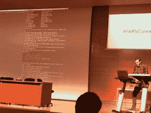
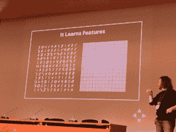

# 用于深度学习的 Apache Spark:两个案例研究

> 原文：<https://thenewstack.io/two-tales-big-data-framework-adoption-apache-spark/>

谈到大数据风格的分析处理，这是老种马 Hadoop MapReduce 和年轻的 buck Apache Spark 之间的所谓两匹马的比赛。越来越多在 Hadoop 环境中运行的公司选择使用 Spark 来处理大数据。

Hadoop MapReduce 和 Apache Spark 不一定是竞争对手，事实上，它们可以很好地合作——Spark 可以在 Hadoop 分布式文件系统(HDFS)上工作。但是 Spark 应用程序可以比运行在 Hadoop 的 MapReduce 上的应用程序快一个数量级——一位受访者甚至说快 100 倍。 MapReduce 的工作是磁盘密集型的，跨多个磁盘，而 spark 则尽量在 RAM 中运行。

MapReduce 被认为是一个更灵活、更广泛的选择，但 Spark 可以更快地将大量数据转化为可操作的信息。

## **trovi 为什么从 Hadoop MapReduce 到 Apache Spark**

在分类广告搜索引擎 [Trovit](https://www.trovit.com/) ，Ferran Gali Reniu 最初与 Hadoop 合作，因为“与其购买更大的机器，不如购买更小的机器。它解决了海量数据的存储问题。”他们正在创建 Hadoop 分布式文件系统层或 HDFS，这使他和他的团队能够将应用程序编码到 Hadoop 作业中。

他说，“使用 Hadoop，我们解决了 Trovit 面临的挑战，即拥有一个高质量、无重复、新鲜度好的搜索引擎。”但是，当在 HDFS 上使用 Hadoop MapReduce 时，他发现应用程序编程接口或 API 不是很灵活，并且他发现它“非常占用磁盘空间”

Gali Reniu 说:“这就是为什么出现了其他分布式处理框架，如 Spark，它们解决了同样的问题，但允许开发人员用更灵活的不同方法来解决问题。

该公司使用 Apache Spark 来驱动其推荐引擎。它仍然在产品中运行 MapReduce 代码来完成许多任务，但由于其速度和开发人员的易用性，它在 Spark 上构建了新的功能。

Trovit 团队决定转向 it，他决定在 PAPIs Connect predictive APIs 大会上演示 Spark，因为 Spark 的限制性数据集(RDS)代表了几组你可以组合的例程。当 Trovit 的 API 是用 Scala、Java 和 Python 编写时，这是必不可少的。

Gali Reniu 谈到了他发现 Spark 对用户有用的其他原因，包括他们在框架之上建立了一套库。

Spark 在其 API 之上提供了一套对用户有用的库，他说这让他们能够提供更多的智能，并通过快速处理进行迭代，这反过来让他们更好地利用自己的资源。

> “Spark 让我们在大数据处理方面更上一层楼，创新了我们从事数据科学的方式”——Ferran Gali Reniu

现在 Trovit 将 Hadoop 和 Spark 结合使用，在数据语言和一次做多件事情的能力方面有了新的灵活性。他说，通过这个组合，他可以唤醒一个集群，并在深度学习模型上执行它，或者将原型带到分布式结构生产中，而不必担心他的笔记本电脑崩溃，因为它将数据分布在多个分布式数据集合中。

## **在 AWS 上用 Spark 更快的分布式深度学习**

像 PAPIs 这样的关于机器学习的会议仍然很小众，他们充满了学者，实验者和第一个采用者，愿意展示他们为推动科学发展而创造的东西。Vincent Van Steenbergen 是一名自由职业数据工程师，在“玩”了 Scala、Akka 和 Spark 三年之后，他决定在空闲时间利用 Spark 来训练一个模型。他的演示向人们展示了他从发现深度学习和机器学习需求到研究和测试不同工具，最后训练模型的过程。

他首先解释了分布式深度学习的可能性，可以是图像分析、图像生成(比如将图像变成梵高的复制品)，最著名的是学习和下围棋，围棋比地球上的原子有更多可能的走法。

Steenbergen 说训练一个模型通常需要:

1.  很多时候。
2.  大量的计算机功率。

继续使用热门的 AlphaGo 参考，他说仅训练它就花了 1202 个 CPU 和 176 个 GPU 来训练它超过六周。因此，Steenbergen 以及其他数据科学家和工程师必须回答的一个明显问题是:  “我如何才能在适当的时间内用笔记本电脑以适当的价格做到这一点？”解决方案是在 Spark 集群上分配培训。他解释说 Spark 对他的价值在于它“允许你在多台机器和多种资源上分配你的训练和计算。”

“Spark 让我们在大数据处理方面更上一层楼，创新了我们进行数据科学的方式，”Reniu 说。

然后你需要一组服务，在他的例子中，这是一个没有企业预算支持的实验性爱好；它必须定价合理。他发现亚马逊网络服务的 EC2 有 GPU 实例，你可以按需扩展，每点一美元，他说这比其他实例便宜两到三倍。对于这一美元，您将获得:

*   四个 NVIDIA GRID GPUs，每个都有 1536 个 CUDA 内核和 4GB 显存
*   32 个 vcpu
*   60 GiB 内存
*   240 GB (2 x 120)固态硬盘内存

下一步是选择深度学习框架。现在的大牌包括谷歌的 [TensorFlow](https://thenewstack.io/look-inside-tensorflow-googles-open-source-deep-learning-framework/) 、 [Deepmind 的火炬](http://superintelligence.ch/deepmind/)(来自脸书)和 [Berkeley 的 Caffe](http://caffe.berkeleyvision.org/) 。他选择了后者，因为它是用 C++构建的，“因此可以快速优化，非常高效地使用 CPU 和 GPU，”他还说，它已经有很好的文档，丰富的社区，以及许多现有的深度学习模型用于训练。他模仿雅虎工程师在 Flickr 为深度学习所做的工作，在 Spark 集群上运行了一个 Caffe wrapper。

对于 Steenbergen 来说，优势是显而易见的，比如能够与其他 Spark 作业一起运行现有集群。他说，你可以同时运行尽可能多的深度学习任务，这允许你一次训练多个模型，甚至利用现有的模型。“您甚至可以使用 SQL、数据帧和现有的 LMDB 文件来训练您的模型，并对您的数据进行任何类型的处理。”

那么，我们的早期采用者在舞台上的现场演示中构建了什么？他建造了一台图像识别机器，可以对手写数字进行分类。这台机器花了大约 5 分钟的时间来研究 6 万个从 0 到 9 的手写数字，寻找与众不同的特征，比如 5 的曲线和 3 的曲线。他说，机器在运行模型的同时，也在用样本 id 图像进行测试。这就是机器学习甚至深度学习随着机器工作不断改进的地方。

<svg xmlns:xlink="http://www.w3.org/1999/xlink" viewBox="0 0 68 31" version="1.1"><title>Group</title> <desc>Created with Sketch.</desc></svg>