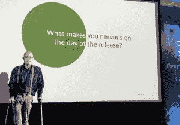
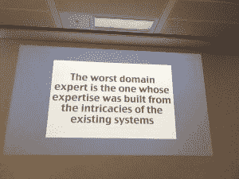
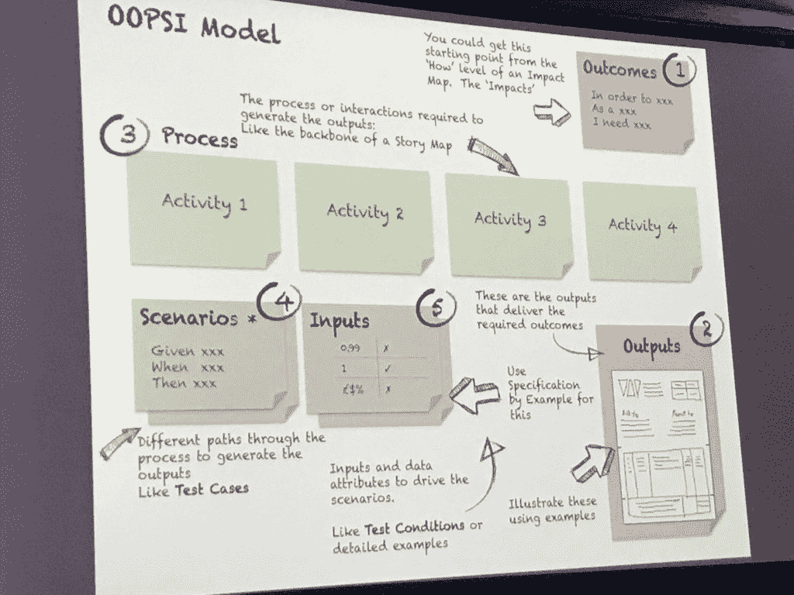
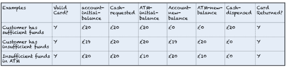
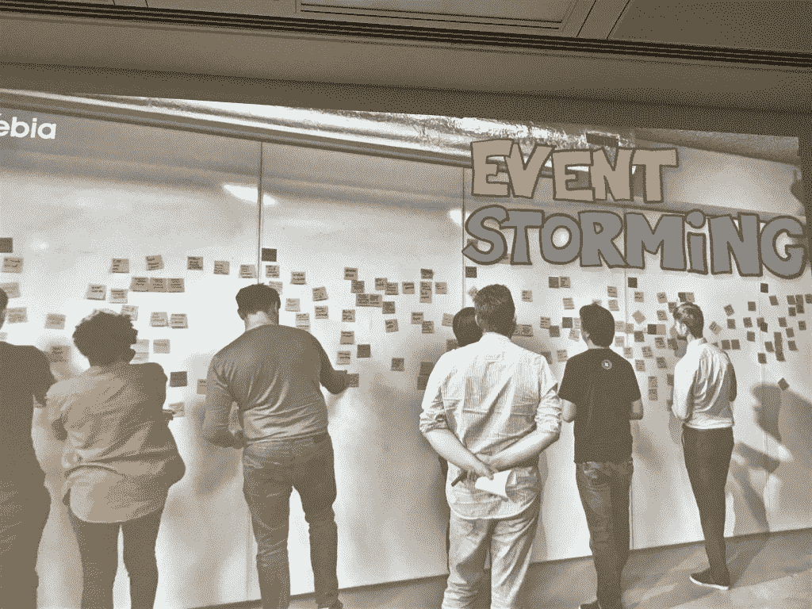

# 开始行为驱动开发的两种方法

> 原文：<https://thenewstack.io/two-ways-to-get-started-with-behavior-driven-design-bdd/>

有时在软件开发中，我们太沉迷于事物的技术，以至于忘记了我们在谈论什么。有时候，找到一种将开发人员所做的事情与业务的其他部分联系起来的共同语言，是将一个产品从有趣变成让客户满意所需要的全部。

作为[领域驱动设计](/domain-driven-design-aids-planning-microservices-architecture/)和[测试驱动开发](/unit-testing-time-consuming-product-saving/)的一个分支，行为驱动开发(BDD)致力于将业务和客户利益与技术专长结合起来。它使用简单的语法——给定这个/这些，当这发生时，那么这个/这些将会发生——以共享语言来解释环境，然后可以转换成通常在代码本身之前创建的可执行测试。BDD 将用户故事和输入语言相结合，并转化为规范。

在伦敦举行的 [P3X:人，产品&过程交流](https://skillsmatter.com/conferences/10367-p3x-people-product-process-exchange-2018)会议的大部分内容都集中在敏捷测试和 BDD 的发展上，因为这正是过程在人和产品之间寻求积极变化的地方。今天，新的 Stack 将分享一些有助于遵循行为驱动设计的过程。

## BDD 一切从对话开始

Spec Solutions' Gáspár Nagy

Spec Solutions'[gáspár Nagy](http://gasparnagy.com/)将 BDD 描述为一种提供共享所有权感的测试工具。

“业务的难点是什么？[了解]他们最重要的问题是什么，看看 BDD 如何对此产生影响。假设我们没有设定最后期限——看看 BDD 是否可以帮助让场景具有商业可读性，这样企业就会看到冲刺的过程，”他说，并继续说 BDD 就是利用测试让你在发布日充满信心。

但是我们如何达到这种共同的主人翁感呢？这种交流的持续障碍是什么？

"嗨，领域专家，请告诉我所有我需要知道的事情来构建这个软件."

“ [Living Documentation by design，with Domain-Driven Design](https://leanpub.com/livingdocumentation) ”、“ [Cyrille Martraire](https://twitter.com/cyriux) 把尾巴钉在驴子身上，以至于我们开始错过行为驱动设计的整个要点。我们知道向我们的领域专家学习很重要，但是为什么很难与我们的潜在客户开始这些对话呢？

“我们说的不是同一种语言。他们没时间理我们。作为非领域专家，我们必须把时间视为宝贵的，”马特莱尔解释道。

他说这一切都始于在开始谈话前做好功课:

*   从真正的好奇心开始
*   寻找领域专家的代理——阅读领域的“圣经”
*   创建一个潜在的精确而中肯的问题清单
*   学习该领域的词汇语料库

以上都不是可能的特性列表。你在那里学习领域专家需要什么。你的准备工作只是帮助确保你没有忘记任何东西，不要浪费他们的时间。

接下来，为了充分利用这段时间，做大量的笔记——添加清晰的评论，以区分你的想法和事实。练习积极倾听的苏格拉底式方法，一字不差地向他们重复短语“我听到你说的是……”或“你说的是什么意思……”来澄清。不要害怕挑战他们的假设。

接下来，深入了解特定潜在客户或客户的具体需求，总是要问:为什么？目标是什么？

然后，由于 BDD 是关于创建好的、真实世界的例子，Martraire 建议用“我想我们同意，但是为了 100%确定，我们应该花几分钟一起制作一个例子”来澄清一切。

“通常那是对话真正开始的时候。”

Martraire 说这是尽早发现早期“未知的未知”的最好方法。求具体例子。他与法国大银行合作，所以他肯定想要 PDF 文档作为具有真实数据的合同示例。他承认这通常是你的领域发现中最耗时的部分，但是你应该坚持。

但这并不意味着所有的领域专家都具有相同的素质。这就是为什么你需要面试不止一个人。

“最糟糕的领域专家是那些其专业知识是为现有系统的复杂性而建立的人，”马特雷尔说，“而最好的专家则因为失去了某些东西而产生了情感上的损失。”

最后，他提醒我们，你不要忘记代码本身就是一个领域专家——告诉你它想要什么，什么已经不起作用了。

行为驱动的设计和开发的整个过程都是关于移情和倾听。现在，我们分享 P3X 演讲者的一些技巧，如何促进那些具有不同思维模式、背景、技能组合和沟通风格的困难对话。

## 面向 BDD 发现和规范的 OOPSI 示例

BDD 的行为非常像造句，这是英语语法中一种濒临灭绝的艺术。它是关于以逻辑的方式映射重要的部分，以确保业务的所有方面都理解。正如敏捷蔻驰的珍妮·马丁所说，这是关于:

*   给定—行为的前提条件(可以是多个给定)
*   何时—真正重要的动作位(只能是一个何时)
*   Then-描述后置条件(可以是多个 then)

马丁将 GWT 描述为“一种帮助我们开启对话和有时自动化测试的语法和说法”

她提供了一个用户故事:“作为一名客户，我想从 ATM 机取款，这样我就不用在银行排队了。”

场景 1:

*   鉴于借记卡是有效的；鉴于账户有存款。如果自动售货机里有足够的现金，
*   当顾客要求现金时，
*   然后确保账户被记入借方；然后确保分发现金；然后确保卡被归还；然后确保分发收据。

鉴于 When Then 是开始 BDD 的一个好方法，但是 Martin 指出，它可能非常冗长，有太多的可能性。

她认为，由于没有数据进入这些 GWT 案例，它还不够具体，甚至不能作为一个例子。它也没有优先考虑最重要的输入和输出。

这就是为什么她说你应该从 GWT 前进到 SBE，因为它涉及使用真实数据值的决策表来设置例子。据说 SBE 从一开始就减少返工和澄清需求。

“将输入值输入系统，在系统中执行某些操作，然后根据任何预期结果对它们进行评估。你可以表达给定、何时和输出，你可以在属性表中使用它，”马丁说。

接下来是一个任何企业成员都可以做的练习，在一个称为 OOPSI 模型或 OOPSI 映射的决策表中绘制出 ATM 的预期行为:

*   结果
*   输出
*   过程
*   情节
*   输入

Martin 参与编写了 OOPSI 模型,作为将用户故事转化为场景和测试的一种方式。她使用一个表格来增加 BDD 用户故事的合理性，同时消除重复。她认为 OOPSI 映射是一种在将示例转化为特性之前，围绕示例表逐个使用规范的方法。

像所有 BDD 的事情一样，这可以首先使用便笺和白板来完成。

按照同样的示例练习，从结果开始:作为客户，我想提取现金，这样我就不必在银行排队等候。

“BDD 是一种由外向内的实践，在这里你理解价值观，探索目标，并在过程中学习，”Martin 解释道。然后，“从输出开始有助于我们真正理解价值是什么，并与企业进行良好的对话。”

接下来，取款机的输出包括:

*   现金
*   收据，可能包括余额
*   退回的银行卡
*   屏幕上的平衡
*   错误消息

Martin 建议用例子来说明输出。在这种情况下，可能是收据或现金。您的 OOPSI 对于与您的最终用户分享非常有用，具体的例子也有助于开发人员理解数据属性。

您通常可以对输出进行分组，比如获取返回的银行卡、现金和收据。

现在，想象一下这个过程:

1.  用户输入卡
2.  机器检查卡
3.  用户输入 PIN
4.  机器检查引脚
5.  用户选择账户类型
6.  用户请求现金
7.  机器检查 ATM 余额
8.  机器检查用户的余额
9.  返回卡
10.  分发现金
11.  分发收据

接下来，基于这个简单的流程，有哪些场景？一个接着一个。

场景 2:客户资金不足

*   鉴于借记卡是有效的；鉴于账户没有存款。如果自动售货机里有足够的现金
*   当顾客要求现金时
*   然后在屏幕上通知拒绝；然后还卡

但这仍然缺乏一个由实例驱动的规范，因为马丁说数据甚至比文字更重要。没有数据，情景 2 仍然模糊不清。

需要有一个输入和前提条件表，如下例所示。

从 OOPSI 模型中，您可以构建连接到这些表的测试。它允许每个人参考这些表来理解测试的基本原理和随后的代码。

Martin 指出，这也让团队考虑常见 API 提取的场景组合。

她提供了通过举例说明获得成功的最后技巧:

*   整个团队都参与其中
*   客户/用户参与
*   这是可以用真实数据测试的
*   移除测试之间的依赖关系

“你不希望有太多的列或太多的给定和然后，因为你测试的东西会变得不清楚——做更小的测试组和 SBE 表，”马丁说。

然后，您可以删除与任何特定场景无关的列，因为您拥有的 OOPSI 列越多，您的计划就越复杂，这反过来意味着您的代码就越复杂。

行为驱动的设计是如此的合乎逻辑，甚至一个非开发人员(比如这位作者)也能做到。这一切都是为了仔细规划用户旅程，然后将它转化为规范和测试，再转化为直接从用户旅程中派生出来的代码。

## BDD 混沌的事件风暴

软件顾问 Kenny Baas-Schwegler 说行为驱动设计应用了“一致语言的有限语境原则，但是语言是流动的，易变的。只是有人进入你的大楼就会改变语言。”

Baas-Schwegler 认为，围绕特定主题吸引团队的一个很好的方法是简单地让每个人——业务人员、IT 人员，甚至关键客户——在一个房间里，放一堆——你猜对了——便利贴。

“我们彼此不理解，所以我们需要努力创造一种能产生理解的模式，”他说。"胶粘物很容易重构——你只需取下板子，把它们扔掉就行了."

Baas-Schwegler 继续说“这是一片混乱。但这很好，因为现在我们可以在董事会上进行有意义的对话了。”

[事件风暴](https://www.eventstorming.com/)或模型风暴，是为了在筒仓上协作而构建的，是一个从左到右流动的时间线，致力于快速找出在你的软件领域级别正在发生或应该发生的事情。

正如 [Mathias Verraes](http://verraes.net/2013/08/facilitating-event-storming/) 所写，模特风暴的主要动机是:

*   尽早发现复杂性，找到缺失的概念，并理解业务流程
*   建模或解决具体问题的细节
*   学习如何建模和思考建模

从在橙色便利贴上写下所有域事件开始。(注意:颜色及其含义因团队而异，但它们遵循这些图像。)说的任何话都加到板子上。混乱过后，要求参与者至少五人一组，按照逻辑流程分组进行组织。明确命名每个进程。

接下来，为吉文斯夫妇添加紫色。然后黄色代表 Then 变量，比如如果订单超过 20 美元，则是免费送货。

“如果我要讲的东西不在黑板上，我就把它写在便签上，”巴斯-施韦格勒说。

“我们让它可见。我们让它变得清晰。所以我们的假设降低了。”

在 BDD 的大部分时间里，任何红色的帖子——它意味着停止，有些事情是不清楚的，需要立即讨论

但是，最后，Baas-Schwegler 指出，你永远不能只有一种工具，因为它会导致盲点。

“一个模型总是错误的，所以不要因为你花了很多时间去犯一个错误就抓住不放。”他说，这都是关于使用不同的模型来获得“我们的思想在同一水平上，所以我们不会创建相同的假设。”

通过 Pixabay 的特征图像。

<svg xmlns:xlink="http://www.w3.org/1999/xlink" viewBox="0 0 68 31" version="1.1"><title>Group</title> <desc>Created with Sketch.</desc></svg>