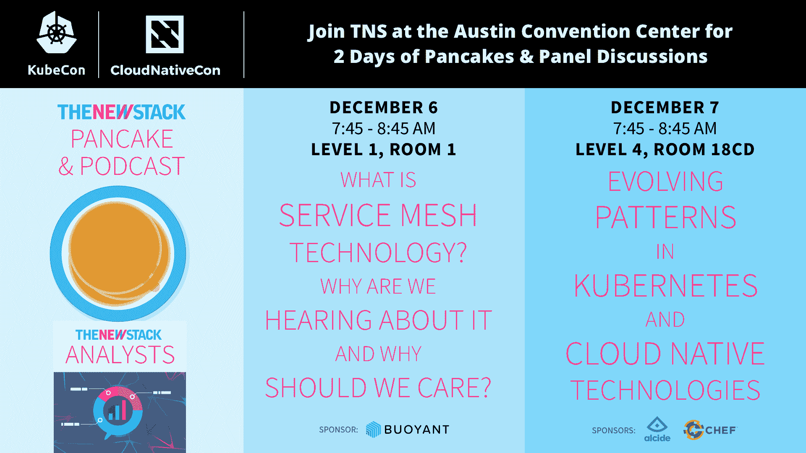

# 超越:超越

> 原文：<https://thenewstack.io/typeform-go-beyond/>

[字体:超越](https://thenewstack.simplecast.com/episodes/typeform-to-go-and-beyond)

在今天的《新堆栈制造商》节目中，TNS 创始人 Alex Williams 与 Typeform 的运营工程师 Daniel Vidal de la Rubia 进行了简短的交谈，以了解更多关于 Typeform 的技术基础设施及其对 Kubernetes 环境的持续开发。

Typeform 旨在帮助在线表单人性化，同时广泛使用数据库技术，如 MySQL、Redis、ElasticSearch 以及 PostgreSQL。Typeform 最初开始与 Kubernetes 在一个小型内部集群上合作，供自己使用，现在正在构建其 Kubernetes 基础设施。

“我们主要用 Go 做 bac- end，和 PHP 叠加。我们仍然有一个整体，但我们正在转向微服务。我们从巨石堆里堆出来的大部分东西，都是内置的。我们期待着向 Kubernetes 前进，”Vidal de la Rubia 说。

[https://www.youtube.com/embed/r5-kENY-7sg?feature=oembed](https://www.youtube.com/embed/r5-kENY-7sg?feature=oembed)

视频

### 在这个版本中:

[1:08:](https://thenewstack.simplecast.com/episodes/typeform-to-go-and-beyond?t=1:08) 软件马戏团的性能方面。
[1:49:](https://thenewstack.simplecast.com/episodes/typeform-to-go-and-beyond?t=1:49) Typeform 的基础设施以及如何在 Go 和 PHP 上构建。
[3:32:](https://thenewstack.simplecast.com/episodes/typeform-to-go-and-beyond?t=3:32)Typeform 在 Kubernetes 上的目标是什么，Kubernetes 会缓解哪些业务挑战。
[5:39:](https://thenewstack.simplecast.com/episodes/typeform-to-go-and-beyond?t=5:39) 铅字的存放环境。
[6:46:](https://thenewstack.simplecast.com/episodes/typeform-to-go-and-beyond?t=6:46)Typeform 如何应对其现有有状态环境的挑战。

<svg xmlns:xlink="http://www.w3.org/1999/xlink" viewBox="0 0 68 31" version="1.1"><title>Group</title> <desc>Created with Sketch.</desc></svg>