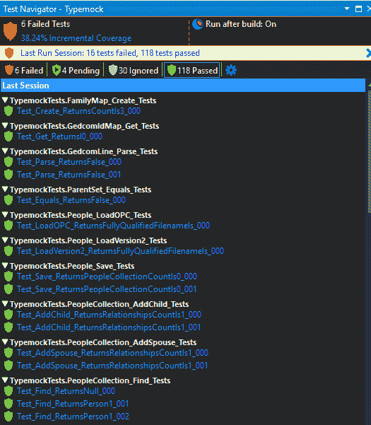

# Typemock 简化了。NET、C++单元测试

> 原文：<https://thenewstack.io/typemock-simplifies-net-c-unit-testing/>

遗留代码仍然是应用程序现代化的主要障碍，以色列单元测试供应商 [Typemock](https://www.typemock.com/) 帮助解决了这个问题。

Typemock 首席执行官[伊莱·洛皮安](https://mobile.twitter.com/elilopian)称，改变遗留代码是困难的、有风险的、昂贵的——基本上，每个人都害怕接触它，因为他们不知道改变是否会破坏其他东西。

“可能编写它的开发人员已经不在那里了……现在他们必须在那里更改一个功能。因为人们真的很害怕，所以没有单元测试，他们所做的就是，他们，他们写另一段代码。…然后突然，你得到了两个功能，或多或少做着同样的事情。…然后另一段代码进来，别人做了同样的事情，你就有了三段代码。如果你想改变这个主要逻辑，你必须在三个不同的地方改变它。这变得非常非常复杂，”他解释道，“你会得到意大利面条式的代码，其中相同的动作出现在多个地方。”

Typemock 为开发单元测试工具。NET 和 C++。这项技术提供了一种不用修改代码就能模仿代码的方法。

“他们最近一直在做的是使用机器学习和模糊逻辑来进行下一步。对于一个没有单元测试的公司代码，我们可以运行这个程序，它使用机器学习来学习实际的程序是如何运行的，并且它抛出了一个完整的单元测试负载，这个负载与人类为该代码编写的单元测试是兼容和可比的。一旦有了这些，开发团队就可以开始编写敏捷的代码了，”他说。

## 更早地捕捉错误

当测试遗留代码时，你需要逐个测试逻辑的小部分，比如单个函数、方法或类的行为。他解释说，要做到这一点，逻辑必须与遗留代码隔离开来。

正如 Jennifer Riggins 在以前的帖子中解释的，[单元测试不同于集成测试，](https://thenewstack.io/unit-testing-time-consuming-product-saving/)集成测试关注这些单元或组件之间的交互，并在单元级别更早地捕捉错误，因此修复错误的成本大大降低。

洛皮安说。NET 和 C++给单元测试带来了特殊的挑战。

“一些语言更容易交换方法和分离逻辑，”他说。“Python 很简单，因为名称可以动态交换。Java 更难，但因为大多数方法是虚拟的；使用继承更容易交换。。NET 更难，因为大多数方法不是虚拟的，继承也行不通，但由于代码是在运行前编译的，所以还是可以做到的。C++更难，因为代码是机器码，”他说。

他说，Typemock 使用可以与软件流程相交的特殊代码，而不是调用真实的代码，不管它是真实方法还是虚拟方法，它都可以拦截它，你可以在代码中伪造不同的东西。

## 更多机器学习

自从 2004 年洛皮安和罗伊·奥舍洛夫(T2 测试驱动开发领域的知名人物)一起创立公司以来，Typemock 就一直存在。他们在 2006 年首次发布了 Typemock Isolator，这是一款用于 SharePoint、等单元测试的工具。NET 项目。

Isolator 提供了一个 API，帮助用户编写简单的、人类可读的测试，这些测试与产品代码完全隔离。

它的用户包括美国空军、美国宇航局、微软和美国银行等。

最近发布的 Isolator 版本 9.1 支持开源跨平台[。NET Core](https://github.com/dotnet/core) 和它的前身一样。NET 框架在新的和遗留的代码。更新版本与微软最新的 Visual Studio 2022 集成，使开发人员能够对他们的代码进行单元测试，而不必修改现有的测试。

它包括一个自动的智能运行器，在每次修改后，它只执行所需的测试。它使用 Auto Deploy 或 NuGet 包提供向后兼容性。

Typemock Isolator 提供了对 fakes 和 mock 框架的详细了解，以跟踪测试，并支持和集成其他运行程序，如 VS Test Explorer、JetBrains Resharper 等。

Typemock Suggest 组件使用机器学习来获取遗留代码并为其创建测试。覆盖率组件显示了为多少代码编写了单元测试。

“覆盖率组件可以告诉管理者你的测试覆盖了代码的哪一部分，哪一部分没有覆盖。所以我们知道什么东西摸起来危险，什么东西摸起来不危险。开发人员可以看到这一点，知道他们是安全的…知道他们受到保护，或者他们必须非常小心，”Lopian 说。

超过 34%的开发人员使用。Net 框架 和超过 31%的开发人员使用。NET 核心框架，根据 Statista。。NET Core 可以在 Windows、Linux 和 macOS 操作系统上运行。

说道。NET 顾问[道格·汤普森](https://www.linkedin.com/in/dougrthompson/?originalSubdomain=uk):“从 C#开发者的角度来看，TypeMock 允许我们测试不可测试的东西。任何 HTTP/网络活动都可以被完全模拟，建议函数可以查看遗留代码并为其创建一个测试套件。这些测试教你如何从头开始编写自己的测试。”

## 。净发展

微软最近宣布将不再支持[。NET Core 3.1](https://devblogs.microsoft.com/dotnet/net-core-3-1-will-reach-end-of-support-on-december-13-2022/) 在 12 月 13 日之后，该公司敦促用户升级到。NET 6。同时，。NET 7 已经进入预览版，预计将于 11 月正式发布。

至于 C++的现状，谷歌的工程师们对这种语言的缓慢发展感到沮丧，他们推出了一种新的“实验性”开源编程语言。他们称之为 Carbon ，它解决了现代开发概念，如内存安全和泛型。

<svg xmlns:xlink="http://www.w3.org/1999/xlink" viewBox="0 0 68 31" version="1.1"><title>Group</title> <desc>Created with Sketch.</desc></svg>