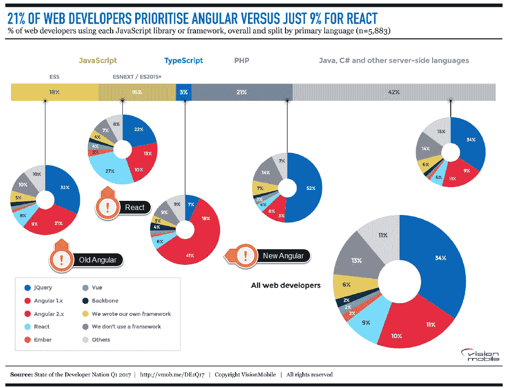

# 为什么 TypeScript 越来越受欢迎

> 原文：<https://thenewstack.io/typescript-getting-popular/>

为什么 [TypeScript](https://www.typescriptlang.org/) 变得如此流行？关键的开发框架依赖于它，在不断变化的 JavaScript 世界中，它提高了开发人员的生产力。

最近的[栈溢出开发者调查](https://stackoverflow.com/insights/survey/2017#technology)和年度 [RedMonk](http://redmonk.com) 编程[语言排名](https://redmonk.com/sogrady/2017/03/17/language-rankings-1-17/)都显示，TypeScript——由微软发起的将高级 JavaScript 功能的 transpiling 与静态类型检查和工具相结合的开源项目——正达到新的受欢迎程度。通过在 JavaScript 之上提供[最少的检查语法，TypeScript 允许开发人员对他们的代码进行类型检查，这可以](https://medium.com/@tomdale/glimmer-js-whats-the-deal-with-typescript-f666d1a3aad0)[揭示错误，并总体上改善大型 JavaScript 代码库的组织和文档](https://slack.engineering/typescript-at-slack-a81307fa288d)。

接受 Stack Overflow 调查的 9.5%的开发人员正在使用 TypeScript，这使它成为第九大流行语言，仅领先于 Ruby，是 Perl 的两倍。在本次调查中，堆栈溢出影响了不同的受众；使用最多的两种语言是 JavaScript 和 SQL，所以这个调查不仅仅是询问前端开发。事实上，类型脚本编码员出现在 Stack Overflow 询问的所有四个工作角色中；web 开发人员、桌面开发人员、管理员和开发人员以及数据科学家。

RedMonk 的排名将堆栈溢出数字与 GitHub pull 请求结合起来，以了解开发人员在想什么，以及他们在使用什么。TypeScript 在这些开发人员中也很受欢迎，排名从第 26 位上升到第 17 位。有些是因为对堆栈溢出的兴趣，但主要是因为 GitHub 上开发人员的参与增加了。

事实上，GitHub 自己的 octo verse 2016 年[状态](https://octoverse.github.com/)将 TypeScript 列为开发人员在 GitHub 项目中使用的 316 种编程语言中最受欢迎的第 15 位^((基于 pull 请求的数量和 TypeScript pull 请求比上一年增加 250%)。)

在另一项针对开发人员的调查中，在各种“替代”JavaScript 风格中，TypeScript 的使用率最高(21%)并且在尚未使用它的人群中最受欢迎(39%)。这项调查的方法是不寻常的——它相当奇怪地将 transpilers 与包管理器如 [npm](https://www.npmjs.com/) 和 [Bower](https://bower.io/) 混为一谈——但是响应调查并使用 TypeScript 的开发人员也通常使用 [ECMAScript 2015](http://www.ecma-international.org/ecma-262/6.0/) 、 [NativeScript](https://www.nativescript.org/) 、 [Angular](https://angular.io/) ，尤其是 Angular2。

RedMonk 的 Stephen O'Grady 指出,“有理由怀疑 Angular 在 TypeScript 的日益流行中扮演了一个角色”。Angular2 只是采用 TypeScript 的项目之一(Asana 和 Dojo 已经在使用它，Adobe、Google、Palantir、SitePen 和易贝的内部项目也在使用它)。但它可能是最有名的——像 Rob Wormald [@robwormald]这样的谷歌员工与 Angular 一起宣传 TypeScript。

## 不仅仅是角度 2

“毫无疑问，我们与 Angular 团队的合作有助于推动这些数字，”核心 TypeScript 开发者[安德斯·海尔斯伯格](https://twitter.com/ahejlsberg?lang=en)告诉新堆栈。“那不言而喻；但即便如此，我认为真正的意义在于，这是一个重要行业力量投下的巨大信任票。”

他指出，这种信任投票不仅仅是角度上的。“在这一点上，许多其他框架都在使用 TypeScript。Aurelia、Ionic、NativeScript 都以这样或那样的方式涉及到了打字稿。刚刚发布的 [Ember](https://www.emberjs.com/) 框架、 [Glimmer](https://github.com/glimmerjs) 框架是用打字稿写的。”

> “我们看到很多在这个行业有丰富经验的人投下了相当大的信任票，我想这可能是所有人都注意到的，”—安德斯·海尔斯伯格

这种信任投票也让框架用户参与进来。“为了成为 React 生态系统中真正伟大的公民，我们已经做了很多工作。我们支持 [JSX](https://jsx.github.io/) ，我们支持你想要的所有高级类型系统特性，比如重构和 JSX 标记上的代码导航。我们现在也在与 [Vue.js](https://vuejs.org/) 社区合作，为框架中使用的模式提供更好的支持，”Hejlsberg 说。

增加对新框架的支持是保持受开发人员欢迎的一个重要部分。“谈到框架，我们总是保持警惕。我们知道这是一个非常活跃的生态系统。变化很大；你必须保持警觉，做好每一件事。”

工具管道也是如此，尤其是随着 ECMAScript 模块变得越来越流行。“许多人编写现代风格的 JavaScript 应用程序都使用模块，当你使用 ECMAScript 6 模块时，你需要一个捆绑器来捆绑你的代码，以便它可以在浏览器中运行，如 [Webpack](https://webpack.github.io/) 或 [Rollup.js](https://rollupjs.org/) 。我们确保与这些工具很好地合作，这样我们就能融入整个流程，”Hejlsberg 说。

React 是一个具有脸书根源的库。Angular 是谷歌开发的一个框架。有大量的分析对它们进行了比较，总的来说，它显示了有角度的轨迹，Vue.js 得到了显著的关注。Angular 在 TypeScript 爱好者中得到了广泛接受，41%的人优先选择 2.x，另有 18%的人喜欢旧版本。随着最近 Angular 4 的发布和 TypeScript 的日益流行，我们预计 JavaScript 战争将继续下去(劳伦斯·赫克特)。

具有 TypeScript 定义的库的数量也在稳步增长。 [DefinitelyTyped](http://definitelytyped.org/) ，一个 TypeScript 类型化定义的存储库，现在有超过 3000 个框架和库。这可以通过在@type 名称空间下自动抓取和发布声明文件作为 npm 包来加速。

“这意味着现在有一种非常可预测的方法来发现哪些框架有类型——我们可以自动提供类型。当我们看到你正在导入一个特定的框架时，我们可以去为你寻找类型，这样你就不必再这样做了。”事实上，Hejlsberg 声称，“对于一些开发者来说，当他们选择一个框架时，这已经成为一个决定因素；他们是否能使用框架并获得类型。”

> “通常 TypeScript 最终被企业、初创企业和个人开发人员采用的方式是，你在一个项目中尝试它，然后说‘哇，这太棒了！’然后你开始传福音，它在你的势力范围内成长。”—安德斯·海尔斯伯格

兴趣的普遍上升似乎是一种有机的增长。“我们不做任何广告，这都是由社区推动的。这实际上是稳定的增长，我们现在才开始注意到更大的数字，”Hejlsberg 说。

Hejlsberg 指出，TypeScript 也是堆栈溢出调查中第三大最受欢迎的语言，仅次于 Rust 和 Smalltalk(仅领先于 Swift 和 go)，也是第六大最受欢迎的语言，位于 C#和 Swift 之后。“我认为这很能说明我们实际上正在解决真正的问题，”Hejlsberg 说。

## 微软的势力范围

很容易将 TypeScript 的成功视为微软通过熟悉的工具将已经进入微软世界的企业开发人员引入 JavaScript。

“很明显，我们已经有了一个拥有 C#和 C++以及 Visual Basic 的大型开发人员生态系统。许多企业使用微软工具，他们也有前端，当我们开始在前端方面改善世界时，他们会注意到并开始使用它，”Hejlsberg 承认。

但是，虽然大量的打字稿开发是在 [Visual Studio](https://www.visualstudio.com/) 中完成的，但同样多的开发是在 [Visual Studio Code](https://code.visualstudio.com/) 中完成的，后者是微软的开源跨平台 IDE。“我们与这个社区的联系越来越少。对于 Visual Studio 代码，我们一半的用户都不使用 Windows，所以突然之间，我们与开发人员社区进行了一次对话，而我们以前并没有进行过太多的对话。”

## 开源和快速发展

TypeScript 团队最近宣布，现在发布将每两个月进行一次，而不是每季度一次，Heljsberg 称这是为了使发布日期更可预测，而不是推迟新的发布来获得特定的功能。这也是 ECMAScript 委员会所采用的方法。

TypeScript 的新发布节奏也与 Visual Studio 代码计划保持一致；部分原因是 Visual Studio 代码实际上是用 TypeScript 编写的，还因为工具是 TypeScript 吸引力的关键部分。

虽然 TypeScript 支持多种编辑器和 ide 很重要，但 Hejlsberg 指出，Visual Studio 代码是帮助该语言流行的另一个因素。

事实上，因为有了 TypeScript，你可以获得更好的编码特性，即使你只用 JavaScript 编写，他解释道。Visual Studio 代码和 Visual Studio 都使用 TypeScript 语言服务作为它们的 JavaScript 语言服务。因为 TypeScript 是 JavaScript 的超集，这意味着 JavaScript 是 TypeScript 的子集，它实际上只是没有类型注释的 TypeScript，”他指出。

在 Visual Studio 代码中，打开 JavaScript 文件将触发 TypeScript 解析器、扫描器、词法分析器和类型分析器，以在 JavaScript 代码中提供语句完成和代码导航。“即使没有类型注释，我们也可以从你使用的模块和你声明的类中推断出很多关于项目结构的东西，”Hejlsberg 说。“我们可以为您导入的框架自动提供类型信息，然后我们可以用 JavaScript 为您提供出色的语句完成，这真的会让人们大吃一惊。”

使这种快速节奏成为可能的是接受拉请求所需的测试，这保证了主分支的质量，以及 TypeScript 的流行，这意味着任何问题都可以快速找到。

“我们是一个开源项目，我们在 GitHub 上做了很多工作。我们从不接受“拉”请求，除非它们通过了我们所有的 55，000 次测试，除非它们带来了新的测试(如果你正在实现一个新功能)或回归测试(如果它正在修复一个错误)。这意味着我们的总分行总是处于非常良好的状态，”他说。

## JavaScript:强大但复杂

与任何单一因素相比，TypeScript 越来越受欢迎的真正原因可能是 JavaScript 开发变得多么复杂，以及它有多么强大。

“我们的行业和我们对 JavaScript 的使用已经发生了巨大的变化，”Hejlsberg 指出。“过去，我们生活在一个同质化的世界里，每个人都在运行 Windows 和使用浏览器，这就是你获得 JavaScript 的方式。现在世界变得非常多样化。有各种不同的设备——手机和平板电脑，在 node 的后端运行 JavaScript，JavaScript 已经跳出了浏览器，使用 NativeScript 或 React Native 或 Cordova 等工具，允许您使用 JavaScript 构建原生应用程序。”

“是的，它更复杂，但也无限地更有能力，”Hejlsberg 说 JavaScript。“使用 JavaScript，使用单一的语言和工具集，您可以获得如此多不同的应用程序配置文件。对我来说，这就是推动这一切的原因:你可以构建的应用程序种类之多令人难以置信，以及你可以在这个不断发展的生态系统中获得的可重用性和杠杆作用。它不仅仅变得更加复杂；它也变得更有能力了。”

<svg xmlns:xlink="http://www.w3.org/1999/xlink" viewBox="0 0 68 31" version="1.1"><title>Group</title> <desc>Created with Sketch.</desc></svg>