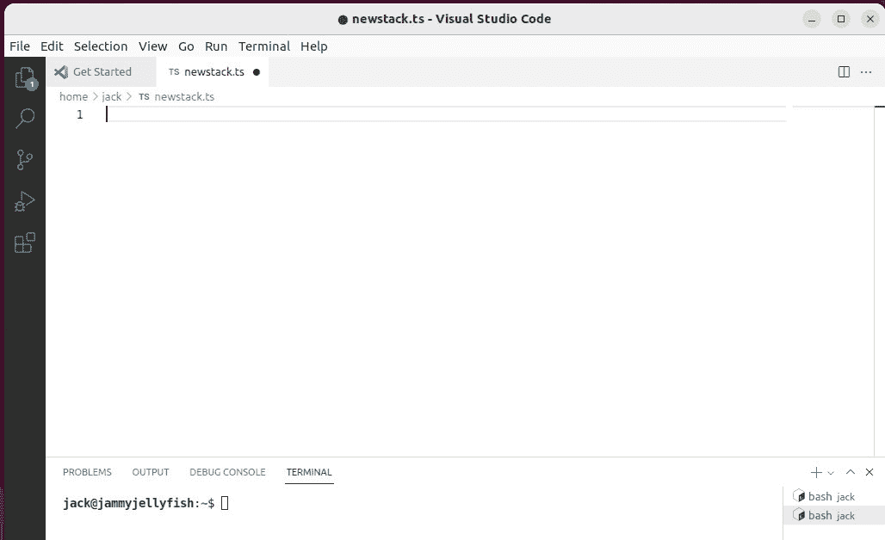
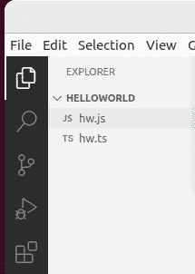
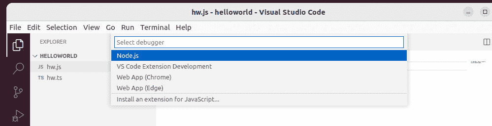
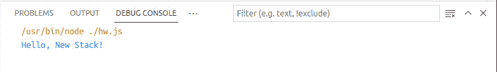

# TypeScript 教程:编程语言使用指南

> 原文：<https://thenewstack.io/typescript-tutorial-a-guide-to-using-the-programming-language/>

JavaScript 是全球前端 web 开发中使用最广泛的编程语言之一。由微软开发的 TypeScript 是 JavaScript 的一个严格的语法超集，旨在扩展该语言，使其更加用户友好，并适用于现代开发。TypeScript 是一种开源语言，几乎可以在任何平台上使用(Linux、macOS 和 Windows)。

TypeScript 是一种面向对象的语言，包括类、接口、箭头函数、环境声明和类继承等功能。使用 TypeScript 的一些优点包括:

*   可以在任何浏览器或 JavaScript 引擎上运行。
*   使用与 JavaScript 相同的语法，所有 TypeScript 代码都转换为 JavaScript。
*   可以从现有的 JavaScript 代码中调用 TypeScript 代码。
*   使用现有的 JavaScript 框架。
*   提供对 JavaScript 库的支持。
*   支持最新的 JavaScript 特性。
*   与第三方工具轻松集成。
*   运行时错误更少。
*   更好的代码质量和文档

TypeScript 相对于 JavaScript 提供的一些特性包括:

*   可选静态类型
*   可读性
*   广泛的 IDE 支持
*   面向对象编程
*   支持最新的 ECMAScript 特性

使用 TypeScript 的最大优点之一是它提供了一个健壮的环境来帮助您在键入时发现代码中的错误。这个特性可以极大地减少测试和调试时间，这意味着您可以更快地交付工作代码。

最终，TypeScript 最适合用于构建和管理大型 JavaScript 项目。它既不是前端语言，也不是后端语言，而是一种扩展 JavaScript 特性集的手段。

我将带您完成 TypeScript 的安装，并通过创建一个非常基本的 Hello，World！申请。

## 在 Linux 上安装 TypeScript 和 VSCode

让我们在 Linux 上安装 TypeScript(具体来说，Ubuntu 22.04)。为此，我们必须首先安装 Node.js。登录到您的 Ubuntu 桌面实例，打开一个终端窗口，并使用以下命令安装 Node.js 和 npm:

`sudo apt-get install nodejs npm -y`

安装 Node.js 和 npm 后，我们现在可以使用以下命令安装带有 npm 的 TypeScript:

`npm install -g typescript`

如果出现错误，您可能需要使用 sudo 权限运行上面的命令，如下所示:

`sudo npm install -g typescript`

要验证安装是否成功，请发出以下命令:

`tsc -v`

您应该看到安装的 TypeScript 的版本号，例如:

`Version 4.7.4`

现在您已经安装了 TypeScript，让我们添加一个 IDE。我们将安装 VSCode(因为它内置了 TypeScript 支持)。为此，我们可以像这样使用快照:

`sudo snap install code --classic`

安装完成后，您可以从桌面菜单启动 [VSCode](https://code.visualstudio.com/) 。

## 创造你好，世界！应用

我们要做的第一件事是创建一个文件夹来存放我们的 Hello，World！申请。在您的 Linux 机器上，打开终端窗口并发出命令:

`mkdir helloworld`

使用以下命令切换到该目录:

`cd helloworld`

接下来，我们将使用以下内容创建应用程序文件:

`nano hw.ts`

在这个新文件中，像这样添加应用程序的第一行:

```
let message:  string  =  'Hello, New Stack!';

```

上面你可以看到我们使用了 *let* ，它类似于 *var* 变量声明，但是避免了 JavaScript 中一些更常见的问题(比如变量捕获、奇怪的作用域规则等)。).在我们的例子中，我们将变量 *message* 设置为一个*字符串*，其内容为 *Hello，New Stack！*。很简单。

我们的问候，世界的第二行！app 长这样:

这样做的是将变量*消息*设置为(在我们的例子中， *Hello，New Stack！*)。

我们的整个应用程序将看起来像这样:

```
let message:  string  =  'Hello, New Stack!';
console.log(message);<i>
</i>

```

保存并关闭文件。

在 VSCode 打开的情况下，点击 Terminal > New Terminal，这将在窗口的下半部分打开一个终端(**图 1** )。



图 1:我们在 VSCode 中打开了一个新的终端。

在终端，使用以下命令切换到 helloworld 文件夹:

`cd helloworld`

接下来，我们将使用以下命令从我们的 TypeScript 文件生成一个 JavaSript 文件:

`tsc hw.ts`

打开 VSCode Explorer，您应该会看到 hw.js 和 hw.ts ( **图 2** )。



图 2:我们的两个文件都显示在 VSCode Explorer 中。

选择 hw.js，然后单击运行>不调试运行。当出现提示时(**图 3** ，选择 node.js 作为您的调试器。



图 3:选择正确的调试器是至关重要的一步。

一旦你这样做了，VSCode 将做它自己的事情并输出运行的结果(**图 4** )。



图 4:我们的 Hello，World！应用程序运行成功。

如果您想从终端窗口完成所有这些工作(并且不使用 IDE)，该怎么办呢？那就更简单了。回到你用来写 Hello，World 的同一个终端！应用程序，并确保您仍在 helloworld 目录中。您应该仍然可以看到 TypeScript 和 JavaScript 文件。

去经营你好，世界！从命令行使用 node，如下所示:

`node hw.js`

输出应该是:

`Hello, New Stack!`

恭喜您，您已经安装了 TypeScript，并用该语言编写了您的第一个应用程序。下一次，我们将更深入地探讨你能用这种语言做些什么。

<svg xmlns:xlink="http://www.w3.org/1999/xlink" viewBox="0 0 68 31" version="1.1"><title>Group</title> <desc>Created with Sketch.</desc></svg>