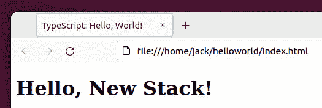

# TypeScript 教程:超越“你好，世界！”

> 原文：<https://thenewstack.io/typescript-tutorial-go-beyond-hello-world/>

上周，我发布了一篇关于[TypeScript](https://thenewstack.io/what-is-typescript/)(“[TypeScript 教程:编程语言使用指南](https://thenewstack.io/typescript-tutorial-a-guide-to-using-the-programming-language/)”)的介绍性文章，在这篇文章中，我不仅向您介绍了这种语言，还带您创建了第一个应用程序。所说的应用是无处不在的“你好，世界！”它只做一件事——打印出短语“你好，世界！”在终点站。

这太棒了…但只是帮助你迈出学习这门语言的第一步。当然，TypeScript 可以做的不仅仅是打印出“Hello，World！”我想帮助你们采取接下来的重要步骤。

如果你还没有读第一篇，一定要读，因为这不仅会带你走过“你好，世界！”app，还演示了如何借助 Node.js 和 npm 在 Linux 平台上安装 TypeScript。因此，在您继续阅读本文之前，请确保安装了 TypeScript 并阅读了“Hello，World！”应用程序创建。

完了，完了。

我们继续吧。

## 扩展“你好，世界！”应用

你以为你已经不用那个小程序了。从来没有。我们要做的是突出显示 TypeScript 的一个很酷的功能，它可以将消息打印到网络浏览器中。在第一部分中，我们构建了生成 hw.js 文件的应用程序。如果我们用命令 *node hw.js* 运行该应用程序，我们将看到正确的输出 *Hello，New Stack！*(扔你那里一圈)。

但是，如果我们想在 web 浏览器中打印输出结果呢？我们可以做到这一点，而且非常简单。让我们走一遍。

首先，切换到您创建新项目的目录。在最初的代码中，该目录名为“helloworld ”,因此改为:

`cd ~/helloworld`

您应该看到两个文件:hw.js 和 HW . ts。HW . ts 文件是我们构建应用的地方，hw.js 是使用 *tsc hw.ts* 命令从代码生成的 JavaScript 文件。

我们现在要做的是创建一个基本的 HTML 索引文件，它调用 hw.js 应用程序并在 web 浏览器中打印输出。因为 TypeScript 是 JavaScript 的超集，所以您可能会发现这种用法非常熟悉(如果您曾经使用过 JavaScript)。

我们要做的第一件事是用以下命令创建一个 index.html 文件:

`nano index.html`

首先，我们将向该文件添加常见的 HTML 元素。因此，将以下内容复制/粘贴(或者创建您自己的基本索引文件)到新文件中:

```
&lt;!DOCTYPE html&gt;
&lt;html lang="en"&gt;
&lt;head&gt;
&lt;meta charset="UTF-8"&gt;
&lt;meta name="viewport"  content="width=device-width, initial-scale=1.0"&gt;
&lt;title&gt;TypeScript:  Hello,  New Stack!&lt;/title&gt;
&lt;/head&gt;

```

头部部分完成后，让我们把注意力放在身体上。我们要做的是使用*脚本 src* 调用指向 hw.js JavaScript 文件。该部分如下所示:

```
&lt;body&gt;
     &lt;script src="/home/jack/helloworld/hw.js"&gt;&lt;/script&gt;
&lt;/body&gt;
&lt;/html&gt;

```

注意，在上面的部分中，我有 hw.js 文件的显式路径。如果你要添加~/helloworld/hw.js，这个应用就会有问题。因此，您需要确保输入 JavaScript 应用程序的完整路径。

保存并关闭文件。

现在，用默认的 web 浏览器打开该文件，它应该会打印出 Hello，New Stack！(**图 1** )。



图 1:成功！我们的应用程序能够输出到浏览器。

现在，让我们超越“你好，世界！”。

## 用 TypeScript 添加数字

让我们用 TypeScript 把两个数加在一起。这将不仅演示如何使用语言中的变量，还将演示如何使用 add 函数。

使用以下内容创建新的 ts 文件:

`nano numbers.ts`

应用程序的第一行将调用 add 函数，看起来像这样:

我们用大括号结束这一行，因为我们还没有完成这一部分。我们需要接着添加:

整个第一部分定义了我们的函数，该函数将 x 和 y 的值相加，我们将在下一行中定义该函数，如下所示:

上面这条线把我们的 x (3.14)加到我们的 y (10)上，但不做其他任何事情。然后我们需要用下面的代码行打印出我们分配给变量 *sum* 的值:

我们的整个应用程序如下所示:

```
unction add(x:number,  y:number)  {
         return  x+y;
}

let sum  =  add(3.14,10);
console.log(sum);

```

你着火了！

保存并关闭文件。接下来，我们将用以下代码将其编译成 JavaScript:

`tsc numbers.ts`

这将创建 numbers.js 文件，我们可以使用:

`node numbers.js`

运行该应用程序的结果将打印出 13.14(因为我们在 10 中添加了 3.14)。

好吧，这太棒了。接受用户的输入怎么样？使用 *parseInt* 函数也是可行的。让我们创建一个简单的应用程序，要求用户输入姓名并打印出来。在此之前，我们需要为 Node.js 安装以下类型定义:

`npm i --save-dev @types/node`

处理完这个问题后，使用以下内容创建新文件:

`nano name.ts`

在该文件中，粘贴以下内容:

```
const readline  =  require('readline').createInterface({
  input:  process.stdin,
  output:  process.stdout
});

readline.question('What is your name?',  name  =&gt;  {
  console.log(`Hello,  ${name}!`);
  readline.close();
});

```

在上面的代码中我们:

*   用 *createInterface* 函数设置常量变量 *readline* 以接受用户的输入。
*   打印出问题“你是谁？并将输入赋给变量*名。*
*   打印出分配给*的名字*。

保存并关闭文件。使用以下代码将应用程序编译成 JavaScript:

`tsc name.tc`

现在，运行应用程序:

`node name.js`

你会被要求输入你的名字，然后应用程序会在控制台上打印出你的名字。

现在你知道了！使用 TypeScript 语言的下一步。为了更深入地了解这种奇妙的语言，请务必访问官方的[打字文档](https://www.typescriptlang.org/docs/)。

<svg xmlns:xlink="http://www.w3.org/1999/xlink" viewBox="0 0 68 31" version="1.1"><title>Group</title> <desc>Created with Sketch.</desc></svg>