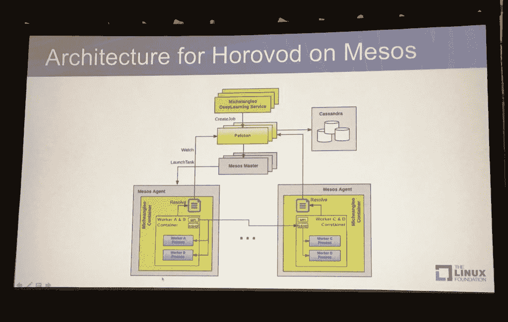

# 优步设计了一个调度器，在多个 GPU 上运行 TensorFlow 深度学习作业

> 原文：<https://thenewstack.io/uber-devises-scheduler-large-deep-learning-jobs/>

汽车共享服务公司优步发现，虽然 Spark 和 MapReduce 等“大数据”工具可能提供了一种弹性方法，可以将一项工作分散到多个节点上，使工作能够容忍少数节点的故障，但一些深度学习工作需要每个节点保持运行，直到工作结束。

为了满足这一需求，优步求助于[集群调度](https://www.quora.com/What-are-the-advantages-of-gang-scheduling-algorithm)，一种在超级计算领域久负盛名的优化算法。上周，优步的工程师[蔡敏](https://www.linkedin.com/in/min-cai-6879834/)在[于洛杉机举行的一次介绍会](http://events.linuxfoundation.org/events/mesoscon-north-america/program/schedule)上解释说，集群调度确保了一个集群计算任务只有在所有节点都可以同时运行的情况下才会运行。

蔡是在开源框架中实现帮派调度算法的工程师之一，该框架名为 [Horovod](https://github.com/uber/horovod) ，用于在多个节点上运行谷歌的 [TensorFlow](https://www.tensorflow.org/) 机器学习软件。

优步使用该软件运行训练模型，用于运行数百个 GPU 的深度学习任务，用于研究自动驾驶汽车的导航、图像分类和欺诈检测。这种“深度学习”训练涉及节点之间的大量反馈，因此所有节点同时运行是至关重要的。使用 Mesos 容器是因为 Docker 在上游版本中还不支持 GPU。

每个深度学习程序的相同副本安装在多个容器中，因此它们可以在 [Mesos 集群](http://mesos.apache.org/)上串联运行。优步使用嵌套容器方法来避免依赖冲突，在这种方法中，程序本身被放在一个 Docker 容器中，该容器由第二个带有管理代码的容器封装。通过分组调度，Horovod 将所有容器放在一台主机上。

优步还研究了其他用于在多个节点上运行作业的 TensorFlow 包，但它们被拒绝了，因为它们给开发人员强加了一条学习曲线；了解消息传递接口(MPI)的限制要容易得多，MPI 是一个几乎所有超级计算机中都有的通信库，优步在 Horovod 也使用它。

在同一次演讲中，优步高级工程师亚历克斯·谢尔盖耶夫指出，在使用 Horovod 时，开发者在程序中包含一个库调用，在运行时，软件代理将启动所需数量的副本来运行应用程序。

【T2

谢尔盖耶夫指出，脸书也部署了类似的任务，不过使用的是 Caffe 框架而不是 TensorFlow。

管理 Mesos 项目的 Mesosphere 是新堆栈的赞助商。

特写图像，蔡敏(右)和亚历克斯·谢尔盖耶夫在中尺度上。

<svg xmlns:xlink="http://www.w3.org/1999/xlink" viewBox="0 0 68 31" version="1.1"><title>Group</title> <desc>Created with Sketch.</desc></svg>