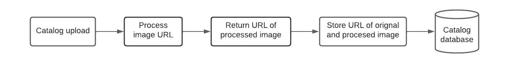
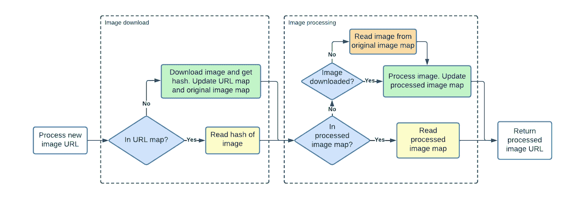
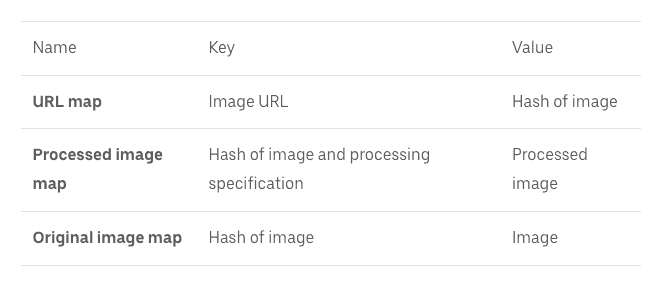
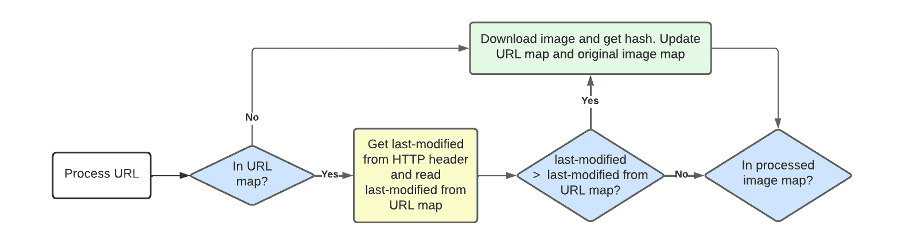

# Uber Eats 创建了一个缓存来删除重复图像

> 原文：<https://thenewstack.io/uber-eats-carves-out-a-caching-system-to-deduplicate-images/>

通过实施基本的哈希映射和控制流逻辑结构，受欢迎的食品配送服务 [Uber Eats](https://www.ubereats.com/?utm_source=AdWords_Brand&utm_campaign=CM2199889-search-google-brand_1_-99_US-National_e_web_acq_cpc_en_T1_Generic_Exact_uber%20eats_kwd-125079392186_619088290072_139311657734_e_c&campaign_id=18207574469&adg_id=139311657734&fi_id=&match=e&net=g&dev=c&dev_m=&ad_id=619088290072&cre=619088290072&kwid=kwd-125079392186&kw=uber%20eats&placement=&tar=&gclid=CjwKCAjwsfuYBhAZEiwA5a6CDH1gCPHw_t6kUwEomhBJBP4EXFjaaI8Mo6fQ4dZBmkUNBjivPCUZ3xoClZMQAvD_BwE&gclsrc=aw.ds) 创建了一个内容可寻址的缓存层，将发送的独特图像数量减少到其服务器之前发送数量的 1%。

鉴于该服务每天向最终用户提供数百万张图像，节省的资源相当可观。这个解决方案看起来很像一个 LeetCode 问题。

优步软件工程师 [Kristoffer Andersen](https://www.linkedin.com/in/kristoffera) 在[的博客文章](https://www.uber.com/blog/deduping-and-storing-images-at-uber-eats/)中指出:“这一完整系统在不到两个月的时间内开发并完全推出，这改善了图像服务的延迟和可靠性，并畅通了我们新目录 API 开发的项目。”。

这封邮件给人一种熟悉的感觉。起初很难得出完整的结论，因为技术故障非常有趣，但读了几遍之后，就很简单了。这是一个直接来自代码实践网站的散列结构问题。

**提示:** Uber Eats 的存储上图像太多。It 部门希望降低存储成本并缩短延迟时间，但无法利用当前的映像系统清理不同供应商的映像。实施一个逻辑和缓存系统，不仅可以消除供应商之间的重复，还可以减少多次处理图像的需要。"

旧系统:旧系统保存了大量健怡可乐的照片，对于那些依赖 Uber Eats 的不太懂技术的餐馆老板来说，这听起来像是一场噩梦。每次上传都需要完整的菜单上传，并且系统知道某个图像需要通过所需的 URL 更改来重新下载。这使得一切都非常商店和商家特定。想象一下，需要更改一张图片，上传整个菜单，却发现 URL 没有更改。

**高级解决方案:**在供应商上传图像 URL 之后，实现通过检查数据库中的图像来确定 URL 是否存在于数据库中的逻辑。如果图像是新的，下载并确保它是一个有效的图像，然后重新格式化并缩放到标准大小。存储最终处理的图像。

## **用于重复数据删除映像的高级控制流程逻辑和映射**

Uber Eats 实施的解决方案是跨系统部署的，而不是基于每个供应商。控制流逻辑分为三个主要流程，如下图所示。

控制流程逻辑 1: **已知的已处理图像**:这是最简单的流程，因为它返回先前存储的值。它穿过两个黄色的盒子。

控制流程逻辑 2: **新的、未处理的图像**:图像在该流程中被下载和处理。这由两个绿色方框来说明。

控制流程逻辑 3: **已知的、未处理的图像**:该流程涵盖图像已知但未按照要求的规格进行处理的情况。这种流动在图表中左侧的黄色方框和右侧的橙色方框中可以看到。

与逻辑一起工作的映射如下:

## **控制流程的详细分解以及这些图如何协同工作**

URL 映射返回图像的散列。哈希和处理规范(输入要求、输出格式和大小)返回经过处理的图像。原始图像映射根据图像的哈希返回原始图像。

当使用图像 URL 和处理规范启动图像处理时，第一步是检查 URL 是否已经下载。

*   什么事？读取原始图像映射的字节哈希。

*   没有吗？创造它！下载图像，更新 URL 映射，并将原始图像存储在系统中。

则使用图像的散列和处理规范。之前是否下载并处理过图像？

*   什么事？将处理过的图像的 URL 返回给请求者。
*   没有吗？创造它！处理图像，存储它，并将图像的 URL 返回给请求者。

客户端图像错误也存储在已处理的图像映射中。例如，如果原始图像不符合最小允许尺寸。这样，如果相同的 URL 出现相同的错误，错误会立即返回。

## **在未改变的 URL 上重写图像值**

这个更新的图像系统中内置的一个额外的控制流逻辑是如何更新没有更新的 URL 上的图像。

Uber Eats 使用逻辑来读取这些传入图像上最后修改的 HTTP 头的值，以确定是否需要再次下载。如果该值比存储在 URL 映射中的值新，则必须再次下载该图像。如果不是，那么什么都不会改变。如果再次下载图像，URL 映射将使用图像的新散列和新的上次修改时间进行更新。

## **总之**

该缓存层目前正在运行，并在过去的四个月中取得了成功。优步的系统每天处理数百万张图像，与指定的 1%的服务器调用相比，这是惊人的。if/then 流和 hash map 体系结构的好处在本文中得到了清晰的阐述，它为 LeetCode 隧道的结尾提供了一盏明灯。

<svg xmlns:xlink="http://www.w3.org/1999/xlink" viewBox="0 0 68 31" version="1.1"><title>Group</title> <desc>Created with Sketch.</desc></svg>