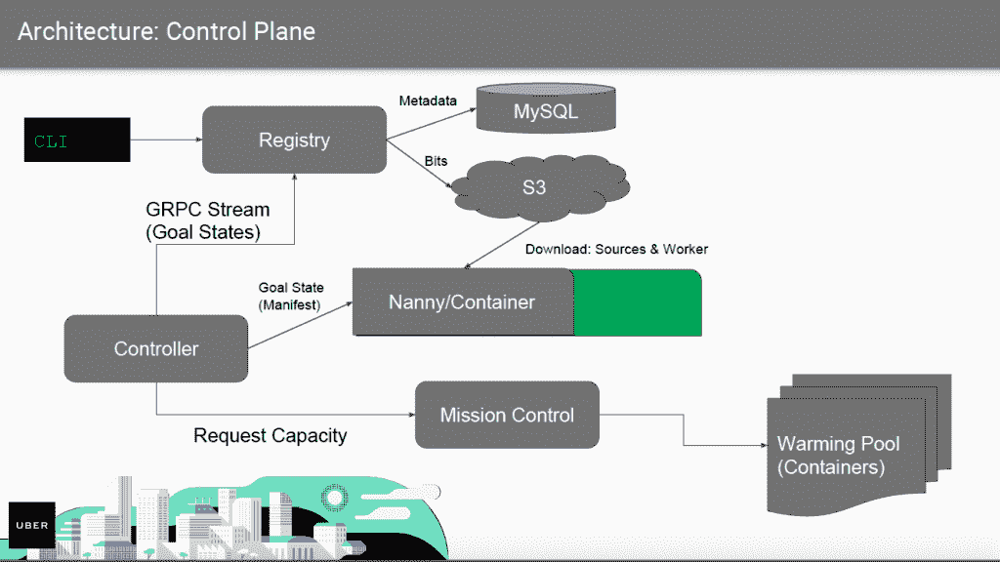
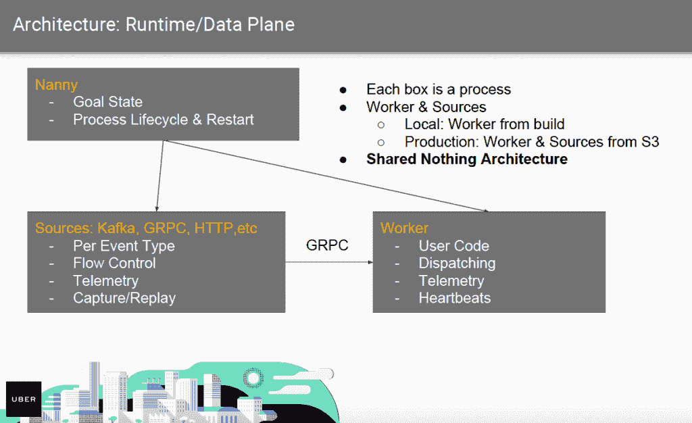

# 优步基于无服务器的服务网格 Catalyst 加快了应用程序开发

> 原文：<https://thenewstack.io/ubers-catalyst-service-mesh-provides-visibility-speed/>

2015 年，当肖恩·伯克(Shawn Burke)被优步聘为员工工程师时，他走进了一家正在经历前所未有增长的公司。站台上的人数正以惊人的速度增长。就在他到来之前，优步有 150 名工程师。当他签约时，他已经是第 900 名了。几个月后，该公司庆祝了第十亿次旅行。

伯克说，这不仅仅是开发人员的激增，而是该公司正在发布一波全新的产品。该公司增加了行程，然后是拼车，然后是优步吃饭，然后是货运和其他内部业务。两个月前，该公司进行了第 50 亿次旅行。

所有这些都给基础设施带来了压力。当他到达时，他对他们系统的复杂性感到惊讶。这是为了快速推出产品而做出的工程选择的结果。在这样的规模下，这个系统的大部分都无法维持。四种语言被经常使用，超过一千个微服务。这种匆忙搞定的文化导致了一系列伯克称之为雪花的服务。每一个都不一样。

因此，当他被要求建立一个内部服务网络，被称为 Catalyst 时，他决定将它建立在一个[无服务器](/category/serverless/)平台上。“这是关于简单性，”他在最近于旧金山举行的 Emit 无服务器会议上说。Emit 会议的重点是事件驱动架构(EDA)，优步汽车共享服务是使用这项新技术的公司的前沿。

采用无服务器架构允许优步的工程团队在用户、开发者和基础设施之间建立一个抽象平台。这一抽象层创造了一些巨大的好处。伯克解释说，它使公司能够在各种领域将消费与生产分离，无论是 HTTP、RPC 还是 Kafka。每天有一万亿条卡夫卡的信息在优步传递。

催化剂控制平面

开发人员不是直接链接到库，而是链接到无服务器层，由于后端的设置工作，一切都通过一个接口进行。例如，Catalyst 层允许开发人员开始工作，而不用担心他们是否需要访问 Kafka seven 库或 Kafka nine 库。入职变得更加容易，允许新的开发人员更快地上手。“它还允许你在后端做一些非常酷的事情，”伯克说。

## 购买还是建造

Catalyst 听起来很像是基于 Amazon Web Services 自己的商业无服务器产品 Lambda。Lambda 是 Burke 和他的团队在决定制造他们自己的产品之前评估的产品之一。在评估现成软件时，他问了一些关键问题。“我们支持哪些类型的消息传输？有多快？对于消息路由、获取消息和检查数据包的速度，SLA 有什么保证？”

此外，伯克说，Ubers 拥有自己的数据中心，在世界各地有许多业务。当生产环境在美国，而优步生产环境分散在全球各地时，AWS Lambda 工作得最好。此外，在优步的范围内，工程师们需要对系统进行比 AWS Lambda 提供的更多的内省。(这也是 Lyft 打造 Envoy 的关键原因，Envoy 也是该公司自己的服务网)。

伯克拿到了执照，组建了一个团队，然后他们出发了。Catalyst 的口号是，“编写你的代码，告诉系统什么时候运行它，你就完成了，”他说。同样，简单是关键。该公司希望将其开发人员与他们在大规模开发时面临的大量分布式系统问题隔离开来。

具体来说，这意味着工程团队极大地简化了交付业务逻辑的过程，将该层从开发人员那里抽象出来。Catalyst 既可以在台式机上运行，也可以在笔记本电脑上运行，既可以在开发环境中运行，也可以在生产环境中运行，因为架构完全相同。

“我的目标是在飞机上写代码，”他说。"如果我不能在飞机上写代码，那就是出问题了."

他们简化的另一个方法是放弃四种语言(尽管他们为一些金融应用保留了 Java)。

该团队希望 Catalyst 作为一种产品级的体验，而不是一组不同的服务，这意味着具有标准化布局和执行以及通用编码模型的统一端到端体验。该产品包括配置、日志记录、仪表板、指标、存储、多数据中心、遥测、崩溃、捕获/重放和跟踪，所有这些都捆绑在一起。

伯克说，所有这些都是现成的。“这很有智慧，但对于标准开发人员来说，这很有用。有了 Catalyst，我们可以在 90 秒内将人送到那里。”

Burke 真的想让开发人员觉得产品有趣。这从快速迭代循环开始:编写代码，测试代码，调试错误，部署代码。“你知道，冲洗和重复循环，”他说。

Catalyst 有自己的注册处理程序，Burke 将其描述为“一个简单的小功能”告诉 Catalyst 你打开了什么，写在处理程序上。Catalyst 真正需要知道的是主题，程序会计算出所有其他内容。然后你就不用写代码了。

“因为我们解析代码，我们可以做出其他智能的东西，”他说。Catalyst 将更改二进制代码，并根据开发人员编写的内容计算出需要哪种封送处理。这是该计划让开发人员专注于工作的另一种方式。

## 建筑

为描述架构做准备，Burke 分解了一些术语表术语。

Catalyst 运行时数据平面

该架构中有三个基本流程。“保姆”是一个组，这是一个非常薄的层，在整个生命周期中管理您，并监控指标，它接收我们所谓的冷状态。下一个过程是源的分组(Kafka、gRPC、HTTP 等)。

“源”是 Catalyst 的抽象，它将事件记录到 Catalyst 中。所以有一个 Kafka 源，它运行 Kafka 服务器，等等。因此，有一个 STK(系统工具包)来建立这些资源，并在优步发展资源生态系统。该过程处理每个事件类型的流量控制、遥测和捕获/重放。

第三个进程是 Worker，它管理用户代码、遥测、心跳和调度。

所有这些元素都提供了业务流量的度量。收到了多少旅行申请？有多少人成功了？有多少有错误？伯克说，所有这些都是免费的。

“催化剂控制板可以放下来了，你的操作手只要保持运转就行了。超级耐用。，”伯克说。它产生了大量的指标。

他说，优步确实想开源 Catalyst，但除非经过实战检验。与此同时，该团队正在致力于扩展和一些高级场景，如在许多工作人员之间共享单一资源，以及基于 SLA 的优先级。

<svg xmlns:xlink="http://www.w3.org/1999/xlink" viewBox="0 0 68 31" version="1.1"><title>Group</title> <desc>Created with Sketch.</desc></svg>