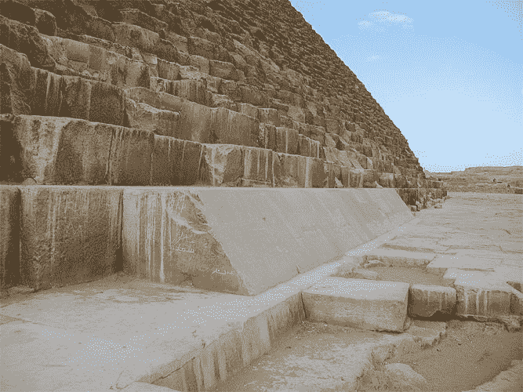

# 终极物流问题:建造吉萨大金字塔

> 原文：<https://thenewstack.io/ultimate-logistics-problem-building-great-pyramid/>

如果你认为你的项目有不可能的限制和困难的时间表，想象一下试图建造大金字塔。最近的两项考古发现揭示了这项历时 20 年的建设工程中令人惊叹的后勤保障。

根据一名英国探险家 1823 年的笔记，加上 20 世纪 50 年代两名法国飞行员的更多记录，考古学家 Pierre Tallet [于 2011 年在一些偏远的埃及山丘](https://www.smithsonianmag.com/history/ancient-egypt-shipping-mining-farming-economy-pyramids-180956619/)找到了 30 个不同的人造洞穴——所有这些洞穴都被密封起来(因此隐藏在视野之外)。在现代全球定位系统的帮助下，他发现自己远离任何已知的城市，并确定了这些洞穴的年代约为公元前 2600 年。他重新访问了这个地方，进行了几次挖掘，在他的第三年发现了成卷的纸莎草纸，其中一些有几英尺长。

它们是迄今发现的最古老的纸莎草卷。

令人惊讶的是，神秘的古代记录显然是由吉萨大金字塔的建造者所写。他们讲述了梅勒的故事，一个被遗忘的 200 名工人的监工，他的工作是收集物资。
这是一个长期困扰历史学家的问题。吉萨大金字塔包含 230 万块独立的石块，这意味着在整整 20 年的时间里，每小时每 5 分钟就要砌一块。问题？每块至少重 2 吨。这相当于 20 年来每天要铺设 176.4 万磅的石头。那么，你如何*移动*所有那些石头呢？

完工的金字塔重达 590 万公吨，或超过 130 亿磅。

来自 19 世纪立体视觉卡片照片的吉萨大金字塔(公共领域)

据福布斯报道，[虽然石灰石块的内核来自附近的采石场，但外部装饰性的高质量白色石灰石必须从尼罗河对岸运来，而 374，785，846 磅粉红色花岗岩则是从 500 多英里外采购的。](https://www.forbes.com/sites/davidbressan/2017/09/28/papyrus-reveals-from-where-the-rocks-used-to-build-the-great-pyramid-came-from/#179445ec3a90)

福布斯指出，这是一项非常艰巨的任务，以至于“一些作者认为古代外星人参与了建造。”具体来说，酒店经理埃里希·冯·丹尼肯在 1968 年的著作《诸神的战车》中推广了这一理论。(1970 年改编自该书的电影最终获得奥斯卡最佳纪录片提名。)澳大利亚广播公司在其伪科学揭秘页面上反驳了[的说法，指出完全有可能用一组精心策划的人来建造一座金字塔。](http://www.abc.net.au/science/correx/archives/lies.htm)

麦考瑞大学的埃及古物学家克里斯蒂娜·科勒博士解释说，通过在石头下放置滚轴(并使用一些牛)，“一个八人小组实际上可以搬运一个两吨半重的石块。”

甚至在一位后来的埃及游牧者的墓墙上也有画，画中工人(不是外星人)用巨大的手拉雪橇拖着一尊重达 58 公吨的雕像[。](https://en.wikipedia.org/wiki/Djehutihotep#The_.E2.80.9Ccolossus_on_a_sledge.E2.80.9D)

约翰·加德纳·威尔金森爵士的照片(公共领域)

但是 Tallet 新发现的纸莎草纸填补了一些关键的细节。它描述了一个由 200 名工人组成的团队在图拉将石灰石装满他们的船，然后沿着尼罗河将其运送到大金字塔的建筑工地。塔雷特在一个庞大而有序的船只储存设施的遗迹中发现了古老的纸卷。(船只可能在红海动荡的几个月里被存放起来，然后在平静的季节取回)。2015 年，有人呼吁对他的发现的更大意义做出大胆的宣布，塔莱特对此表示异议。“我真的不想卷入任何关于在吉萨建造金字塔的争论中，”塔莱特向史密森尼博物馆解释说，“这不是我的工作。”

但是另一个发现提供了更多的证据，证明金字塔的巨石不是被拖动的，而是由船只支撑的，船只可以利用复杂的运河系统漂浮到合适的位置——离最终的安息地只有几码远。

上个月，一部新的纪录片在英国公共服务电视网播出，提供了更多细节。《埃及大金字塔:新证据》报道说，考古学家马克·雷纳发现了大吉萨高原下有一条水道的证据。“我们已经勾勒出中央运河盆地的轮廓，我们认为它是吉萨高原脚下的主要运输区域，”莱纳告诉每日镜报。

[https://www.youtube.com/embed/TihUZmWUF6c?feature=oembed](https://www.youtube.com/embed/TihUZmWUF6c?feature=oembed)

视频

研究人员还使用 3D 激光扫描了一艘仪式用船——在用原始木板修复后——以研究这些船是如何组装的。更多的激光被用于绘制金字塔内部的地图，而不破坏其结构，导致[隐藏房间的新证据](http://www.newsweek.com/who-built-ancient-egypts-great-pyramid-hidden-text-holds-clues-thousand-year-670265)。

Tallet 确信他发现的遗址是一个巨大的供应中心的一部分——食物和矿物——表明古埃及人将造船视为他们多年金字塔建造工程的必要附属品。他的团队还发现了炼铜锅——铜在当时是人类已知的最坚硬的金属。埃及人需要大量的它来继续切割那些石块。

如果你担心这些古代金字塔工人的工作满意度，Tallet 挑战了他们是奴隶的观念。作为皇家船员的一员显然是很有声望的，在这里，工人们有肉、家禽、鱼，甚至还有啤酒。塔莱特觉得这个供应点的雄心和复杂程度让人想起了法老胡夫的整个大王朝，并描述纸莎草纸上有序的象形文字“就像古代世界的 Excel 电子表格——所有这些都具有金字塔的清晰度、力量和复杂程度，以及胡夫和第四王朝早期的所有特征。”

建成后，在接下来的 3800 年里，它一直是地球上最高的人造建筑。最初，大金字塔覆盖着倾斜的白色“外壳”石头，形成了一个明亮光滑的表面。(今天剩下的只是支撑那些套管石的台阶状支撑石。)

因为建造者仔细考虑了使用哪种石头，整个巨大的结构位于厚厚的石灰石层之上。《福布斯》指出:“其他只建在沙子上的金字塔，随着时间的推移倒塌了。”。

但是，尽管可能有一种满足感，也有一些古老的簿记。塔雷特认为，纸莎草纸之所以在船只储存洞穴中，是因为古代管理者“总是会带着他们的档案旅行，因为他们总是被期望对他们的时间负责。”

* * *

## WebReduce

<svg xmlns:xlink="http://www.w3.org/1999/xlink" viewBox="0 0 68 31" version="1.1"><title>Group</title> <desc>Created with Sketch.</desc></svg>