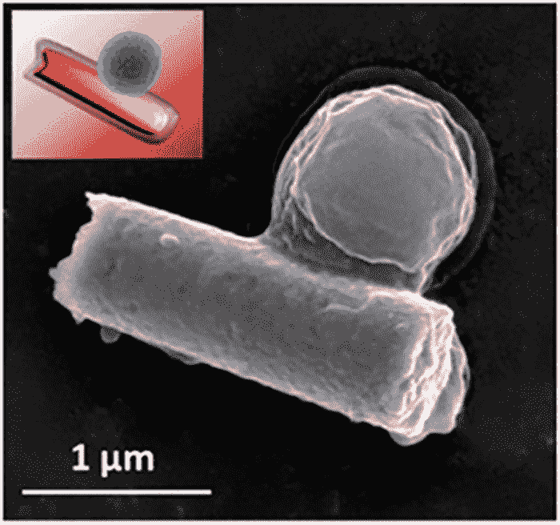

# 超声波驱动的纳米机器人清除血液中的细菌感染

> 原文：<https://thenewstack.io/ultrasound-powered-nanorobots-clear-bacterial-infections-in-blood/>

毫无疑问，现代医学史上最伟大的时刻之一是抗生素药物的发明，它从各种传染病中拯救了无数人的生命。但近年来，人们已经清楚地看到，抗生素正被滥用，并被过度用于人类和牲畜，导致出现了适应这些救命药物的新菌株。这些危险的超级细菌现在对过去有效的常规广谱抗生素具有高度耐药性，这意味着以前可治疗的感染现在可能再次成为威胁生命的疾病。

但是，如果有一种更有针对性的方法来消除体内的感染呢？来自加州大学圣地亚哥分校(UCSD)的一组科学家开发出了微型纳米机器人，能够清除血液中的感染。

[https://www.youtube.com/embed/qe_uWIlySWw?feature=oembed](https://www.youtube.com/embed/qe_uWIlySWw?feature=oembed)

视频

## 受到生物学的启发

他们最近在 [*科学机器人*](http://robotics.sciencemag.org/content/3/18/eaat0485) 上发表的论文描述了该团队如何着手创造这样一种机器人替代品，用于消除血液中的致病菌及其产生的毒素——即所谓的革兰氏阳性细菌感染。这些毒素可以穿透红细胞的外膜，而细菌可以与血小板结合，最终导致感染。

受真实红细胞和血小板(或血小板，帮助血液凝固的细胞)工作原理的启发，该团队的微型机器人由金纳米线制成。这种纳米机器人长约 1 微米(1000 纳米)，顶部有一层来自血小板和红细胞的生物混合膜，可以伪装它们，使其看起来和功能像真的一样。

“这种杂交细胞膜具有多种与人类红细胞和血小板相关的功能蛋白，这赋予了纳米机器人许多吸引人的生物能力，包括粘附和结合血小板粘附病原体(如*金黄色葡萄球菌*细菌)以及中和成孔毒素，”研究人员解释道。

纳米机器人(红色圆柱体)捕获的 MRSA 细菌(蓝色)。

这种涂层还保护机器人免受生物污损，生物污损是指蛋白质开始积聚在外来物体上，妨碍它们的正常功能。纳米机器人不是使用有害的化学物质，而是由超声波或高频声波推动，允许它们每秒钟移动约 35 微米，密切模仿真实细胞的运动，并允许它们更自由地与血液中潜在的有害微生物混合。由于纳米线与其对手之间的碰撞次数更多，除了有助于加快血液的细菌解毒，这还防止了微型机器人作为异物被身体排斥。

当这些伪装的微型纳米机器人被注射到血液中时，它们会引起细菌入侵者的注意，这些细菌入侵者会将它们误认为真正的红细胞或凝血细胞。然后，细菌将攻击这些伪装的机器人，附着在它们身上，就像它们通常附着在普通红细胞上一样。然而，细菌会发现它们无法挣脱纳米线，于是它们的毒素被中和。

在他们的实验中，研究小组将纳米机器人用于感染了[耐甲氧西林*金黄色葡萄球菌*](https://en.wikipedia.org/wiki/Methicillin-resistant_Staphylococcus_aureus) (MRSA)的血液样本，发现五分钟后，这些样本的细菌和毒素比没有任何干预的样本少三分之一。此外，研究小组发现，与没有暴露于超声波以用于推进目的的纳米机器人相比，使用超声波来启动机器人的运动导致红细胞破裂数量减少 2.4 倍，与纳米线结合的细菌增加 3.5 倍。

## 解毒机器人平台

该团队现在正计划将他们的测试扩展到老鼠身上，并用可生物降解的材料而不是黄金来开发纳米机器人。研究人员还打算改进声学推进系统的设计，以便在其他生物液体中部署纳米机器人。也有计划潜在地使用纳米机器人将药物输送到身体的精确位置——这是我们之前在其他研究项目中看到的，专注于基于 DNA 的纳米机器人。最终，我们的目标是创造一个“广谱解毒机器人平台”，不仅可以清除血液感染和输送药物，这样我们就不必仅仅依赖药物治疗。

图片:加州大学圣地亚哥分校

<svg xmlns:xlink="http://www.w3.org/1999/xlink" viewBox="0 0 68 31" version="1.1"><title>Group</title> <desc>Created with Sketch.</desc></svg>