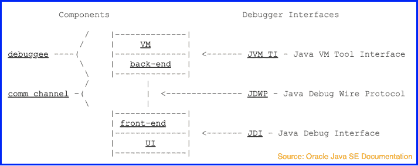
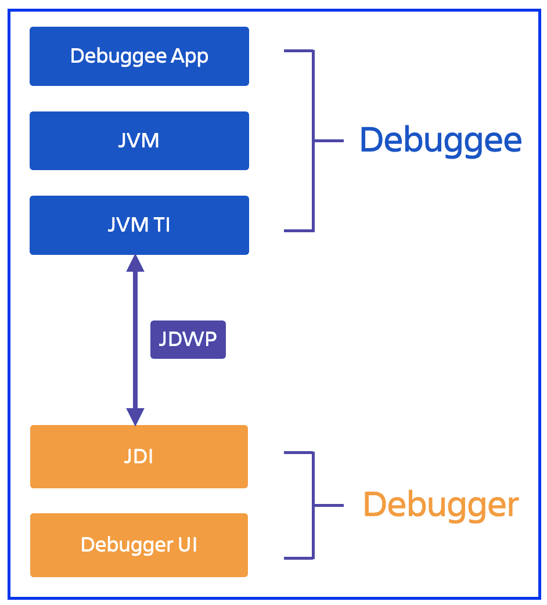

# 引擎盖下:近距离观察 Java 远程调试

> 原文：<https://thenewstack.io/under-the-hood-a-closer-look-at-java-remote-debugging/>

多年来，我们已经看到了软件架构的转变，自治实体允许更好的开发实践。今天的团队更加敏捷和自主。就基础设施而言，这通常转化为运行在独立服务器上的代码库的不同部分，通常以容器实例、FaaS 函数或 pod 的形式存在。云技术的发展让这一切成为可能。

然而，这也意味着即使整个系统在生产中作为一个单独的实体运行，在开发阶段处理的代码库部分可能与系统的其他部分和关键资源相分离。

 [萨尔吉尔·优素福

Sarjeel 是 Atlassian 的一名产品经理，负责引导 Atlassian 工具在其功能集中促进 DevOps 功能。](https://www.linkedin.com/in/syedsarj/) 

因此，这需要重新考虑我们的调试实践。调试环境和编写依赖于这些不可用资源的测试用例变得很困难。考虑到开发人员在为云开发时倾向于使用的架构，这一点尤其正确。这些可以包括各种概念的组合，例如云上的混合单片、[事件驱动的无服务器](https://dzone.com/articles/rethinking-serverless-architectures-with-eventbrid)配置、[主动/主动多区域](https://dzone.com/articles/the-theory-and-motive-behind-activeactive-multi-re)设置等等。

由于这些棘手的问题，我们看到远程调试的使用开始发挥作用，它使开发人员能够在调试的同时连接到远程系统。通过进一步利用[非中断断点](https://blog.thundra.io/is-it-possible-to-effectively-debug-your-cloud-applications)，开发人员可以在这些远程环境中运行的代码库的任何一行设置非侵入式断点。这允许远程调试器在远程系统中的非中断断点处捕获所有关键的洞察，例如包含变量状态的度量和快照。更好的是，开发人员将获得所有这些洞察，而不必中断他们系统的流程。

总的来说，当系统本身不在开发人员的本地环境中时，它允许通过在本地环境和位于远程服务器上的要调试的服务之间建立连接来调试系统。本文旨在阐述如何使用 Java 应用程序实现这种连接，甚至介绍不间断断点的机制。

## Java 远程调试的机制

如上所述，远程调试的好处为这个不断变化的软件开发世界提供了正确的进步思维。该技术的主要目的是能够将调试环境与驻留在远程实例中的目标系统连接起来。

当深入研究如何为特定于 Java 的应用程序建立这种连接时，我们看到了 Java 调试器平台架构(JDPA)的出现。

从上图可以看出，JDPA 由三个主要接口组成。它们是 Java 虚拟机工具接口(JVM TI)、Java 调试线协议(JDWP)和 Java 调试接口(JDI)。

这三个组件扮演的高级角色非常简单。JDWP 满足了连接的需要，它定义了调试器和远程系统之间通信的消息格式。此外，JDWP 没有定义传输机制以确保使用的灵活性。因此，后端 VM 和前端调试器接口运行在不同的机制上。

JDI 可以被简单地认为是一个 Java API，它的目标是捕获请求并在调试器之间传递信息。这也意味着调试器接口可以用任何语言编写，只要它调用所提供的一组正确的 API 端点。

另一端是 JVM TI，它是一个本地编程接口。它与 VM 内部的服务进行通信，并且可以观察和控制 Java 应用程序的执行。

当理解了这三个组件如何协同工作来实现远程 Java 调试时，我们可以从两个角度来考虑 JPDA 的功能:调试器和被调试程序。

不管接口是与调试器相关还是与被调试对象相关，每个接口中都有两种形式的活动。这些是事件和请求。然而，请求通常是在调试器端生成的，而事件是在被调试程序端生成的。这些事件是被调试程序对关于位于远程 VM 上的被调试程序应用程序的当前状态的信息请求的响应。

## 不间断断点流程

如前所述，不间断断点是远程调试的一个有价值的组件，因为它们在不中断正在运行的应用程序的情况下提供了所有必要的洞察力。这被证明是非常有用的，特别是当目标系统在生产环境中运行时，但是对于调试在本地环境中开发的另一个服务是至关重要的。这只是一个用例；这项技术还有助于克服其他几个挑战。不过，在本节中，我们将讨论 JPDA 在设置和响应不间断断点时的表现。

第一步是在本地调试器 UI 中设置不间断断点。这样做时，调试器调用 JDI 中的相关端点集。根据这些调用，JDI 然后生成调试状态改变请求。然后，根据 JDWP 设置的定义，该请求被转换成字节流。如前所述，JDWP 没有强加任何特定的通信系统，这可以由建立 JDPA 的人来定义。在这种情况下，它可能是一个插座。

通过利用 JDWP，JDI 设法将这个请求最终发送到后端，字节流在后端首先被解密。收到请求后，相关的 JVM TI 函数被触发，在 Java 应用程序中设置断点。

当正在远程 VM 中执行的应用程序最终遇到断点时，就会生成包含系统信息的事件。VM 通过调用 JVM TI 的事件处理函数并传递断点本身，将这些事件传递回前端。这引发了对事件进行过滤和排队的一连串操作，然后最终通过 JDWP 以字节流的形式发送出去。

然后，前端对从 JDWP 接收的消息进行解码，并调用 JDI 的事件函数，从而启动 JDI 事件。然后处理这些事件的调试信息，这些信息显示在调试器控制台中。

## 结论:远程调试工具

可以看出，JDPA 是一个复杂的系统，使我们能够执行调试技术。由于 JDPA 的这种复杂性和低级状态，通过使用 JDPA 来执行远程调试可能是困难的。

除了直接使用 JDPA 的操作挑战之外，还有其他挑战。其中一个主要问题是安全性，因为该技术需要打开远程虚拟机的端口。此外，由于日志可能会写入应用程序本身，这取决于具体的实现，因此日志问题并没有得到有效的缓解。因此，在应用程序遇到事故的情况下，这些日志可能变得不可用或不可访问，从而破坏了这些日志的调试目的。

然而，并没有失去一切。软件开发行业能够迅速满足有效开发实践的需求。我们现在看到了一个提供远程调试解决方案的调试工具的新时代。我们的产品[桑德拉助手](https://www.thundra.io/sidekick)就是这样一个解决方案。它为开发人员调试他们的云和分布式系统提供了喘息的机会，为他们提供了所有必要的远程调试操作和洞察力。

<svg xmlns:xlink="http://www.w3.org/1999/xlink" viewBox="0 0 68 31" version="1.1"><title>Group</title> <desc>Created with Sketch.</desc></svg>