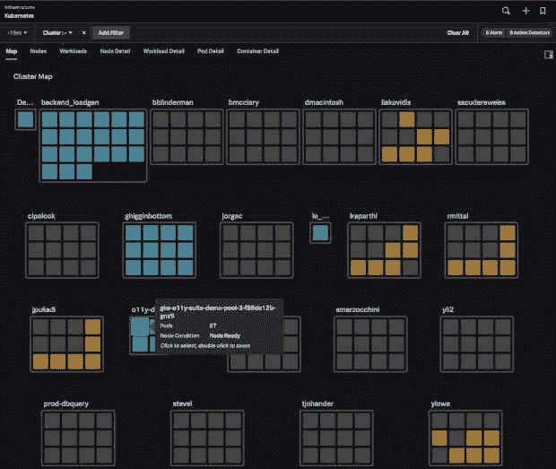
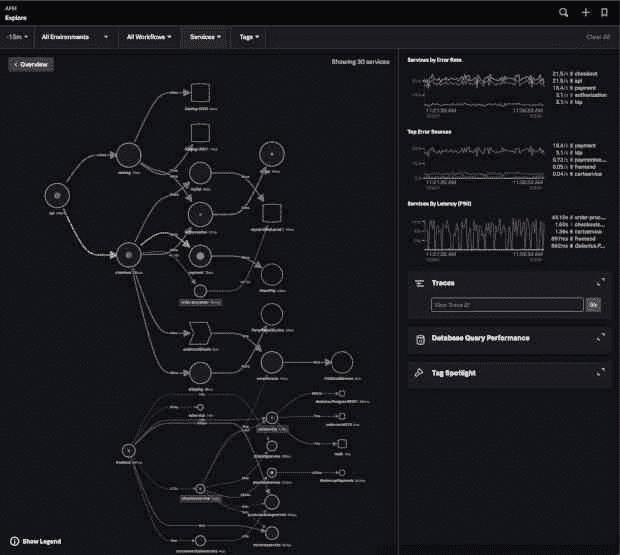
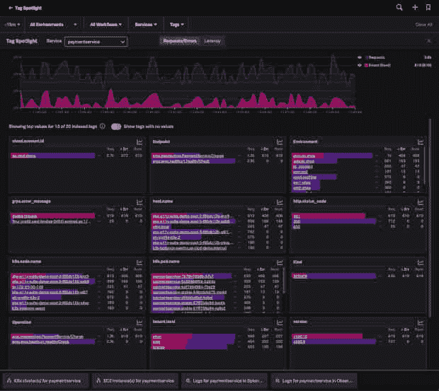
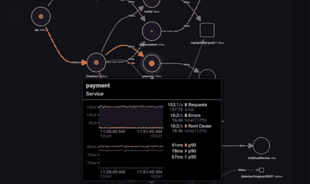

# 通过 Splunk 观察云了解 Kubernetes

> 原文：<https://thenewstack.io/understand-kubernetes-and-containers-with-splunk-observability-cloud/>

Kubernetes 是软件交付中最热门的趋势，随着越来越多的人发现它，它的势头越来越猛。Kubernetes 有很多好处，而且非常强大，但是强大的力量也带来了巨大的响应……监控上的困难。

可观察性工具，如 [Splunk Observability Cloud](https://www.splunk.com/en_us/products/observability.html?utm_content=inline-mention) ，旨在从头开始处理云原生应用，是您理解复杂 Kubernetes 环境的秘密武器。

## 在 Kubernetes 环境中可观测性的作用

虽然 Kubernetes 提供了许多好处(例如，易于扩展，不需要计划应用程序将在哪些特定的机器上运行，等等。)，也产生了新的挑战。这些挑战中最大的是增加的复杂性。基于 Kubernetes 的环境通常非常大，在大量机器上运行几十或几百个微服务。

将应用程序拆分到容器中并使用编排系统来运行它们所产生的数据量对于传统工具来说实在是太大了。每个容器都会创建指标，每个部署的应用程序也会创建指标。

可观察性，作为监控的一种进化，使用人工智能和机器学习技术，帮助你理解这些海量数据。Splunk Observability 帮助您做到这一点的一种方式是通过基础架构监控中的 Kubernetes Navigator，它提供了整个 Kubernetes 集群的基于地图的视图，以及更具体的节点、单元和容器视图。请参见下面的 Kubernetes Navigator 截图:

在本文的剩余部分，我将讨论有效运行 Kubernetes 环境需要哪三种能力——标记、人工智能引导的故障排除和根本原因分析。

## 观察能力:理解所有的数据

遥测数据是可观测性产品消耗的最重要的东西。这包括指标、跟踪和日志，但也包括像用户会话或合成测试这样的事件。这些数据是 observability 提供的所有其他酷东西的基础，所以通过采样技术扔掉这些数据对于看到所有东西的目标是适得其反的，在 Kubernetes 这样的复杂系统中，采样可能会导致您错过关键事件，直到为时已晚，客户开始注意到。

除非您了解并愿意接受采样给环境带来的潜在风险，否则您需要确保您的可观测性工具能够完全保真您的数据，并且不会采样。Splunk Observability Cloud 使您无需采样即可轻松实时获取所有数据。您可以在几秒钟内看到基础架构中任何地方的问题，而无需等待警报汇总、轮询或数据通过复杂的接收管道。

所有这些数据的主要视图是通过我们的动态服务地图，如下所示。在这个服务地图上，您可以看到您的 Kubernetes 工作负载支持的服务是如何相互交互的。可以使用顶部的下拉菜单定制这个视图，以适应特定的 Kubernetes 环境，甚至特定的业务工作流。

1.  ## 标记

标记是 Kubernetes 环境的另一个关键功能。通过标记，您可以将元数据添加到可观察性数据中，例如实例部署在哪个区域，请求与哪个客户 ID 相关联，正在使用哪个 canary 部署或 A/B 测试，或者其他对您很重要的业务指标，例如客户层或他们响应的营销活动，这些数据对于快速解决问题和确定不同类型的用户如何体验您的应用程序非常重要。

您将希望确保您的平台支持具有任意数量值的标记(称为“基数”)—能够将特定用户的每个请求标记到您的应用程序中，然后通过您的应用程序跟踪他们的特定体验，这是非常强大的。大多数平台不支持这一点，并且/或者对具有大量值的标签收取过高的费用。确保你不会掉进那个陷阱。Splunk 可观察性云支持基数数百万甚至更多的标签。

在 Splunk Observability 中，我们提供了一个名为 Tag Spotlight 的强大的标记数据视图，如下所示。Tag Spotlight 让您一目了然地了解特定标记的红色指标(请求、错误和持续时间)有何不同。此外，Tag Spotlight 底部的快速链接允许您跳转到相关视图以快速解决问题，包括 Kubernetes 集群、云实例和日志。在本例中，通过查看版本标记，您可以看到我们在版本 350.10 上明显有问题(每个带有该版本标记的请求都出错)，只需快速浏览一下:

Splunk 的标签聚光灯。

2.  ## 人工智能引导故障排除

大多数成熟的软件开发组织每天都要部署很多次代码。这些部署中的每一个都改变了数据流经组成应用的各种微服务的方式。此外，使用 Kubernetes，部署几乎肯定会导致 pod 被重新分配到不同的节点，资源限制被更改或创建，以及您需要了解的其他内部 Kubernetes 操作。

这些变化的频率和容器化应用程序的复杂性产生了数以千计的潜在交互和故障点。传统上，您需要为所有这些故障做好准备，为每个故障创建一个仪表板和警报。这很容易出错，也很耗时。此外，部署容器化的微服务应用会带来复杂性，每个版本都可能以新的方式相互调用，这根本无法扩展。寻找根本原因需要太多的努力(寻找仪表盘、切换工具等。)没有 AI 引导的工具。

在 Splunk Observability Cloud 中，我们通过定向故障排除体验提供实际的端到端可见性，其中包括业务环境(例如，受影响的具体业务工作流),并告诉工程师问题发生的原因、其影响以及在哪里调查和调试问题。您不需要查看日志来寻找问题—我们的服务地图会向您显示整个架构中哪些服务出现了故障。在这个例子中，您可以看到 API 正在返回一些错误—大约 7%的时间—但是您也可以看到 API 服务本身并不是根本原因。

端到端可观测性

3.  ## 根本原因分析

最后，当问题发生时，时间就是金钱。当出现故障时，您需要找出故障的根本原因，并尽快修复它。Splunk Observability Cloud 可以通过动态服务地图帮助您做到这一点，动态服务地图可以绘制出应用程序中微服务之间的关系，然后立即突出根本原因。这样，当问题是一个错误的后端服务发布时，您就不会在数千行前端日志中游泳。

根本原因分析和检测是一项针对可观察性的表桩功能，因此您需要确保您的平台能够识别问题，即使是在跨多个云的复杂部署、混合云部署中，甚至是在无服务器的环境中。

在 Splunk Observability Cloud 中，您可以在服务地图上看到一个实心红点，向您显示导致上游错误的根本原因是什么服务—在上面的屏幕截图中，您可以看到 API 服务不是任何错误的根本原因，但最终路径直接指向支付服务，这是本例中错误的根本原因。

将鼠标悬停在该服务上显示，12%的对该服务的请求(大约 16，000 个)有错误，并且该服务是对该服务的请求的大约 16，000 个错误的根本原因，换句话说，该服务是所有这些问题的唯一原因。我们能够在服务地图上一次零点击就找到这个问题，所有的探索都是通过悬停在地图上完成的。

## 入门指南

许多供应商提供可观察性产品。从其中任何一个开始的最佳方式是将 [OpenTelemetry](https://streaklinks.com/BPUrDlxgYHHVmA2SzQF8fHbM/https%3A%2F%2Fopentelemetry.io) 集成到您的应用程序中，这样您就可以向任何可观测性平台发送必要的数据。使用专有代理在短期内可能会更快，但以后很难改变平台。Splunk 提供对 Splunk Observability Cloud 的 [14 天免费试用，Splunk Observability Cloud](https://streaklinks.com/BPUrDltpaX2rMXK-MQE9XUtR/https%3A%2F%2Fsplunk.com%2Fo11y-trial)使用 OpenTelemetry 作为其原生数据格式，因此这是一个很好的开始。它还具有上面提到的功能。

无论您选择如何开始您的可观察性之旅，重要的是要认识到 Kubernetes 是一种不同的动物，需要一种更成熟的工具。在做出任何决定之前，请确保您的工具提供了上述基本功能。此外，确保您的团队在 Kubernetes 上进行了一些培训，并且了解该平台是如何运行的。

<svg xmlns:xlink="http://www.w3.org/1999/xlink" viewBox="0 0 68 31" version="1.1"><title>Group</title> <desc>Created with Sketch.</desc></svg>