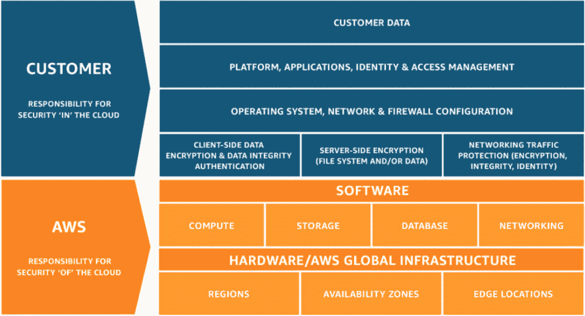

# Kubernetes 的 AWS 共同责任模型

> 原文：<https://thenewstack.io/understand-the-aws-shared-responsibility-model-for-kubernetes/>

[亚马逊网络服务](https://aws.amazon.com/?utm_content=inline-mention)’[共享责任模型](https://aws.amazon.com/compliance/shared-responsibility-model/)清晰地描述了 AWS 所涵盖的基础设施安全责任以及企业自身的责任。

AWS 负责云的安全——充分保护它提供的基础设施资产。同时，AWS 客户负责保护他们在云中运行的数据和解决方案的所有方面。为了履行这些职责，利用 AWS 来运营 Kubernetes、 [Red Hat OpenShift](https://www.openshift.com/try?utm_content=inline-mention) 、EKS 或 ECS 环境的客户必须拿出他们自己有效的 AWS 容器安全策略。

AWS 共同责任模型

 [Gary Duan

Gary Duan 是集装箱安全公司 NeuVector 的首席技术官和联合创始人。此前，他曾在信息安全公司 vArmour Networks 和 Fortinet 担任高级技术职务。Gary 的技术专长包括 IDS/IPS、OpenStack、NSX 和编排系统，他拥有多项安全和数据中心技术专利。](https://www.linkedin.com/in/garyduan/) 

请注意，除了您自己的数据、编排平台等之外，共享责任模型还要求您监控和正确配置 AWS 提供的操作系统、网络和防火墙。此外，您在 AWS 上保护容器的方法也应该保护整个 CI/CD 管道中的应用程序，并进入生产环境。为了实现可靠地保护容器和 Kubernetes 环境所需的纵深防御，安全性必须扩展到整个应用程序生命周期，从最初的漏洞和合规性扫描到强大的准入控制和运行时的自动化安全性。

下面从容器和 Kubernetes 安全的角度对企业责任的各个方面进行了更深入的研究:

## 1)客户数据

使用 AWS 的企业对其使用的数据全权负责，无论是传输中的还是静态的。实现深度防御的适当数据安全策略包括加密、网络防火墙、检查措施和运行时安全性。例如，深度数据包检测可以密切监控集装箱流量以提供数据丢失防护(DLP)，检测并阻止个人身份信息(PII)、信用卡数据和其他敏感信息的传输。身份和访问管理以及应用程序安全性对于将数据访问仅限于授权人员也至关重要。

## 2)平台

Kubernetes 和其他编排平台本身就是攻击面，必须加以保护。在 EC2 实例上运行 Kubernetes 的企业必须有适当的监控和安全保障。如果使用 AWS 服务进行编排，如 EKS 或 ECS，企业必须保护所有工作节点组件，包括应用程序和系统容器。AWS 负责保护主节点和关键系统容器，例如 Kubernetes api-server。为了更好地履行职责，企业应该使用 [CIS 基准](https://www.cisecurity.org/cis-benchmarks/)等工具来实现对平台系统容器、漏洞扫描和平台配置审计的强大监控。

## 3)应用

容器化的应用容易受到漏洞利用、零日攻击、SQL 注入(和其他应用层攻击)、嵌入式恶意软件和其他企业自己负责克服的危险威胁的攻击。如果攻击成功，最终结果可能是数据泄露、关键应用程序故障或对其他企业资产的攻击。引入运行时安全性，为每个应用程序自动定义和实施适当的容器行为，为企业提供了应对这些威胁的强大方法。

## 4)身份和访问管理(IAM)

实施强大的身份和访问管理，包括基于角色的访问控制(RBACs ),可消除对关键 AWS 资源的内部攻击风险。正确配置的 RBACs 同样可以保护 Kubernetes 或其他编排平台以及基本工具。作为最佳实践，将 RBACs 和安全工具集成到整个身份和访问管理体系结构中。这里同样重要的是:对 AWS 角色和权限执行符合性检查和定期审查。

## 5)操作系统、网络和防火墙配置

企业有责任通过正确配置和定期审计操作系统、网络和防火墙安全保护来切断攻击机会。此外，诸如 Kubernetes 和其他 orchestrators 的 CIS 基准之类的合规性检查可以验证正确的配置，定制的容器和主机检查也是如此。主机操作系统监控和漏洞扫描也将防范操作系统漏洞。请注意，企业必须仔细配置 AWS 提供的安全组和任何其他防火墙，以保护外部和内部容器环境的连接性。

## 6)客户端和服务器端数据加密、数据完整性和身份验证

企业应该对静态数据实施加密，并对客户端和服务器之间的所有通信连接进行加密。这些措施可以防止数据泄露，并且是某些法规(如 PCI-DSS)所强制要求的。您还需要像保护数据本身一样保护容器软件映像，从而保护数据的完整性。身份验证安全性主要涉及客户端对应用程序的访问，例如可能由面向外部的容器提供的应用程序。对微服务的身份验证访问也应根据情况强制执行。

## 7)网络流量保护和分段

毫无疑问，正如您在越来越多的头条新闻中看到的那样，容器和 Kubernetes 网络是攻击者的宝贵目标，他们可以访问企业数据，并有机会在首次入侵后升级攻击。保护网络流量对于防止此类攻击得逞至关重要。能够防止传统网络威胁(如 DDoS 攻击、SQL 注入或 DNS 隧道)的安全策略应该与旨在保护高度动态容器环境的功能相结合。网络分段、数据包捕获和深度数据包检测可实现自动保护，跟上并阻止任何可疑或未经授权的容器或连接，在攻击变得危险之前将其击败。还要记住，传统的网络方法对东西向的流量是盲目的，并且不能有效地实施出口和入口规则，因此容器的专门安全性是必要的。

## 外卖

在 AWS 中运行 container 和 [Kubernetes 环境的企业必须考虑其应用程序所需的运行时安全性、安全自动化以及合规性和审计措施，并主动有效地实施这些安全措施。通过清楚地了解您在 AWS 共享责任模型下的责任，您的企业可以从强大的保护中受益，并消除您的整体容器和 Kubernetes 安全策略中的任何疏忽。](https://thenewstack.io/7-tips-for-cutting-down-your-aws-kubernetes-bill/)

<svg xmlns:xlink="http://www.w3.org/1999/xlink" viewBox="0 0 68 31" version="1.1"><title>Group</title> <desc>Created with Sketch.</desc></svg>