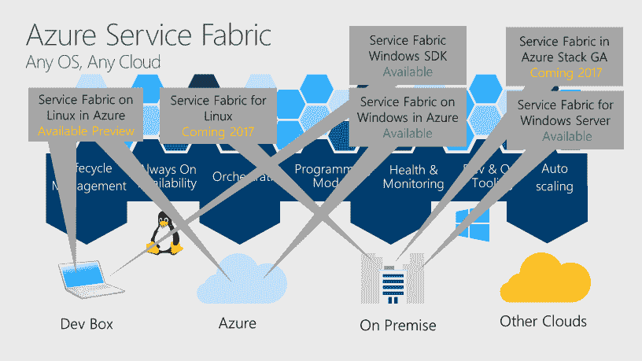
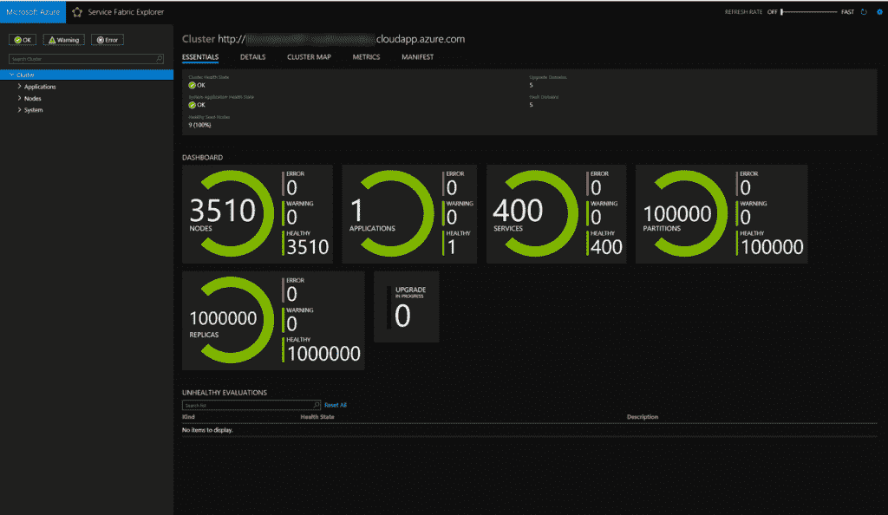

# 微软将容器编排引入 Azure Service Fabric，用于 Windows 和(即将推出的)Linux

> 原文：<https://thenewstack.io/understanding-azure-container-service-azure-service-fabric/>

微软正在投资容器，包括其 Azure 容器服务和用于构建微服务应用的分布式系统平台 T2 Azure 服务架构。

Service Fabric 是运行 Azure 的结构，可供开发人员使用。Azure SQL 数据库、Skype for Business、Service Bus、Event Hubs、Cosmos DB、Intune 和其他运行在 Service Fabric 上的微软云服务。用户可以在 Azure 中部署云版本(很快会有其他云)，或者将运行时放在他们自己的 Windows 和(很快)Linux 服务器上。

Azure Service Fabric 通过将不同的微服务放在不同机架的不同服务器中来处理弹性；它处理滚动更新，如果出现问题，会自动回滚到已知的良好状态，并对虚拟机、服务和微服务中的故障进行健康监控，此外，它还支持无状态和有状态微服务。

Service Fabric 最初是作为构建云服务的平台即服务(PaaS)向开发人员推销的，现在组织也在使用它将现有的应用程序“提升并转移”到云中，有时与微软的持续集成和部署服务 [Visual Studio Team Services](https://www.visualstudio.com/team-services/) 结合使用。Service Fabric 具有用于容器端点的命名服务和用于容器间通信的 DNS 服务。应用程序可以用 Visual Studio 远程调试，用[操作管理套件](https://docs.microsoft.com/en-us/azure/operations-management-suite/operations-management-suite-overview)监控。

上周，该公司发布了 Azure Service Fabric 的新版本(版本 5.6)，将处理 Windows Server 容器的容器编排职责。今年晚些时候，您将能够在 Linux 上使用 Service Fabric [作为容器编排器，并且计划推出更多容器编排功能。](https://azure.microsoft.com/en-us/blog/announcing-windows-server-container-orchestration-with-azure-service-fabric/)

管理微软 ACS 团队的 Brendan Burns 将 Service Fabric 视为“一个容器编排器，就像 Kubernetes 或其他任何东西一样；它还有一个更丰富的构建应用程序的环境。它将部署容器的能力与更丰富的编程环境相结合。”

微软刚刚[收购了 Deis](https://deis.com/blog/2017/deis-to-join-microsoft/) 的 Kubernetes 专业技术。它还增加了对 T4 Docker Compose T5 的支持，这种支持在 Windows 服务器容器 T7 中已经有了编排。

ACS 是微软的(日益多样化的)容器托管服务，您可以在其上构建基于容器的系统。ACS 为您运行容器编排器，您可以使用与其他地方的编排器相同的开源 API 和工具生态系统，而不必担心构建和维护编排器基础架构的复杂性。

## 

ACS [还支持](https://azure.microsoft.com/en-gb/blog/microsoft-extends-azure-managed-database-services-with-introduction-of-mysql-and-postgresql/)Azure、PostgresSQL 和 MySQL 上新的托管 NoSQL 服务；这些是具有数据保护、恢复和弹性扩展的高可用性服务。微软数据库系统总经理 Rohan Kumar 告诉我们，这是微软与开发人员会面的地方。“有些开发人员希望在 MySQL 上进行开发。它使用了我们构建其他关系数据库时所使用的相同结构，具有内置的高可用性，可以在不停机的情况下扩展和缩减。”

[据 Burns](https://twitter.com/brendandburns/status/862346185385820164) 称，ACS Deis’[Steward](https://github.com/deis/steward)和其他[服务代理](https://github.com/kubernetes-incubator/service-catalog)将很快支持托管 NoSQL 服务，因此，如果您希望您的 Kubernetes 应用程序使用 PostgresSQL 或 MySQL 数据库，您将能够浏览服务目录，选择您想要的键盘，并让服务代理提供它并将其绑定到您的应用程序，所有这些都通过 ACS 完成。

## 场景和服务

随着如此多的容器特性出现在服务结构中，您应该在什么时候考虑它，什么时候使用 ACS？或者 Azure Batch 怎么样，[可以用 Docker 打包部署作业](https://azure.microsoft.com/en-us/blog/running-docker-container-on-azure-batch/)？

对于 Azure Service Fabric，你可以使用低级的原语，或者更高级的抽象，比如键值存储和队列，甚至更高级的 actor 模型(基于最初作为[项目 Orleans](https://thenewstack.io/project-orleans-the-net-framework-from-microsoft-research-used-in-halo-4/) 开发的相同研究)。正如 Azure 首席技术官 [Mark Russinovich](http://www.trojanhorsethebook.com/) 在 Service Fabric 首次发布时所说的，“这真的使有状态分布式编程民主化了——这是最难的一种编程。”

微软 Azure Compute 产品负责人 Corey Sanders 告诉新堆栈，越来越多的人可以在几乎所有 Azure 服务中使用容器，这样你就可以选择正确的服务，而不仅仅是支持容器的服务。

“到处都有容器的好处之一是，您不需要根据是否使用容器来决定使用哪个平台。对于 web 应用程序，如果您想部署一个集成 CI 和 CD 的解决方案，有预热功能，有应用程序服务作为完全托管平台提供的所有功能，但您想使用容器—很好，我们有这种支持(在服务结构中)。或者，如果您希望运行基于作业的计算解决方案，而不必管理基础架构，只需在一组虚拟机上运行作业，但您希望使用容器来托管您的作业，我们可以满足您的需求。那是天蓝色的一批。这个想法是，当你接近平台时，你带着一个场景(在头脑中)接近，而不仅仅是‘我想使用容器’。”

桑德斯解释说，容器正在迅速成为封装应用程序的事实方式，这就是为什么 Docker 和容器生态系统的其他部分出现在微软的产品和服务中，从 Windows Server 到 SQL Server 2017，再到 Azure 中的 everywhere。容器不是目的地，而是另一种工具。

“这种组合为客户提供了很大的灵活性，让他们可以根据自己的兴趣、场景和编程模型来选择服务。Azure 上到处都支持容器，这是一大进步。”

<svg xmlns:xlink="http://www.w3.org/1999/xlink" viewBox="0 0 68 31" version="1.1"><title>Group</title> <desc>Created with Sketch.</desc></svg>