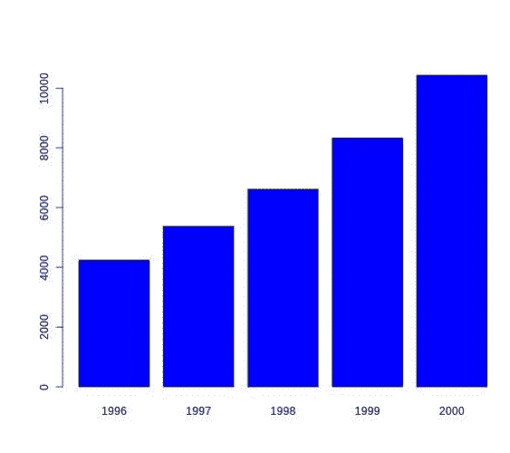

# 通过 R 以图形方式理解数据

> 原文：<https://thenewstack.io/understanding-data-graphically-through-r/>

被调查的数据通常被收集并以清晰有效的图表来表示。在 R 编程中，数据通常用一些简单而有用的命令来说明。这篇文章是关于通过使用 R 编程命令来理解图形化的数据表示。

## 基本表格和条形图

让我们考虑一个调查报告分析的经典案例。下表显示了每年收集的对应于其学习课程的学生人数。该表描述了通过调查参加学习课程的学生人数而积累的年度数据。

[](https://thenewstack.io/wp-content/uploads/2015/02/1.png)

条形图 1:学生人数

从上面的柱状图 1 中，我们可以很容易地得出结论，每年参加各专业学习的学生人数都在稳步增长。

## 增强详细信息以了解更多信息

如果我们希望从图表中获得更多的信息呢？也许我们想知道哪一个流有更多的学生或者想按年比较学生的数量来学习流？下面的条形图 2 详细描述了我们的需求。请注意，它表明学生人数正在增加，增加了学习课程描述。

[](https://thenewstack.io/wp-content/uploads/2015/02/2.png)

条形图 2:按学习课程划分的学生人数

[](https://thenewstack.io/wp-content/uploads/2015/02/31.png)

条形图 3:按学习课程划分的学生人数

上面的条形图 3 显示，每门课程的学生人数每年都在增加。

一般来说，从给定的表格中，你可以获得热门学科的信息，并看到每个学科学生人数的增加。

## 一图胜千言。

通过 R 编程，我们可以使用它的一些命令来图形化地描述数据。例如，基于从调查中收集的表格数据，实现 R 命令可以产生与图表相同的数据表示，有助于理解。就像他们说的，一张照片真的胜过千言万语。通过 R 编程，我们可以毫不费力地用图像来表示数据。

## 用 R 编程命令画图

用 R，可以画出各种各样的图形，帮助观察者更好地理解数据。R 中支持的一些图形有:

*   柱状图
*   条形图
*   点图表
*   地块点:使用命令 plot(c(3，12，15)，c(23，1，14))
*   饼图:使用命令 pie(1:10，col=rainbow(10))

[](https://thenewstack.io/wp-content/uploads/2015/02/4.png)

绘图函数:使用命令曲线(sin(x)，-3，3，col=3)


## 为图表添加颜色

可以在图表中添加颜色以增加区分度。例如，col="red "是与 plot 命令一起使用的选项之一，用于指定图形的颜色。另一种变化是尝试 palette()以不同的颜色生成图形。

## 绘制内置数据

正如我们之前看到的，r 中有内置数据集。下面的代码显示了内置数据集的有趣例子:

```
&gt;  data(volcano)
&gt;  image(volcano)
&gt;  contour(volcano)
&gt;  filled.contour(volcano)

```

[](https://thenewstack.io/wp-content/uploads/2015/02/6.png)

## 用数据填充表格

下面是 R 中填充数据的语法。首先，以矩阵形式输入数字数据。接下来，添加所需的行名和列名。下面是代码:

```
&gt;  year.stud&lt;-matrix(c(2810,890,540,3542,1363,471,4301,1663,652,5363,2071,895,  6567,2752,1113),byrow=T,ncol=3)
&gt;rownames(year.stud)=c("1996","1997","1998","1999","2000")
&gt;  colnames(year.stud)=c("Management","Commerce","Science")
&gt;  year.stud
    Management Commerce Science
1996        2810       890      540
1997        3542      1363      471
1998        4301      1663      652
1999        5363      2071      895
2000        6567      2752     1113

```

## 绘制数据

要绘制数据，只需使用命令条形图。按照下面的代码，数据存储在 year.stud 中，我们对它应用“t”进行转置。要更改颜色，请使用命令 col。执行下面的代码来查看数据的条形图。

```
&gt;barplot(t(year.stud),col=c("red","gray80","yellow"))

```

以下是可以使用的更多选项:

*   side=TRUE 允许并排显示条形图。
*   图例给出了以彩色显示的项目信息。

```
&gt;barplot(t(year.stud),col=c("red","gray80","yellow")  
  ,beside=TRUE)

```

## **独特的图形**

在本节中，我们来看一些使用 R 编程特性的独特图形。

### 向日葵地块

多个点被绘制成具有多个“花瓣”的“向日葵”,从而使过度绘制可视化，而不是重复数据。这个图表对于寻找数据中的模式很有用。让我们看看下面的数据集合，标有“a”，其中显然包含了重复的数据。

```
a

[1]   1   2   2   3   3   3   4   4   4   4   5   5   5   5   5   6   6   6   6   6   6   7   7   7   7
[26]   7   7   7   8   8   8   8   8   8   8   8   9   9   9   9   9   9   9   9   9  10  10  10  10  10
[51]  10  10  10  10  10

```

[](https://thenewstack.io/wp-content/uploads/2015/02/7.png)

要绘制它，请发出> sunflowerplot(a，a)。在下面的输出中，每朵花的花瓣数用红色标记。它表示数据项出现的次数。

### ggplot2

ggplot2 是 r 中流行的绘图库，它基于图形的语法，尽量利用基图和点阵图形的好的部分。首先，用 install . packages(“ggplot2”)安装它，每次你想在一个新的会话中使用它时，你需要用命令库(gg plot 2)加载它。

使用 ggplot2 的一些好处是:

*   它有助于以整洁的图表形式生成报告。
*   它使报告可读，便于数据分析。
*   由于它的易用性，快速决策是很有用的。

### 菱形图一

让我们根据克拉和价格绘制一个钻石图，其中钻石是 ggplot2 中的一个数据集，克拉被视为列，价格被视为行。

```
qplot(carat,price,data=diamonds,colour=color)

```

[](https://thenewstack.io/wp-content/uploads/2015/02/8.png)

观察图例是如何自动生成的。

### 菱形图二

下面是下图的代码:

*   qplot 是可用的基本命令，类似于 plot 命令。
*   geom 是几何图形:它允许用户选择给定数据使用哪种类型的图形。

```
&gt;  qplot(carat,data=diamonds,fill=color,geom="histogram")

```

[](https://thenewstack.io/wp-content/uploads/2015/02/8a.png)

### 菱形图三

```
&gt;  qplot(carat,data=diamonds,colour=color,geom="density")

```

[](https://thenewstack.io/wp-content/uploads/2015/02/9.png)

有关 ggplot2 的更多详情，请参见[http://www.cookbook-r.com/Graphs/](http://www.cookbook-r.com/Graphs/)。

Github 回购链接在这里:[https://github . com/thenewstack/R-code/tree/master/visualizedata](https://github.com/thenewstack/R-code/tree/master/visualizedata)。

Manjusha Joshi 是科学计算的自由开源软件的自由职业者。她是一名数学家，也是 Pune Linux 用户组的成员。

通过 Flickr Creative Commons[获取专题图片。](https://www.flickr.com/photos/chrisinplymouth/6128303784/in/photolist-a7CPBx-o8dvb4-6MqWqW-7wgd4N-6sZ3V3-73Mrw8-NwQpq-6zsvky-fH3Ef8-8XKmKQ-qq4gqZ-8oN1c7-bpvmsV-4DcDoY-5fe5tz-pDWpW4-eX9nwS-p6WB86-8UKjw2-p31W8g-akxad5-g9tN2o-aUFYg4-qHoq5d-4o3jWB-7hgmnz-nGqv9V-6jeeGg-9np4bL-nhuZyU-dHX3G-zhu1Z-56gDnz-3XSaUw-4mahNL-a1PW4t-Nm2Gw-6KUpZw-2DZTJ1-hfG7J-4D6HgF-5HZEDu-8NH1xQ-6R3Dkd-hfNQj-6FP5vm-6Byj1c-6urKFs-DoW7N-4DgCuS)

<svg xmlns:xlink="http://www.w3.org/1999/xlink" viewBox="0 0 68 31" version="1.1"><title>Group</title> <desc>Created with Sketch.</desc></svg>