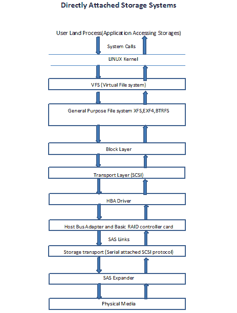
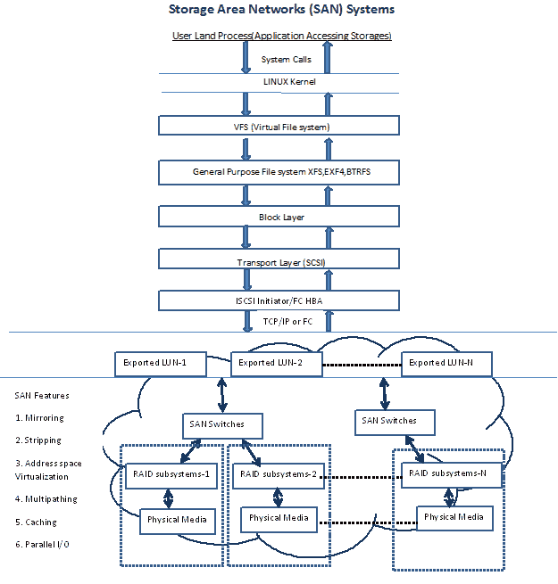
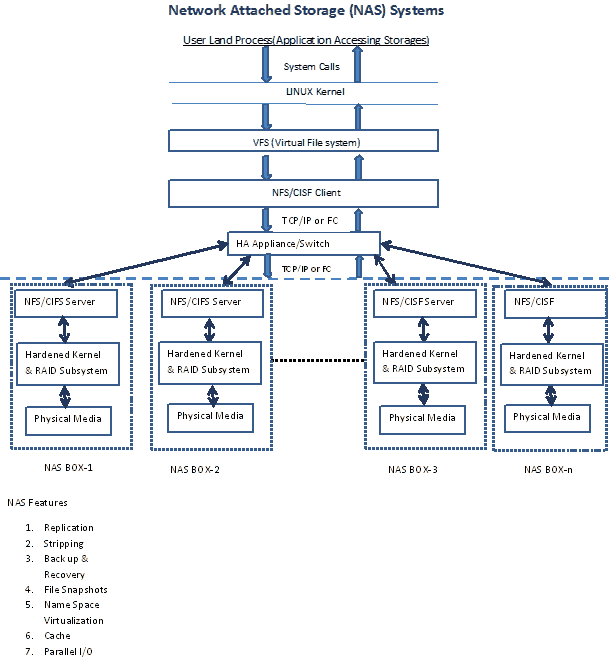
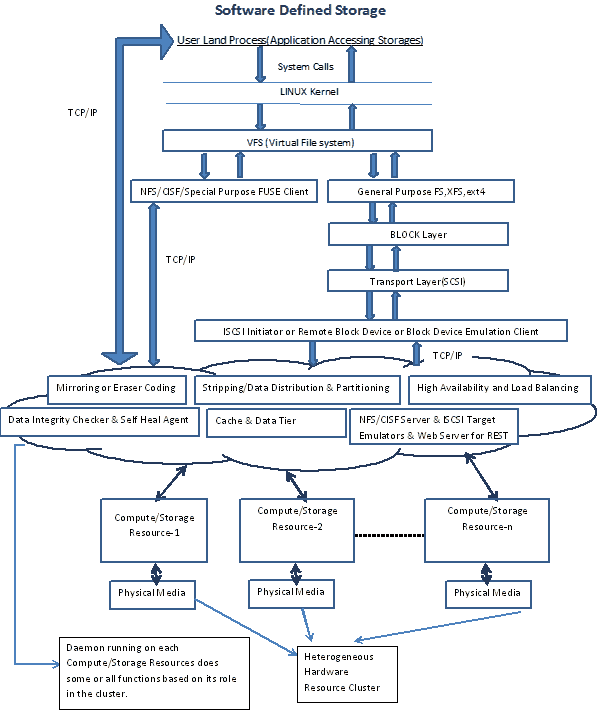

# 了解软件定义的存储，第一部分

> 原文：<https://thenewstack.io/understanding-software-defined-storage/>

这是关于软件定义的存储的三部分系列的第一部分。在…里

[part two](https://thenewstack.io/software-defined-storage-ceph-way/)

而在

[part three](https://thenewstack.io/software-defined-storage-with-an-understandable-interface-the-ceph-way-part-three/)

，我们探索 Ceph，一种流行的 SDS 解决方案。

存储系统对于数据中心至关重要。鉴于数据呈指数级增长，以经济高效的方式扩展企业存储基础架构变得越来越具有挑战性。

多年来，存储技术不断进步。早期的企业存储主要是[带](https://en.wikipedia.org/wiki/Direct-attached_storage)[主机总线适配器](https://en.wikipedia.org/wiki/Host_adapter)(HBA)[独立磁盘冗余阵列](https://en.wikipedia.org/wiki/RAID)(raid)的直连存储 (DAS)。)DAS 采用了更快、更可靠的协议，如[以太网 ATA](https://en.wikipedia.org/wiki/ATA_over_Ethernet)(ATA)、[串行连接技术 gy 适配器](https://en.wikipedia.org/wiki/Serial_ATA) (SATA)、外部串行连接技术适配器(eSATA)、小型计算机系统接口(SCSI)、串行连接 SCSI ( [SAS](https://en.wikipedia.org/wiki/Serial_attached_SCSI) )和[光纤通道](https://en.wikipedia.org/wiki/Fibre_Channel)。

然而，随着 20 世纪 90 年代中期网络公司的繁荣和数据的急剧增长，DAS 被广泛批评为“信息孤岛”NFSv3 网络文件系统(NFS)和[通用互联网文件系统](https://en.wikipedia.org/wiki/Server_Message_Block) (CIFS)在 1995 年左右开始流行，拥有一个集中、共享、专用的存储系统的想法变得越来越流行。因此，[网络连接存储](https://en.wikipedia.org/wiki/Network-attached_storage) (NAS)和[存储区域网络](https://en.wikipedia.org/wiki/Storage_area_network) (SAN)系统成为未来几年任何大型企业存储基础设施的事实。SAN/NAS 存储系统的适应率还受到这样一个事实的推动，即在 21 世纪初，拥有此类系统的复杂性和成本大幅降低。如今，在数据中心添加 NAS/SAN 系统已经成为一项即插即用的任务，只需要考虑网络设计，其余的一切都可以通过 Web UI 完成。这些盒子包含几乎所有企业友好的功能，例如可靠性、容错、高可用性和集群、重复数据删除、备份、低延迟、高吞吐量和带宽、QoS。围绕不同的企业主题和需求，甚至有不同的机箱，如速度提高 2 倍的机箱、容量提高 4 倍的机箱或每 GB 成本降低 0.5 倍的机箱。然而，近年来，云计算和大数据的增长及其对 Pb 和 EB 的关注促使企业重新思考其存储基础架构。事实证明，基于机箱的方法越来越昂贵，并且难以扩展以适应这些工作负载。供应商锁定和为维护支付的额外费用也令人担忧。

## **软件定义的存储嗡嗡声**

简而言之，软件定义的存储(SDS)是一种企业存储方法，它使用更加智能且独立于硬件的软件和商用硬件。现在把它看作是基于盒子的方法的完全替代品还为时过早，但是现在让我们假设它是一个严重的挑战者。然而，一个替代任何“很好”的东西的想法总是需要大量的说服和追求。为了让其他人相信这个想法有可能替代现有的解决方案，我们必须了解什么是现有的解决方案。因此，我们将首先关注现有存储系统能够提供什么。了解优势和劣势以及它们之间的差异是非常重要的。我们将重点介绍现代 DAS、NAS 和 SAN 系统。然后，我们将继续讨论 SDS，看看与现有存储系统相比，它如何解决企业存储问题。

## **了解 DAS**

顾名思义，DAS 是一种将存储直接连接到服务器的拓扑结构，服务器还充当消耗存储的应用程序的主机。为了克服驱动器故障的限制，由于机械磁盘主轴而降低吞吐量和带宽；这种拓扑利用了 RAID 子系统。RAID 是一种磁盘阵列，通过数据分条、复制、并行 I/o 和磁盘虚拟化来实现高吞吐量、高带宽和高容错能力。RAID 是一项相当成熟且经过验证的技术，并且有足够的[文献](https://en.wikipedia.org/wiki/RAID)可用于理解 RAID 概念和不同的 RAID 级别。深入探讨 RAID 概念的细节超出了本文的范围。但是，如果您还不知道 RAID 的概念，那么阅读一下 RAID 是明智的。下图解释了 DAS 系统中的基本数据流:

## 【T2

DAS 拓扑的问题在于其固有的将存储连接到单个服务器的设计限制。

> 这使得 DAS 不适合高度可扩展和高度可用的应用程序和存储系统的现代数据中心要求。

## **了解三**

SAN 是指这样一种存储拓扑，其中许多虚拟化磁盘(也称为逻辑单元或 LUN)通过连接到网络的专用存储设备，在以太网或光纤通道网络上可供应用服务器使用。通常，SAN 设备附带了针对吞吐量、带宽和容错的特定 QoS 参数。

这些功能的促成因素是 RAID 技术和添加到其中的供应商特定的“魔力”。这些设备还提供了易用性，因为应用服务器的存储管理和配置外包给了一个集中的专用设备(或设备池)。

这也使得数据更加独立于应用服务器的问题。为了实现高可用性，还可以通过利用不同的群集文件系统或使用特定于操作系统的群集机制，在不同主机之间共享 LUN。下图解释了 SAN 系统中的基本数据流:

## 

然而，这一切都是有代价的。如果您的数据需求在增长，那么就准备好花更多的钱购买“兼容”设备，或者购买价格更低但不受支持的硬件。所以选择是有限的，也没有掉头。与普遍的看法相反，大多数供应商使用或多或少相同的磁盘；然而，价值主张和粘性来自于嵌入在盒子中的逻辑，而外界对此一无所知。

## **了解 NAS**

NAS 指的是一种存储拓扑，其中存储客户端(应用程序服务器/用户机器)可以使用专用存储设备上托管的网络文件共享协议来存储和共享文件。NFS 协议负责身份验证、访问控制、文件锁定、数据的事务完整性、命名空间管理等。而提供更好的吞吐量、带宽和容错的责任是留给底层 RAID 子系统的任务。高级 NAS 系统具有附加功能，如文件快照、复杂的备份和恢复方法、QoS、更简单的存储资源调配和管理、高可用性以及随着存储需求的增长而扩展基础架构。

NAS 在典型的 SAN 系统上增加了一个抽象层，从而使客户端不必再负责创建和管理通用文件系统或群集文件系统。NAS 可以被看作是 s an 系统的增量发展，它不是取代 SAN 系统，而是通过提供一个更简单的接口对 SAN 系统进行补充。也有提供这两种接口的混合 NAS/SAN 系统。NAS 系统的基本数据流如下图所示:

【T2

然而，供应商锁定和为 SAN 系统支付额外费用的问题在 NAS 系统中也是如此。

## **了解软件定义的存储**

SAN 和 NAS 设备仍然是企业存储市场的主流。相反，一些在 2003-2013 年左右成立并仍在涌入的初创企业能够吸引足够的注意力，表明一些根本性的变化即将发生，这些变化将改变人们对企业存储的看法和购买方式。这些初创公司喜欢使用不同的术语，如“分散存储网络”、“横向扩展 NAS”、“集群文件系统”、“融合存储”、“虚拟化存储”、“并行容错文件系统”等，来区分他们的产品和行业巨头的产品。这些基本上都可以归入单一的 SDS 类别。

根据存储和网络行业协会的说法，术语 SDS 是一个营销术语，是术语“软件定义的网络”的后续术语，最初用于描述网络技术中的一种方法，该方法抽象了网络的各种元素，并在软件中创建了一个抽象或虚拟化层。已经提出了 SDS(SNIA ca。2013，2013 存储开发者大会)作为存储软件产品的新品类。2014 年 3 月， [SNIA](https://en.wikipedia.org/wiki/Storage_Networking_Industry_Association) 开始了 SDS 的技术工作草案，供公众审查。

定义术语 SDS 是一项棘手的任务，因为许多利益相关者希望该术语与他们对企业存储未来的想法最紧密地联系在一起。简而言之，SDS 是一类可以与商用存储介质和计算硬件一起使用的存储解决方案；其中存储介质和计算硬件没有嵌入特殊智能。数据管理和访问的所有智能都由软件层提供。该解决方案可以提供现代企业存储系统的部分或全部功能，如纵向扩展和横向扩展架构、可靠性和容错、高可用性、统一存储管理和供应、地理上分散的数据中心感知和处理、灾难恢复、QoS、资源池、与现有存储基础架构的集成等。它可以提供一些或所有的数据访问方法，如文件、块和对象。

SNIA 发布了一个关于 SDS 功能和属性的[详细视图](http://snia.org/sites/default/files/SNIA%20Software%20Defined%20Storage%20White%20Paper-%20v1.0k-DRAFT.pdf)，其中大部分都包含在上面简化规范的尝试中。下图解释了 SDS 解决方案中的通用数据流:

SDS 也可以看作是教科书术语“分布式文件系统”的扩展分布式文件系统流行开源示例包括 OpenStack Swift、Gluster、Ceph、HDFS、RozoFS、HekaFS、luster、XtremeFS、MooseFS、Quantcast 文件系统等等。这些开源项目中的一些也可以通过商业支持许可获得。很少有比与 Hadoop 或其他生态系统紧密结合的其他产品更通用的产品。专有 SDS 示例有 Nexenta、CleverSafe、RiakCS 等。

最初，基于盒子的企业的大玩家仍然否认 SDS 对其商业模式的任何可能威胁。为他们的产品创造粘性一直是每一个商业幻想和最终目标。但是市场力量和创新决定了未来技术的形态。SDS 仅仅是一些开源爱好者和风投希望押注下一件大事的炒作或创意的神话已经被打破了。基于盒子的企业的大玩家现在都推出了自己版本的企业 SDS 解决方案，如 EMC 的 VIPR、Scale IO 和 NetApp Data ONTAP Edge。随着这些发展，风向变得越来越清晰。可以毫不夸张地说，SDS 是基于存储系统方法的根本性转变。然而，在生产环境中理解、部署和管理 SDS 仍然是一个挑战；在不久的将来，看看 SDS 在生产环境中的适应率会很有意思。

开源替代方案看起来很有前途，是熟悉 SDS 良好起点。在不久的将来，我们将尝试介绍一些流行的开源 SDS 解决方案。

免责声明:这里表达的观点是个人的，而不是我的雇主。

Pushpesh Sharma 目前在班加罗尔的 SanDisk 印度设备设计中心担任高级测试开发工程师。他在评估云、虚拟化和存储技术方面拥有超过六年的经验。他拥有政府颁发的工程(信息技术)学士学位。哥打工程学院(Raj。)，印度。他还拥有孟买 IIT SJMSOM 的市场营销和人力资源管理证书。在他的空闲时间，他喜欢阅读(几乎任何东西)，听好音乐，享受美食和美酒。

<svg xmlns:xlink="http://www.w3.org/1999/xlink" viewBox="0 0 68 31" version="1.1"><title>Group</title> <desc>Created with Sketch.</desc></svg>